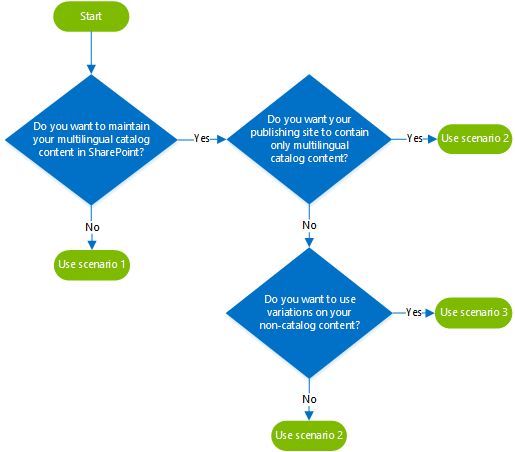
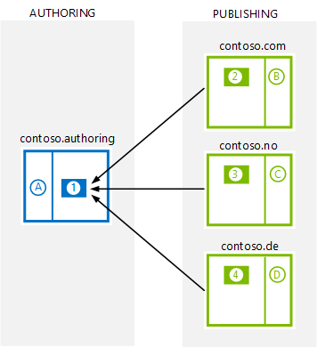
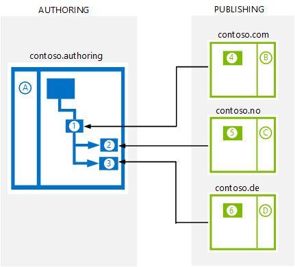
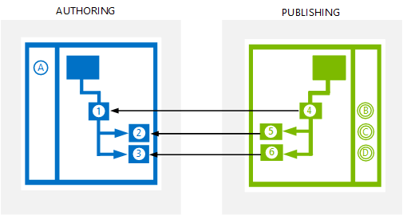
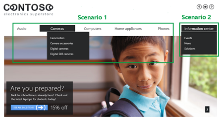

# Plan variations for multilingual cross-site publishing site in SharePoint Server

[!INCLUDE[appliesto-2013-2016-2019-xxx-md](../includes/appliesto-2013-2016-2019-xxx-md.md)]
  
You can use variations features to create and maintain your multilingual SharePoint sites. For more information, see [Variations overview in SharePoint Server](variations-overview.md). When you use cross-site publishing and variations, you should set up your site architecture according to one of three scenarios.
  
## Decide which scenario that you should plan for

Use the following decision tree to determine which scenario best fits you:
  

  
|**If you want to**|**Plan for this scenario**|
|:-----|:-----|
|Maintain your multilingual catalog content outside SharePoint    |1    |
|Publish only multilingual catalog content, or a mix of catalog and non-catalog content, and you don't want to use variations on your non-catalog content    |2    |
|Publish a mix of multilingual catalog and non-catalog content, and you want to use variations on all your content    |3    |
   
For each scenario, you should plan to do the following tasks:
  
|**Scenario**|**Authoring site**|**Publishing site**|
|:-----|:-----|:-----|
|1    | Create a **Product Catalog Site Collection**.     Use the **Products** list to store content that you maintain outside SharePoint.     Use one term set to tag the items in your **Products** list.     Translate the term set.    | Install language packs.     Create one **Publishing Portal Site Collection** for each language.     Connect each site collection to your **Products** catalog.    |
|2    | Create a **Publishing Portal Site Collection**.     Create variation labels.     In the source variation site, create your catalog content in custom lists or in the **Pages** library.     Use one term set to tag the items in your source variation catalog.     Use variations features to propagate the source variation catalog content to your variation target sites.     Translate the term set.    | Install language packs.     Create one **Publishing Portal Site Collection** for each language.     Connect each site collection to a language variation catalog.    |
|3    | Create a **Publishing Portal Site Collection**.     Create variation labels.     In the source variation site, create your catalog content in custom lists or in the **Pages** library.     Use one term set to tag the items in your source variation catalog.     Use variations features to propagate the source variation catalog content to your variation target sites.     Translate the term set.    | Install language packs.     Create one **Publishing Portal Site Collection**.     Create variation labels.     On the source variation site, create your non-catalog content.     Use variation features to propagate your non-catalog content to you variation target sites.     Connect each publishing variation site to a language variation catalog.    |
   
For information on how to do these tasks, see the  *See also*  section at the end. 
  
## Scenario 1: You want to maintain your multilingual catalog content outside SharePoint

To use cross-site publishing, your catalog data has to exist in a SharePoint list. But, you can maintain your catalog content in an external system and regularly import this content to the SharePoint list. When you create a site collection by using the **Product Catalog** site template, a list named **Products** is automatically created at the root level of the site collection. The **Products** list includes site columns for typical product item information, such as  *Title*  and  *Item Number*  . You can use this list to import your catalog content. 
  
> [!IMPORTANT]
> If you use the **Products** list for your catalog content in SharePoint, you won't be able to use variations. Instead, you can use the  *Language Tag*  site column to categorize the different languages of your catalog content. > If you use the **Products** list for your catalog content on the authoring site, and a catalog item page to display your catalog items on the publishing site, you won't be able to use variations on your publishing site. This is because there can only be one URL re-write per site collection. This means that on your publishing site you'll have to create one site collection for each language that you plan to maintain, and connect each one to the **Products** catalog. 
  
The following diagram shows how you should set up your site architecture if your catalog content exists in the **Products** list. In the diagram, each box represents a site collection. Within the boxes, the numbers represent sites within the site collection, and the letters represent term sets. The arrows that go from the PUBLISHING side to the AUTHORING site represent catalog connections. 
  

  
|**AUTHORING**|
|:-----|
|contoso.authoring    |
|A    |The term set that is used to tag items in the **Products** catalog. This term set is translated into three languages: English, Norwegian and German.    |
|1    |Authoring site that contains the **Products** catalog. Variations is not used. In the **Products** catalog, the  *Language Tag*  site column categorizes the different languages:  *en-US*  for English content,  *nb-NO*  for Norwegian content and  *de-DE*  for German content.    |
   
|**PUBLISHING**|
|:-----|
|contoso.com    |
|2    |The English publishing site, which is connected to the **Products** catalog (1). In this site, Search Web Parts are configured to display catalog items where the value of the  *Language Tag*  site column is  *en-US*  .    |
|B    |The term set that drives managed navigation for the English publishing site. This term set has pinned the terms from the term set (A) on the authoring site, and displays the English versions of the terms.    |
|contoso.no    |
|3    |The Norwegian publishing site, which is connected to the **Products** catalog (1). In this site, Search Web Parts are configured to display catalog items where the value of the  *Language Tag*  site column is  *nb-NO*  .    |
|C    |The term set that drives managed navigation for the Norwegian publishing site. This term set has pinned the terms from the term set (A) on the authoring site, and displays the Norwegian versions of the terms.    |
|contoso.de    |
|4    |The German publishing site, which is connected to the **Products** catalog (1). In this site, Search Web Parts are configured to display catalog items where the value of the  *Language Tag*  site column is  *de-DE*  .    |
|D    |The term set that drives managed navigation for the German publishing site. This term set has pinned the terms from the term set (A) on the authoring site, and displays the German versions of the terms.    |
   
## Scenario 2: Your publishing site should contain only multilingual catalog content or a mix of catalog and non-catalog content, and you don't want to use variations on your non-catalog content

To use variations on your catalog content, you have to maintain your catalog content either in custom lists or in the **Pages** library on your authoring site. You can use one term set to tag all catalog language variations. 
  
The following diagram shows how you should set up your site architecture so that you can use variations on your catalog content. In the diagram, each box represents a site collection. Within the boxes, the numbers represent sites within the site collection, and the letters represent term sets. The arrows that go from the PUBLISHING side to the AUTHORING site represent catalog connections.
  

  
|**AUTHORING**|
|:-----|
|contoso.authoring    |
|A    |The term set that is used to tag catalog items. This term set is translated into three languages: English, Norwegian and German.    |
|1    |The English source variation site (contoso.authoring/en-us). This site contains a catalog, which is propagated to the Norwegian and German target variation sites (2 and 3).    |
|2    |The Norwegian target variation site (contoso.authoring/nb-no). This site contains a Norwegian version of the catalog.    |
|3    |The German target variations site (contoso.authoring/de-de). This site contains a German version of the catalog.    |
   
|**PUBLISHING**|
|:-----|
|contoso.com    |
|4    |The English publishing site, which is connected to the catalog from on English source variation site (1).    |
|B    |The term set that drives managed navigation for the English publishing site. This term set has pinned the terms from the term set (A) on the authoring site, and displays the English versions of the terms.    |
|contoso.no    |
|5    |The Norwegian publishing site, which is connected to the catalog on the Norwegian target variation site (2).    |
|C    |The term set that drives managed navigation for the Norwegian publishing site. This term set has pinned the terms from the term set (A) on the authoring site, and displays the Norwegian versions of the terms.    |
|contoso.no    |
|6    |The German publishing site, which is connected to the catalog on the German target variation site (3).    |
|D    |The term set that drives managed navigation for the German publishing site. This term set has pinned the terms from the term set (A) on the authoring site, and displays the German versions of the terms.    |
   
In the article [Case Study: Mavention and web content management in SharePoint Server 2013](/SharePoint/sharepoint-server) you can see an example of how Mavention used this scenario for their multilingual cross-site publishing website. 
  
## Scenario 3: Your publishing site should contain a mix of catalog content and non-catalog content, and you want to use variations on all your content

To use variations on all your content, you have to use variation features on both your authoring site and your publishing site. In your authoring site, you have to maintain your catalog content either in custom lists or in the **Pages** library. You can use one term set to tag all catalog language variations. 
  
The following diagram shows how you should set up your site architecture so that you can use variations on all your content. In the diagram, each box represents a site collection. Within the boxes, the numbers represent sites within the site collection, and the letters represent term sets. The arrows that go from the PUBLISHING side to the AUTHORING site represent catalog connections.
  
> [!NOTE]
> On the publishing site, variation term sets are used. 
  

  
|**AUTHORING**|
|:-----|
|contoso.authoring    |
|A    |The term set that is used to tag catalog items. This term set is translated into three languages: English, Norwegian and German.    |
|1    |The English source variation site (contoso.authoring/en-us). This site contains a catalog, which is propagated to the Norwegian and German target variation sites (2 and 3).    |
|2    |The Norwegian target variation site (contoso.authoring/nb-no). This site contains a Norwegian version of the catalog.    |
|3    |The German target variations site (contoso.authoring/de-de). This site contains a German version of the catalog.    |
   
|**PUBLISHING**|
|:-----|
|4    |The English publishing site and source variation site for non-catalog content (contoso.com/en-us). This site is connected to the catalog on the English source variation site (1).    |
|B    |The English variations term set and term set that drives managed navigation on the English source variations site. This term set has pinned the terms from the term set (A) on the authoring site, and displays the English versions of the terms.    |
|5    |The Norwegian publishing site and target variation site for non-catalog content (contoso.com/nb-no). This site is connected to the catalog on the Norwegian target variation site (2).    |
|C    |The Norwegian variations term set and term set that drives managed navigation on the Norwegian target variations site. This term set has pinned the terms from the term set (A) on the authoring site, and displays the Norwegian versions of the terms.    |
|6    |The German publishing site and target variation site for non-catalog content (contoso.com/de-de). This site is connected to the catalog on the German target variation site (3).    |
|D    |The German variations term set and term set that drives managed navigation on the German target variations site. This term set has pinned the terms from the term set (A) on the authoring site, and displays the German versions of the terms.    |
   
## Use locale-specific site collections to show differences in search engine rankings for your language versions

When you use variations on your publishing site as described in scenario 3, your sites are not hosted on the top-level domain of the respective country/region code, such as www.contoso.com, www.contoso.no, and www.contoso.de. Instead, the URLs are www.contoso.com/en-us, www.contoso.com/nb-no, and www.contoso.com/de-de. When sites aren't hosted on the top-level domain of the respective country/region code, search engines such as Bing or Google might rank search results identically for all language versions of your site.
  
For example, consider a company that sells washing machines in different countries. The most popular washing machine in a small country, for example Norway, differs from the most popular washing machine in a large country, for example Germany. This means that if someone searches for a Contoso washing machine in Norway, it's possible that the search results will show the most popular washing machine in Germany high up in the search results because overall this is the most popular washing machine.
  
To show differences in local search engine rankings, you must use locale-specific site collections on your publishing site (scenario 1 and 2).
  
## Maintenance of design assets for the different scenarios

When you use locale-specific site collections on your publishing site as described in scenario 1 and 2, you'll have to maintain your design files such as master pages, page layouts and display templates separately for each of your locale-specific site collections. For example, in scenario 1 and 2 you'll have to maintain three sets of design files. One in the English publishing site, one in the Norwegian publishing site and one in the German publishing site. You can use [Design Manager design packages](https://msdn.microsoft.com/library/office/jj862342%28v=office.15%29.aspx) to export and import the design files from your publishing sites. 
  
If you use variations on your publishing site such as described in scenario 3, you can use the same design files across all your variation sites.
  
## Advantages and disadvantages of each scenario

The following table shows the advantages and disadvantages for each scenario.
  
|**Scenario**|**Advantages**|**Disadvantages**|
|:-----|:-----|:-----|
|1    | Easy import of multilingual content that you maintain outside SharePoint.     Search engines might reflect language differences in their search results.    | You can't use variations on your catalog content or on your publishing site.     You'll have to maintain one set of design files for each language that you plan to support.    |
|2    | You can use variations on your catalog content.     Search engines might reflect language differences in their search results.    | You'll have to maintain one set of design files for each language that you plan to support.    |
|3    | You can use variations on your catalog content and your non-catalog content.     You'll only have to maintain one set of design files for all the languages that you plan to support.    | Search engines might not reflect language differences in their search results.    |
   
## Combining scenarios

You can also use a combination of the scenarios. For example, you can combine scenarios 1 and 2 to create a site where:
  
- You display catalog content with product information. You maintain the product information, such as item number, price and stock amount, in an external system outside SharePoint (scenario 1).
    
- You display catalog content with information articles such as events, news, solutions and so on. You create and maintain language variations of the information articles in SharePoint (scenario 2). 
    

  
For this combination, you should plan to do the following:
  
|**On your authoring site**|**On your publishing site**|
|:-----|:-----|
| Create a **Product Catalog Site Collection**.     Use the **Products** list to store product catalog content that you maintain outside SharePoint.     Use one term set to tag the items in your **Products** catalog.     Create variation labels.     In the source variation site, create your information article catalog content in custom lists or in the **Pages** library.     Use another term set to tag the items in your information article catalog.     Use variations features to propagate the source variation information article catalog content to your variation target sites.     Translate the two term sets.    | Create one **Publishing Portal Site Collection** for each language.     Connect each site collection to the **Products** catalog and to a language variation of the information article catalog.    |
   
## See also

#### Concepts

[Configure cross-site publishing in SharePoint Server](configure-cross-site-publishing.md)
  
[Connect a publishing site to a catalog in SharePoint Server](connect-a-publishing-site-to-a-catalog.md)
  
[Install or uninstall language packs for SharePoint Server 2016](../install/install-or-uninstall-language-packs-0.md)
#### Other Resources

[Configure the query for a Content Search Web Part](configure-search-web-parts.md#BKMK_ConfigureWP)
  
[Introduction to multilingual features](https://office.microsoft.com/sharepoint-server-help/introduction-to-multilingual-features-HA102771975.aspx?CTT=1)
  
[Create a multi-language website](https://office.microsoft.com/sharepoint-server-help/create-a-multi-language-website-HA102886546.aspx)
  
[Work with multi-lingual term sets](https://support.office.com/article/Work-with-multi-lingual-term-sets-D04098AF-282B-45C3-97CB-59363042C1B3)

