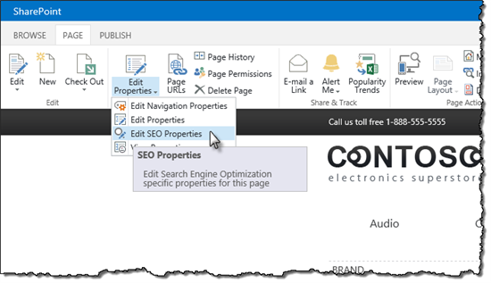

# Search Engine Optimization (SEO) in SharePoint Server

[!INCLUDE[appliesto-xxx-2016-xxx-xxx-md](../includes/appliesto-xxx-2016-xxx-xxx-md.md)]
  
If you are a website owner, you know how important it is that users can easily find your website by using Internet search engines such as Bing or Google. The higher your website is shown in the search results list, the more likely it is that users will click on it. Just think of your own behavior when looking at search results. When was the last time that you clicked to view the second page of search results?
  
## Optimizing SharePoint Server 2016 websites for Internet search engines

The white paper [Optimizing SharePoint Server 2013 websites for Internet search engines](https://go.microsoft.com/fwlink/p/?LinkId=400784) explains how to apply SEO features to your SharePoint Server 2016 website so that Internet search engines will display it high in their search results list. The white paper covers subjects such as the following: 
  
- SEO activities that you can do in the planning phase of setting up a new website
    
- New SharePoint Server 2016 SEO features and how you can use them
    
- SEO for websites that use cross-site publishing
    
- How to handle common SEO challenges
    

  

