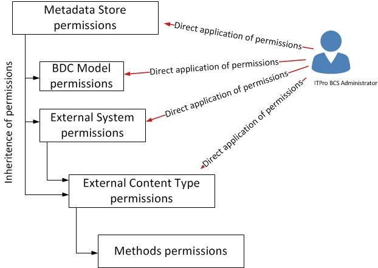

# Overview of Business Connectivity Services security tasks in SharePoint Server

[!INCLUDE[appliesto-2013-2016-2019-xxx-md](../includes/appliesto-2013-2016-2019-xxx-md.md)]
  
Providing security for the data that you work with through Microsoft Business Connectivity Services (BCS) is a critical part of every BCS solution. Unlike regular SharePoint data, which is stored in a SharePoint content database, the data that BCS solutions make visible live outside of SharePoint in external systems. BCS provides the channel that SharePoint uses to get to the external data. In addition to working within the usual SharePoint Server security controls such as site access permissions and list permissions, BCS solutions have to deal with additional communication and security layers. For example, the external system might use a different authentication mechanism or provider, and require different credentials than the ones your users use to access SharePoint Server with. Because there are more security layers in a BCS solution, there are more security configuration tasks involved.
  
The Business Connectivity Services security tasks fall to three different roles: the IT professional; the site collection administrator, or site owner; and the developer. The following examples describe what each role is responsible for.
  
- IT professionals have the responsibility of managing the security on the Metadata Store and its contents. They also handle account and group administration and credential mapping in the Secure Store Service.
    
- Site collection administrators and site owners are responsible for understanding the kind of security the external system uses and how to configure no-code, or declarative, external content types to communicate with it. They are also responsible for planning and applying security to external lists and business data Web Parts.
    
- BCS solution developers are responsible for understanding the kind of security that the external system uses and how to configure the BDC model to communicate with it, and security around development and deployment of apps for Office and SharePoint.
    
## Business Connectivity Services security

 **Delegation of administration to the **Business Data Connectivity service****
  
The first task that the farm administrator should perform after creating an instance of the Business Data Connectivity service is to delegate administration of the service to a different account, preferably one without farm administrator rights. This best practice follows the principle of least-privilege. The delegated account will be granted the necessary permissions to open the SharePoint Central Administration website and access to the Business Data Connectivity service service application. This should be the primary account that is used to administer the service. The only permission that can be granted or revoked is **Full Control**.
  
 **Managing permission on the Metadata Store and its contents**
  
The Metadata Store holds the external content type, the external system, and the BDC model definitions that the Business Data Connectivity service application uses. One of the main jobs of the BCS Services administrator is to manage security of the Metadata Store and all the items it contains. Items in the Metadata Store get their permissions in two ways. First you can directly apply the permissions to the Metadata Store, BDC models, external systems, or external content types. The second way is by inheriting them from a higher level item. Both methods are shown in the following figure.
  
**Figure: Metadata Store permissions**

  
- **Inheritance** Inheritance happens in two ways. First when any item is added to the Metadata Store, it inherits the permissions configuration of the Metadata Store itself. Second, the Metadata Store, external system, and external content type items can forcibly overwrite the permissions of items that are below them in the hierarchy. This happens when you select the **Propagate permissions to all…** and click **OK** when you are setting permissions on the parent item. 
    
- **Direct Application** If the permissions that an item do not meet your needs, you can manually adjust them. 
    
You can directly apply four permissions:
  
- **Edit** This allows the user or group to edit the item 
    
- **Execute** This allows the user or group to execute the operations (create, read, update, delete, query) of external content types in the Metadata Store. All users of a BCS solution must have execute permission on the associated external content type. 
    
- **Selectable in Clients** This allows the user or group to use the External Content Type for External Lists, and apps for SharePoint by making them available in the external item picker 
    
- **Set Permissions** This allows the user or group to set permissions on the item. Every item must have at least one user or group that has the Set Permissions permission. 
    
 **Recommendations for managing Metadata Store permissions**
  
1. Pick one account, probably your Business Connectivity Services administrator account, and grant it **Set Permissions** permissions at the Metadata Store level. This will satisfy the requirement that every item has one user or group that has **Set Permissions** permissions with a securely managed administrative account. If you don't explicitly set an account, the farm account is used by default. Do not select the **Propagate permissions to all** option. You don't have to select the **Propagate permissions to all** option because every item will inherit this configuration when it is added to the Metadata Store. This also prevents unnecessary accounts from gaining access to any external systems, BDC models, or external content types that they shouldn't have. 
    
2. Use the direct application method, configure the permissions on the individual items, again not selecting the **Propagate permissions to all** option. This will allow you to maintain unique permissions configuration on each object. 
    
3. Periodically, as part of your maintenance and operational plans, review the permissions configuration starting from the Metadata Store level and moving down the hierarchy to ensure that each item has the correct permissions configuration. If the permissions configuration has drifted from what it should be you should manually reconfigure them.
    
4. You should only use the **Propagate all permissions** option when you must completely reset all the permissions on the parent item and all its children. Note that this is a destructive process and all custom permissions on child items are lost. This action can break BCS solutions for users or groups that lose their permissions. 
    
 **Mapping accounts and groups in Secure Store Service**
  
BCS cannot pass a user's credentials outside of the SharePoint Server farm to the external system where the data resides unless you've configured Kerberos Constrained Delegation. Kerberos Constrained Delegation can be challenging to configure and maintain. As an alternative, you can use the [Secure Store Service](/previous-versions/office/sharepoint-server-2010/ee806889(v=office.14)). With Secure Store, you can map a group of users to a set of credentials that BCS can use to access the external system.
  
There are two ways to configure your mappings:
  
- **Group mapping** In group mapping target application, you add AD DS user accounts and security groups to Secure Store and then map them to a single set of credentials for the external system. This is the easiest way to manage access to a BCS solution. 
    
- **Individual mapping** In an individual mapping target application you can only map a single AD DS user account to a single set of credentials for the external system. Basically, this is a 1:1 mapping. You would generally do this if you have very few accounts to manage or if you want to track access and activity on the external system. 
    
 **Managing permissions on the Business Data Connectivity Service application**
  
By default, every Web Application in your farm is granted access to the Business Data Connectivity Service application through the server farm account. If you want to restrict access to only certain web applications, you can change this by removing the server farm account and then adding the Application Pool Identity account of desired the web applications. By doing this you control which web applications have access to the Business Data Connectivity Service application. For more information, see [Set permissions to published service applications in SharePoint Server](set-permission-to-a-published-service-application.md).
  
If you are publishing the Business Data Connectivity Service Application to other farms, you have to add the Farm IDs of the consuming farms. For more information, see [Share service applications across farms in SharePoint Server](share-service-applications-across-farms.md).
  
## See also

#### Concepts

[Overview of Business Connectivity Services in SharePoint Server](business-connectivity-services-overview.md)

