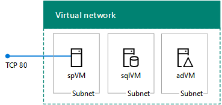
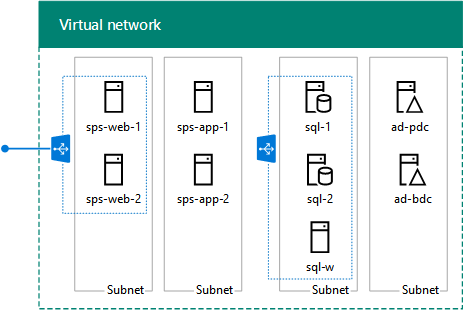

# SharePoint 2013 dev/test environments in Azure

[!INCLUDE[appliesto-2013-xxx-xxx-xxx-md](../includes/appliesto-2013-xxx-xxx-xxx-md.md)]
  
You can quickly create SharePoint 2013 dev/test environments in Microsoft Azure with the **SharePoint 2013 non-HA Farm** and **SharePoint 2013 HA Farm** Azure Resource Manager templates. These templates can save you a lot of time when you need a basic or high-availability SharePoint farm for a dev/test environment or if you are evaluating SharePoint Server 2013 as a collaboration solution for your organization. 
  
The basic SharePoint 2013 farm consists of three virtual machines hosted in Azure infrastructure services.
  

  
You can use the basic farm configuration for a simplified setup for SharePoint app development or your first-time evaluation of SharePoint 2013.
  
The high-availability SharePoint farm consists of nine virtual machines hosted in Azure infrastructure services.
  

  
You can use the high-availability farm configuration to test higher client loads, high availability of the external SharePoint site, and SQL Server AlwaysOn Availability Groups for a SharePoint farm. You can also use this configuration for SharePoint app development in a high-availability environment.
  
> [!NOTE]
> You cannot create the SharePoint 2013 non-HA Farm or SharePoint 2013 HA Farm with an Azure Free Trial. 
  
Both of these farms are in a cloud-only Azure virtual network with an Internet-facing web presence. There is no site-to-site VPN or ExpressRoute connection back to your organization network.
  
You can create these farms with the Azure portal or with Azure PowerShell.
  
## Create SharePoint 2013 dev/test farms with the Azure portal
<a name="portal"> </a>

To create the basic (three-server) SharePoint farm with the Azure portal:
  
1. Sign in to the Azure portal at [https://portal.azure.com/](https://portal.azure.com/).
    
2. Click **All services**, and then click **Marketplace** in the **General** list of services.
    
3. In the search box, type **SharePoint 2013**, and then click **SharePoint 2013 non-HA Farm**.
    
4. In the results, click **SharePoint 2013 non-HA Farm**.
    
5. On the **SharePoint 2013 non-HA Farm** pane, click **Create**.
    
6. Specify settings on the steps of the **Create SharePoint 2013 non-HA Farm** pane, and then click **Create**.
    
To create the high-availability (nine-server) SharePoint farm with the Azure portal:
  
1. Sign in to the Azure portal at [https://portal.azure.com/](https://portal.azure.com/).
    
2. Click **All services**, and then click **Marketplace** in the **General** list of services.
    
3. In the search box, type **SharePoint 2013**, and then click **SharePoint 2013 HA Farm**.
    
4. In the results, click **SharePoint 2013 HA Farm**.
    
5. On the **SharePoint 2013 HA Farm** pane, click **Create**.
    
6. Specify settings on the steps of the **Create SharePoint 2013 HA Farm** pane, and then click **Create**.
    
In both cases, it will take some time for Azure to build the workload.
  
There are limitations to creating these SharePoint 2013 dev/test farms with the Azure portal. For example, you can only specify a new resource group. You cannot specify an existing resource group. To work around these limitations and further customize the settings used to create the dev/test farms, you can use Azure PowerShell.
  
## Create SharePoint 2013 dev/test farms with Azure PowerShell
<a name="powershell"> </a>

With Azure PowerShell, you can also create the basic and high-availability SharePoint 2013 farms with a local copy of the following Azure Resource Manager (ARM) template files:
  
- **azuredeploy.json** Contains the instructions to create the Azure infrastructure and the virtual machines. 
    
- **azuredeploy.parameters.json** Contains a set of parameters that you can modify for the deployment. 
    
Executing a local copy of the template with the parameters file with Azure PowerShell allows you to specify the settings for the deployment, similar to the set of panes for the Azure portal. It also allows you to work around the limitations of executing the template in the Azure portal, such as specifying an existing resource group.
  
### The basic SharePoint 2013 dev/test farm

In this procedure, you download copies of the basic SharePoint 2013 farm template files, modify them as needed, and then execute the template with Azure PowerShell.
  
> [!NOTE]
> These commands use [the latest version of Azure PowerShell](https://azure.microsoft.com/documentation/articles/powershell-install-configure/). 
  
Create a local folder to store the ARM template files for the basic SharePoint 2013 farm. Fill in the **$myFolder** variable value (removing the text and the "<" and ">" characters between the quotes) and run the following commands from Azure PowerShell: 
  
```
$myFolder="<your local folder path, such as C:\azure\templates\BasicSPFarm>"
$url1="https://raw.githubusercontent.com/Azure/azure-quickstart-templates/master/sharepoint-three-vm/azuredeploy.json"
$url2="https://raw.githubusercontent.com/Azure/azure-quickstart-templates/master/sharepoint-three-vm/azuredeploy.parameters.json"
$webClient=New-Object System.Net.WebClient
$filePath=$myFolder + "\azuredeploy.json"
$webclient.DownloadFile($url1,$filePath)
$filePath = $myFolder + "\azuredeploy.parameters.json"
$webclient.DownloadFile($url2,$filePath)

```

Ensure that the download was successful with this command.
  
```
dir $myFolder
```

Modify the **azuredeploy.parameters.json** file as needed for your basic SharePoint 2013 farm. You can use Visual Studio Code or the free [Sublime Text editor](https://www.sublimetext.com/). For example, you can specify:
  
- The Windows Server AD domain administrator account name (adminUsername).
    
- The SQL Server service account name (sqlServerServiceAccountUserName).
    
- The SharePoint setup user account name (sharePointSetupUserAccountUserName).
    
- The DNS host name for the public IP address of the ARM resource (sppublicIPAddressName).
    
- The DNS prefix for the public IP address of the SharePoint server (spDNSPrefix).
    
- The DNS name for the storage account (storageAccountNamePrefix).
    
- The virtual machine size of the domain controller (adVMSize).
    
- The virtual machine size of the SQL Server computer (sqlVMSize).
    
- The virtual machine size of the SharePoint server (spVMSize).
    
For the virtual machine sizes, you must specify a size in the [DS or GS series of virtual machines](https://azure.microsoft.com/documentation/articles/virtual-machines-windows-sizes/).
  
> [!NOTE]
> Although you can specify the passwords for the various accounts in the azuredeploy. parameters.json file, this is not recommended for security reasons because the passwords are recorded in a text file that anyone with access to the file can easily see. 
  
Modify the **azuredeploy.json** file as needed for your basic SharePoint 2013 farm. Specify values through the **defaultValue** line of each setting in the **parameters** section. For example, you can specify: 
  
- The name of the SharePoint farm (sharepointFarmName).
    
- The Azure location (location).
    
- The Azure virtual network name (virtualNetworkName), address space (virtualNetworkAddressRange), and the address spaces for the domain controllers (adSubnet), SQL servers (sqlSubnet), and SharePoint servers (spSubnet).
    
- The static private IP address assigned to the domain controller virtual machine (adNicIPAddress).
    
- The Windows Server AD domain name (domainName).
    
- The SharePoint site template (spSiteTemplateName).
    
Next, sign in to Azure PowerShell.
  
```
Connect-AzAccount
```

Determine the Azure subscription for the basic SharePoint farm with this command.
  
```
Get-AzSubscription | Sort SubscriptionName | Select SubscriptionName
```

Set your subscription to the correct one with these commands.
  
```
$subscrName="<subscription name>"
Select-AzSubscription -SubscriptionName $subscrName
```

Next, specify the resource group name and Azure location for the deployment with these commands.
  
```
$rgName="<resource group name>"
$locName="<Azure location, such as West US>"
```

You can get a list of existing resource groups with this command.
  
```
Get-AzResourceGroup | Sort ResourceGroupName | Select ResourceGroupName
```

If needed, create a new resource group.
  
> [!NOTE]
> If you are using an existing resource group, the resources and settings of the template can impact the resources within the group. You should perform a careful analysis of the existing resources of the resource group to ensure that do not overlap in an undesirable way. 
  
```
New-AzResourceGroup -Name $rgName -Location $locName
```

Next, determine the following values, for which you may be prompted when you execute the template:
  
- adminUsername
    
- adminPassword
    
- sqlServerServiceAccountPassword
    
- sharePointSetupUserAccountPassword
    
- sharePointFarmAccountPassword
    
- sharePointFarmPassphrasePassword
    
- spDNSPrefix: 
    
    This value is the DNS label for the SharePoint server's public IP address, which hosts the first site collection and the Central Administration site.
    
- sppublicIPAddressName: 
    
    The DNS host name for the public IP address of the ARM resource.
    
- storageAccountNamePrefix: 
    
    The name must be between 3 and 24 characters in length and use numbers and lower-case letters only. Example: contosotestsp2013farm.
    
Use these commands to specify a deployment name and execute the template **without** the azuredeploy.parameters.json file: 
  
```
$deployName="<deployment name>"
New-AzResourceGroupDeployment -Name $deployName -ResourceGroupName $rgName -TemplateFile $myFolder\azuredeploy.json
```

Use these commands to specify a deployment name and execute the template **with** the azuredeploy.parameters.json file: 
  
```
$deployName="<deployment name>"
New-AzResourceGroupDeployment -Name $deployName -ResourceGroupName $rgName -TemplateFile $myFolder\azuredeploy.json -TemplateParameterFile $myFolder\azuredeploy.parameters.json
```

When you run the **New-AzureResourceGroupDeployment** command, you will be prompted to supply some values, such as passwords. When you have specified all the needed values, the command creates the three-server, basic SharePoint 2013 farm in Azure. 
  

  
This can take some time to complete.
  
### The high-availability SharePoint 2013 dev/test farm

In this procedure, you download copies of the high-availability SharePoint 2013 farm template files, modify them as needed, and then execute the template with Azure PowerShell.
  
> [!NOTE]
> These commands use [Azure PowerShell 1.0.0 and later](https://azure.microsoft.com/documentation/articles/powershell-install-configure/). 
  
Create a local folder to store the ARM template files for the high-availability SharePoint 2013 farm. Fill in the **$myFolder** variable value (removing the text and the "<" and ">" characters between the quotes) and run the following commands from Azure PowerShell: 
  
```
$myFolder="<your local folder path, such as C:\azure\templates\HASPFarm>"
$url1=https://raw.githubusercontent.com/Azure/azure-quickstart-templates/master/sharepoint-server-farm-ha/azuredeploy.json"
$url2="https://raw.githubusercontent.com/Azure/azure-quickstart-templates/master/sharepoint-server-farm-ha/azuredeploy.parameters.json"
$webClient=New-Object System.Net.WebClient
$filePath=$myFolder + "\azuredeploy.json"
$webclient.DownloadFile($url1,$filePath)
$filePath = $myFolder + "\azuredeploy.parameters.json"
$webclient.DownloadFile($url2,$filePath)
```

Ensure that the download was successful with this command.
  
```
dir $myFolder
```

Modify the **azuredeploy.parameters.json** file as needed for your high-availability SharePoint 2013 farm. You can use Visual Studio Code or the free [Sublime Text editor](https://www.sublimetext.com/). For example, you can specify:
  
- The Windows Server AD domain administrator account name (adminUsername).
    
- The SQL Server service account name (sqlServerServiceAccountUserName).
    
- The SharePoint setup user account name (sharePointSetupUserAccountUserName).
    
- The DNS host name for the public IP address of the SharePoint server (sppublicIPAddressName).
    
- The DNS prefix for the public IP address of the SharePoint server (spDNSPrefix).
    
- The DNS name for the storage account (storageAccountNamePrefix).
    
- The size of the domain controller virtual machines (adVMSize).
    
- The size of the SQL Server virtual machines (sqlVMSize).
    
- The size of the file share witness virtual machine (witnessVMSize).
    
- The size of the SharePoint server virtual machines (spVMSize).
    
- The Windows Server AD domain name (domainName).
    
For the virtual machine sizes, you must specify a size in the [DS or GS series of virtual machines](https://azure.microsoft.com/documentation/articles/virtual-machines-windows-sizes/).
  
> [!NOTE]
> Although you can specify the passwords for the various accounts in the azuredeploy. parameters.json file, this is not recommended for security reasons because the passwords are recorded in a text file that anyone with access to the file can easily see. 
  
Modify the **azuredeploy.json** file as needed for your high-availability SharePoint 2013 farm. Specify values through the **defaultValue** line of each setting in the **parameters** section. For example, you can specify: 
  
- The name of the SharePoint farm (sharepointFarmName).
    
- The Azure location (location).
    
- The Azure virtual network name (virtualNetworkName), address space (virtualNetworkAddressRange), and the address spaces for the domain controllers (adSubnet), SQL servers (sqlSubnet), and SharePoint servers (spSubnet).
    
- The static private IP addresses assigned to the domain controller virtual machines (adPDCNICIPAddress and adBDCNICIPAddress).
    
- The static IP address assigned to the internal load balancer for the SQL Server virtual machines (sqlLBIPAddress).
    
- The SharePoint site template (spSiteTemplateName).
    
Next, sign in to Azure PowerShell.
  
```
Connect-AzAccount
```

Determine the Azure subscription for the high-availability SharePoint farm with this command.
  
```
Get-AzSubscription | Sort SubscriptionName | Select SubscriptionName
```

Set your subscription to the correct one with these commands.
  
```
$subscrName="<subscription name>"
Select-AzSubscription -SubscriptionName $subscrName
```

Next, specify the resource group name and Azure location for the deployment with these commands.
  
```
$rgName="<resource group name>"
$locName="<Azure location, such as West US>"
```

You can get a list of existing resource groups with this command.
  
```
Get-AzResourceGroup | Sort ResourceGroupName | Select ResourceGroupName
```

If needed, create a new resource group.
  
> [!NOTE]
> If you are using an existing resource group, the resources and settings of the template can impact the resources within the group. You should perform a careful analysis of the existing resources of the resource group to ensure that do not overlap in an undesirable way. 
  
```
New-AzResourceGroup -Name $rgName -Location $locName
```

Next, determine the following values, for which you may be prompted when you execute the template:
  
- adminUsername
    
- adminPassword
    
- sqlServerServiceAccountPassword
    
- sharePointSetupUserAccountPassword
    
- sharePointFarmAccountPassword
    
- sharePointFarmPassphrasePassword
    
- spDNSPrefix: 
    
    This value is the DNS label for the SharePoint server's public IP address, which hosts the first site collection and the Central Administration site.
    
- sppublicIPAddressName: 
    
    The DNS host name for the public IP address of the ARM resource.
    
- storageAccountNamePrefix: 
    
    The name must be between 3 and 24 characters in length and  *use numbers and lower-case letters only*  . Example: contosotestsp2013farm. 
    
Use these commands to specify a deployment name and execute the template **without** the azuredeploy.parameters.json file: 
  
```
$deployName="<deployment name>"
New-AzResourceGroupDeployment -Name $deployName -ResourceGroupName $rgName -TemplateFile $myFolder\azuredeploy.json
```

Use these commands to specify a deployment name and execute the template **with** the azuredeploy.parameters.json file: 
  
```
$deployName="<deployment name>"
New-AzResourceGroupDeployment -Name $deployName -ResourceGroupName $rgName -TemplateFile $myFolder\azuredeploy.json -TemplateParameterFile $myFolder\azuredeploy.parameters.json
```

When you run the **New-AzureResourceGroupDeployment** command, you will be prompted to supply some values, such as passwords. When you have specified all the needed values, the command creates the nine-server, high-availability SharePoint 2013 farm in Azure. 
  

  
This can take some time to complete.
  
## Manage the SharePoint 2013 dev/test farms
<a name="powershell"> </a>

You can administer the servers of these farms through [Remote Desktop connections](https://azure.microsoft.com/documentation/articles/virtual-machines-windows-connect-logon/).
  
From the Central Administration SharePoint site, you can configure My sites, SharePoint applications, and other functionality. For more information, see [Configure SharePoint 2013](/SharePoint/install/configure).
  
## Create a SharePoint 2016 dev/test farm
<a name="powershell"> </a>

See the instructions in [SharePoint Server 2016 dev/test environment in Azure](/SharePoint/administration/sharepoint-server-2016-dev-test-environment-in-azure) to create the following single-server, SharePoint 2016 dev/test farm:. 
  

  
## See also

[Technical diagrams for SharePoint Server](../technical-reference/technical-diagrams.md)

[SharePoint Server 2016 dev/test environment in Azure](/SharePoint/administration/sharepoint-server-2016-dev-test-environment-in-azure)

