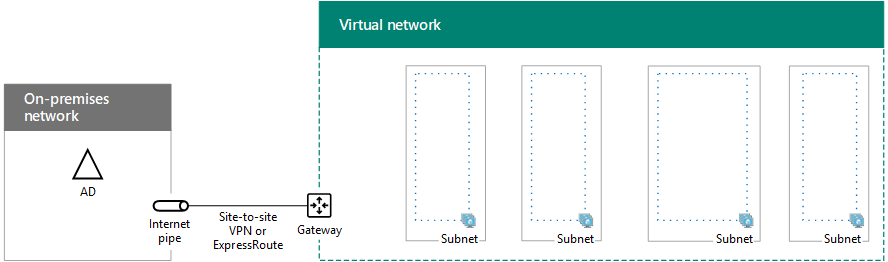

# SharePoint Intranet Farm in Azure Phase 1: Configure Azure

[!INCLUDE[appliesto-xxx-2016-xxx-xxx-md](../includes/appliesto-xxx-2016-xxx-xxx-md.md)] 
  
In this phase of deploying an intranet-only SharePoint Server 2016 farm in Azure, you build out the Azure infrastructure. You must complete this phase before moving on to [SharePoint Intranet Farm in Azure Phase 2: Configure domain controllers](sharepoint-intranet-farm-in-azure-phase-2-configure-domain-controllers.md). See [Deploying SharePoint Server 2016 with SQL Server AlwaysOn Availability Groups in Azure](/SharePoint/administration/deploying-sharepoint-server-2016-with-sql-server-alwayson-availability-groups-in) for all of the phases. 
  
Azure must be provisioned with these basic components for networking and storage:
  
- Resource groups
    
- A cross-premises virtual network with subnets for hosting the Azure virtual machines
    
- Network security groups for performing subnet isolation
    
- Availability sets
    
- Load balancer instances for the SharePoint front end and distributed cache and the SQL Server virtual machines
    
## Configure Azure components

Before you begin configuring Azure components, fill in the following tables. To assist you in the procedures for configuring Azure, print this section and write down the needed information or copy this section to a document and fill it in. For the settings of the Azure virtual network (VNet), fill in Table V.
  
|**Item**|**Configuration setting**|**Description**|**Value**|
|:-----|:-----|:-----|:-----|
|1.  <br/> |VNet name  <br/> |A name to assign to the Azure Virtual Network (example SPFarmNet).  <br/> |  <br/> |
|2.  <br/> |VNet location  <br/> |The Azure datacenter that will contain the virtual network.  <br/> |  <br/> |
|3.  <br/> |VPN device IP address  <br/> |The public IPv4 address of your VPN device's interface on the Internet.  <br/> |  <br/> |
|4.  <br/> |VNet address space  <br/> |The address space for the virtual network. Work with your IT department to determine this address space.  <br/> |  <br/> |
|5.  <br/> |IPsec shared key  <br/> |A 32-character random, alphanumeric string that will be used to authenticate both sides of the site-to-site VPN connection. Work with your IT or security department to determine this key value. Alternately, see [Create a random string for an IPsec preshared key](http://social.technet.microsoft.com/wiki/contents/articles/32330.create-a-random-string-for-an-ipsec-preshared-key.aspx).  <br/> |  <br/> |

   
 **Table V: Cross-premises virtual network configuration**
  
Next, fill in Table S for the subnets of this solution. All address spaces should be in Classless Interdomain Routing (CIDR) format, also known as network prefix format. An example is 10.24.64.0/20.
  
For the first four subnets, specify a name and a single IP address space based on the virtual network address space. For the gateway subnet, determine the 27-bit address space (with a /27 prefix length) for the Azure gateway subnet through the following process:
  
1. Set the variable bits in the address space of the VNet to 1, up to the bits being used by the gateway subnet, then set the remaining bits to 0.
    
2. Convert the resulting bits to decimal and express it as an address space with the prefix length set to the size of the gateway subnet.
    
See [Address space calculator for Azure gateway subnets](https://gallery.technet.microsoft.com/scriptcenter/Address-prefix-calculator-a94b6eed) for a PowerShell command block and C# console application that performs this calculation for you. 
  
Work with your IT department to determine these address spaces from the virtual network address space.
  
|**Item**|**Subnet name**|**Subnet address space**|**Purpose**|
|:-----|:-----|:-----|:-----|
|1.  <br/> |  <br/> |  <br/> |The subnet used by the Windows Server Active Directory (AD) VMs.  <br/> |
|2.  <br/> |  <br/> |  <br/> |The subnet used by the VMs in the SQL Server cluster.  <br/> |
|3.  <br/> |  <br/> |  <br/> |The subnet used by the SharePoint app and search servers.  <br/> |
|4.  <br/> |  <br/> |  <br/> |The subnet used by the front end and distributed cache servers.  <br/> |
|5.  <br/> |GatewaySubnet  <br/> |  <br/> |The subnet used by the Azure gateway virtual machines.  <br/> |
   
 **Table S: Subnets in the virtual network**
  
Next, fill in Table I for the static IP addresses assigned to virtual machines and load balancer instances.
  
|**Item**|**Purpose**|**IP address on the subnet**|**Value**|
|:-----|:-----|:-----|:-----|
|1.  <br/> |Static IP address of the first domain controller  <br/> |The fourth possible IP address for the address space of the subnet defined in Item 1 of Table S.  <br/> |  <br/> |
|2.  <br/> |Static IP address of the second domain controller  <br/> |The fifth possible IP address for the address space of the subnet defined in Item 1 of Table S.  <br/> |  <br/> |
|3.  <br/> |Static IP address of the internal load balancer for the front end and distributed cache SharePoint servers  <br/> |The sixth possible IP address for the address space of the subnet defined in Item 4 of Table S.  <br/> |  <br/> |
|4.  <br/> |Static IP address of the internal load balancer for the listener address of the SQL server cluster  <br/> |The fourth possible IP address for the address space of the subnet defined in Item 2 of Table S.  <br/> |  <br/> |
|5.  <br/> |Static IP address of the first SQL server  <br/> |The fifth possible IP address for the address space of the subnet defined in Item 2 of Table S.  <br/> |  <br/> |
|6.  <br/> |Static IP address of the second SQL server  <br/> |The sixth possible IP address for the address space of the subnet defined in Item 2 of Table S.  <br/> |  <br/> |
|7.  <br/> |Static IP address of the minority node server  <br/> Note that this is not needed if you are using a [cloud witness](/windows-server/failover-clustering/deploy-cloud-witness).  <br/> |The seventh possible IP address for the address space of the subnet defined in Item 2 of Table S.  <br/> |  <br/> |
|8.  <br/> |Static IP address of the first application and search SharePoint server  <br/> |The fourth possible IP address for the address space of the subnet defined in Item 3 of Table S.  <br/> |  <br/> |
|9.  <br/> |Static IP address of the second application and search SharePoint server  <br/> |The fifth possible IP address for the address space of the subnet defined in Item 3 of Table S.  <br/> |  <br/> |
|10.  <br/> |Static IP address of the first front end and distributed cache SharePoint server  <br/> |The fourth possible IP address for the address space of the subnet defined in Item 4 of Table S.  <br/> |  <br/> |
|11.  <br/> |Static IP address of the second front end and distributed cache SharePoint server  <br/> |The fifth possible IP address for the address space of the subnet defined in Item 4 of Table S.  <br/> |  <br/> |
   
 **Table I: Static IP addresses in the virtual network**
  
For the two Domain Name System (DNS) servers in your on-premises network that you want to use when initially setting up the domain controllers in your virtual network, fill in Table D. Note that two blank entries are listed, but you can add more. Work with your IT department to determine this list.
  
|**Item**|**DNS server friendly name**|**DNS server IP address**|
|:-----|:-----|:-----|
|1.  <br/> |  <br/> |  <br/> |
|2.  <br/> |  <br/> |  <br/> |
   
 **Table D: On-premises DNS servers**
  
> [!NOTE]
> If you are using [Azure Active Directory (AD) Domain Services](/azure/active-directory-domain-services/active-directory-ds-overview) as a substitute for virtual machines running as domain replicas, you do not need these DNS server IP addresses. 
  
To route packets from the cross-premises network to your organization network across the site-to-site VPN connection, you must configure the virtual network with a local network that contains a list of the address spaces (in CIDR notation) for all of the reachable locations on your organization's on-premises network. The list of address spaces that define your local network must be unique and must not overlap with the address space used for other virtual networks or other local networks.
  
For the set of local network address spaces, fill in Table L. Note that three blank entries are listed but you will typically need more. Work with your IT department to determine this list of address spaces.
  
|**Item**|**Local network address space**|
|:-----|:-----|
|1.  <br/> |  <br/> |
|2.  <br/> |  <br/> |
|3.  <br/> |  <br/> |
   
 **Table L: Address prefixes for the local network**
  
Now let's begin building the Azure infrastructure to host your SharePoint farm.
  
> [!NOTE]
> The following command sets use the latest version of Azure PowerShell. See [Get started with Azure PowerShell cmdlets](/powershell/azure/overview?view=azurermps-6.13.0). 
  
First, start an Azure PowerShell prompt and login to your account.
  
```
Connect-AzAccount
```

Get your subscription name using the following command.
  
```
Get-AzSubscription | Sort Name | Select Name
```

Set your Azure subscription. Replace everything within the quotes, including the \< and \> characters, with the correct name.
  
```
$subscr="<subscription name>"
Select-AzSubscription -SubscriptionName $subscr
```

Next, create the new resource groups for your intranet SharePoint farm. To determine a unique set of resource group names, use this command to list your existing resource groups.
  
```
Get-AzResourceGroup | Sort ResourceGroupName | Select ResourceGroupName
```

Fill in the following table for the set of unique resource group names.
  
|**Item**|**Resource group name**|**Purpose**|
|:-----|:-----|:-----|
|1.  <br/> |  <br/> |Domain controllers  <br/> |
|2.  <br/> |  <br/> |Database cluster servers  <br/> |
|3.  <br/> |  <br/> |App and search servers  <br/> |
|4.  <br/> |  <br/> |Front end and distributed cache servers  <br/> |
|5.  <br/> |  <br/> |Infrastructure elements  <br/> |
   
 **Table R: Resource groups**
  
Create your new resource groups with these commands.
  
```
$locName="<an Azure location, such as West US>"
$rgName="<Table R - Item 1 - Name column>"
New-AzResourceGroup -Name $rgName -Location $locName
$rgName="<Table R - Item 2 - Name column>"
New-AzResourceGroup -Name $rgName -Location $locName
$rgName="<Table R - Item 3 - Name column>"
New-AzResourceGroup -Name $rgName -Location $locName
$rgName="<Table R - Item 4 - Name column>"
New-AzResourceGroup -Name $rgName -Location $locName
$rgName="<Table R - Item 5 - Name column>"
New-AzResourceGroup -Name $rgName -Location $locName
```

Next, you create the Azure virtual network and its subnets that will host your intranet SharePoint farm.
  
```
$rgName="<Table R - Item 5 - Resource group name column>"
$locName="<Azure location>"
$locShortName="<the location of the resource group in lowercase with spaces removed, example: westus>"
$vnetName="<Table V - Item 1 - Value column>"
$vnetAddrPrefix="<Table V - Item 4 - Value column>"
$dnsServers=@( "<Table D - Item 1 - DNS server IP address column>", "<Table D - Item 2 - DNS server IP address column>" )
# Create the subnets
$spSubnet1Name="<Table S - Item 1 - Subnet name column>"
$spSubnet1Prefix="<Table S - Item 1 - Subnet address space column>"
$spSubnet1=New-AzVirtualNetworkSubnetConfig -Name $spSubnet1Name -AddressPrefix $spSubnet1Prefix
$spSubnet2Name="<Table S - Item 2 - Subnet name column>"
$spSubnet2Prefix="<Table S - Item 2 - Subnet address space column>"
$spSubnet2=New-AzVirtualNetworkSubnetConfig -Name $spSubnet2Name -AddressPrefix $spSubnet2Prefix
$spSubnet3Name="<Table S - Item 3 - Subnet name column>"
$spSubnet3Prefix="<Table S - Item 3 - Subnet address space column>"
$spSubnet3=New-AzVirtualNetworkSubnetConfig -Name $spSubnet3Name -AddressPrefix $spSubnet3Prefix
$spSubnet4Name="<Table S - Item 4 - Subnet name column>"
$spSubnet4Prefix="<Table S - Item 4 - Subnet address space column>"
$spSubnet4=New-AzVirtualNetworkSubnetConfig -Name $spSubnet4Name -AddressPrefix $spSubnet4Prefix
$gwSubnet5Prefix="<Table S - Item 5 - Subnet address space column>"
$gwSubnet=New-AzVirtualNetworkSubnetConfig -Name "GatewaySubnet" -AddressPrefix $gwSubnet5Prefix
# Create the virtual network
New-AzVirtualNetwork -Name $vnetName -ResourceGroupName $rgName -Location $locName -AddressPrefix $vnetAddrPrefix -Subnet $gwSubnet,$spSubnet1,$spSubnet2,$spSubnet3,$spSubnet4 -DNSServer $dnsServers
```

Next, you create network security groups for each subnet that contains virtual machines. To perform subnet isolation, you can add rules for the specific types of traffic allowed or denied to the network security group of a subnet.
  
```
# Create network security groups
$vnet=Get-AzVirtualNetwork -ResourceGroupName $rgName -Name $vnetName
New-AzNetworkSecurityGroup -Name $spSubnet1Name -ResourceGroupName $rgName -Location $locShortName
$nsg=Get-AzNetworkSecurityGroup -Name $spSubnet1Name -ResourceGroupName $rgName
Set-AzVirtualNetworkSubnetConfig -VirtualNetwork $vnet -Name $spSubnet1Name -AddressPrefix $spSubnet1Prefix -NetworkSecurityGroup $nsg
New-AzNetworkSecurityGroup -Name $spSubnet2Name -ResourceGroupName $rgName -Location $locShortName
$nsg=Get-AzNetworkSecurityGroup -Name $spSubnet2Name -ResourceGroupName $rgName
Set-AzVirtualNetworkSubnetConfig -VirtualNetwork $vnet -Name $spSubnet2Name -AddressPrefix $spSubnet2Prefix -NetworkSecurityGroup $nsg
New-AzNetworkSecurityGroup -Name $spSubnet3Name -ResourceGroupName $rgName -Location $locShortName
$nsg=Get-AzNetworkSecurityGroup -Name $spSubnet3Name -ResourceGroupName $rgName
Set-AzVirtualNetworkSubnetConfig -VirtualNetwork $vnet -Name $spSubnet3Name -AddressPrefix $spSubnet3Prefix -NetworkSecurityGroup $nsg
New-AzNetworkSecurityGroup -Name $spSubnet4Name -ResourceGroupName $rgName -Location $locShortName
$nsg=Get-AzNetworkSecurityGroup -Name $spSubnet4Name -ResourceGroupName $rgName
Set-AzVirtualNetworkSubnetConfig -VirtualNetwork $vnet -Name $spSubnet4Name -AddressPrefix $spSubnet4Prefix -NetworkSecurityGroup $nsg
$vnet | Set-AzVirtualNetwork
```

Next, use these commands to create the gateways for the site-to-site VPN connection.
  
```
$rgName="<Table R - Item 5 - Resource group name column>"
$locName="<Azure location>"
$vnetName="<Table V - Item 1 - Value column>"
$vnet=Get-AzVirtualNetwork -Name $vnetName -ResourceGroupName $rgName
$subnet=Get-AzVirtualNetworkSubnetConfig -VirtualNetwork $vnet -Name "GatewaySubnet"
# Attach a virtual network gateway to a public IP address and the gateway subnet
$publicGatewayVipName="SPPublicIPAddress"
$vnetGatewayIpConfigName="SPPublicIPConfig"
New-AzPublicIpAddress -Name $vnetGatewayIpConfigName -ResourceGroupName $rgName -Location $locName -AllocationMethod Dynamic
$publicGatewayVip=Get-AzPublicIpAddress -Name $vnetGatewayIpConfigName -ResourceGroupName $rgName
$vnetGatewayIpConfig=New-AzVirtualNetworkGatewayIpConfig -Name $vnetGatewayIpConfigName -PublicIpAddressId $publicGatewayVip.Id -Subnet $subnet
# Create the Azure gateway
$vnetGatewayName="SPAzureGateway"
$vnetGateway=New-AzVirtualNetworkGateway -Name $vnetGatewayName -ResourceGroupName $rgName -Location $locName -GatewayType Vpn -VpnType RouteBased -IpConfigurations $vnetGatewayIpConfig
# Create the gateway for the local network
$localGatewayName="SPLocalNetGateway"
$localGatewayIP="<Table V - Item 3 - Value column>"
$localNetworkPrefix=@( <comma-separated, double-quote enclosed list of the local network address prefixes from Table L, example: "10.1.0.0/24", "10.2.0.0/24"> )
$localGateway=New-AzLocalNetworkGateway -Name $localGatewayName -ResourceGroupName $rgName -Location $locName -GatewayIpAddress $localGatewayIP -AddressPrefix $localNetworkPrefix
# Define the Azure virtual network VPN connection
$vnetConnectionName="SPS2SConnection"
$vnetConnectionKey="<Table V - Item 5 - Value column>"
$vnetConnection=New-AzVirtualNetworkGatewayConnection -Name $vnetConnectionName -ResourceGroupName $rgName -Location $locName -ConnectionType IPsec -SharedKey $vnetConnectionKey -VirtualNetworkGateway1 $vnetGateway -LocalNetworkGateway2 $localGateway

```

Next, record the public IPv4 address of the Azure VPN gateway for your virtual network from the display of this command:
  
```
Get-AzPublicIpAddress -Name $publicGatewayVipName -ResourceGroupName $rgName
```

Next, configure your on-premises VPN device to connect to the Azure VPN gateway. For more information, see [Configure your VPN device](/azure/vpn-gateway/vpn-gateway-about-vpn-devices).
  
To configure your on-premises VPN device, you will need the following:
  
- The public IPv4 address of the Azure VPN gateway.
    
- The IPsec pre-shared key for the site-to-site VPN connection (Table V - Item 5 - Value column).
    
Next, ensure that the address space of the virtual network is reachable from your on-premises network. This is usually done by adding a route corresponding to the virtual network address space to your VPN device and then advertising that route to the rest of the routing infrastructure of your organization network. Work with your IT department to determine how to do this.
  
Next, define the names of four availability sets. Fill out Table A. 
  
|**Item**|**Purpose**|**Availability set name**|
|:-----|:-----|:-----|
|1.  <br/> |Domain controllers  <br/> |  <br/> |
|2.  <br/> |SQL servers  <br/> |  <br/> |
|3.  <br/> |Application and search servers  <br/> |  <br/> |
|4.  <br/> |Front-end and distributed cache servers  <br/> |  <br/> |
   
 **Table A: Availability sets**
  
You will need these names when you create the virtual machines in phases 2, 3, and 4.
  
Create your availability sets with these Azure PowerShell commands.
  
```
$locName="<the Azure location of your resource group>"
$rgName="<Table R - Item 1 - Resource group name column>"
$avName="<Table A - Item 1 - Availability set name column>"
New-AzAvailabilitySet -ResourceGroupName $rgName -Name $avName -Location $locName -Sku Aligned  -PlatformUpdateDomainCount 5 -PlatformFaultDomainCount 2
$rgName="<Table R - Item 2 - Resource group name column>"
$avName="<Table A - Item 2 - Availability set name column>"
New-AzAvailabilitySet -ResourceGroupName $rgName -Name $avName -Location $locName -Sku Aligned  -PlatformUpdateDomainCount 5 -PlatformFaultDomainCount 2
$rgName="<Table R - Item 3 - Resource group name column>"
$avName="<Table A - Item 3 - Availability set name column>"
New-AzAvailabilitySet -ResourceGroupName $rgName -Name $avName -Location $locName -Sku Aligned  -PlatformUpdateDomainCount 5 -PlatformFaultDomainCount 2
$rgName="<Table R - Item 4 - Resource group name column>"
$avName="<Table A - Item 4 - Availability set name column>"
New-AzAvailabilitySet -ResourceGroupName $rgName -Name $avName -Location $locName -Sku Aligned  -PlatformUpdateDomainCount 5 -PlatformFaultDomainCount 2
```

This is the configuration resulting from the successful completion of this phase.
  
**Phase 1: The Azure infrastructure for your high-availability SharePoint Server 2016 farm**


  
## Next step

Use [SharePoint Intranet Farm in Azure Phase 2: Configure domain controllers](sharepoint-intranet-farm-in-azure-phase-2-configure-domain-controllers.md) to continue with the configuration of this workload. 
  
## See also

#### Other Resources

[Deploying SharePoint Server 2016 with SQL Server AlwaysOn Availability Groups in Azure](/SharePoint/administration/deploying-sharepoint-server-2016-with-sql-server-alwayson-availability-groups-in)
  
[SharePoint Server 2016 in Microsoft Azure](/SharePoint/administration/sharepoint-server-2016-in-microsoft-azure)
  
[Designing a SharePoint Server 2016 farm in Azure](/SharePoint/administration/designing-a-sharepoint-server-2016-farm-in-azure)
  
[Install SharePoint Server](/SharePoint/install/install)

