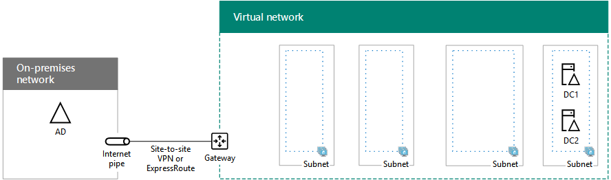

# SharePoint Intranet Farm in Azure Phase 2: Configure domain controllers

[!INCLUDE[appliesto-xxx-2016-xxx-xxx-md](../includes/appliesto-xxx-2016-xxx-xxx-md.md)] 
  
In this phase of deploying an intranet-only SharePoint Server 2016 farm in Azure infrastructure services, you configure two replica domain controllers in the Azure virtual network (VNet). Client web requests for SharePoint farm resources can then be authenticated in the VNet, rather than sending that authentication traffic across the site-to-site VPN or ExpressRoute connection to your on-premises network.
  
> [!NOTE]
> SharePoint Server 2016 also supports the use of [Azure Active Directory (AD) Domain Services](/azure/active-directory-domain-services/active-directory-ds-overview) as a substitute for virtual machines running as domain replicas. However, at this time, this deployment guide only describes the use of virtual machine-based replica domain controllers. 
  
You must complete this phase before moving on to [SharePoint Intranet Farm in Azure Phase 3: Configure SQL Server Infrastructure](sharepoint-intranet-farm-in-azure-phase-3-configure-sql-server-infrastructure.md). See [Deploying SharePoint Server 2016 with SQL Server AlwaysOn Availability Groups in Azure](/SharePoint/administration/deploying-sharepoint-server-2016-with-sql-server-alwayson-availability-groups-in) for all of the phases. 
  
## Create the domain controller virtual machines in Azure

First, you need to fill out the **Virtual machine name** column of Table M and modify virtual machine sizes as needed in the **Minimum size** column. 
  
|**Item**|**Virtual machine name**|**Gallery image**|**Minimum size**|**Storage type**|
|:-----|:-----|:-----|:-----|:-----|
|1.  <br/> | (first domain controller, example DC1)  <br/> |Windows Server 2016 Datacenter  <br/> |Standard_D2  <br/> |StandardLRS  <br/> |
|2.  <br/> | (second domain controller, example DC2)  <br/> |Windows Server 2016 Datacenter  <br/> |Standard_D2  <br/> |StandardLRS  <br/> |
|3.  <br/> | (first SQL Server computer, example SQL1)  <br/> |Microsoft SQL Server 2016 Enterprise - Windows Server 2016  <br/> |Standard_DS4  <br/> |PremiumLRS  <br/> |
|4.  <br/> | (second SQL Server computer, example SQL2)  <br/> |Microsoft SQL Server 2016 Enterprise - Windows Server 2016  <br/> |Standard_DS4  <br/> |PremiumLRS  <br/> |
|5.  <br/> | (majority node witness for the cluster, example MN1)  <br/> |Windows Server 2016 Datacenter  <br/> |Standard_D2  <br/> |StandardLRS  <br/> |
|6.  <br/> | (first SharePoint application and search server, example APP1)  <br/> |Microsoft SharePoint Server 2016 Trial - Windows Server 2012 R2  <br/> |Standard_DS4  <br/> |PremiumLRS  <br/> |
|7.  <br/> | (second SharePoint application and search server, example APP2)  <br/> |Microsoft SharePoint Server 2016 Trial - Windows Server 2012 R2  <br/> |Standard_DS4  <br/> |PremiumLRS  <br/> |
|8.  <br/> | (first SharePoint front end and distributed cache server, example WEB1)  <br/> |Microsoft SharePoint Server 2016 Trial - Windows Server 2012 R2  <br/> |Standard_DS4  <br/> |PremiumLRS  <br/> |
|9.  <br/> | (second SharePoint front end and distributed cache server, example WEB2)  <br/> |Microsoft SharePoint Server 2016 Trial - Windows Server 2012 R2  <br/> |Standard_DS4  <br/> |PremiumLRS  <br/> |
   
 **Table M - Virtual machines for the SharePoint Server 2016 intranet farm in Azure**
  
For the complete list of virtual machine sizes, see [Sizes for virtual machines](/azure/virtual-machines/windows/sizes).
  
Use the following Azure PowerShell command block creates the virtual machines for the two domain controllers. Specify the values for the variables, removing the \< and \> characters. Note that this Azure PowerShell command block uses values from the following:
  
- Table M, for your virtual machines
    
- Table R, for your resource groups
    
- Table V, for your virtual network settings
    
- Table S, for your subnets
    
- Table I, for your static IP addresses
    
- Table A, for your availability sets
    
Recall that you defined Tables R, V, S, I, and A in [SharePoint Intranet Farm in Azure Phase 1: Configure Azure](sharepoint-intranet-farm-in-azure-phase-1-configure-azure.md).
  
> [!NOTE]
> The following command sets use the latest version of Azure PowerShell. See [Get started with Azure PowerShell cmdlets](/powershell/azure/overview?view=azurermps-6.13.0). 
  
When you have supplied all the correct values, run the resulting block at the Azure PowerShell prompt or in the PowerShell Integrated Script Environment (ISE) on your local computer.
  
```
# Set up variables common to both virtual machines
$locName="<Azure location of the Sharepoint farm>"
$vnetName="<Table V - Item 1 - Value column>"
$subnetName="<Table S - Item 1 - Value column>"
$avName="<Table A - Item 1 - Availability set name column>"
$rgNameTier="<Table R - Item 1 - Resource group name column>"
$rgNameInfra="<Table R - Item 5 - Resource group name column>"
$rgName=$rgNameInfra
$vnet=Get-AzVirtualNetwork -Name $vnetName -ResourceGroupName $rgName
$subnet=Get-AzVirtualNetworkSubnetConfig -VirtualNetwork $vnet -Name $subnetName
$rgName=$rgNameTier
$avSet=Get-AzAvailabilitySet -Name $avName -ResourceGroupName $rgName 
# Create the first domain controller
$vmName="<Table M - Item 1 - Virtual machine name column>"
$vmSize="<Table M - Item 1 - Minimum size column>"
$staticIP="<Table I - Item 1 - Value column>"
$diskStorageType="<Table M - Item 1 - Storage type column>"
$diskSize=<size of the extra disk for Windows Server AD data in GB>
$nic=New-AzNetworkInterface -Name ($vmName +"-NIC") -ResourceGroupName $rgName -Location $locName -Subnet $subnet -PrivateIpAddress $staticIP
$vm=New-AzVMConfig -VMName $vmName -VMSize $vmSize -AvailabilitySetId $avset.Id
$cred=Get-Credential -Message "Type the name and password of the local administrator account for the first domain controller." 
$vm=Set-AzVMOperatingSystem -VM $vm -Windows -ComputerName $vmName -Credential $cred -ProvisionVMAgent -EnableAutoUpdate
$vm=Set-AzVMSourceImage -VM $vm -PublisherName MicrosoftWindowsServer -Offer WindowsServer -Skus 2016-Datacenter -Version "latest"
$vm=Add-AzVMNetworkInterface -VM $vm -Id $nic.Id
$vm=Set-AzVMOSDisk -VM $vm -Name ($vmName +"-OS") -DiskSizeInGB 128 -CreateOption FromImage -StorageAccountType $diskStorageType
$diskConfig=New-AzDiskConfig -AccountType $diskStorageType -Location $locName -CreateOption Empty -DiskSizeGB $diskSize
$dataDisk1=New-AzDisk -DiskName ($vmName + "-DataDisk1") -Disk $diskConfig -ResourceGroupName $rgName
$vm=Add-AzVMDataDisk -VM $vm -Name ($vmName + "-DataDisk1") -CreateOption Attach -ManagedDiskId $dataDisk1.Id -Lun 1
New-AzVM -ResourceGroupName $rgName -Location $locName -VM $vm
# Create the second domain controller
$vmName="<Table M - Item 2 - Virtual machine name column>"
$vmSize="<Table M - Item 2 - Minimum size column>"
$staticIP="<Table I - Item 2 - Value column>"
$diskStorageType="<Table M - Item 2 - Storage type column>"
$diskSize=<size of the extra disk for Windows Server AD data in GB>
$nic=New-AzNetworkInterface -Name ($vmName +"-NIC") -ResourceGroupName $rgName -Location $locName -Subnet $subnet -PrivateIpAddress $staticIP
$vm=New-AzVMConfig -VMName $vmName -VMSize $vmSize -AvailabilitySetId $avset.Id
$cred=Get-Credential -Message "Type the name and password of the local administrator account for the second domain controller." 
$vm=Set-AzVMOperatingSystem -VM $vm -Windows -ComputerName $vmName -Credential $cred -ProvisionVMAgent -EnableAutoUpdate
$vm=Set-AzVMSourceImage -VM $vm -PublisherName MicrosoftWindowsServer -Offer WindowsServer -Skus 2016-Datacenter -Version "latest"
$vm=Add-AzVMNetworkInterface -VM $vm -Id $nic.Id
$vm=Set-AzVMOSDisk -VM $vm -Name ($vmName +"-OS") -DiskSizeInGB 128 -CreateOption FromImage -StorageAccountType $diskStorageType
$diskConfig=New-AzDiskConfig -AccountType $diskStorageType -Location $locName -CreateOption Empty -DiskSizeGB $diskSize
$dataDisk1=New-AzDisk -DiskName ($vmName + "-DataDisk1") -Disk $diskConfig -ResourceGroupName $rgName
$vm=Add-AzVMDataDisk -VM $vm -Name ($vmName + "-DataDisk1") -CreateOption Attach -ManagedDiskId $dataDisk1.Id -Lun 1
New-AzVM -ResourceGroupName $rgName -Location $locName -VM $vm

```

> [!NOTE]
> Because these virtual machines are for an intranet application, they are not assigned a public IP address or a DNS domain name label and exposed to the Internet. However, this also means that you cannot connect to them from the Azure portal. The Connect option is unavailable when you view the properties of the virtual machine. Use the Remote Desktop Connection accessory or another Remote Desktop tool to connect to the virtual machine using its private IP address or intranet DNS name. 
  
## Configure the first domain controller

Use the remote desktop client of your choice and create a remote desktop connection to the first domain controller virtual machine. Use its intranet DNS or computer name and the credentials of the local administrator account.
  
Next, you need to add the extra data disk to the first domain controller with these commands from a Windows PowerShell command prompt:
  
```
Get-Disk | Where PartitionStyle -eq "RAW" | Initialize-Disk -PartitionStyle MBR -PassThru | New-Partition -AssignDriveLetter -UseMaximumSize | Format-Volume -FileSystem NTFS -NewFileSystemLabel "WSAD Data"

```

Next, test the first domain controller's connectivity to locations on your organization network by using the **ping** command to ping names and IP addresses of resources on your organization network. 
  
This procedure ensures that DNS name resolution is working correctly (that the virtual machine is correctly configured with on-premises DNS servers) and that packets can be sent to and from the cross-premises virtual network. If this basic test fails, contact your IT department to troubleshoot the DNS name resolution and packet delivery issues.
  
Next, from the Windows PowerShell command prompt on the first domain controller, run the following commands:
  
```
$domname="<DNS domain name of the domain for which this computer will be a domain controller, such as corp.contoso.com>"
$cred = Get-Credential -Message "Enter credentials of an account with permission to join a new domain controller to the domain"
Install-WindowsFeature AD-Domain-Services -IncludeManagementTools
Install-ADDSDomainController -InstallDns -DomainName $domname  -DatabasePath "F:\NTDS" -SysvolPath "F:\SYSVOL" -LogPath "F:\Logs" -Credential $cred

```

You will be prompted to supply the credentials of a domain administrator account. The computer will restart.
  
## Configure the second domain controller

Use the remote desktop client of your choice and create a remote desktop connection to the second domain controller virtual machine. Use its intranet DNS or computer name and the credentials of the local administrator account.
  
Next, you need to add the extra data disk to the second domain controller with these commands from a Windows PowerShell command prompt:
  
```
Get-Disk | Where PartitionStyle -eq "RAW" | Initialize-Disk -PartitionStyle MBR -PassThru | New-Partition -AssignDriveLetter -UseMaximumSize | Format-Volume -FileSystem NTFS -NewFileSystemLabel "WSAD Data"
```

Next, run the following commands:
  
```
$domname="<DNS domain name of the domain for which this computer will be a domain controller, such as corp.contoso.com>"
$cred = Get-Credential -Message "Enter credentials of an account with permission to join a new domain controller to the domain"
Install-WindowsFeature AD-Domain-Services -IncludeManagementTools
Install-ADDSDomainController -InstallDns -DomainName $domname  -DatabasePath "F:\NTDS" -SysvolPath "F:\SYSVOL" -LogPath "F:\Logs" -Credential $cred

```

You will be prompted to supply the credentials of a domain administrator account. The computer will restart.
  
Next, you need to update the DNS servers for your virtual network so that Azure assigns virtual machines the IP addresses of the two new domain controllers to use as their DNS servers.
  
```
$rgName="<Table R - Item 4 - Resource group name column>"
$adrgName="<Table R - Item 1 - Resource group name column>"
$locName="<your Azure location>"
$vnetName="<Table V - Item 1 - Value column>"
$onpremDNSIP1="<Table D - Item 1 - DNS server IP address column>"
$onpremDNSIP2="<Table D - Item 2 - DNS server IP address column>"
$staticIP1="<Table I - Item 1 - Value column>"
$staticIP2="<Table I - Item 2 - Value column>"
$firstDCName="<Table M - Item 1 - Virtual machine name column>"
$secondDCName="<Table M - Item 2 - Virtual machine name column>"
$vnet=Get-AzVirtualNetwork -ResourceGroupName $rgName -Name $vnetName
$vnet.DhcpOptions.DnsServers.Add($staticIP1)
$vnet.DhcpOptions.DnsServers.Add($staticIP2) 
$vnet.DhcpOptions.DnsServers.Remove($onpremDNSIP1)
$vnet.DhcpOptions.DnsServers.Remove($onpremDNSIP2) 
Set-AzVirtualNetwork -VirtualNetwork $vnet
Restart-AzVM -ResourceGroupName $adrgName -Name $firstDCName
Restart-AzVM -ResourceGroupName $adrgName -Name $secondDCName
```

Note that we restart the two domain controllers so that they are not configured with the on-premises DNS servers as DNS servers. Because they are both DNS servers themselves, they were automatically configured with the on-premises DNS servers as DNS forwarders when they were promoted to domain controllers.
  
Next, we need to create an Active Directory replication site to ensure that servers in the Azure virtual network use the local domain controllers. Log on to the primary domain controller with a domain administrator account and run the following commands from an administrator-level Windows PowerShell prompt:
  
```
$vnet="<Table V - Item 1 - Value column>"
$vnetSpace="<Table V - Item 5 - Value column>"
New-ADReplicationSite -Name $vnet 
New-ADReplicationSubnet -Name $vnetSpace -Site $vnet

```

## Configure SharePoint farm accounts and permissions

The SharePoint farm needs the following user accounts:
  
- sp_farm: A user account for managing SharePoint farms.
    
- sp_farm_db: A user account that has sysadmin rights on SQL Server instances.
    
- sp_install: A user account that has domain administration rights needed for installing roles and features.
    
- sqlservice: A user account that SQL Server instances can run as.
    
Log on to any computer with a domain administrator account for the domain for which the domain controllers are members, open an administrator-level Windows PowerShell command prompt, and run these commands  *one at a time*  : 
  
```
New-ADUser -SamAccountName sp_farm -AccountPassword (read-host "Set user password" -assecurestring) -name "sp_farm" -enabled $true -PasswordNeverExpires $true -ChangePasswordAtLogon $false
```

```
New-ADUser -SamAccountName sp_farm_db -AccountPassword (read-host "Set user password" -assecurestring) -name "sp_farm_db" -enabled $true -PasswordNeverExpires $true -ChangePasswordAtLogon $false
```

```
New-ADUser -SamAccountName sp_install -AccountPassword (read-host "Set user password" -assecurestring) -name "sp_install" -enabled $true -PasswordNeverExpires $true -ChangePasswordAtLogon $false
```

```
New-ADUser -SamAccountName sqlservice -AccountPassword (read-host "Set user password" -assecurestring) -name "sqlservice" -enabled $true -PasswordNeverExpires $true -ChangePasswordAtLogon $false
```

For each command, you will be prompted to enter a password. Record these account names and passwords and store them in a secure location.
  
Next, perform the following steps to add more account properties to the new user accounts.
  
1. Click **Start**, type **Active Directory Users**, and then click **Active Directory Users and Computers**.
    
2. In the tree pane, open your domain, and then click **Users**.
    
3. In the contents pane, right-click **sp_install**, and then click **Add to a group**.
    
4. In the **Select Groups** dialog, type **domain admins**, and then click **OK** twice. 
    
5. In the dialog, click **View** and click **Advanced Features**. The option lets you see all hidden containers and hidden tabs in the property windows for Active Directory objects.
    
6. Right-click your domain name and click **Properties**.
    
7. In the **Properties** dialog, click the **Security** tab, and then click the **Advanced** button. 
    
8. In the **Advanced Security settings for** window, click **Add**.
    
9. In the **Permission Entry for** window, click **Select a principal**.
    
10. In the text box, type **\sp_install**, and then click **OK**.
    
11. Select **Allow** for **Create computer objects**, and then click **OK** three times. 
    
Here is the configuration resulting from the successful completion of this phase, with placeholder computer names.
  
**Phase 2: The domain controllers for your high-availability SharePoint Server 2016 farm**


  
## Next step

Use [SharePoint Intranet Farm in Azure Phase 3: Configure SQL Server Infrastructure](sharepoint-intranet-farm-in-azure-phase-3-configure-sql-server-infrastructure.md) to continue configuring this workload. 
  
## See also

#### Other Resources

[Deploying SharePoint Server 2016 with SQL Server AlwaysOn Availability Groups in Azure](/SharePoint/administration/deploying-sharepoint-server-2016-with-sql-server-alwayson-availability-groups-in)
  
[SharePoint Server 2016 in Microsoft Azure](/SharePoint/administration/sharepoint-server-2016-in-microsoft-azure)
  
[Designing a SharePoint Server 2016 farm in Azure](/SharePoint/administration/designing-a-sharepoint-server-2016-farm-in-azure)
  
[Install SharePoint Server](/SharePoint/install/install)

