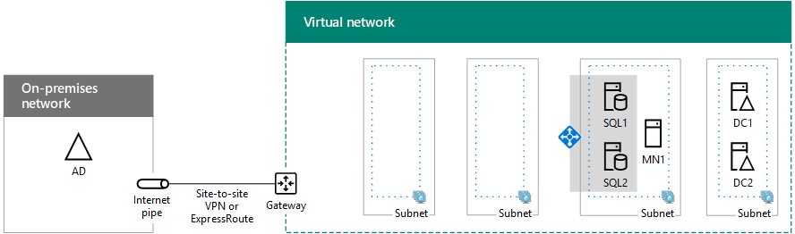

# SharePoint Intranet Farm in Azure Phase 3: Configure SQL Server Infrastructure

[!INCLUDE[appliesto-xxx-2016-xxx-xxx-md](../includes/appliesto-xxx-2016-xxx-xxx-md.md)] 
  
In this phase of deploying an intranet-only SharePoint Server 2016 farm in Azure infrastructure services, you create and configure the two SQL Server virtual machines and the cluster majority node, and then combine them into a Windows Server cluster.
  
You must complete this phase before moving on to [SharePoint Intranet Farm in Azure Phase 4: Configure SharePoint servers](sharepoint-intranet-farm-in-azure-phase-4-configure-sharepoint-servers.md). See [Deploying SharePoint Server 2016 with SQL Server AlwaysOn Availability Groups in Azure](/SharePoint/administration/deploying-sharepoint-server-2016-with-sql-server-alwayson-availability-groups-in) for all of the phases. 
  
> [!NOTE]
> These instructions use a SQL Server image in the Azure image gallery and you are charged ongoing costs for the use of the SQL Server license. It is also possible to create virtual machines in Azure and install your own SQL Server licenses, but you must have Software Assurance and License Mobility to use your SQL Server license on a virtual machine, including an Azure virtual machine. 
  
## Create the SQL Server cluster virtual machines in Azure

There are two SQL server virtual machines. One contains the primary database replica of an availability group. The second contains the secondary backup replica. The backup is provided to ensure high availability. An additional virtual machine is for the cluster majority node.
  
Use the following blocks of PowerShell commands to create the components in Azure. Specify the values for the variables, removing the \< and \> characters. Note that these PowerShell command blocks use values from the following tables:
  
- Table R, for your resource groups
    
- Table V, for your virtual network settings
    
- Table S, for your subnet
    
- Table I, for your static IP addresses
    
- Table M, for your virtual machines
    
- Table A, for your availability sets
    
Recall that you defined Table M in [SharePoint Intranet Farm in Azure Phase 2: Configure domain controllers](sharepoint-intranet-farm-in-azure-phase-2-configure-domain-controllers.md) and Tables R, V, S, I, and A in [SharePoint Intranet Farm in Azure Phase 1: Configure Azure](sharepoint-intranet-farm-in-azure-phase-1-configure-azure.md).
  
> [!NOTE]
> The following command sets use the latest version of Azure PowerShell. See [Get started with Azure PowerShell cmdlets](/powershell/azure/overview?view=azurermps-6.13.0). 
  
First, you create an Azure internal load balancer for the two virtual machines running SQL Server. When you have supplied all the correct values, run the resulting block at the Azure PowerShell command prompt or in the PowerShell Integrated Script Environment (ISE) on your local computer.
  
  
```
# Set up key variables
$locName="<Azure location of your SharePoint farm>"
$vnetName="<Table V - Item 1 - Value column>"
$subnetName="<Table S - Item 2 - Subnet name column>"
$privIP="<Table I - Item 4 - Value column>"
$rgName="<Table R - Item 5 - Resource group name column>"
$vnet=Get-AzVirtualNetwork -Name $vnetName -ResourceGroupName $rgName
$subnet=Get-AzVirtualNetworkSubnetConfig -VirtualNetwork $vnet -Name $subnetName
$frontendIP=New-AzLoadBalancerFrontendIpConfig -Name "SQLServers-LBFE" -PrivateIPAddress $privIP -Subnet $subnet
$beAddressPool=New-AzLoadBalancerBackendAddressPoolConfig -Name "SQLServers-LBBE"
$healthProbe=New-AzLoadBalancerProbeConfig -Name WebServersProbe -Protocol "TCP" -Port 59999 -IntervalInSeconds 5 -ProbeCount 2
$lbrule=New-AzLoadBalancerRuleConfig -Name "SQLTraffic" -FrontendIpConfiguration $frontendIP -BackendAddressPool $beAddressPool -Probe $healthProbe -Protocol "TCP" -FrontendPort 1433 -BackendPort 1433 -EnableFloatingIP
New-AzLoadBalancer -ResourceGroupName $rgName -Name "SQLServers" -Location $locName -LoadBalancingRule $lbrule -BackendAddressPool $beAddressPool -Probe $healthProbe -FrontendIpConfiguration $frontendIP

```

Next, add a DNS address record to your organization's internal DNS infrastructure that resolves the fully qualified domain name of the SQL cluster (such as sqlcluster.corp.contoso.com) to the IP address assigned to the internal load balancer (the value of Table I - Item 4).
  
Next, create the virtual machines of the SQL Server cluster.
  
> [!NOTE]
> The images for the SQL Server virtual machines are for SQL Server 2016, which cannot be used with Workflow Manager. If you need Workflow Manager, you must use SQL Server 2014. You can specify this by setting the **$sqlSKU** variable in the following Azure PowerShell command block to **SQL2014SP2-WS2012R2**. 
  
When you have supplied all the correct values, run the resulting block at the Azure PowerShell command prompt or in the PowerShell ISE on your local computer.
  
```
# Set up variables common to all three virtual machines
$locName="<Azure location of your SharePoint farm>"
$vnetName="<Table V - Item 1 - Value column>"
$subnetName="<Table S - Item 2 - Subnet name column>"
$avName="<Table A - Item 2 - Availability set name column>"
$rgNameTier="<Table R - Item 2 - Resource group name column>"
$rgNameInfra="<Table R - Item 5 - Resource group name column>"
$sqlSKU="SQL2016-WS2016"
$rgName=$rgNameInfra
$vnet=Get-AzVirtualNetwork -Name $vnetName -ResourceGroupName $rgName
$subnet=Get-AzVirtualNetworkSubnetConfig -VirtualNetwork $vnet -Name $subnetName
$backendSubnet=Get-AzVirtualNetworkSubnetConfig -Name $subnetName -VirtualNetwork $vnet
$webLB=Get-AzLoadBalancer -ResourceGroupName $rgName -Name "SQLServers"
$rgName=$rgNameTier
$avSet=Get-AzAvailabilitySet -Name $avName -ResourceGroupName $rgName
# Create the first SQL Server virtual machine
$vmName="<Table M - Item 3 - Virtual machine name column>"
$vmSize="<Table M - Item 3 - Minimum size column>"
$staticIP="<Table I - Item 5 - Value column>"
$diskStorageType="<Table M - Item 3 - Storage type column>"
$nic=New-AzNetworkInterface -Name ($vmName +"-NIC") -ResourceGroupName $rgName -Location $locName -Subnet $backendSubnet -LoadBalancerBackendAddressPool $webLB.BackendAddressPools[0] -PrivateIpAddress $staticIP
$vm=New-AzVMConfig -VMName $vmName -VMSize $vmSize -AvailabilitySetId $avset.Id
$vm=Set-AzVMOSDisk -VM $vm -Name ($vmName +"-OS") -DiskSizeInGB 128 -CreateOption FromImage -StorageAccountType $diskStorageType
$diskSize=1000
$diskConfig=New-AzDiskConfig -AccountType $diskStorageType -Location $locName -CreateOption Empty -DiskSizeGB $diskSize
$dataDisk1=New-AzDisk -DiskName ($vmName + "-SQLData") -Disk $diskConfig -ResourceGroupName $rgName
$vm=Add-AzVMDataDisk -VM $vm -Name ($vmName + "-SQLData") -CreateOption Attach -ManagedDiskId $dataDisk1.Id -Lun 1
$diskSize=1000
$diskConfig=New-AzDiskConfig -AccountType $diskStorageType -Location $locName -CreateOption Empty -DiskSizeGB $diskSize
$dataDisk1=New-AzDisk -DiskName ($vmName + "-SQLLogs") -Disk $diskConfig -ResourceGroupName $rgName
$vm=Add-AzVMDataDisk -VM $vm -Name ($vmName + "-SQLLogs") -CreateOption Attach -ManagedDiskId $dataDisk1.Id -Lun 2
$diskSize=1000
$diskConfig=New-AzDiskConfig -AccountType $diskStorageType -Location $locName -CreateOption Empty -DiskSizeGB $diskSize
$dataDisk1=New-AzDisk -DiskName ($vmName + "-SQLTemp") -Disk $diskConfig -ResourceGroupName $rgName
$vm=Add-AzVMDataDisk -VM $vm -Name ($vmName + "-SQLTemp") -CreateOption Attach -ManagedDiskId $dataDisk1.Id -Lun 3
$cred=Get-Credential -Message "Type the name and password of the local administrator account for the first SQL Server computer." 
$vm=Set-AzVMOperatingSystem -VM $vm -Windows -ComputerName $vmName -Credential $cred -ProvisionVMAgent -EnableAutoUpdate
$vm=Set-AzVMSourceImage -VM $vm -PublisherName MicrosoftSQLServer -Offer $sqlSKU -Skus Enterprise -Version "latest"
$vm=Add-AzVMNetworkInterface -VM $vm -Id $nic.Id
New-AzVM -ResourceGroupName $rgName -Location $locName -VM $vm
# Create the second SQL Server virtual machine
$vmName="<Table M - Item 4 - Virtual machine name column>"
$vmSize="<Table M - Item 4 - Minimum size column>"
$staticIP="<Table I - Item 6 - Value column>"
$diskStorageType="<Table M - Item 4 - Storage type column>"
$nic=New-AzNetworkInterface -Name ($vmName +"-NIC") -ResourceGroupName $rgName -Location $locName  -Subnet $backendSubnet -LoadBalancerBackendAddressPool $webLB.BackendAddressPools[0] -PrivateIpAddress $staticIP
$vm=New-AzVMConfig -VMName $vmName -VMSize $vmSize -AvailabilitySetId $avset.Id
$vm=Set-AzVMOSDisk -VM $vm -Name ($vmName +"-OS") -DiskSizeInGB 128 -CreateOption FromImage -StorageAccountType $diskStorageType
$diskSize=1000
$diskConfig=New-AzDiskConfig -AccountType $diskStorageType -Location $locName -CreateOption Empty -DiskSizeGB $diskSize
$dataDisk1=New-AzDisk -DiskName ($vmName + "-SQLData") -Disk $diskConfig -ResourceGroupName $rgName
$vm=Add-AzVMDataDisk -VM $vm -Name ($vmName + "-SQLData") -CreateOption Attach -ManagedDiskId $dataDisk1.Id -Lun 1
$diskSize=1000
$diskConfig=New-AzDiskConfig -AccountType $diskStorageType -Location $locName -CreateOption Empty -DiskSizeGB $diskSize
$dataDisk1=New-AzDisk -DiskName ($vmName + "-SQLLogs") -Disk $diskConfig -ResourceGroupName $rgName
$vm=Add-AzVMDataDisk -VM $vm -Name ($vmName + "-SQLLogs") -CreateOption Attach -ManagedDiskId $dataDisk1.Id -Lun 2
$diskSize=1000
$diskConfig=New-AzDiskConfig -AccountType $diskStorageType -Location $locName -CreateOption Empty -DiskSizeGB $diskSize
$dataDisk1=New-AzDisk -DiskName ($vmName + "-SQLTemp") -Disk $diskConfig -ResourceGroupName $rgName
$vm=Add-AzVMDataDisk -VM $vm -Name ($vmName + "-SQLTemp") -CreateOption Attach -ManagedDiskId $dataDisk1.Id -Lun 3
$cred=Get-Credential -Message "Type the name and password of the local administrator account for the second SQL Server computer." 
$vm=Set-AzVMOperatingSystem -VM $vm -Windows -ComputerName $vmName -Credential $cred -ProvisionVMAgent -EnableAutoUpdate
$vm=Set-AzVMSourceImage -VM $vm -PublisherName MicrosoftSQLServer -Offer $sqlSKU -Skus Enterprise -Version "latest"
$vm=Add-AzVMNetworkInterface -VM $vm -Id $nic.Id
New-AzVM -ResourceGroupName $rgName -Location $locName -VM $vm
# Create the cluster majority node server
#  Note that this virtual machine is not needed if you are using a cloud witness.
$vmName="<Table M - Item 5 - Virtual machine name column>"
$vmSize="<Table M - Item 5 - Minimum size column>"
$staticIP="<Table I - Item 7 - Value column>"
$diskStorageType="<Table M - Item 5 - Storage type column>"
$nic=New-AzNetworkInterface -Name ($vmName +"-NIC") -ResourceGroupName $rgName -Location $locName -Subnet $subnet -PrivateIpAddress $staticIP
$vm=New-AzVMConfig -VMName $vmName -VMSize $vmSize -AvailabilitySetId $avset.Id
$vm=Set-AzVMOSDisk -VM $vm -Name ($vmName +"-OS") -DiskSizeInGB 128 -CreateOption FromImage -StorageAccountType $diskStorageType
$cred=Get-Credential -Message "Type the name and password of the local administrator account for the cluster majority node server." 
$vm=Set-AzVMOperatingSystem -VM $vm -Windows -ComputerName $vmName -Credential $cred -ProvisionVMAgent -EnableAutoUpdate
$vm=Set-AzVMSourceImage -VM $vm -PublisherName MicrosoftWindowsServer -Offer WindowsServer -Skus 2016-Datacenter -Version "latest"
$vm=Add-AzVMNetworkInterface -VM $vm -Id $nic.Id
New-AzVM -ResourceGroupName $rgName -Location $locName -VM $vm

```

> [!NOTE]
> Because these virtual machines are for an intranet application, they are not assigned a public IP address or a DNS domain name label and exposed to the Internet. However, this also means that you cannot connect to them from the Azure portal. The Connect option is unavailable when you view the properties of the virtual machine. Use the Remote Desktop Connection accessory or another Remote Desktop tool to connect to the virtual machine using its private IP address or intranet DNS name. 
  
## Configure the SQL Server computers

For each virtual machine running SQL Server, use the remote desktop client of your choice and create a remote desktop connection. Use its intranet DNS or computer name and the credentials of the local administrator account.
  
For each virtual machine running SQL Server, join them to the appropriate Windows Server AD domain with these commands at the Windows PowerShell prompt.
  
```
$domName="<Windows Server AD domain name to join, such as corp.contoso.com>"
Add-Computer -DomainName $domName
Restart-Computer

```

Note that you must supply domain account credentials after entering the **Add-Computer** command. 
  
After they restart, reconnect to them using the local administrator account.
  
Next, you need to add the extra data disks. Run these commands from a Windows PowerShell command prompt on each SQL server computer:
  
```
$newDisks=Get-Disk | Where Partitionstyle -eq "RAW"
ForEach ($d in $newDisks) {
$diskNum=$d.Number - 1
Get-Disk $d.Number | Initialize-Disk -PartitionStyle GPT -PassThru | New-Partition -AssignDriveLetter -UseMaximumSize | Format-Volume -FileSystem NTFS -NewFileSystemLabel "DataDisk$diskNum"
}
md f:\Data
md g:\Log
md h:\Backup

```

Next, test each SQL server computer's connectivity to locations on your organization network by using the **ping** command to ping names and IP addresses of resources on your organization network. This procedure ensures that DNS name resolution is working correctly (that the virtual machine is correctly configured with DNS servers in the virtual network) and that packets can be sent to and from the cross-premises virtual network. 
  
Run the following PowerShell command block twice, once for each SQL server, to configure them to use the extra drives for new databases and for accounts and permissions:
  
```
$domain = "<your Windows Server AD domain name, such as CORP for corp.contoso.com>"
$spFarmDBAcctName=$domain +"\sp_farm_db"
$spFarmInstallAcctName=$domain +"\sp_install"
Import-Module -Name 'SQLPS' -DisableNameChecking
$svr = new-object('Microsoft.SqlServer.Management.Smo.Server')localhost
$svr.properties["DefaultFile"].Value="f:\data"
$svr.properties["DefaultLog"].Value="g:\log"
$svr.properties["BackupDirectory"].Value = "H:\Backup"
$svr.alter()
$login = New-Object('Microsoft.SqlServer.Management.Smo.Login') -ArgumentList $svr, $spFarmDBAcctName
$login.LoginType = "WindowsUser"
$Login.Create()
$login.AddToRole("sysadmin")
$login.Alter()
$login = New-Object('Microsoft.SqlServer.Management.Smo.Login') -ArgumentList $svr, $spFarmInstallAcctName
$login.LoginType = "WindowsUser"
$Login.Create()
$login.AddToRole("securityadmin")
$login.AddToRole("dbcreator")
$login.Alter()
$maxdop=$svr.Configuration.Properties| where displayname -Match 'degree'
$maxdop.ConfigValue = 1
$svr.Alter()

```

Sign out of each SQL Server virtual machine and then connect to them using the sp_install account.
  
On each SQL Server virtual machine, open an administrator-level Windows PowerShell command prompt and run the following PowerShell command block to allow remote desktop connections using the sp_farm_db account:
  
```
$domain = "<your Windows Server AD domain name, such as CORP for corp.contoso.com>"
$server="<name of the server>"
$user = "sp_farm_db"
$group = "Remote Desktop Users"
$de = [ADSI]"WinNT://$server/$group,group" 
$de.psbase.Invoke("Add",([ADSI]"WinNT://$domain/$user").path)

```

SQL Server requires a port that clients use to access the database server. It also needs ports to connect with the SQL Server Management Studio and to manage the high-availability group, plus an additional unused port for the Loadbalancer Probe for the Availability Group Listener. 
  
Next, run the following command at the Windows PowerShell command prompt twice, once for each SQL server, to add a firewall rule that allows these types of inbound traffic to the SQL server:
  
```
New-NetFirewallRule -DisplayName "SQL Server ports 1433, 1434, and 5022, and 59999" -Direction Inbound -Protocol TCP -LocalPort 1433,1434,5022,59999 -Action Allow 
```

For each of the SQL server virtual machines, sign out as the local administrator.
  
For information about optimizing SQL Server performance in Azure, see [Performance Best Practices for SQL Server in Azure Virtual Machines](/azure/virtual-machines/windows/sql/virtual-machines-windows-sql-performance). 
  
## Configure the cluster majority node server

Use the remote desktop client of your choice and create a remote desktop connection to the cluster majority node server. Use its intranet DNS or computer name and the credentials of the local administrator account.
  
> [!NOTE]
> Note that this is not needed if you are using a [cloud witness](/windows-server/failover-clustering/deploy-cloud-witness). 
  
Join the cluster majority node server to the appropriate Windows Server AD domain with these commands at the Windows PowerShell prompt.
  
```
$domName="<Windows Server AD domain name to join, such as corp.contoso.com>"
Add-Computer -DomainName $domName
Restart-Computer

```

Note that you must supply domain account credentials after running the **Add-Computer** command. 
  
## Create the Windows server cluster

SQL Server AlwaysOn Availability Groups rely on the Windows Server Failover Clustering (WSFC) feature of Windows Server. The feature allows several machines to participate as a group in a cluster. When one machine fails, a second machine is ready to take its place. Therefore the first task is to enable the Failover Clustering feature on all of the participating machines, which include:
  
- The primary SQL server
    
- The secondary SQL server
    
- The cluster majority node (if needed)
    
The failover cluster requires at least three VMs. Two machines host SQL Server. The second SQL Server VM is a synchronous secondary replica, ensuring zero data loss if the primary machine fails. The third machine does not need to host SQL Server. The cluster majority node provides a quorum in the WSFC. Because the WSFC cluster relies on a quorum to monitor health, there must always be a majority to ensure that the WSFC cluster is online. If only two machines are in a cluster, and one fails, there can be no majority when only one out of two fails. For more information, see [WSFC Quorum Modes and Voting Configuration (SQL Server)](https://msdn.microsoft.com/library/hh270280.aspx). As an alternative to using a cluster majority node virtual machine, you can use a [cloud witness](/windows-server/failover-clustering/deploy-cloud-witness).
  
For both SQL server computers and for the cluster majority node, run the following command at an administrator-level Windows PowerShell command prompt.
  
```
Install-WindowsFeature Failover-Clustering -IncludeManagementTools
```

Due to current non-RFC-compliant behavior by DHCP in Azure, creation of a WSFC cluster can fail. For details, search for "WSFC cluster behavior in Azure networking" in [High Availability and Disaster Recovery for SQL Server in Azure Virtual Machines](/azure/virtual-machines/windows/sql/virtual-machines-windows-sql-high-availability-dr). However, there is a workaround. Use the following steps to create the cluster.
  
1. Connect to the primary SQL Server virtual machine with the sp_install account credentials.
    
2. Click **Start**, type **Failover**, and then click **Failover Cluster Manager**.
    
3. In the left pane, right-click **Failover Cluster Manager**, and then click **Create Cluster**.
    
4. On the **Before You Begin** page, click **Next**.
    
5. On the **Select Servers** page, type the name of the primary SQL Server machine, click **Add**, and then click **Next**.
    
6. On the **Validation Warning** page, click **No, I do not require support from Microsoft for this cluster, and therefore do not want to run the validation tests. When I click Next, continue creating the cluster**, and then click **Next**.
    
7. On the **Access Point for Administering the Cluster** page, in the **Cluster Name** text box, type the name for your cluster, and then click **Next**.
    
8. In the **Confirmation** page, click **Next** to begin cluster creation. 
    
9. On the **Summary** page, click **Finish**.
    
10. In the left pane, click your new cluster. In the **Cluster Core Resources** section of the contents pane, open your server cluster name. The **IP Address** resource appears in the **Failed** state. The IP address resource cannot be brought online because the cluster is assigned the same IP address as that of the machine itself. The result is a duplicate address. 
    
11. Right-click the failed **IP Address** resource, and then click **Properties**.
    
12. In the **IP Address Properties** dialog box, click **Static IP Address**.
    
13. Type an unused IP in the address range corresponding to the subnet on which the SQL server is located, and then click **OK**.
    
14. Right-click the failed **IP Address** resource, and then click **Bring Online**. Wait until both resources are online. When the cluster name resource comes online, it updates the domain controller with a new Active Directory (AD) computer account. This AD account is used later to run the availability group clustered service.
    
15. Now that the AD account is created, bring the cluster name offline. Right-click the cluster name in **Cluster Core Resources**, and then click **Take Offline**.
    
16. To remove the cluster IP address, right-click **IP Address**, click **Remove**, and then click **Yes** when prompted. The cluster resource can no longer come online because it depends on the IP address resource. However, an availability group does not depend on the cluster name or IP address in order to work properly. So the cluster name can be left offline. 
    
17. To add the remaining nodes to the cluster, right-click your cluster name in the left pane, and then click **Add Node**.
    
18. On the **Before You Begin** page, click **Next**.
    
19. On the **Select Servers** page, type the name and then click **Add** to add the secondary SQL server and cluster majority node to the cluster. Note that the majority node is not needed if you are using a [cloud witness](/windows-server/failover-clustering/deploy-cloud-witness).
    
20.  After adding the computers, click **Next**. If a machine cannot be added, and the error message is "the Remote Registry is not running," do the following. Log on to the machine, open the Services snap-in (services.msc), and enable the Remote Registry. For more information, see [Unable to connect to Remote Registry service](/previous-versions/office/exchange-server-analyzer/bb266998(v=exchg.80)).
    
21. On the **Validation Warning** page, click **No, I do not require support from Microsoft for this cluster, and therefore do not want to run the validation tests. When I click Next, continue creating the cluster**, and then click **Next**.
    
22. On the **Confirmation** page, click **Next**.
    
23. On the **Summary** page, click **Finish**.
    
24. In the left pane, click **Nodes**. You should see all three computers listed.
    
If you are using a cloud witness, see [Deploy a Cloud Witness for a Failover Cluster](/windows-server/failover-clustering/deploy-cloud-witness).
  
## Enable AlwaysOn Availability Groups

The next step is to enable AlwaysOn Availability Groups using the SQL Server Configuration Manager. Note that an availability group in SQL Server differs from an Azure availability set. An availability group contains databases that are highly-available and recoverable. An Azure availability set allocates virtual machines to different fault domains. For more information about fault domains, see [Manage the Availability of Virtual Machines](/azure/virtual-machines/windows/manage-availability).
  
Use these steps to enable AlwaysOn Availability Groups on SQL Server:
  
1. Connect to the primary SQL server using the sp_install account, or some other account that has sysadmin server role on the SQL server.
    
2. Click **Start**, type **SQL Server Configuration**, and then click **SQL Server Configuration Manager**.
    
3. In the left pane, click **SQL Server Services**.
    
4. In the contents pane, double-click **SQL Server (MSSQLSERVER)**.
    
5. In **SQL Server (MSSQLSERVER) Properties**, click the **AlwaysOn High Availability** tab, select **Enable AlwaysOn Availability Groups**, click **Apply**, and then click **OK** when prompted. Do not close the properties window yet. 
    
6. Click **Log On** tab, ensure the **This Account** radio button is selected, then type \<your domain>**\sqlservice** in **Account Name**. Type the sqlservice account password in **Password** and **Confirm password**, and then click **OK**.
    
7. In the message window, click **Yes** to restart the SQL Server service. 
    
8. Connect to the secondary SQL server and repeat this process.
    
Here is the configuration resulting from the successful completion of this phase, with placeholder computer names.
  
**Phase 3: The SQL Server infrastructure for your high-availability SharePoint Server 2016 farm**


  
## Next step

Use [SharePoint Intranet Farm in Azure Phase 4: Configure SharePoint servers](sharepoint-intranet-farm-in-azure-phase-4-configure-sharepoint-servers.md) to continue configuring this workload. 
  
## See also

#### Other Resources

[Deploying SharePoint Server 2016 with SQL Server AlwaysOn Availability Groups in Azure](/SharePoint/administration/deploying-sharepoint-server-2016-with-sql-server-alwayson-availability-groups-in)
  
[SharePoint Server 2016 in Microsoft Azure](/SharePoint/administration/sharepoint-server-2016-in-microsoft-azure)
  
[Designing a SharePoint Server 2016 farm in Azure](/SharePoint/administration/designing-a-sharepoint-server-2016-farm-in-azure)
  
[Install SharePoint Server](/SharePoint/install/install)

