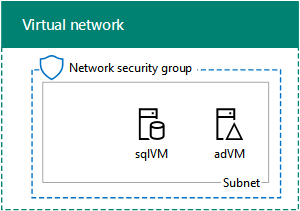

# SharePoint Server 2016 dev/test environment in Azure

[!INCLUDE[appliesto-xxx-2016-xxx-xxx-md](../includes/appliesto-xxx-2016-xxx-xxx-md.md)] 
  
This article steps you through the creation of a SharePoint Server 2016 dev/test farm hosted in Azure. Here is the resulting configuration.
  

  
This configuration consists of a single-server SharePoint Server 2016 farm in a subnet of an Azure virtual network, which provides a basis and common starting point from which you can demonstrate SharePoint Server 2016 and develop and test SharePoint applications.
  
There are three major phases to setting up this dev/test environment:
  
1. Set up the virtual network and domain controller (adVM).
    
2. Configure the SQL Server computer (sqlVM).
    
3. Configure the SharePoint server (spVM).
    
> [!NOTE]
> This configuration requires a paid Azure subscription. You cannot build this with an Azure Free Trial. 
  
## Phase 1: Deploy the virtual network and a domain controller

In this phase, you create a new Azure virtual network and a domain controller with Azure PowerShell. You run the PowerShell commands from a Windows PowerShell command prompt or in the PowerShell Integrated Script Environment (ISE) on your local computer. 
  
> [!NOTE]
> The following command sets use the latest version of Azure PowerShell. See [Get started with Azure PowerShell cmdlets](/powershell/azure/overview?view=azurermps-6.13.0). 
  
First, sign into your Azure account.
  
```
Connect-AzAccount
```

Get your subscription name using the following command.
  
```
Get-AzSubscription | Sort Name | Select Name
```

Set your Azure subscription with the following commands. Set the **$subscr** variable by replacing everything within the quotes, including the < and > characters, with the correct name. 
  
```
$subscr="<subscription name>"
Select-AzSubscription -SubscriptionName $subscr
```

Next, create a new resource group. To determine a unique resource group name, use this command to list your existing resource groups.
  
```
Get-AzResourceGroup | Sort ResourceGroupName | Select ResourceGroupName
```

Create your new resource group with these commands. Set the variables by replacing everything within the quotes, including the \< and \> characters, with the correct names.
  
```
$rgName="<resource group name>"
$locName="<location name, such as West US>"
New-AzResourceGroup -Name $rgName -Location $locName
```

Next, you create the SP2016Vnet Azure Virtual Network that will host the SP2016Subnet subnet and protect it with a network security group.
  
```
$rgName="<name of your new resource group>"
$locName=(Get-AzResourceGroup -Name $rgName).Location
$spSubnet=New-AzVirtualNetworkSubnetConfig -Name SP2016Subnet -AddressPrefix 10.0.0.0/24
New-AzVirtualNetwork -Name SP2016Vnet -ResourceGroupName $rgName -Location $locName -AddressPrefix 10.0.0.0/16 -Subnet $spSubnet -DNSServer 10.0.0.4
$rule1=New-AzNetworkSecurityRuleConfig -Name "RDPTraffic" -Description "Allow RDP to all VMs on the subnet" -Access Allow -Protocol Tcp -Direction Inbound -Priority 100 -SourceAddressPrefix Internet -SourcePortRange * -DestinationAddressPrefix * -DestinationPortRange 3389
$rule2 = New-AzNetworkSecurityRuleConfig -Name "WebTraffic" -Description "Allow HTTP to the SharePoint server" -Access Allow -Protocol Tcp -Direction Inbound -Priority 101 -SourceAddressPrefix Internet -SourcePortRange * -DestinationAddressPrefix "10.0.0.6/32" -DestinationPortRange 80
New-AzNetworkSecurityGroup -Name SP2016Subnet -ResourceGroupName $rgName -Location $locName -SecurityRules $rule1, $rule2
$vnet=Get-AzVirtualNetwork -ResourceGroupName $rgName -Name SP2016Vnet
$nsg=Get-AzNetworkSecurityGroup -Name SP2016Subnet -ResourceGroupName $rgName
Set-AzVirtualNetworkSubnetConfig -VirtualNetwork $vnet -Name SP2016Subnet -AddressPrefix "10.0.0.0/24" -NetworkSecurityGroup $nsg
$vnet | Set-AzVirtualNetwork
```

Next, we create the adVM virtual machine in Azure. adVM is a domain controller for the corp.contoso.com Windows Server Active Directory (AD) domain and a DNS server for the virtual machines of the SP2016Vnet virtual network.
  
First, fill in the name of your resource group and run these commands at the Azure PowerShell command prompt on your local computer to create an Azure virtual machine for adVM.
  
```
$rgName="<resource group name>"
# Get the location
$locName=(Get-AzResourceGroup -Name $rgName).Location
# Create an availability set for domain controller virtual machines
New-AzAvailabilitySet -ResourceGroupName $rgName -Name dcAvailabilitySet -Location $locName -Sku Aligned  -PlatformUpdateDomainCount 5 -PlatformFaultDomainCount 2
# Create the adVM virtual machine
$vmName="adVM"
$vmSize="Standard_D1_v2"
$vnet=Get-AzVirtualNetwork -Name SP2016Vnet -ResourceGroupName $rgName
$pip = New-AzPublicIpAddress -Name ($vmName + "-PIP") -ResourceGroupName $rgName -Location $locName -AllocationMethod Dynamic
$nic = New-AzNetworkInterface -Name ($vmName + "-NIC") -ResourceGroupName $rgName -Location $locName -SubnetId $vnet.Subnets[0].Id -PublicIpAddressId $pip.Id -PrivateIpAddress 10.0.0.4
$avSet=Get-AzAvailabilitySet -Name dcAvailabilitySet -ResourceGroupName $rgName 
$vm=New-AzVMConfig -VMName $vmName -VMSize $vmSize -AvailabilitySetId $avSet.Id
$vm=Set-AzVMOSDisk -VM $vm -Name ($vmName +"-OS") -DiskSizeInGB 128 -CreateOption FromImage -StorageAccountType "StandardLRS"
$diskConfig=New-AzDiskConfig -AccountType "StandardLRS" -Location $locName -CreateOption Empty -DiskSizeGB 20
$dataDisk1=New-AzDisk -DiskName ($vmName + "-DataDisk1") -Disk $diskConfig -ResourceGroupName $rgName
$vm=Add-AzVMDataDisk -VM $vm -Name ($vmName + "-DataDisk1") -CreateOption Attach -ManagedDiskId $dataDisk1.Id -Lun 1
$cred=Get-Credential -Message "Type the name and password of the local administrator account for adVM."
$vm=Set-AzVMOperatingSystem -VM $vm -Windows -ComputerName adVM -Credential $cred -ProvisionVMAgent -EnableAutoUpdate
$vm=Set-AzVMSourceImage -VM $vm -PublisherName MicrosoftWindowsServer -Offer WindowsServer -Skus 2012-R2-Datacenter -Version "latest"
$vm=Add-AzVMNetworkInterface -VM $vm -Id $nic.Id
New-AzVM -ResourceGroupName $rgName -Location $locName -VM $vm
```

You will be prompted for a user name and password. This article will refer to this user name as ADMIN_NAME. Use a strong password and record both in a secure location.
  
> [!NOTE]
>  The password that you specify cannot be "pass@word1". It must be between 8-123 characters long and must satisfy at least 3 of the following password complexity requirements: >  Contains an uppercase letter >  Contains an lowercase letter >  Contains a numeric digit >  Contains a special character 
  
It can take a few minutes for Azure to build the virtual machine.
  
Use these steps to connect to the domain controller virtual machine using local administrator account credentials: 
  
1. In the [Azure portal](https://portal.azure.com), click **Resource Groups \>** \<the name of your new resource group> **\> adVM \> Connect**.
    
2. Run the adVM.rdp file that is downloaded, and then click **Connect**.
    
3. In **Windows Security**, click **Use another account**. In **User name**, type **adVM**\\<ADMIN_NAME>.
    
4. In **Password**, type the password of the ADMIN_NAME account, and then click **OK**.
    
5. When prompted, click **Yes**.
    
Next, add an extra data disk as a new volume with the drive letter F: with these commands at an administrator-level Windows PowerShell command prompt.
  
```
Get-Disk | Where PartitionStyle -eq "RAW" | Initialize-Disk -PartitionStyle GPT -PassThru | New-Partition -AssignDriveLetter -UseMaximumSize | Format-Volume -FileSystem NTFS -NewFileSystemLabel "WSAD Data"
```

Next, configure adVM as a domain controller and DNS server for the corp.contoso.com domain. Run these commands at an administrator-level Windows PowerShell command prompt on adVM.
  
```
Install-WindowsFeature AD-Domain-Services -IncludeManagementTools
Install-ADDSForest -DomainName corp.contoso.com -DatabasePath "F:\NTDS" -SysvolPath "F:\SYSVOL" -LogPath "F:\Logs"
```

Note that these commands can take a few minutes to complete.
  
After adVM restarts, reconnect to the adVM virtual machine.
  
 **Connect to the domain controller virtual machine using domain credentials**
  
1. In the [Azure portal](https://portal.azure.com), click **Resource Groups \>** \<your resource group name> **\> adVM \> Connect**.
    
2. Run the adVM.rdp file that is downloaded, and then click **Connect**.
    
3. In **Windows Security**, click **Use another account**. In **User name**, type **CORP**\\<ADMIN_NAME>.
    
4. In **Password**, type the password of the ADMIN_NAME account, and then click **OK**.
    
5. When prompted, click **Yes**.
    
From the desktop on adVM, open an administrator-level Windows PowerShell command prompt and run the following commands:
  
```
Add-WindowsFeature RSAT-ADDS-Tools
New-ADUser -SamAccountName sp_farm_db -AccountPassword (read-host "Set user password" -assecurestring) -name "sp_farm_db" -enabled $true -PasswordNeverExpires $true -ChangePasswordAtLogon $false
```

Record the password for the sp_farm_db account in a secure location.
  
Here is the result of Phase 1.
  

  
## Phase 2: Add and configure a SQL Server 2014 virtual machine

In this phase, you create a SQL Server 2014 virtual machine in your virtual network, make it a member of the Windows Server AD domain, and prepare it for SharePoint.
  
To create the SQL Server 2014 virtual machine with Azure PowerShell, supply the values for the variables. Then, run the resulting block at the Azure PowerShell prompt or in the PowerShell Integrated Script Environment (ISE) on your local computer.
  
```
# Log in to Azure
Connect-AzAccount
# Set up key variables
$subscrName="<name of your Azure subscription>"
$rgName="<your resource group name>"
# Set the Azure subscription and location
Select-AzSubscription -SubscriptionName $subscrName
$locName=(Get-AzResourceGroup -Name $rgName).Location
# Create an availability set for SQL Server virtual machines
New-AzAvailabilitySet -ResourceGroupName $rgName -Name sqlAvailabilitySet -Location $locName -Sku Aligned  -PlatformUpdateDomainCount 5 -PlatformFaultDomainCount 2
# Create the SQL Server virtual machine
$vmName="sqlVM"
$vmSize="Standard_D3_V2"
$vnet=Get-AzVirtualNetwork -Name "SP2016Vnet" -ResourceGroupName $rgName
$pip=New-AzPublicIpAddress -Name ($vmName + "-PIP") -ResourceGroupName $rgName -Location $locName -AllocationMethod Dynamic
$nic=New-AzNetworkInterface -Name ($vmName + "-NIC") -ResourceGroupName $rgName -Location $locName -SubnetId $vnet.Subnets[0].Id -PublicIpAddressId $pip.Id -PrivateIpAddress "10.0.0.5"
$avSet=Get-AzAvailabilitySet -Name sqlAvailabilitySet -ResourceGroupName $rgName 
$vm=New-AzVMConfig -VMName $vmName -VMSize $vmSize -AvailabilitySetId $avSet.Id
$vm=Set-AzVMOSDisk -VM $vm -Name ($vmName +"-OS") -DiskSizeInGB 128 -CreateOption FromImage -StorageAccountType "StandardLRS"
$diskSize=100
$diskConfig=New-AzDiskConfig -AccountType "StandardLRS" -Location $locName -CreateOption Empty -DiskSizeGB $diskSize
$dataDisk1=New-AzDisk -DiskName ($vmName + "-SQLData") -Disk $diskConfig -ResourceGroupName $rgName
$vm=Add-AzVMDataDisk -VM $vm -Name ($vmName + "-SQLData") -CreateOption Attach -ManagedDiskId $dataDisk1.Id -Lun 1
$cred=Get-Credential -Message "Type the name and password of the local administrator account of the SQL Server computer." 
$vm=Set-AzVMOperatingSystem -VM $vm -Windows -ComputerName $vmName -Credential $cred -ProvisionVMAgent -EnableAutoUpdate
$vm=Set-AzVMSourceImage -VM $vm -PublisherName MicrosoftSQLServer -Offer SQL2014SP1-WS2012R2 -Skus Standard -Version "latest"
$vm=Add-AzVMNetworkInterface -VM $vm -Id $nic.Id
New-AzVM -ResourceGroupName $rgName -Location $locName -VM $vm

```

> [!NOTE]
> This PowerShell command set creates an Azure availability set for the sqlVM virtual machine. This is done in case you want to add more SQL Server virtual machines to this basic configuration. 
  
From the [Azure portal](https://portal.azure.com), connect to the SQL Server virtual machine (sqlVM) using the credentials of the local administrator account.
  
Next, join the SQL Server to the Windows Server AD domain with these commands at an administrator-level Windows PowerShell command prompt on sqlVM.
  
```
Add-Computer -DomainName "corp.contoso.com"
Restart-Computer
```

Note that you must supply domain account credentials after entering the **Add-Computer** command. Use the CORP\\<ADMIN_NAME> account and password. 
  
After the SQL Server virtual machine restarts, reconnect to it using the credentials of the local administrator account.
  
Next, add an extra data disk as a new volume with the drive letter F: and create folders with these commands at an administrator-level Windows PowerShell command prompt on sqlVM.
  
```
Get-Disk | Where PartitionStyle -eq "RAW" | Initialize-Disk -PartitionStyle GPT -PassThru | New-Partition -AssignDriveLetter -UseMaximumSize | Format-Volume -FileSystem NTFS -NewFileSystemLabel "SQL Data"
md f:\Data
md f:\Log
md f:\Backup
```

Next, configure the SQL server to use the F: drive for new databases and for accounts and permissions.
  
1. On the Start screen, type **SQL Studio**, and then click **SQL Server 2014 Management Studio**.
    
2. In **Connect to Server**, click **Connect**.
    
3. In the left pane, right-click the top node—the default instance named after the machine—and then click **Properties**.
    
4. In **Server Properties**, click **Database Settings**.
    
5. In **Database default locations**, set the following values:
    
  - For **Data**, set the path to **f:\Data**.
    
  - For **Log**, set the path to **f:\Log**.
    
  - For **Backup**, set the path to **f:\Backup**.
    
6. Click **OK** to close the window. 
    
7. In the left pane, expand the **Security** folder. 
    
8. Right-click **Logins**, and then click **New login**.
    
9. In **Login name**, type **CORP**\\<ADMIN_NAME>.
    
10. Under **Select a page**, click **Server Roles**, click **sysadmin**, and then click **OK**.
    
11. Close SQL Server 2014 Management Studio.
    
SQL Server requires a port that clients use to access the database server. It also needs ports to connect with the SQL Server Management Studio. Run the following command at an administrator-level Windows PowerShell command prompt on the SQL Server virtual machine.
  
```
New-NetFirewallRule -DisplayName "SQL Server ports 1433, 1434, and 5022" -Direction Inbound -Protocol TCP -LocalPort 1433,1434,5022 -Action Allow
```

Sign out as the local administrator.
  
Here is the result of Phase 2.
  

  
## Phase 3: Add and configure a SharePoint Server 2016 virtual machine

In this phase, you create a SharePoint Server 2016 virtual machine in your virtual network, make it a member of the Windows Server AD domain, and then create a new SharePoint farm.
  
To create the SharePoint Server 2016 virtual machine with Azure PowerShell, supply the values of the variables. For the **$dnsName** value, you must determine a globally unique name. Then, run the resulting block at your local Azure PowerShell prompt. 
  
```
# Set up key variables
$subscrName="<name of your Azure subscription>"
$rgName="<your resource group name>"
$dnsName="<unique, public domain name label for the SharePoint server>"
# Set the Azure subscription
Select-AzSubscription -SubscriptionName $subscrName
# Get the location
$locName=(Get-AzResourceGroup -Name $rgName).Location
# Create an availability set for SharePoint virtual machines
New-AzAvailabilitySet -ResourceGroupName $rgName -Name spAvailabilitySet -Location $locName -Sku Aligned  -PlatformUpdateDomainCount 5 -PlatformFaultDomainCount 2
# Create the spVM virtual machine
$vmName="spVM"
$vmSize="Standard_D3_V2"
$vm=New-AzVMConfig -VMName $vmName -VMSize $vmSize
$pip=New-AzPublicIpAddress -Name ($vmName + "-PIP") -ResourceGroupName $rgName -DomainNameLabel $dnsName -Location $locName -AllocationMethod Dynamic
$vnet=Get-AzVirtualNetwork -Name "SP2016Vnet" -ResourceGroupName $rgName
$nic=New-AzNetworkInterface -Name ($vmName + "-NIC") -ResourceGroupName $rgName -Location $locName -SubnetId $vnet.Subnets[0].Id -PublicIpAddressId $pip.Id -PrivateIpAddress "10.0.0.6"
$avSet=Get-AzAvailabilitySet -Name spAvailabilitySet -ResourceGroupName $rgName 
$vm=New-AzVMConfig -VMName $vmName -VMSize $vmSize -AvailabilitySetId $avSet.Id
$vm=Set-AzVMOSDisk -VM $vm -Name ($vmName +"-OS") -DiskSizeInGB 128 -CreateOption FromImage -StorageAccountType "StandardLRS"
$cred=Get-Credential -Message "Type the name and password of the local administrator account."
$vm=Set-AzVMOperatingSystem -VM $vm -Windows -ComputerName $vmName -Credential $cred -ProvisionVMAgent -EnableAutoUpdate
$vm=Set-AzVMSourceImage -VM $vm -PublisherName "MicrosoftSharePoint" -Offer "MicrosoftSharePointServer" -Skus "2016" -Version "latest"
$vm=Add-AzVMNetworkInterface -VM $vm -Id $nic.Id
New-AzVM -ResourceGroupName $rgName -Location $locName -VM $vm
```

> [!NOTE]
> This Azure PowerShell command block creates an Azure availability set for the spVM virtual machine. This is done in case you want to add more SharePoint Server 2016 virtual machines to this basic configuration. 
  
### Configure the SharePoint Server 2016 virtual machine

Connect to the SharePoint virtual machine (spVM) using the credentials of the local administrator account.
  
Join the SharePoint virtual machine to the Windows Server AD domain with these commands at an administrator-level Windows PowerShell command prompt on spVM.
  
```
Add-Computer -DomainName "corp.contoso.com"
Restart-Computer
```

Note that you must supply domain account credentials after entering the **Add-Computer** command. Use the CORP\\<ADMIN_NAME> account name and password. 
  
After the SharePoint virtual machine restarts, reconnect to it using the CORP\\<ADMIN_NAME\> account name and password.
  
 **Create a new SharePoint farm**
  
1. From the Start screen, type **SharePoint**, and then click **SharePoint 2016 Products Configuration Wizard**.
    
2. On the **Welcome to SharePoint Products** page, click **Next**.
    
3. A **SharePoint Products Configuration Wizard** dialog appears, warning that services (such as IIS) will be restarted or reset. Click **Yes**.
    
4. On the **Connect to a server farm** page, select **Create a new server farm**, and then click **Next**.
    
5. On the **Specify Configuration Database Settings** page: 
    
  - In **Database server**, type **sqlVM**.
    
  - In **Username**, type **CORP\sp_farm_db**. 
    
  - In **Password**, type the sp_farm_db account password.
    
6. Click **Next**.
    
    If the sqlVM server cannot be found, ensure that you ran this command from an administrator-level Windows PowerShell command prompt on sqlVM:
    
  ```
  New-NetFirewallRule -DisplayName "SQL Server ports 1433, 1434, and 5022" -Direction Inbound -Protocol TCP -LocalPort 1433,1434,5022 -Action Allow
  ```

7. On the **Specify Farm Security Settings** page, type a passphrase twice. Record the passphrase and store it in a secure location for future reference. Click **Next**.
    
8. On the **Specify Server Role** page, in **Single-Server Farm**, click **Single-Server Farm**, and then click **Next**.
    
9. On the **Configure SharePoint Central Administration Web Application** page, click **Next**.
    
10. The **Completing the SharePoint Products Configuration Wizard** page appears. Click **Next**.
    
11. The **Configuring SharePoint Products** page appears. Wait until the configuration process completes. 
    
12. On the **Configuration Successful** page, click **Finish**. The new administration website starts.
    
13. On the **Help Make SharePoint Better** page, click your choice to participate in the Customer Experience Improvement Program, and then click **OK**.
    
14. On the **Welcome** page, click **Start the Wizard**.
    
15. On the **Service Applications and Services** page, in **Service Account**, click **Use existing managed account**, and then click **Next**. It can take a few minutes to display the next page.
    
16. On the **Create Site Collection** page, type **Contoso** in **Title**, and then click **OK**.
    
17. On the **This completes the Farm Configuration Wizard** page, click **Finish**. The SharePoint Central Administration web page displays.
    
18. Open a new tab in Internet Explorer, type **http://spvm/** in the Address bar, and then press Enter. You should see the default Contoso team site. 
    
Next, you configure an alternate access mapping so that Internet users can access the SharePoint server using the DNS name for the public IP address assigned to the spVM virtual machine.
  
 **Configure an alternate access mapping**
  
1. At the Azure PowerShell prompt on your local computer, run the following command:
    
  ```
  Write-Host (Get-AzPublicIpaddress -Name "spVM-PIP" -ResourceGroup $rgName).DnsSettings.Fqdn
  ```

2. Note the DNS name.
    
3. On the spVM virtual machine, in Internet Explorer, click the **Home - Central Administration** tab. 
    
4. In the **System Settings** section, click **Configure alternate access mappings**.
    
5. On the **Alternate Access Mappings** page, click **Edit Public URLs**.
    
6. On the **Edit Public Zone URLs** page, click the link next to **Alternate Access Mapping Collection**, and then click **Change Alternate Access Mapping Collection**.
    
7. In **Select An Alternate Access Mapping Collection**, click **SharePoint - 80**.
    
8. On the **Edit Public Zone URLs** page, in **Internet**, type **http://**<the DNS name from step 2>, and then click **Save**.
    
Here is the result of Phase 3.
  

  
From a browser on your local computer, access **http://**\<DNS name of the spVM virtual machine>. When prompted from credentials, use the CORP\\<ADMIN_NAME> account name and password. You should see the default Contoso team site.
  
## Next steps

When you are ready to design a production SharePoint Server 2016 farm in Azure, see [Designing a SharePoint Server 2016 farm in Azure](designing-a-sharepoint-server-2016-farm-in-azure.md).
  
When you are ready to deploy a production-ready, high availability SharePoint Server 2016 farm in Azure, see [Deploying SharePoint Server 2016 with SQL Server AlwaysOn Availability Groups in Azure](deploying-sharepoint-server-2016-with-sql-server-alwayson-availability-groups-in.md).

To start developing Low or High Trust Addins, you must first configure an App Domain. See [Configure an environment for apps for SharePoint Server](configure-an-environment-for-apps-for-sharepoint.md).
  
## Stop and start the virtual machines in the farm

Azure virtual machines incur an ongoing cost when they are running. To help minimize the cost of your SharePoint Server 2016 dev/test environment, use these commands to stop the virtual machines:
  
```
$rgName="<your resource group name>"
Stop-AzVM -Name spVM -ResourceGroupName $rgName -Force
Stop-AzVM -Name sqlVM -ResourceGroupName $rgName -Force
Stop-AzVM -Name adVM -ResourceGroupName $rgName -Force
```

To start them again, use these commands:
  
```
$rgName="<your resource group name>"
Start-AzVM -Name adVM -ResourceGroupName $rgName
Start-AzVM -Name sqlVM -ResourceGroupName $rgName
Start-AzVM -Name spVM -ResourceGroupName $rgName
```

## See also

#### Concepts

[SharePoint Server](../sharepoint-server.md)
  
[Install SharePoint Server](../install/install.md)
#### Other Resources

[Designing a SharePoint Server 2016 farm in Azure](designing-a-sharepoint-server-2016-farm-in-azure.md)
  
[Deploying SharePoint Server 2016 with SQL Server AlwaysOn Availability Groups in Azure](deploying-sharepoint-server-2016-with-sql-server-alwayson-availability-groups-in.md)

[Cloud adoption Test Lab Guides (TLGs)](/office365/enterprise/cloud-adoption-test-lab-guides-tlgs) 
