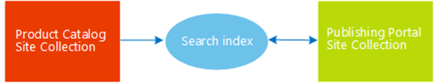
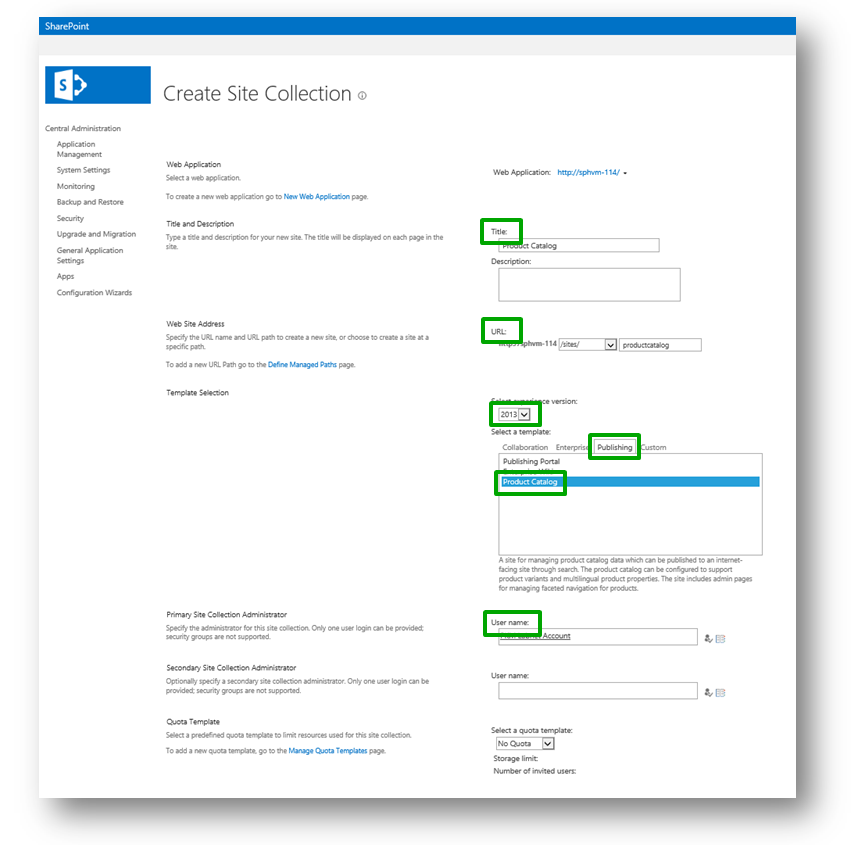
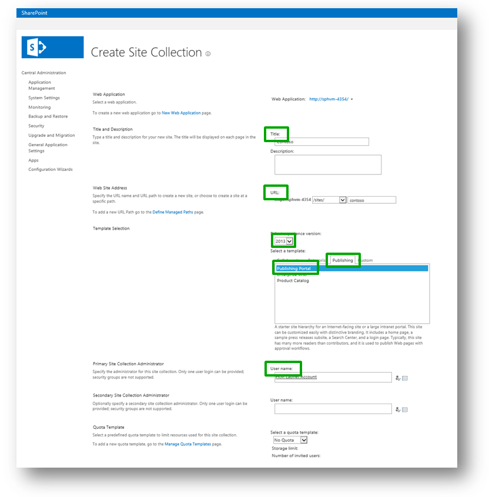

# Stage 1: Create site collections for cross-site publishing in SharePoint Server

[!INCLUDE[appliesto-2013-2016-2019-xxx-md](../includes/appliesto-2013-2016-2019-xxx-md.md)]
  
> [!NOTE]
> Many of the features described in this series are also available for most sites in SharePoint for Microsoft 365. 
  
## Start stage 1

When you use cross-site publishing, you use one or more authoring site collections to author and store content, and one or more publishing site collections to show this content.
  
In our scenario, we'll start by creating a **Product Catalog Site Collection**. We'll use this site collection to author and store information about Contoso products, for example, information about the MP3 player "Litware 2G E200" or the Laptop "Adventure Works 15.4W." 
  
Along with this, we'll create a **Publishing Portal Site Collection**. We'll use this site collection to display product information about "Litware 2G E200," "Adventure Works 15.4W," and all the other products that Contoso offers. 
  
Remember, visitors browsing the Contoso website, which is the publishing portal, will  *not*  be able to view content in the product catalog! They will only see content that is added to the search index from the product catalog. When visitors browse the Contoso website, search technology displays content from the search index. 
  
So, in the simplest terms, our architecture will resemble this:
  

  
If this seems a bit tricky to follow, be patient. Upcoming articles in this series use real examples, and it'll all become a lot clearer. But first things first: let's create the site collections.
  
To create a Product Catalog Site Collection, go to **Central Administration** --> **Create site collections**, and then enter the necessary details: 
  
1. A **title** for the website. 
    
2. The website's **URL**. 
    
3. Select **2013** for the experience version. 
    
4. From the **Publishing** tab, select the **Product Catalog** template. 
    
5. In the field **Primary Site Collection Site Administrator**, enter the site administrator's **user name**. 
    
The following screenshot provides more guidance.
  

  
Next, to create a Publishing Portal Site Collection, repeat the previous steps, except for the following difference: from the **Publishing** tab, select **Publishing Portal**. The title of this site collection is **Contoso**. 
  

  
Now that we have our site collections, it's time to start adding content.
  
### Next article in this series

[Stage 2: Import list content into the Product Catalog Site Collection in SharePoint Server](stage-2-import-list-content-into-the-product-catalog-site-collection.md)
  
## See also

#### Concepts

[Create a site collection in SharePoint Server](../sites/create-a-site-collection.md)

