# Stage 10: Configure the query in a Content Search Web Part on a catalog item page in SharePoint Server
[!INCLUDE[appliesto-2013-2016-2019-xxx-md](../includes/appliesto-2013-2016-2019-xxx-md.md)]

  
> [!NOTE]
> Most of the features described in this series are available only for private sites collections in SharePoint in Microsoft 365. 
  
## Quick Overview

[Stage 9: Configure the query in a Content Search Web Part on a category page in SharePoint Server](stage-9-configure-the-query-in-a-content-search-web-part-on-a-category-page.md) explained how to add a Content Search Web Part to a page and how to configure the query for a catalog page. The next step is to do the same for the catalog item page. 
  
In this article, you'll learn:
  
- [Defining how catalog items should be displayed on our Contoso site](stage-10-configure-the-query-in-a-content-search-web-part-on-a-catalog-item-page.md#BKMK_DefiningHowCatalotItemsShouldBeDisplayedOnOurContosoSite)
    
- [How to add a Content Search Web Part to a catalog item page](stage-10-configure-the-query-in-a-content-search-web-part-on-a-catalog-item-page.md#BKMK_HowToAddAContentSearchWebPartToACatalogItemPage)
    
- [About query variables](stage-10-configure-the-query-in-a-content-search-web-part-on-a-catalog-item-page.md#BKMK_AboutQueryVariables)
    
- [How to configure a query in a Content Search Web Part on a catalog item page](stage-10-configure-the-query-in-a-content-search-web-part-on-a-catalog-item-page.md#BKMK_HowToConfigureAQueryInAContentSearchWebPartOnACatalogItemPage)
    
## Start stage 10

### Defining how catalog items should be displayed on our Contoso site

The various products featured in the Contoso catalog are all available in different colors. For example, by looking in our catalog list, you'll see that the  *Northwind Traders 50W Car Radio*  is available in five colors. The color versions of a product are grouped under a common  *Group Number*  . 
  
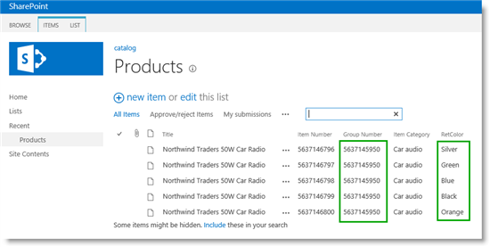
  
When displaying a product on our Contoso site, visitors should easily see that the product is available in other colors. For example, when visitors browse to a silver colored version of the  *Northwind Traders 50W Car Radio*  , they should easily see which other color options are available for that item. They should also be able to view details quickly about the product in another color, without having to go back to the category page. 
  
So, on our catalog item page we want to display items that have the same  *Group Number*  . To do this, we must use the Content Search Web Part (CSWP). 
  
> [!NOTE]
> The item details page that was automatically created when we connected our publishing site to our catalog as described in [Stage 5: Connect your publishing site to a catalog in SharePoint Server](stage-5-connect-your-publishing-site-to-a-catalog.md) contained several Catalog Item Reuse Web Parts (CIRWP). There are scenarios where using CIRWPs to display item detail content would be appropriate. But, because the CIRWP is only able to display one item at a time, we can't use this Web Part for our Contoso scenario. 
  
For information about how to customize the automatically created catalog item page using CIRWPs, see [How to: Customize page layouts for a catalog-based site in SharePoint 2013](https://go.microsoft.com/fwlink/p/?LinkId=400646).
  
### How to add a Content Search Web Part to a catalog item page

Browse to the catalog item page. In our scenario, click the item "Northwind Traders 50W Car Radio" in the "Audio" category.
  
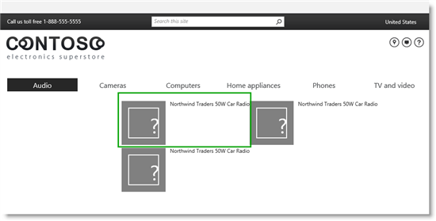
  
Because we didn't add any Web Parts to the page when we created it in [Stage 7: Upload page layouts and create new pages in a publishing site in SharePoint Server](stage-7-upload-page-layouts-and-create-new-pages-in-a-publishing-site.md), this page doesn't show any content.
  
Our catalog item page only has one Web Part zone. To add a CSWP to our catalog item page, repeat the steps from [How to add a Content Search Web Part to a page](stage-9-configure-the-query-in-a-content-search-web-part-on-a-category-page.md#BKMK_HowToAddAContentSearchWebPartToAPage) and add the Web Part to Zone 1. 
  

  
As was the case when we added a CSWP to our category page, the Web Part displays some content (Audio, Cameras and Computers), but does not display the content we want. To make the Web Part display Contoso catalog content, we must configure the query in the Web Part. To configure the query, we'll use what's known as a query variable. But first, let's take a look at what query variables are and how they're used when you configure a query.
  
### About query variables

A query variable is a placeholder that is replaced with a value when a query is run. Let's look at this definition within the context of our Contoso scenario.
  
You might not have been aware of it, but in [Stage 9: Configure the query in a Content Search Web Part on a category page in SharePoint Server](stage-9-configure-the-query-in-a-content-search-web-part-on-a-category-page.md), when we configured the query in the CSWP on the catalog page, we used a query variable. When we selected **Restrict by current and child navigation terms**, a query variable was added to our query. That query variable was a placeholder for the navigation value in the URL (audio, camera, mp3, etc.). Whenever a visitor clicks a category, the query variable in the Web Part is replaced with the navigation value in the URL. As a result, the Web Part issued a query for catalog items that are tagged with "audio", "camera", "mp3", and so on 
  
Coming back to our catalog item page, we want to display items that have the same Group Number. Remember in [Stage 3: How to enable a list as a catalog in SharePoint Server](stage-3-how-to-enable-a-list-as-a-catalog.md) how we added **Group Number** as one of the list columns to be used as a **Catalog Item URL Field**. We did this so the value of  *Group Number*  would be used in the URL. 
  
The following screen shot shows our final Contoso site. Notice that the group number,  *5637145950*  , is used as the second to last value in the URL. 
  
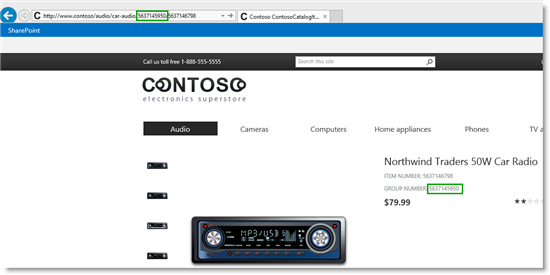
  
If we browse to another product, we'll see the group number for this product ( *5637145875*  , for example) is also used as the second to last value in the URL. 
  

  
So, when you configure the query for the CSWP on our catalog item page, you should use a query variable that will represent the second to last value in the URL.
  
Query variables are contained enclosed in braces as follows: {QueryVariable}. Don't worry about those braces, this isn't as scary or as complex as it might look.
  
As mentioned above, when we configured the query in the CSWP on the catalog page we used a query variable. But we didn't have to deal with any scary looking braces. That was because the nice looking radio button, **Restrict by current and child navigation terms**, took care of it for us. To configure the query for our item catalog page, we must add a query variable with braces. Luckily, we'll have some friendly pull-down menus to help us along. So let's delve into the task of configuring the query. 
  
### How to configure a query in a Content Search Web Part on a catalog item page

1. In the Web Part, click the **Web Part Menu** --> **Edit Web Part**. 
    
2. In the Web Part tool pane, click **Change query**. This opens a dialog. 
    
3. In the dialog, from the **Select a query** list, select your catalog result source. In our scenario, it's  *catalog - Products Results*  . 
    
     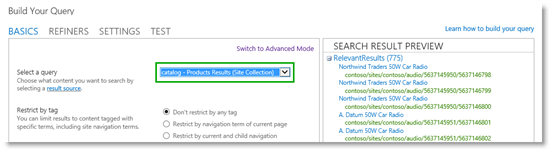
  
4. Click **Switch to Advanced Mode**. 
    
     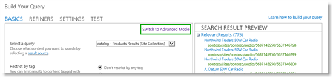
  
In Advanced Mode, in the **Query text** field, you'll see some text. This is the query text that represents our result source  *catalog - Products Results*  . (We saw the same query text in Stage 9, when we looked at [How to view details of the query configuration](stage-9-configure-the-query-in-a-content-search-web-part-on-a-category-page.md#BKMK_HowToViewDetailsOfTheQueryConfiguration).)
    
     
  
5. In the **Property filter** list, select **Show all managed properties**. 
    
     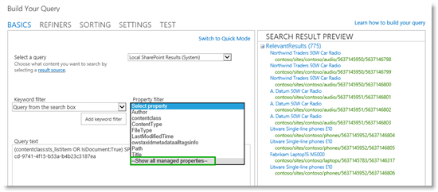
  
6. In the **Property filter** list, select **ProductCatalogGroupNumberOWSTEXT**, **Contains**, and **Value of a token from URL**. 
    
     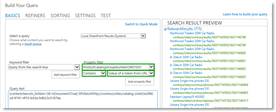
  
 **ProductCatalogGroupNumberOWSTEXT** is the managed property name of the site column  *Group Number*  . (Earlier in this series, we looked at naming convention for this column in [Naming convention for the default site columns in the Products list](from-site-column-to-managed-propertywhat-s-up-with-that.md#BKMK_NamingConventionfortheDefaultSiteColumnsintheProductsList).) Selecting **Contains** and **Value of a token from URL** will create the query variable we want to use. 
    
7. Click **Add property filter**. 
    
     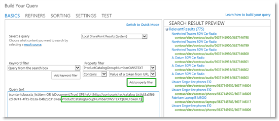
  
Notice that **ProductCatalogGroupNumberOWSTEXT:{URLToken.1}** is added to the **Query text** field. So without having to know about query syntax or type a curly bracket, we have added a query variable. 
    
    So now you might be thinking "OK, that was easy, but what does **ProductCatalogGroupNumberOWSTEXT:{URLToken.1}** actually mean?" Let's break it down: 
    
  - **ProductCatalogGroupNumberOWSTEXT** is the managed property that represents the  *Group Number*  column in our catalog. 
    
  - The colon : means "contains"
    
  - **{URLToken.1}** represents a value from the URL of the current page. The integer, in this case **1**, represents the value in the URL as counted from right to left. So, for example, in the URL  *http://www.contoso.com/cameras/camcorders/563714875/6637146586*  , the query variable {URLToken.1} represents the value  *6637146586*  . 
    
    If we put the complete query together, it means the following:
    
    From the result source  *catalog - Products Results*  , search for items where the value of the managed property  *ProductCatalogGroupNumberOWSTEXT*  contains the value that is currently used as the first value in the URL, counting from right to left. 
    
    In the last step of the procedure in [Stage 3: How to enable a list as a catalog in SharePoint Server](stage-3-how-to-enable-a-list-as-a-catalog.md), we defined that the item URL should contain both Group Number and Item Number as catalog Item and URL fields. This means that the first value in the URL, counting from right to left, is  *Item Number*  . We want to search for items that have the same  *Group Number*  . Therefore, we must make a small change to the query variable. 
    
8. In the **Query text** field, change the number in the query variable to **2**. 
    
     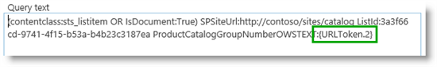
  
Now the query in the Web Part will search for items where the value of the managed property  *ProductCatalogGroupNumberOWSTEXT*  contains the value that is currently used as the second value in the URL, counting from right to left. 
    
9. To test that this query returns the correct results, click **Test query**. 
    
     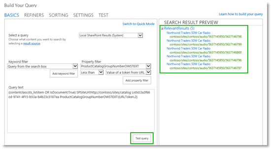
  
Notice that five items are displayed under **RelevantResults**. This verifies that the query is correct, because we know that the  *Northwind Traders 50W Car Radio*  is available in five colors. 
    
10. Click **OK** and save the page. 
    
     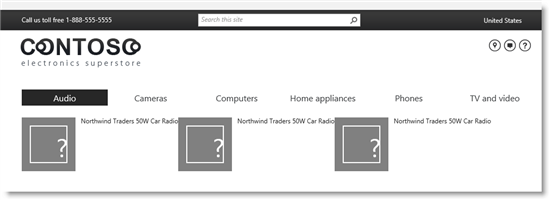
  
Even though three products are displayed instead of one, and we still don't have the Contoso look, this is progress. The query in the Web Part is now configured. In the next article we'll show you how to add display templates that will give our items the Contoso look.
  
#### Next article in this series

[Stage 11: Upload and apply display templates to the Content Search Web Part in SharePoint Server](stage-11-upload-and-apply-display-templates-to-the-content-search-web-part.md)
  
## See also

#### Concepts

[Configure Search Web Parts in SharePoint Server](configure-search-web-parts.md)

