# Stage 11: Upload and apply display templates to the Content Search Web Part in SharePoint Server

[!INCLUDE[appliesto-2013-2016-2019-xxx-md](../includes/appliesto-2013-2016-2019-xxx-md.md)]
  
> [!NOTE]
> Most of the features described in this series are available only for private sites collections in SharePoint Online. 
  
## Quick overview

Previous stages of this series explained:
  
-  How to configure the query for a Content Search Web Part on a category page ( [Stage 9: Configure the query in a Content Search Web Part on a category page in SharePoint Server](stage-9-configure-the-query-in-a-content-search-web-part-on-a-category-page.md))
    
- How to configure a catalog item page ([Stage 10: Configure the query in a Content Search Web Part on a catalog item page in SharePoint Server](stage-10-configure-the-query-in-a-content-search-web-part-on-a-catalog-item-page.md)).
    
Although the query results displayed in the Web Parts were correct, they did not have a Contoso look, and they displayed only a title and a strange looking gray box.
  
In this article, you'll learn:
  
- [About display templates](stage-11-upload-and-apply-display-templates-to-the-content-search-web-part.md#BKMK_AboutDisplayTemplates)
    
- [How to upload display templates](stage-11-upload-and-apply-display-templates-to-the-content-search-web-part.md#BKMK_HowToUploadDisplayTemplates)
    
- [How to apply display templates to a Content Search Web Part](stage-11-upload-and-apply-display-templates-to-the-content-search-web-part.md#BKMK_HowToApplyDisplayTemplatesToAContentSearchWebPart)
    
## Start stage 11

### About display templates

Display templates are used to control how content should be displayed in a Content Search Web Part (CSWP). Remember that the content that is displayed in a CSWP is composed of search results that are returned based on the query that is defined in the Web Part. So, when you customize a display template, you are basically customizing how search results should be displayed in the Web Part.
  
Each display template consists of two files:
  
- An HTML file that you can edit in an HTML editor of your choice
    
- A JavaScript file
    
As with master pages and page layouts, you can edit the display template in your favorite HTML editor. When editing the display template, you can focus on HTML, CSS and JavaScript. SharePoint automatically transforms the HTML file into an associated JavaScript file when you upload it. Because the two files are associated, any changes that you make to the HTML file will be automatically updated in the associated JavaScript file.
  
There are two types of display templates:
  
- **Control display template** - defines the overall layout for how search results should be displayed. For example, this can be how you choose to display the HTML for a heading, the beginning and end of a list, or how to page back and forth in a list of results. The control display template is only rendered once in the Web Part. 
    
- **Item display template** - defines how each item in the search results should be displayed. For example, this can be how you choose to display an image, and the title of a search result, where the title is displayed as a hyperlink below the image. The item display template is rendered one time for each item in the search result. So, in practice, if ten search results are returned, the item display template creates its section of HTML ten times. 
    
The image below shows how the control display template and item display templates are used on the CSWP of our category page.
  
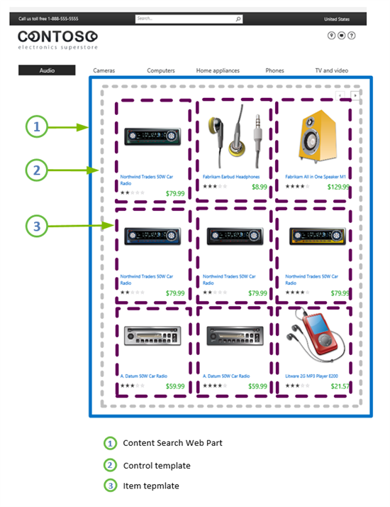
  
For more conceptual information about display templates, and for more information about how to create your own display templates, see [SharePoint 2013 Design Manager display templates](https://go.microsoft.com/fwlink/p/?LinkId=401787).
  
### How to upload display templates

For our Contoso site, we have four display templates:
  
- One control display template for our category page
    
- One item display template for our category page
    
- One control display template for our catalog item page
    
- One item display template for our catalog item page
    
Because we have [How to map your network drive](stage-6-upload-and-apply-a-new-master-page-to-a-publishing-site.md#BKMK_HowToMapYourNetworkDrive), uploading these display templates is very easy. Simply drag-and-drop the files into the folder that is located in **Master Page Gallery --\> Display Templates --\> Content Web Parts**. The exact location of where you drag-and-drop the files isn't that important as long as it is in the Master Page Gallery. But, as the **Content Web Parts** folder is where the other display templates for Content Web Parts are located, we'll add them there. 
  
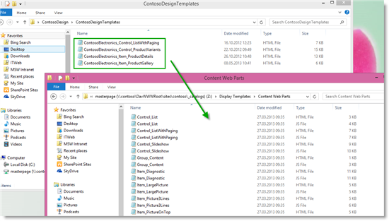
  
In SharePoint, go to **Site settings --\> Master pages and page layouts --\> Display Templates --\> Content Web Parts** and check that the four files are added. Also notice that an associated .js (JavaScript) file has automatically been created for each display template. 
  
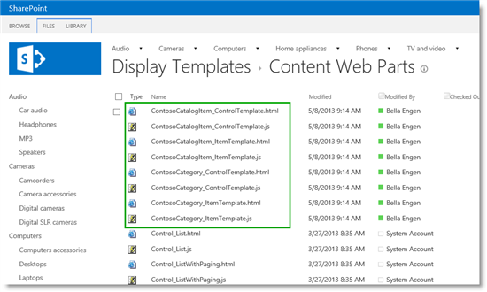
  
So now we're ready to apply these display templates to our Content Search Web Parts.
  
### How to apply display templates to a Content Search Web Part

We first want to apply display templates to the CSWP on our category page. So, let's browse to "Audio."
  
1. Click the **Settings** menu --> **Edit Page**. 
    
2. In the Web Part, click the **Web Part Menu --\> Edit Web Part**. 
    
3. In the Web Part tool pane, in the **Display Templates** section, to apply the control display template, from the **Control** menu, select your control display template. In our Contoso scenario, this is **Contoso Electronics List with Paging**. 
    
     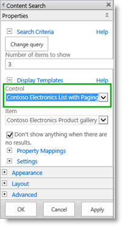
  
4. To apply the item display template, from the **Item** menu select your item display template. In our scenario, it's **Contoso Electronics Product gallery**. 
    
     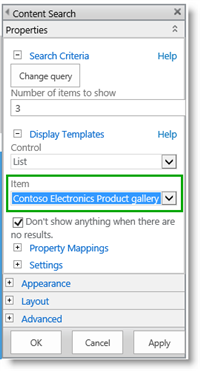
  
5. Click **OK**, and then save the page. 
    
     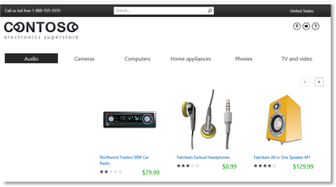
  
Suddenly, our "Audio" page is looking like it has been to one of those makeover shows. Instead of the strange looking gray box, there's a colorful image that displays for each item, and we've also added the price and rating information that was stored in the site columns of our catalog. But it is only displaying three items. So we'll have to do something about that.
    
6. Click to edit the Web Part again. In the **Number of items** to show field, change the value from 3 to 9. 
    
     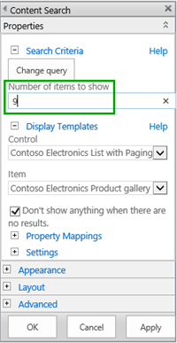
  
7. Click **OK**, and then save the page. 
    
     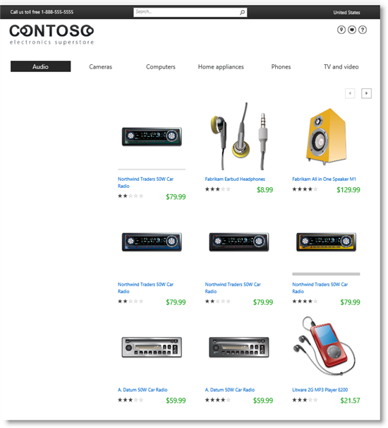
  
Now our "Audio" page is looking really good. By using the paging arrows, we can easily browse through the different items in the "Audio" category.
    
     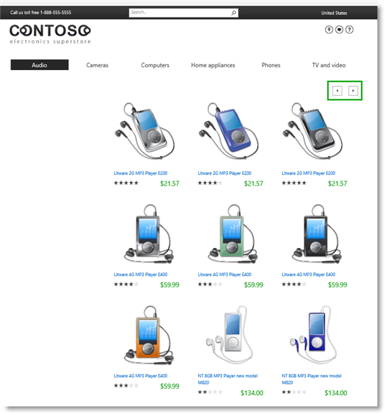
  
Now that our category page has a Contoso look, the next task is to apply display templates to the CSWP on our catalog item page.
  
1. Browse to the catalog item page. In our scenario, we can do this by clicking the item "Northwind Traders 50W Car Radio" in the "Audio" category.
    
2. Repeat steps 1 - 7 in [How to apply display templates to a Content Search Web Part](stage-11-upload-and-apply-display-templates-to-the-content-search-web-part.md#BKMK_HowToApplyDisplayTemplatesToAContentSearchWebPart), but select the control and item display templates for the catalog item page.
    
And now your item details page also has a very nice Contoso look.
  
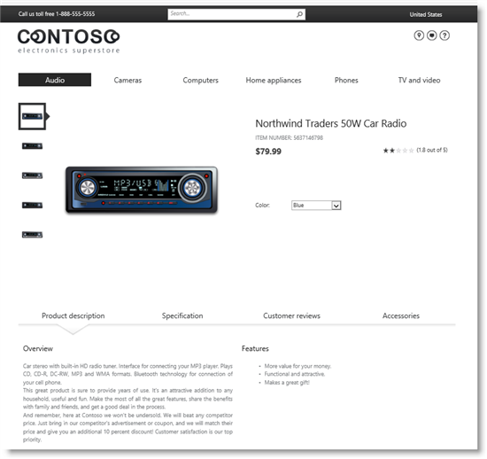
  
By using the Color selection menu, we can easily page through the items with different colors.
  
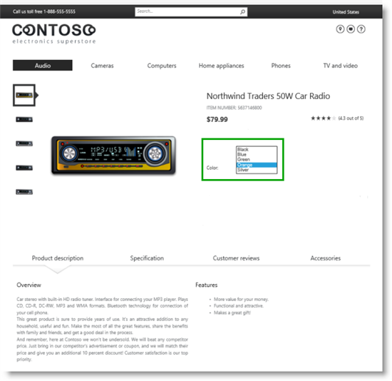
  
Our Contoso site is really starting to look good. But we must also make sure our visitors can browse and quickly find the product they are looking for. The next step is to start considering which refiners we want to use on our site. starts the explanation of which refiners we want to use on our site.
  
#### Next article in this series

[Stage 12: Plan to use refiners for faceted navigation in SharePoint Server - Part I](stage-12-plan-to-use-refiners-for-faceted-navigation-inpart-i.md)
  
## See also

#### Other Resources

[SharePoint 2013 Design Manager display templates](https://msdn.microsoft.com/library/jj945138.aspx)
  
[Overview of Design Manager in SharePoint 2013](https://msdn.microsoft.com/library/jj822363.aspx)

