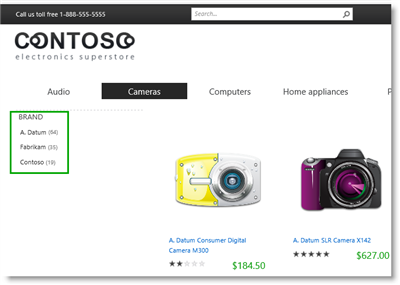
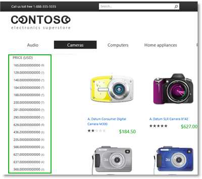
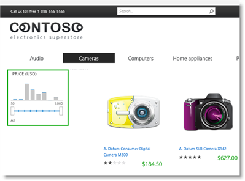

# Stage 12: Plan to use refiners for faceted navigation in SharePoint Server - Part I

[!INCLUDE[appliesto-2013-2016-2019-xxx-md](../includes/appliesto-2013-2016-2019-xxx-md.md)]
  
> [!NOTE]
> Most of the features described in this series are available only for private sites collections in SharePoint Online. 
  
## Quick overview

Previous stages of this series explained the following:
  
- How to configure the query in a CSWP on a  *category page*  ( [Stage 9: Configure the query in a Content Search Web Part on a category page in SharePoint Server](stage-9-configure-the-query-in-a-content-search-web-part-on-a-category-page.md)).
    
- How to configure the query in a CSWP on a  *catalog item page*  ( [Stage 10: Configure the query in a Content Search Web Part on a catalog item page in SharePoint Server](stage-10-configure-the-query-in-a-content-search-web-part-on-a-catalog-item-page.md)).
    
- How to upload and add display templates to a CWSP ([Stage 11: Upload and apply display templates to the Content Search Web Part in SharePoint Server](stage-11-upload-and-apply-display-templates-to-the-content-search-web-part.md)).
    
After completing these stages, our Contoso site is starting to look good, but now it's time to to make sure that that our site visitors can find the exact product they are looking for, quickly and easily. This article focuses on what we must plan before we begin to configure refiners.
  
In this article, you'll learn:
  
- [How refiners helped plan a trip to Japan](stage-12-plan-to-use-refiners-for-faceted-navigation-inpart-i.md#BKMK_HowRefinersHelpedPlanATripToJapan)
    
- [About refiner types](stage-12-plan-to-use-refiners-for-faceted-navigation-inpart-i.md#BKMK_AboutRefinerTypes)
    
- [About identifying refiners for faceted navigation](stage-12-plan-to-use-refiners-for-faceted-navigation-inpart-i.md#BKMK_AboutIdentifyingRefinersForFacetedNavigation)
    
## Start stage 12

### How refiners helped plan a trip to Japan

Although the term "refiners" might sound new to you, there is a high chance you've already used them, and much more often than you think. For example, if you've ever bought a book online, most likely refiners were there to help locate just the right book.
  
Let's consider a hypothetical situation in which you are planning a trip to Japan. You visit your favorite online bookstore in search of a travel guide for your trip. You type "Japan" and, pages of search results are returned. Trawling through page after page of search results does not seem like much fun. Luckily, the site designers have provided a way to narrow the search results. On the left side of the page is a "Categories" list, which contains entries such as "Cooking," "Geography," "History," and "Travel." You click "Travel" and in an instant, the search results show only travel books that contains the word "Japan." But, turns out there are many travel books out there on Japan. Therefore, you have to trim the results additionally. As it happens, you want a paperback version. So, still focusing on the lists on the left side of the page, you spot a category called "Format" that contains terms like "Hardcover," "PDF," "Audio," Digital," and "Paperback." So you click "Paperback" and received what you've been after: results for travel books about Japan in paperback! Unfortunately, the number of search results is still too large. Therefore, you continue to use the category lists on the left side of the page until you've drilled right down to five hopeful candidates, one of which makes it over the finish line and straight into your shopping cart.
  
Now, here's the techy part: when you were clicking "Travel" and "Paperback" you were, in fact, using refiners. In SharePoint terms, a refiner is a managed property that has been enabled as a refiner. Refiner values are the values of a managed property that has been enabled as a refiner. So in the online shopping trip, "Categories" and "Format" were **refiners**, whereas "Travel" and "Paperback" were **refiner values**. 
  
Earlier in this series, the article [From site column to managed property - What's up with that?](from-site-column-to-managed-propertywhat-s-up-with-that.md) explained how a site column is represented as a managed property after they were crawled. For example, in our Contoso catalog we have a site column named "Contoso Color." For each item in the catalog, we have added a color value, such as red, green, or blue, to this column. To enable our site visitors to narrow search results quickly, (for example, to a particular color), we must enable the managed property that represents the "Contoso Color" site column as a refiner. There is, of course, more to it than that, and we'll show you all these steps in later articles. 
  
### About refiner types

There are two types of refiners:
  
- Stand-alone refiners
    
- Refiners for faceted navigation
    
Going back to the scenario about finding a travel book about Japan, we used stand-alone refiners. Stand-alone refiners are usually applied in scenarios where you have unstructured content, and where the refiners can be applied across all content. These refiners are often used on a search results page to narrow search results.
  
Now, you might be thinking that stand-alone refiners seem like an excellent refiner type to use on a search results page. But what about a scenario like our Contoso site, where we show catalog content? On our Contoso site, visitors want to browse the catalog to find what they are looking for. Therefore, they won't enter any words into a search box. Well, remember that we are using a Content Search Web Part to display content on our search page, as explained in [Stage 9: Configure the query in a Content Search Web Part on a category page in SharePoint Server](stage-9-configure-the-query-in-a-content-search-web-part-on-a-category-page.md). Because the Content Search Web Part is using search technology to display search results, we can use refiners to narrow search results that are displayed in the Content Search Web Part.
  
So we can use refiners on our category page. That's nice, but again you might be thinking: What if we want to use different refiners for different categories? For example, on the "Televisions" category, we want visitors to be able to refine on "Screen Size." On the "Air conditioners" category it doesn't make sense to have a refiner called "Screen Size," so we do not want to display it there. But, we do want visitors to be able to refine on "Installation type." In addition, there are some common refiners that should be applied to all categories, such as "Brand."
  
Well, you might have guessed it. You can achieve all of this with **refiners for faceted navigation**. 
  
Refiners for faceted navigation are a new feature in SharePoint Server 2016. This feature enables website visitors to narrow search results by filtering on category specific refiners. They're the type of refiners we need for our Contoso site. But, before we determine how to configure and add them, we should first determine which refiners we want to show, and how we want the refiner values to be displayed.
  
### About identifying refiners for faceted navigation

When identifying refiners for faceted navigation, you have to find properties that contain certain pieces of information. Here's what you should look for:
  
1. Information that website visitors will want to use to narrow search results
    
2. Information that can be applied to all categories
    
3. Information that can be applied to only a sub-set of categories
    
For our Contoso site, we've identified a total of 14 properties that we want to use as refiners.
  
Of these 14 properties, only three represent information that can be applied to all categories. This means that we have 11 properties that apply to a subset of the categories.
  
Adding refiners for faceted navigation is performed on the tagging term set on the authoring side. When specifying which refiners to use in which category, it's helpful to use the tagging term set as a guide. In our Contoso scenario, this is the **Product Hierarchy** term set. 
  
By default, all children of a term inherit refiners that are added to a parent term. For example, a refiner that is added to the term "Cameras" will be applied to all its children, such as "Camcorders," "Camera accessories," and so on You can override this inheritance to add or remove refiners for a child category. Later in this series, we'll look at how this is done. For now, let's concentrate on the planning part.
  
To save space, we'll not look at the complete faceted navigation structure of our Contoso site. Instead, the following table lists the refiners we want to use for the categories "Audio" and "Cameras," and to which term we want to assign them.
  
|**Product Hierarchy term set**|**Refiners**|
|:-----|:-----|
|Electronics    |||**Price, Brand, Color**   |
||Audio    ||Inherit from Electronics    |
|||Car audio    |Inherit from Audio    |
|||Headphones    |Inherit from Audio    |
|||MP3    |Inherit from Audio    |
|||Speakers    |Inherit from Audio    |
||Cameras    ||Inherit from Electronics + **Zoom, Screen size**   |
|||Camcorders    |Inherit from Cameras    |
|||Camera accessories    |Inherit from Cameras    |
|||Digital cameras    |Inherit from Cameras + **Mega pixels**   |
|||Digital SLR cameras    |Inherit from Cameras + **Max ISO**   |
   
Now that we've identified which refiners to use, the next thing to consider is how we want the refiner values to be displayed.
  
Basically, there are two ways refiner values can be displayed: as a list, or grouped in intervals. For refiner values that use the data type Text, Person or Group, Choice or Yes/No, there's not really much to consider. These refiner values will most likely always be displayed in a list as shown in the screen shot below.
  

  
But, for numeric refiner values, the story is somewhat different. For example, consider all the refiner values for a refiner such as Price. In our Contoso scenario, it could overwhelm our visitors with information and would therefore not be of much us.
  

  
For these types of refiner values, it would be much more helpful to display them in grouped intervals, as shown underneath.
  

  
The table below lists the refiners we want to use for the categories "Audio" and "Cameras." It also lists the property type and the display format we want to use for the refiner values.
  
|**Refiners**|**Property Type**|**Display format for refiner values**|
|:-----|:-----|:-----|
|Price    |Number    |Intervals    |
|Brand    |Text    |List    |
|Color    |Text    |List    |
|Zoom    |Number    |List    |
|Screen type    |Number    |List    |
|Mega pixels    |Number    |List    |
|Max ISO    |Number    |List    |
   
It's important to define how you want your refiner values to be displayed because the different display options are tied to the property type. If that didn't make much sense to you, don't worry. We'll expalin more with examples in the next article.
  
#### Next article in this series

[Stage 13: Plan to use refiners for faceted navigation in SharePoint Server - Part II](stage-13-plan-to-use-refiners-for-faceted-navigationpart-ii.md)
  
## See also

#### Other Resources

[Plan refiners and faceted navigation](plan-search-for-sharepoint-cross-site-publishing-sites.md#BKMK_PlanRefinersAndFacetedNavigation)

