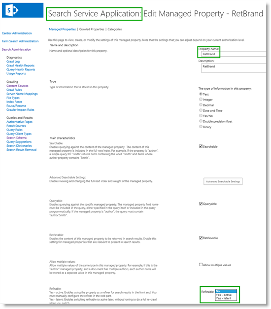
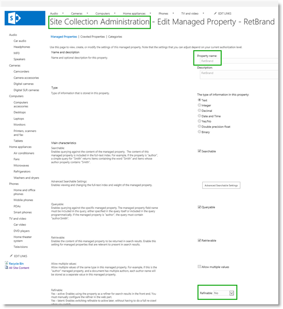

# Stage 13: Plan to use refiners for faceted navigation in SharePoint Server - Part II

[!INCLUDE[appliesto-2013-2016-2019-xxx-md](../includes/appliesto-2013-2016-2019-xxx-md.md)]
  
> [!NOTE]
> Most of the features described in this series are available only for private sites collections in SharePoint in Microsoft 365. 
  
## Quick Overview

In [Stage 12: Plan to use refiners for faceted navigation in SharePoint Server - Part I](stage-12-plan-to-use-refiners-for-faceted-navigation-inpart-i.md) we identified the refiners we want to use for faceted navigation, and determined how we want the refiner values to be displayed. 
  
In this article, you'll learn:
  
- [About enabling a managed property to be a refinable managed property](stage-13-plan-to-use-refiners-for-faceted-navigationpart-ii.md#BKMK_AboutEnablingAManagedPropertyToBeARefinableManagedProperty)
    
- [About refiner-enabled managed properties](stage-13-plan-to-use-refiners-for-faceted-navigationpart-ii.md#BKMK_AboutRefinerEnabledManagedProperties)
    
- [About defining the refiner-enabled managed properties to use in our Contoso scenario](stage-13-plan-to-use-refiners-for-faceted-navigationpart-ii.md#BKMK_AboutDefiningTheRefinerEnabledManagedPropertiesToUseInOurContosoScenario)
    
## Start stage 13

### About enabling a managed property to be a refinable managed property

The first thing that you must do when you configure refiners for faceted navigation is to enable the managed properties that you want to use as refiners to be refinable managed properties.
  
Depending on your permission level, you can do this from two places:
  
|**To refine-enable a managed property from**|**Requires permission level**|
|:-----|:-----|
|Central Administration    |Search service application administrator    |
|Site Collection Administration    |Site collection administrator    |
   
There's a reason you can do this from two places: if you are working with catalog content (let's say you're a content manager), you are unlikely to have Search service application administration level rights, that is, you won't have access to Central Administration. But, you are very likely to have Site collection administrator permissions.
  
[How to initiate a reindexing of the catalog](stage-4-set-up-search-and-enable-the-crawling-of-your-catalog-content.md#BKMK_HowtoInitiateaReindexingoftheCatalog) explained how content managers can easily add content to the search index without the help of a Search service application administrator. So now that everyone's happy, we don't want to jeopardize this happiness by making content managers dependent on a Search service application administrator to enable refiners. 
  
This article describes the procedure as it would be performed by a Site collection administrator (content manager). For information on how Search service application administrators can enable managed properties to be refinable managed properties, see [Configure refiners and faceted navigation in SharePoint Server](configure-refiners-and-faceted-navigation.md).
  
### About refiner-enabled managed properties

At the beginning, we stated: ""The first thing that you must do when you configure refiners for faceted navigation is to enable the managed properties that you * want to use as refiners to be refinable managed properties." *  Site collection administrators (content managers) can't actually do this because they don't have the required permission level. But, they have the permission level to map a crawled property to a refiner-enabled managed property. 
  
This might seem a bit confusing. Let's look somewhat more into it.
  
Search service application administrators, who have access to Central Administration, can configure many things directly on a managed property. For example, the following screen shot shows how they can change the property named **RedBrand** to be refinable by selecting either **Yes - active**, or **Yes - latent** from the **Refinable** menu. 
  

  
If we look at the same property from the perspective of a Site collection administrator, who is configuring the property on the site collection level, not only is the property name grayed out, but the **Refinable** menu is locked. 
  

  
Luckily, there are many "empty" managed properties that by default are enabled as refiners. An "empty" managed property does not have a crawled property mapped to it. This means that Site collection administrators can map a crawled property to one of these refiner-enabled managed properties without having to enlist the help of a Search service application administrator.
  
The following table provides an overview of the managed properties that are enabled as refiners by default.
  
|**Managed property name**|**Data type for mapping**|**Display format for refiner values**|
|:-----|:-----|:-----|
|RefinableDate00 - RefinableDate19    |Values contain dates    |Intervals    |
|RefinableDecimal00 - RefinableDecimal09    |Values contain numbers with maximum three decimals    |Intervals    |
|RefinableDouble00 - RefinableDouble09    |Values contain numbers with maximum three decimals    |Intervals    |
|RefinableInt00 - RefinableInt49    |Values are whole numbers    |Intervals    |
|RefinableString00 - RefinableString99    |Values are strings. This includes values that use the data type Text, Person or Group, Managed Metadata, Choice and Yes/No    |List    |
   
[Stage 12: Plan to use refiners for faceted navigation in SharePoint Server - Part I](stage-12-plan-to-use-refiners-for-faceted-navigation-inpart-i.md) listed the properties we want to use as refiners for the categories "Audio" and "Cameras." Now we have to add a fourth column to this table. For each refiner we want to use, we must define a refiner-enabled managed property. We'll then map the crawled property that represents the refiner to the appropriate refiner-enabled managed property. 
  
|**Refiner to use**|**Property type**|**Display format for refiner values**|**Refiner-enabled managed property**|
|:-----|:-----|:-----|:-----|
|Price    |Number    |Intervals    |TBD    |
|Brand    |Text    |List    |TBD    |
|Color    |Text    |List    |TBD    |
|Zoom    |Number    |List    |TBD    |
|Screen size    |Number    |List    |TBD    |
|Mega pixels    |Number    |List    |TBD    |
|Max ISO    |Number    |List    |TBD    |
   
### About defining the refiner-enabled managed properties to use in our Contoso scenario

For refiners of type Text, we can use two of the  *RefinableString*  managed properties, as shown in the highlighted cells of the following table. 
  
|**Refiner to use**|**Property type**|**Display format for refiner values**|**Refiner-enabled managed property**|
|:-----|:-----|:-----|:-----|
|Price    |Number    |Intervals    |TBD    |
|Brand    |Text    |List    |RefinableString01    |
|Color    |Text    |List    |RefinableString02    |
|Zoom    |Number    |List    |TBD    |
|Screen size    |Number    |List    |TBD    |
|Mega pixels    |Number    |List    |TBD    |
|Max ISO    |Number    |List    |TBD    |
   
The numeric refiners are a bit trickier because we have to consider what type of numeric values we are dealing with, and how we want the refiner values to be listed. Let's start with the numeric refiner **Price**. In our Contoso scenario, the values for **Price** are whole numbers. A  *RefinableInt*  managed property can be used for whole numbers, and it displays refiner values in intervals. As shown in [Stage 12: Plan to use refiners for faceted navigation in SharePoint Server - Part I](stage-12-plan-to-use-refiners-for-faceted-navigation-inpart-i.md), we want to display our **Price** refiner as intervals. So, for this refiner, we can use one of the  *RefinableInt*  managed properties. This is shown in the highlighted cell of the following table. 
  
|**Refiner to use**|**Property type**|**Display format for refiner values**|**Refiner-enabled managed property**|
|:-----|:-----|:-----|:-----|
|Price    |Number    |Intervals    |RefinableInt01    |
|Brand    |Text    |List    |RefinableString01    |
|Color    |Text    |List    |RefinableString02    |
|Zoom    |Number    |List    |TBD    |
|Screen size    |Number    |List    |TBD    |
|Mega pixels    |Number    |List    |TBD    |
|Max ISO    |Number    |List    |TBD    |
   
The remaining numeric refiners are a mix of whole numbers and decimal numbers. This could imply that we should use either  *RefinableInt*  or  *RefinableDecimal*  managed properties. But, because we want to display the refiner values in a list, we can't use either of them. Instead, we must use  *RefinableString*  managed properties. It might seem a bit counter-intuitive that we use managed properties that are meant for string values to display numeric refiner values, but this is the only way that we can display refiner values in a list. 
  
So, our final list of refiner-enabled managed properties looks as follows:
  
|**Refiner to use**|**Property type**|**Display format for refiner values**|**Refiner-enabled managed property**|
|:-----|:-----|:-----|:-----|
|Price    |Number    |Intervals    |RefinableInt01    |
|Brand    |Text    |List    |RefinableString01    |
|Color    |Text    |List    |RefinableString02    |
|Zoom    |Number    |List    |RefinableString03    |
|Screen size    |Number    |List    |RefinableString04    |
|Mega pixels    |Number    |List    |RefinableString05    |
|Max ISO    |Number    |List    |RefinableString06    |
   
Now that we've taken care of the planning, it's time do some actual configuring.
  
#### Next article in this series

[Stage 14: Configure refiners for faceted navigation in SharePoint Server](stage-14-configure-refiners-for-faceted-navigation.md)
  
## See also

#### Other Resources

[Plan refiners and faceted navigation](plan-search-for-sharepoint-cross-site-publishing-sites.md#BKMK_PlanRefinersAndFacetedNavigation)

