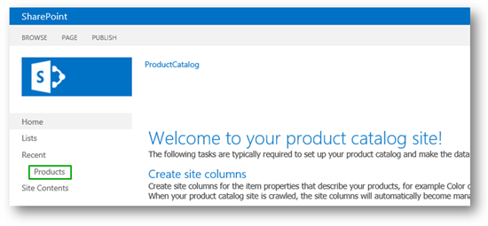
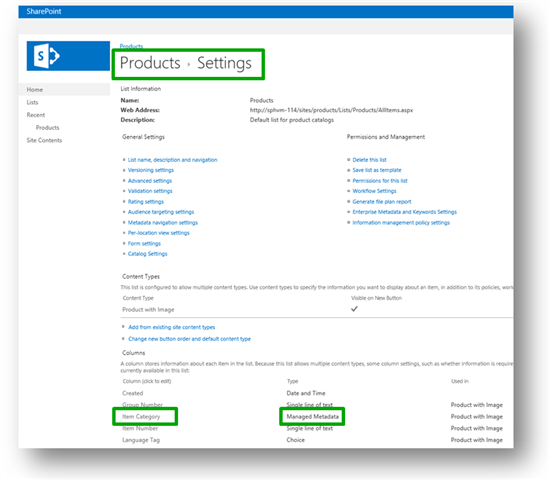
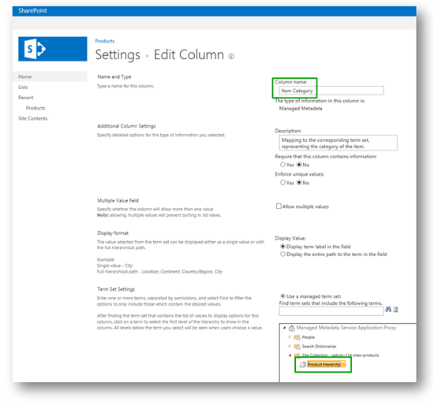
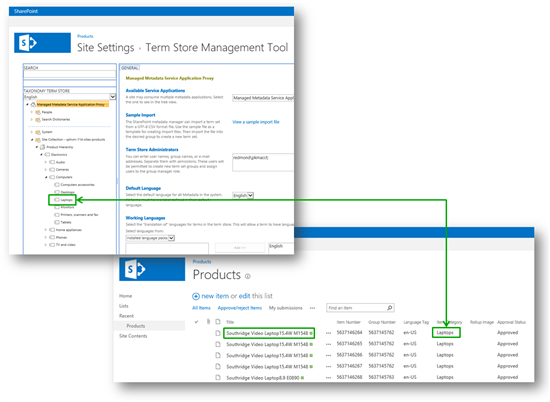

# Stage 2: Import list content into the Product Catalog Site Collection in SharePoint Server

[!INCLUDE[appliesto-2013-2016-2019-xxx-md](../includes/appliesto-2013-2016-2019-xxx-md.md)]
  
> [!NOTE]
> Most of the features described in this series are available only for private sites collections in SharePoint Online. 
  
## Start stage 2

After we've set up our Product Catalog Site Collection, as described in [Stage 1: Create site collections for cross-site publishing in SharePoint Server](stage-1-create-site-collections-for-cross-site-publishing.md), we can import content into this site collection. To do this, we'll use PowerShell scripts. But before we start, let's take a look at what is automatically created in a **Product Catalog Site Collection**. 
  
In our newly created **Product Catalog Site Collection**, we can see a default list template named **Products**. 
  

  
The **Products** list contains a managed metadata site column named **Item Category**. 
  

  
The **Item Category** site column is associated with the term set named **Product Hierarchy**. 
  

  
To import list content into the **Products** list, we'll use PowerShell scripts that will: 
  
- Add content to the **Products** list. 
    
- Add terms to the **Product Hierarchy** term set. 
    
- Associate each item in the **Products** list with the correct term from the **Product Hierarchy** term set, and display this in the **Item Category** column in the **Products** list. 
    
Before we can run the PowerShell scripts, we'll have to prepare the following:
  
- A list of the site columns we want to add to the **Products** list. 
    
- A tab delimited text file that contains the content we want to add to the **Products** list. 
    
- A tab delimited text file that contains the taxonomy to be added to the **Product Hierarchy** term set. 
    
The PowerShell scripts, instructions on how to create the tab delimited text files, and instructions on how to change and use the import scripts can be found in [Import list content to Products list for SharePoint 2013](https://go.microsoft.com/fwlink/p/?LinkId=400443).
  
After we have run the five PowerShell scripts, we get the following:
  
- List content in the **Products** list. In our scenario, each list item is a product that Contoso want to display on their website. 
    
- Terms in the **Product Hierarchy** term set. In our scenario, the term set reflects how Contoso has categorized their products, for example one category is called "Laptops" and another is "MP3" players. 
    
- In the **Products** list, content in the **Item Category** column is associated with the correct term from the **Product Hierarchy** term set. The following screen shot shows how the list item  *Southridge Video Laptop15.4W M1548*  is associated with the term  *Laptops*  through the **Item Category** column. 
    

  
So, now that we have content in the **Products** list, the next task is to enable this list as a catalog. 
  
### Next article in this series

[Stage 3: How to enable a list as a catalog in SharePoint Server](stage-3-how-to-enable-a-list-as-a-catalog.md)
  
## See also

#### Concepts

[Configure cross-site publishing in SharePoint Server](configure-cross-site-publishing.md)

