# Stage 3: How to enable a list as a catalog in SharePoint Server

[!INCLUDE[appliesto-2013-2016-2019-xxx-md](../includes/appliesto-2013-2016-2019-xxx-md.md)]
  
> [!NOTE]
> Most of the features described in this series are available only for private sites collections in SharePoint in Microsoft 365. 
  
## Quick overview

As described in as described in [Stage 2: Import list content into the Product Catalog Site Collection in SharePoint Server](stage-2-import-list-content-into-the-product-catalog-site-collection.md), we've imported content about Contoso's product line into the **Products** list. To display this product information in our Publishing Portal (the Contoso website), we must enable the **Products** list as a catalog. 
  
## Start stage 3

1. On the **Products** list, from the **LIST** tab, click **List Settings**. 
    
     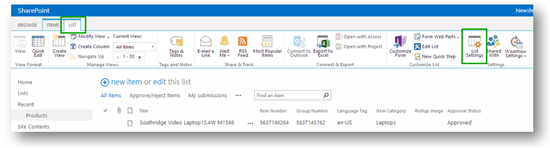
  
2. On the **Settings** page, click **Catalog Settings**. 
    
     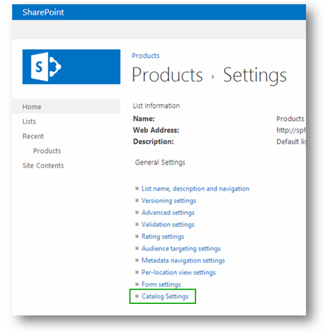
  
    We'll define several things on the **Catalog Settings** page, which we'll separate into individual chunks. 
    
3. For **Catalog Sharing**, select **Enable this Library as a catalog**. 
    
     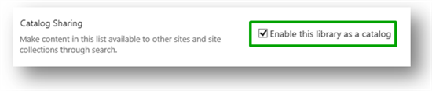
  
By selecting this, we confirm that content from the **Products** list should be added to the search index. 
    
     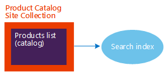
  
4. For **Anonymous Access**, click **Enable anonymous access**, and then click **Make Anonymous**. 
    
     
  
By doing this, we grant anonymous visitors, that is, visitors who are not logged on to Contoso's website, access to view content from this list.
    
    Note that we're **not** granting visitors access to the list itself. All we're doing is granting anonymous visitors access to **view** the catalog content from the search index. Anonymous visitors will never be able to see the actual **Products** list. 
    
     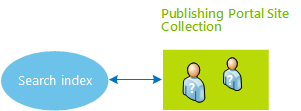
  
5. For **Navigation Hierarchy** (this section is listed after **Catalog Item URL** in the UI, but we'll tell you about this one first), select **Item Category**. 
    
     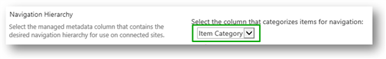
  
In the previous article, [Stage 2: Import list content into the Product Catalog Site Collection in SharePoint Server](stage-2-import-list-content-into-the-product-catalog-site-collection.md), we showed you how the managed metadata column **Item Category** is tied to the **Product Hierarchy** term set. 
    
     
  
By selecting **Item Category** here, we are in fact specifying that the navigation on our publishing site (the Contoso website) will be determined by the structure in the **Product Hierarchy** term set. 
    
    In the following screen shot, notice that the structure in the **Product Hierarchy** term set matches the navigation on the Contoso website. 
    
     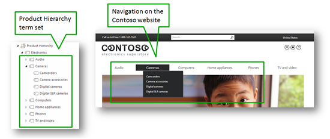
  
The terms from the **Product Hierarchy** term set will also be used to create a friendly URL for our category pages on the publishing site (the Contoso website). For example, the URL to the page displaying camcorders is  *http://www.contoso/cameras/camcorders*  , and the URL to the page displaying camera accessories is  *http://www.contoso/cameras/camera-accessories*  . 
    
     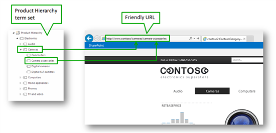
  
6. For **Catalog Item URL Fields**, select the list columns that should be used to create a unique URL to a product. For Contoso, we'll use **Group Number** and **Item Number**. 
    
     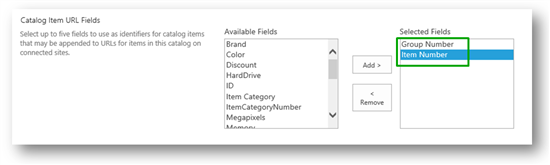
  
The URL to a specific product will be composed of the terms that we specify in **Navigation Hierarchy** (previous step),  *and*  the values from the fields we specify as **Catalog Item URL Fields**. When selecting these fields, we should use at least one field that contains a product unique value, because we want to use this unique value in the product URL. By doing this, the URL to the product  *Fabricam Home Movimaker M300*  will differ from the URL to the product  *Fabricam Home Movimaker M400*  . 
    
    For Contoso, the unique identifier of a product is the value in the **Item Number** column. We also want to use the value of the **Group Number** column. Therefore, we'll add them both. Later in this series, we'll explain why we also want to use **Group Number**. 
    
     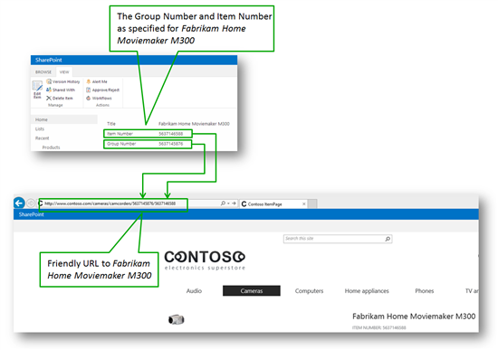
  
Our final **Catalog Settings** page looks as follows: 
    
     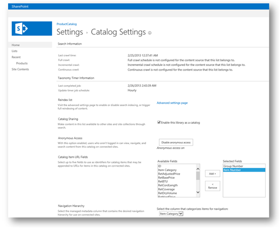
  
So now that we've set all these specifications, it's time to crawl the catalog.
  
### Next article in this series

[Stage 4: Set up search and enable the crawling of your catalog content in SharePoint Server](stage-4-set-up-search-and-enable-the-crawling-of-your-catalog-content.md)
  

