# Stage 5: Connect your publishing site to a catalog in SharePoint Server

[!INCLUDE[appliesto-2013-2016-2019-xxx-md](../includes/appliesto-2013-2016-2019-xxx-md.md)]
  
> [!NOTE]
> Most of the features described in this series are available only for private sites collections in SharePoint Online. 
  
## Quick overview

In previous articles, we described how we created a Publishing Portal Site Collection called Contoso ([Stage 1: Create site collections for cross-site publishing in SharePoint Server](stage-1-create-site-collections-for-cross-site-publishing.md)), and also enabled the Products list as a catalog [Stage 3: How to enable a list as a catalog in SharePoint Server](stage-3-how-to-enable-a-list-as-a-catalog.md). 
  
We're now going to connect the publishing site to our catalog. In this article, we'll describe:
  
- [How to get to the Catalog Source Settings page](stage-5-connect-your-publishing-site-to-a-catalog.md#BKMK_HowtoGettotheCatalogSourceSettingsPage)
    
- [Specify the settings on the Catalog Source Settings page](stage-5-connect-your-publishing-site-to-a-catalog.md#BKMK_SpecifyTheSettingsOnTheCatalogSourceSettingsPage)
    
- [What happens when I click the OK button to connect to a catalog](stage-5-connect-your-publishing-site-to-a-catalog.md#BKMK_WhatHappensWhenIClicktheOKButtontoConnecttoaCatalog)
    
Throughout this stage, we won't have much clicking to do because many the settings have already been preconfigured with what we did in [Stage 3: How to enable a list as a catalog in SharePoint Server](stage-3-how-to-enable-a-list-as-a-catalog.md). But, many new concepts will be introduced, and these features will be explained as we go.
  
To help keep you oriented, we'll use these icons:
  
>  means the section will provide conceptual information. 
    
> 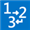 means the section will provide procedural steps for performing a task. 
    
## Start stage 5

### About the Catalog Source Settings page

  
The **Catalog Source Settings** page is an important page, because this is where you specify how your publishing site should be connected to your catalog. If you have several catalogs on your farm, each catalog will have its own **Catalog Source Settings** page. 
  
In our Contoso site scenario, we only have one catalog, the **Products** catalog. Therefore, we want to go to the **Catalog Source Settings** page for the **Products** catalog. 
  
Remember, in [Stage 3: How to enable a list as a catalog in SharePoint Server](stage-3-how-to-enable-a-list-as-a-catalog.md) where we learned how to enable a list as a catalog, and we set a check box **Enable this library as a catalog** ? Well, in this stage, SharePoint will search for libraries or lists where this check box was selected. 
  
### How to get to the Catalog Source Settings page

  
1. On the Contoso site, go to **Site settings** --> **Manage catalog connections**. 
    
2. On the **Manage catalog connections** page, click **Connect to a catalog**. 
    
     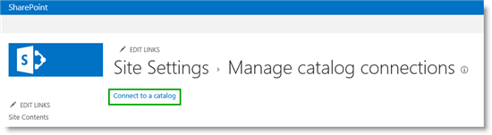
  
Our **Products** list is displayed as an available catalog. To connect to it, click **Connect**. 
    
     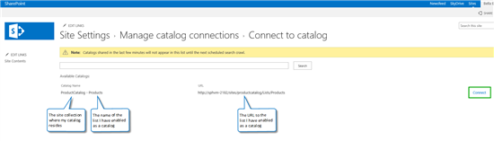
  
    > [!TIP]
    > If you click **Connect to a catalog** and there aren't any available catalogs, this might be because you have not yet crawled the catalog, as demonstrated in [Stage 4: Set up search and enable the crawling of your catalog content in SharePoint Server](stage-4-set-up-search-and-enable-the-crawling-of-your-catalog-content.md). 
  
Now that we've successfully navigated to the **Catalog Source Settings** page for our **Products** catalog, it's time to specify how the catalog should be integrated into our Contoso site. 
  
## Specify the settings on the Catalog Source Settings page

This table provides an overview of the settings we must specify on the **Catalog Source Settings** page. If you want to go straight to a subsection, use the "Go to" links. 
  
|**To**|**Go to**|**Go to**|
|:-----|:-----|:-----|
|[Specify Catalog Integration](stage-5-connect-your-publishing-site-to-a-catalog.md#BKMK_SpecifyCatalogIntegration)   |[About specifying Catalog Integration](stage-5-connect-your-publishing-site-to-a-catalog.md#BKMK_AboutSpecifyingCatalogIntegration)   |[How to specify Catalog Integration](stage-5-connect-your-publishing-site-to-a-catalog.md#BKMK_HowtoSpecifyCatalogIntegration)   |
|[Specify the full site navigation](stage-5-connect-your-publishing-site-to-a-catalog.md#BKMK_SpecifytheFullSiteNavigation)   |[About specifying the full site navigation](stage-5-connect-your-publishing-site-to-a-catalog.md#BKMK_AboutSpecifyingtheFullSiteNavigation)   |[How to specify the full site navigation](stage-5-connect-your-publishing-site-to-a-catalog.md#BKMK_HowtoSpecifytheFullSiteNavigation)   |
|[Specify URL details for a product page](stage-5-connect-your-publishing-site-to-a-catalog.md#BKMK_SpecifyURLDetailsforaProductPage)   |[About specifying URL details for a product page](stage-5-connect-your-publishing-site-to-a-catalog.md#BKMK_AboutSpecifyingURLDetailsforaProductPage)   |[How to specify URL details for a product page](stage-5-connect-your-publishing-site-to-a-catalog.md#BKMK_HowToSpecifyURLDetailsforaProductPage)   |
|[Specify a Category Page and an Item Page](stage-5-connect-your-publishing-site-to-a-catalog.md#BKMK_SpecifyaCategoryPageandanItemPage)   |[About specifying a Category Page and an Item Page](stage-5-connect-your-publishing-site-to-a-catalog.md#BKMK_AboutSpecifyingaCategoryPageandanItemPage)   |[How to specify a Category Page and an Item Page](stage-5-connect-your-publishing-site-to-a-catalog.md#BKMK_HowtoSpecifyaCategoryPageandanItemPage)   |
   
## Specify Catalog Integration

### About specifying Catalog Integration

  
For this setting, specify how the catalog content should be integrated in your publishing site. Your selection will effect whether you have to specify additionally settings on the **Catalog Settings Page**. 
  
### How to specify Catalog Integration

  
In the **Connection Integration** section, keep the setting **Integrate the catalog into my site** as it is: **Selected**. 
  
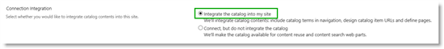
  
The reason we are keeping this setting selected is because we want to use the terms from the **Product Hierarchy** term set (from our Product Catalog Site Collection) in the navigation of our Contoso site. 
  
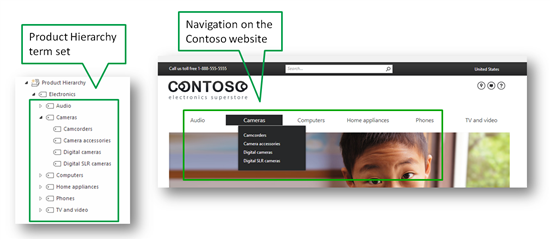
  
Keeping this setting selected enables us to define user-friendly URLs, and have a category page and an item page automatically created for us (we'll describe what a category page and an item page is in more detail later).
  
## Specify the full site navigation

### About specifying the full site navigation

  
A site that was created by using the **Publishing Portal Site Collection** template, which is what we used when we created this site in [Stage 1: Create site collections for cross-site publishing in SharePoint Server](stage-1-create-site-collections-for-cross-site-publishing.md), will by default have **Managed navigation** selected as its navigation method. Managed navigation is a new navigation method introduced in SharePoint Server 2016, which lets you define and maintain the navigation on your site by using term sets. 
  
To view how the navigation of your site is set up:
  
1. Go to **Site settings --\> Navigation**. 
    
2. Verify that:
    
- **Managed Navigation** is selected. 
    
- The **Site Navigation** term set is specified as the term set that defines the navigation on your site. 
    
     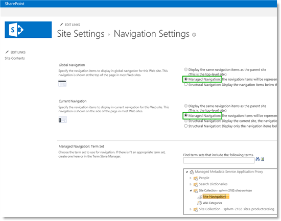
  
We are now going to build the full site navigation by integrating terms from the **Product Hierarchy** term set (from the Product Catalog Site Collection) into the **Site Navigation** term set. 
    
     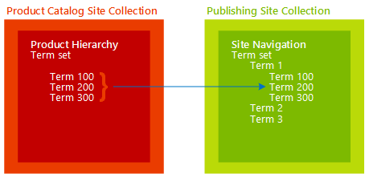
  
In our scenario, the navigation structure of our Contoso site will be very simple, as it'll be made up of the terms from the **Product Hierarchy** term set only. 
    
### How to specify the full site navigation

  
To specify the full site navigation, we have to specify:
  
- Navigation Hierarchy
    
- Navigation Position
    
- Navigation Pinning
    
 **Navigation Hierarchy**
  
The **Select the column that categorizes items for navigation** setting already contains information. Remember in [Stage 3: How to enable a list as a catalog in SharePoint Server](stage-3-how-to-enable-a-list-as-a-catalog.md), when we selected the **Item Category** for **Navigation Hierarchy** setting? That setting is automatically carried over to this page. Therefore, we'll keep the selected **Item Category** as is. 
  

  
Also remember [Stage 2: Import list content into the Product Catalog Site Collection in SharePoint Server](stage-2-import-list-content-into-the-product-catalog-site-collection.md), where we showed how the **Item Category** column is tied to the **Product Hierarchy** term set. Now we will specify from where in the **Product Hierarchy** term set the catalog navigation should start. 
  
1. In the **Root term of hierarchy** section, click the label icon. A dialog box showing the **Product Hierarchy** term set opens. 
    
2. Select "Electronics".
    
    We're selecting this because we want all terms from the term set to be included in the catalog navigation.
    
     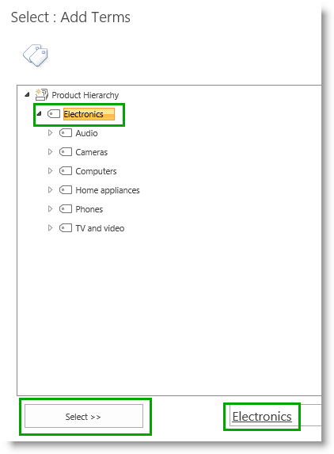
  
3. Don't select **Include root term in site navigation** as we don't want the root term "Electronics" to be shown in the site navigation. 
    
Our final **Navigation Hierarchy** settings will be like this: 
  
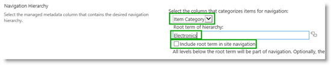
  
 **Navigation Position**
  
 **Navigation Position** defines where, in the current site navigation, the catalog navigation should be integrated. In other words, where, in the **Site Navigation** term set, the **Product Hierarchy** term set should be integrated. As the Contoso site will only contain catalog pages, I keep the setting **Add to navigation root** selected. 
  
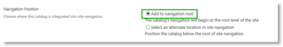
  
 **Navigation Pinning**
  
 **Navigation Pinning** determines whether changes that are made to the **Product Hierarchy** term set in the Product Catalog Site Collection should be reflected on your site navigation. 
  
If we decide to change our **Product Hierarchy** term set, for example by changing the name of a term from "Printers, scanners and fax" to "Printers, scanners &amp; fax", we want this to be reflected on our site navigation. For this to occur, the **Pin terms to site navigation** check box should remain selected. 
  
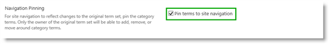
  
## Specify URL details for a product page

### About specifying URL details for a product page

  
When specifying URL details for a product page, you first have to decide which page that you want your visitors to land on when they're browsing to a specific product. To do this, you've two options:
  
- Visitors can land on a page within the publishing portal.
    
- Visitors can land on the list item in the Product Catalog Site Collection.
    
We're building a customer-facing website for Contoso, with colorful, attractive pages to showcase our products. We similarly want our pages to have friendly URLs. Therefore, we'll choose the first option.
  
If we were building an internal company website, where we wanted employees to view the actual list items in our catalog, we'd have chosen the second option.
  
> [!IMPORTANT]
> When specifying URL settings for a product page, your security settings and site access settings remain the same. Visitors will only see what you've granted them permissions to see. 
  
### How to specify URL details for a product page

  
To specify the URL details for a product page, you have to specify:
  
- Catalog Item URL Behavior
    
- Catalog Item URL Format
    
 **Catalog Item URL Behavior**
  
To specify **Catalog Item URL Behavior**, keep the **Make URLs relative to this site** setting selected. 
  
By keeping this setting selected, when our Contoso visitors browse for a specific product, they'll be taken directly to a page in the publishing site collection.
  
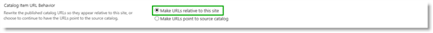
  
 **Catalog Item URL Format**
  
 **Catalog Item URL Format** defines how to build a friendly URL to the product page. We have already specified this in [Stage 3: How to enable a list as a catalog in SharePoint Server](stage-3-how-to-enable-a-list-as-a-catalog.md), when we selected **Catalog Item URL Fields**. 
  
In our Contoso scenario, we'll keep the setting **Use the default URL format provided by the catalog source** selected. This means that the URL to the product page will contain values from the managed properties **ProductCatalogGroupNumberOWSTEXT**, and **ProductCatalogItemNumberOWSTEXT**. 
  
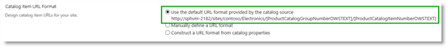
  
> [!NOTE]
> If the managed property names are confusing, see [From site column to managed property - What's up with that?](from-site-column-to-managed-propertywhat-s-up-with-that.md), which describes how automatically created properties are named. 
  
## Specify a Category Page and an Item Page

### About specifying a Category Page and an Item Page

  
When you display information in a catalog format, the layout and structure should be consistent across the catalog. For example, you want to display the image of a product in the upper-left corner, followed by a table of product specifications, such as the height and color of the product. The same applies to category pages. For example, you want the page for all TVs to have the same layout as the page for all cameras.
  
To avoid having to create several pages for each product, and several pages for each category, you can use one template page for each. In SharePoint, an **Item Page** and a **Category Page** serve this purpose. 
  
In our Contoso website scenario, we'll neither create an Item Page, nor shall we create a Category Page as SharePoint will do this for us automatically.
  
### How to specify a Category Page and an Item Page

  
1. In the section **Category Page**, keep **Create a new page** selected. By doing this, SharePoint automatically creates a new category page. 
    
     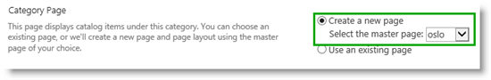
  
2. In the section **Item Page**, keep **Create a new page** selected. By doing this, SharePoint automatically creates a new item page. 
    
     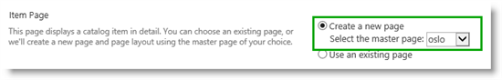
  
Here's what our final **Catalog Source Settings** page will be like: 
    
     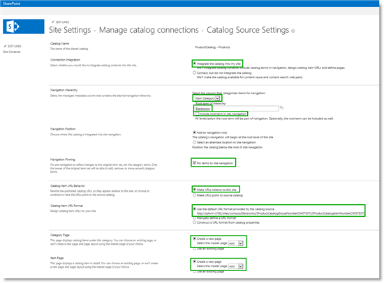
  
Click **OK**, and watch some cool things occur! 
    
### What happens when I click the OK button to connect to a catalog

Our Contoso site navigation now includes terms from the **Product Hierarchy** term set. 
  
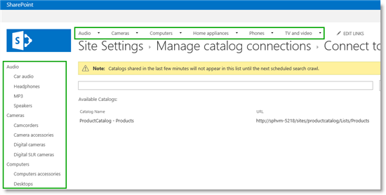
  
If you browse to the **Audio** page, you'll see three MP3 products displayed. 
  
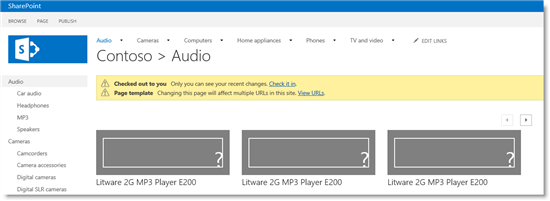
  
If you browse to the **Computers** page, you'll see three laptop products displayed. 
  
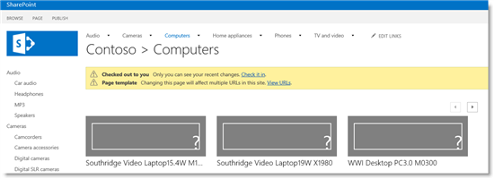
  
A later article in this series will explain why the correct categorized products "magically" appear as we browse through the different categories. For now, let's examine a specific product.
  
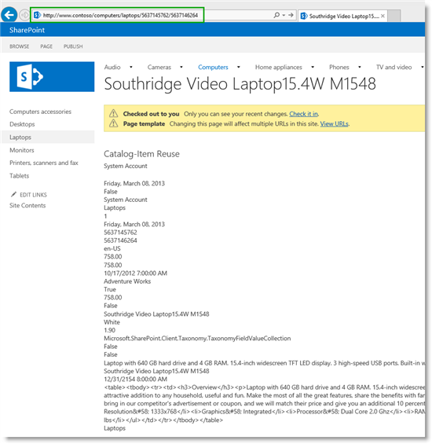
  
As you can see, currently it's not exactly pretty to look at, but information about the product is displayed on the page, and there is a friendly URL.
  
Also, the terms from the **Product Hierarchy** term set are integrated into the **Site Navigation** term set. If you want to see this in more detail, go to **Site settings --\> Term store management**. 
  
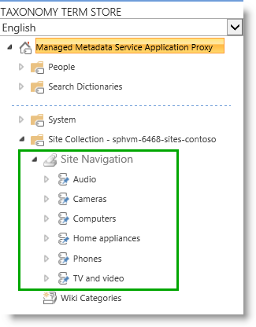
  
And two new pages are added to the Pages library. If you want to see this in more detail, go to **Site contents --\> Pages**. 
  
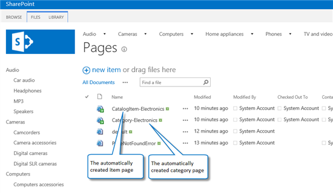
  
A lot of cool things have just happened on our Contoso website. Now it is time to start improving the appearance of our pages.
  
#### Next article in this series

[Stage 6: Upload and apply a new master page to a publishing site in SharePoint Server](stage-6-upload-and-apply-a-new-master-page-to-a-publishing-site.md)
  
## See also

#### Concepts

[Connect a publishing site to a catalog in SharePoint Server](connect-a-publishing-site-to-a-catalog.md)

