# Stage 6: Upload and apply a new master page to a publishing site in SharePoint Server

[!INCLUDE[appliesto-2013-2016-2019-xxx-md](../includes/appliesto-2013-2016-2019-xxx-md.md)]
  
> [!NOTE]
> Most of the features described in this series are available only for private sites collections in SharePoint Online. 
  
## Quick overview

As described in [Stage 5: Connect your publishing site to a catalog in SharePoint Server](stage-5-connect-your-publishing-site-to-a-catalog.md), we connected the publishing site to our catalog. When we connected, SharePoint Server 2016 automatically created some pages for us, on which some search results where shown. These pages all have the standard SharePoint look. So, now it is time to give them a Contoso look.
  
In this stage, you'll learn:
  
- [About the master page](stage-6-upload-and-apply-a-new-master-page-to-a-publishing-site.md#BKMK_AboutTheMasterPage)
    
- [About the Master Page Gallery](stage-6-upload-and-apply-a-new-master-page-to-a-publishing-site.md#BKMK_AboutTheMasterPageGallery)
    
- [How to map your network drive](stage-6-upload-and-apply-a-new-master-page-to-a-publishing-site.md#BKMK_HowToMapYourNetworkDrive)
    
- [How to turn off versioning for the Master Page Gallery](stage-6-upload-and-apply-a-new-master-page-to-a-publishing-site.md#BKMK_HowToTurnOffVersioningForTheMasterPageGallery)
    
- [How to upload a new master page](stage-6-upload-and-apply-a-new-master-page-to-a-publishing-site.md#BKMK_HowToUploadANewMasterPage)
    
- [How to apply a new master page](stage-6-upload-and-apply-a-new-master-page-to-a-publishing-site.md#BKMK_HowToApplyANewMasterPage)
    
> [!NOTE]
> This article doesn' *t*  cover how to create a master page. It will only cover how to upload and apply an already completed master page file and other design files that are stored locally on your computer. These files are not available for download. 
  
For information about how to create a master page, see:
  
- [Overview of Design Manager in SharePoint 2013](https://go.microsoft.com/fwlink/p/?LinkId=400533)
    
- [How to: Convert an HTML file into a master page in SharePoint 2013](https://go.microsoft.com/fwlink/p/?LinkId=400534)
    
## Start stage 6

### About the master page

When visitors browse our Contoso site, they'll see different content on different pages. The displayed content is a combination of a master page and page layouts.
  
A **master page** defines the common layout and interface that you see on all webpages, such as logo, title and navigation menu. 
  
Layout and interface for the individual pages, such as the home page, or the page that displays Audio products, are handled by **page layouts**. We'll provide more information about them later in this series. 
  
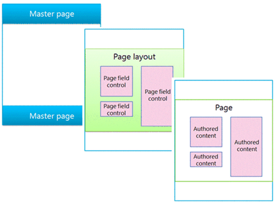
  
In earlier versions of SharePoint, you had to design master pages in ASP.NET. These master pages also had to include SharePoint specific markup, such as controls and content placeholders.
  
In SharePoint Server 2016, you can create a master page in HTML format, and SharePoint Server 2016 will convert it to an ASP.NET page for you. This means that when you design your master page, you can use your favorite HTML editor, focus on HTML, CSS, and JavaScript. You don't have to worry about ASP.NET or SharePoint specific markup.
  
When you add an HTML master page to SharePoint Server 2016, an associated ASP.NET master page is automatically created. Because the two files are associated, any changes that you make to the HTML master page file will be carried over automatically to the associated ASP.NET master page file.
  
For more information, see [Overview of the SharePoint 2013 page model](https://go.microsoft.com/fwlink/p/?LinkId=400535).
  
### About the Master Page Gallery

In our scenario, we have an HTML master page and some design assets, such as a CSS file and images, that we want to upload and apply to our Contoso site. All these files are stored on your local computer.
  
SharePoint expects to find design files in the **Master Page Gallery**. So this is where we should upload the files. To get to the Master Page Gallery, go to **Site Settings** --> **Master pages and page layouts**. 
  
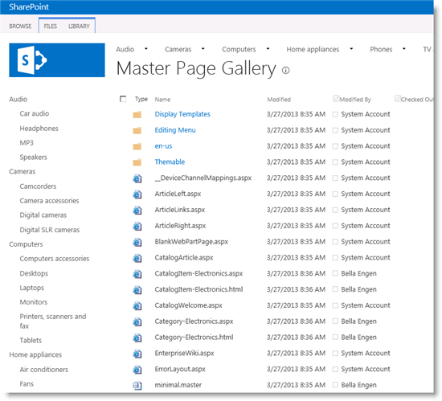
  
You can use the **Upload Document** button to upload a single file to the Master Page Gallery. But, using this button every time that you want to add a document can be somewhat cumbersome. To make life easy for yourself, you can map your network drive. This will enable you to drag-and-drop files into the Master Page Gallery with Windows Explorer. 
  
### How to map your network drive

1. From **Settings** menu, select **Design Manager**. 
    
     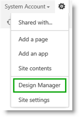
  
2. On the **Design Manager Welcome** page, click **3. Upload Design Files.**
    
     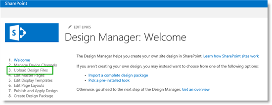
  
3. On the **Upload Design Files** page, copy the URL to your design files. 
    
     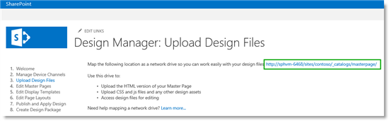
  
    > [!NOTE]
    > The next steps will vary, depending on your computer's operating system. This example shows how to map a network drive on a computer that is running Windows 8.x. 
  
4. Open Windows Explorer. Right-click **Network**, and then select **Map network drive**. 
    
     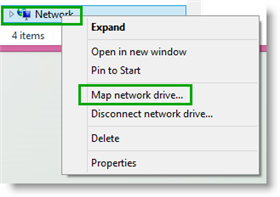
  
5. In the **Folder** field, paste the URL that you copied in step 3, and then click **Finish**. 
    
     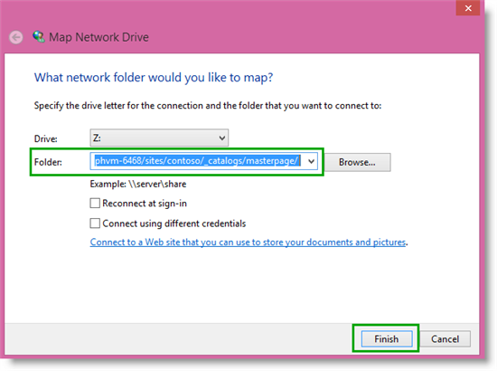
  
6. An explorer window with your Master Page Gallery content opens.
    
     
  
### How to turn off versioning for the Master Page Gallery

In our scenario, we are  *not*  using SharePoint workflows for approval. The files have already been approved. So before we upload a new master page, we want to turn off versioning for the Master Page Gallery. 
  
To turn off versioning for the Master Page Gallery:
  
1. On the **LIBRARY** tab, click **Library Settings**. 
    
2. On the **Settings** page, click **Versioning settings**. 
    
3. On the **Versioning Settings** page, in the **Content Approval** section, for **Require content approval for submitted items**, select **No**. 
    
4. In the **Document Version History** section, for **Create a version each time you edit a file in this document library**, select **No versioning**. 
    
5. In the **Require Check Out** section, for **Require documents to be checked out before they can be edited**, select **No**. 
    
     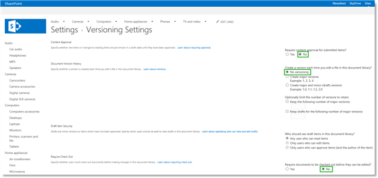
  
Now we're ready to upload a new master page.
    
### How to upload a new master page

Because we have mapped our network drive, uploading a new master page becomes very easy. Simply drag-and-drop the file into your Master Page Gallery.
  

  
If you have any associated design files, such as CSS files or images, you can drag-and-drop these into the Master Page Gallery also.
  
In SharePoint, refresh the Master Page Gallery page to see that the new HTML master page is added. But, notice that an associated ASP.NET master page has not yet been created.
  

  
Because we dragged and dropped the HTML master page into the Master Page Galley, the content type associated with the file is **Design File**. For SharePoint Server 2016 to create an associated ASP.NET master page, we have to change the content type for the newly uploaded HTML master file. This is performed by changing the file properties. 
  
To change the file properties:
  
1. On the **Master Page Gallery** page, select the newly uploaded master page, and then click **Edit Properties**. 
    
     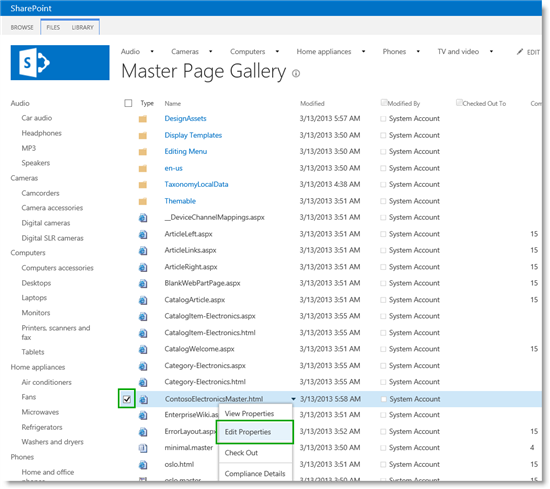
  
2. In the **Content Type** section, select **HTML Master Page**. 
    
3. In the **Compatible UI Version(s)** section, select **15**. 
    
     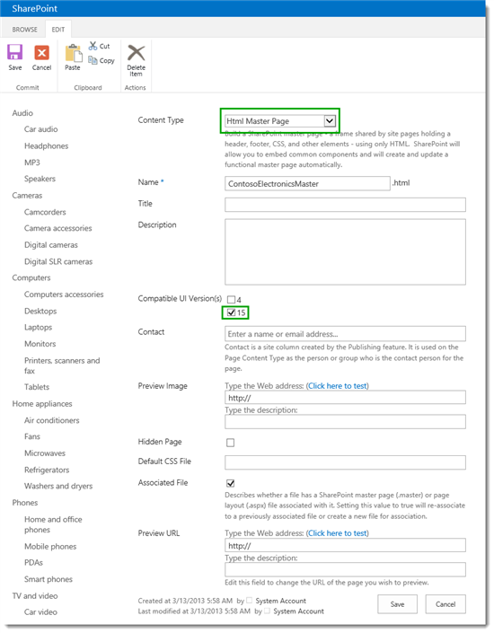
  
On the **Master Page Gallery** page, we can see that an associated ASP.NET master page is created. 
    
     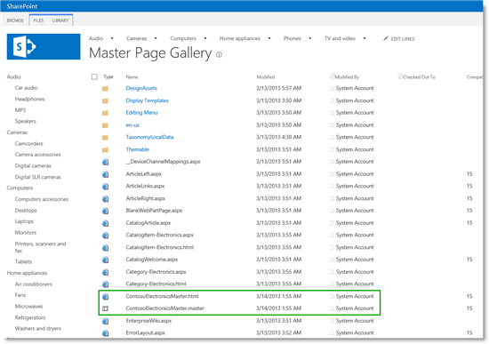
  
We are now ready to apply our new master page.
    
### How to apply a new master page

To apply a new master page:
  
1. From the **Site Settings** page, click **Master page** (under **Look and Feel** ). 
    
2. From the **Site Master Page** section, from the **Specify a master page to be used by this site and all sites that inherit from it**, select the newly uploaded master page. In our scenario, this is **ContosoElectronicsMaster**. 
    
     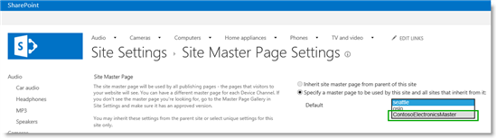
  
By clicking the **Audio** page, we verify that our new master page is now being used. 
    
     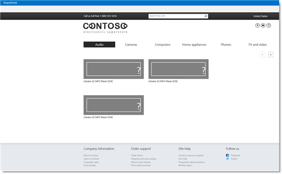
  
The next step is to start to work on the page layouts.
  
### Next article in this series

[Stage 7: Upload page layouts and create new pages in a publishing site in SharePoint Server](stage-7-upload-page-layouts-and-create-new-pages-in-a-publishing-site.md)
  
## See also

#### Other Resources

[Overview of the SharePoint 2013 page model](https://msdn.microsoft.com/library/office/jj191506.aspx)
  
[How to: Map a network drive to the SharePoint 2013 Master Page Gallery](https://msdn.microsoft.com/library/jj733519.aspx)
  
[Overview of Design Manager in SharePoint 2013](https://msdn.microsoft.com/library/jj822363.aspx)
  
[How to: Convert an HTML file into a master page in SharePoint Server 2013](https://msdn.microsoft.com/library/jj822370.aspx)
  
[How to: Apply a master page to a site in SharePoint Server 2013](https://msdn.microsoft.com/library/jj862339.aspx)

