# Stage 8: Assign a category page and a catalog item page to a term in SharePoint Server

[!INCLUDE[appliesto-2013-2016-2019-xxx-md](../includes/appliesto-2013-2016-2019-xxx-md.md)]
  
> [!NOTE]
> Most of the features described in this series are available only for private sites collections in SharePoint Online. 
  
## Quick overview

In previous stages of this series we:
  
- [Specify the full site navigation](stage-5-connect-your-publishing-site-to-a-catalog.md#BKMK_SpecifytheFullSiteNavigation)
    
- [How to specify the full site navigation](stage-5-connect-your-publishing-site-to-a-catalog.md#BKMK_HowtoSpecifytheFullSiteNavigation)
    
- [How to create a page based on a page layout](stage-7-upload-page-layouts-and-create-new-pages-in-a-publishing-site.md#BKMK_HowToCreateAPageBasedOnAPageLayout)
    
In this stage, we'll assign these newly created pages to the terms within the **Site Navigation** term set. 
  
In this article, you'll learn:
  
- [About managed navigation](stage-8-assign-a-category-page-and-a-catalog-item-page-to-a-term.md#BKMK_AboutManagedNavigation)
    
- [About the category page and the catalog item page](stage-8-assign-a-category-page-and-a-catalog-item-page-to-a-term.md#BKMK_AboutTheCategoryPageAndTheCategoryItemPage)
    
- [How to assign a category page and a catalog item page to a term](stage-8-assign-a-category-page-and-a-catalog-item-page-to-a-term.md#BKMK_HowToAssignACategoryPageAndACatalogItemPageToATerm)
    
- [About the friendly URL for category pages](stage-8-assign-a-category-page-and-a-catalog-item-page-to-a-term.md#BKMK_AboutTheFriendlyURLForCategoryPages)
    
## Start stage 8

Before we begin the task of assigning a category page and a catalog item page to a term, let's discuss a bit more about some of the features involved.
  
### About managed navigation

Managed navigation was introduced in SharePoint Server 2016. This navigation method lets you define and maintain your site navigation by using term sets.
  
One of the benefits of using managed navigation is that it separates the site navigation from the location of your content. By using managed navigation, it's not the location of your content that defines where in the navigation your content will appear, but how you tag your content with terms from a term set. For example, in earlier versions of SharePoint, if you wanted to add a new page under "About our company," you had to add that page under the "About our company" branch within your content. By using managed navigation, you can add a page to the branch that makes the most sense to you. By tagging that page with a term, and using Search Web Parts, it will appear in the correct place in the navigation.
  
Another benefit of managed navigation is that it creates friendly URLs. In earlier versions of SharePoint, the URL to a page contained a reference to the **Pages** library and any folders within that library, for example:  *http://www.contoso.com/pages/products/computers/laptops.aspx*  . By using managed navigation, URLs are based on the terms in the term set that drives your site navigation, for example:  *http://www.contoso.com/computers/laptops*  . 
  
[Stage 3: How to enable a list as a catalog in SharePoint Server](stage-3-how-to-enable-a-list-as-a-catalog.md) explained how terms from the **Product Hierarchy** term set are used to create a friendly URL. 
  
> [!IMPORTANT]
> Managed navigation is not tied to a publishing method, and can be used both for author-in-place and for cross-site publishing. For more information, see [Overview of managed navigation in SharePoint Server](overview-of-managed-navigation.md). 
  
### About the category page and the catalog item page

When you display information in a catalog format, the layout and structure of the category pages should be consistent across the catalog. For example, in our Contoso scenario, we want the category page for all MP3 players to have the same layout as the category page for all camcorders.
  
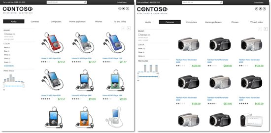
  
Also, regardless of what type of product a visitor views, the catalog item page should be consistent. For example always display an image of a product in the upper-left corner, followed by tables of product specifications.
  
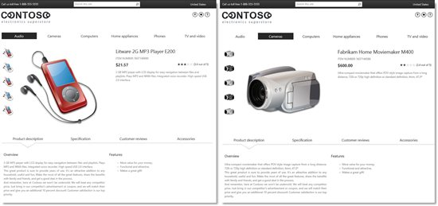
  
By combining managed navigation with category pages and catalog item pages, you don't have to create several pages for your catalog categories or for your catalog items. For example, in our Contoso scenario, we'll use only use the two pages we created in [Stage 7: Upload page layouts and create new pages in a publishing site in SharePoint Server](stage-7-upload-page-layouts-and-create-new-pages-in-a-publishing-site.md).
  
So, after all that theory, in the next section, we'll show you how you can do this.
  
### How to assign a category page and a catalog item page to a term

In [Stage 7: Upload page layouts and create new pages in a publishing site in SharePoint Server](stage-7-upload-page-layouts-and-create-new-pages-in-a-publishing-site.md), we created a new category page and a new catalog item page. Now we want to associate these pages with the terms in the term set that drives site navigation.
  
1. On the Contoso site, go to **Site settings** and then **Term store management**. 
    
2. In the **TAXONOMY TERM STORE** section, click a term, for example "Audio," and then click the **TERM-DRIVEN PAGES** tab. 
    
     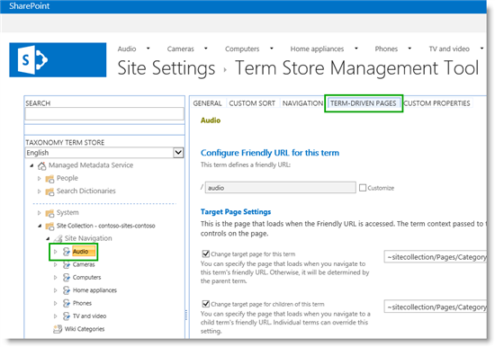
  
In the **Target Page Settings** and **Catalog Item Page Settings** sections, there are four references pointing to two pages:  *Category-Electronics.aspx*  and  *CatalogItem-Electronics.aspx*  . 
    
     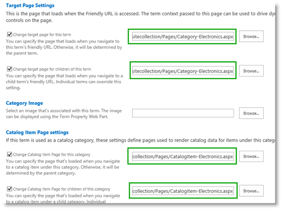
  
Remember [Stage 5: Connect your publishing site to a catalog in SharePoint Server](stage-5-connect-your-publishing-site-to-a-catalog.md), when we connected our publishing site to our catalog? In that stage, a category page and a catalog item page were automatically created and added to the **Pages** library. What we didn't cover in Stage 5 is that references to these pages were added to this term set, as shown in the screen shot above. In the next steps we'll change these references so they point to our newly created category page and catalog item page. 
    
3. In the **Target page settings** section, do the following: 
    
1. In the **Change target page for this term** section, click **Browse**. 
    
2. In the **Select an Asset** dialog, click **Pages**, and then select the category page that you want to apply. In our scenario, this is **ContosoCategoryPage.aspx**. 
    
     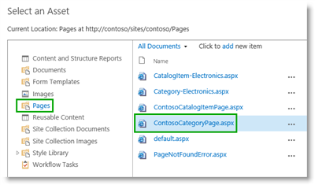
  
By setting this reference, when visitors browse to "Audio" on the Contoso site, the page  *ContosoCategoryPage.aspx*  will be used to display information. It is important to understand that visitors won't see the page name  *ContosoCategoryPage.aspx*  , but instead a friendly URL. More information about friendly URLs will be provided in [About the friendly URL for category pages](stage-8-assign-a-category-page-and-a-catalog-item-page-to-a-term.md#BKMK_AboutTheFriendlyURLForCategoryPages), later in this article.
    
3. In the **Change target page for children of this term** section, repeat steps 3a and 3b. By setting this reference, when visitors browse to a child term of "Audio," for example "Speakers," the page  *ContosoCategoryPage.aspx*  is used to display information. 
    
     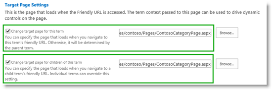
  
4. In the **Catalog Item Page Settings** section, do the following: 
    
1. In the **Change Catalog Item Page for this category** section, click **Browse**. 
    
2. In the **Select an Asset** dialog, click **Pages**, and then select the category page that you want to apply. In our scenario, this is **ContosoCatalogItemPage.aspx**. 
    
     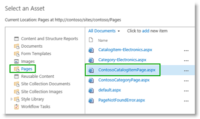
  
By setting this reference, when visitors browse to an item that is tagged with the term "Audio," the page  *ContosoCatalogItemPage.aspx*  will be used to display information. 
    
3. In the section **Change Catalog Item Page for children of this term**, repeat steps 4a and 4b. By setting this reference, when visitors browse to an item that is tagged with a child term of "Audio," for example "Speakers," the page  *ContosoCatalogItemPage.aspx*  will be used to display information. 
    
     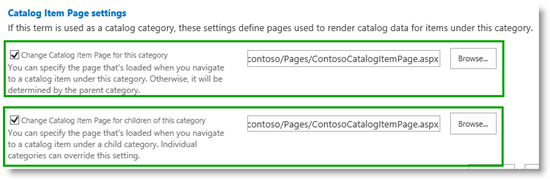
  
5. Repeat steps 2 - 4 for all terms to which you want to assign a category page and an item details page. In our scenario, we'll do this to all terms within the **Site Navigation** term set. 
    
     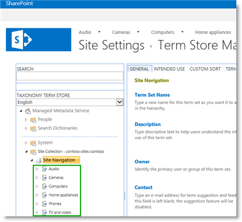
  
After applying the new category page and catalog item page to all terms, you can browse to a category page to verify that the correct page is being used. In our scenario, when we browse to "Audio," there's not much to see.
    
     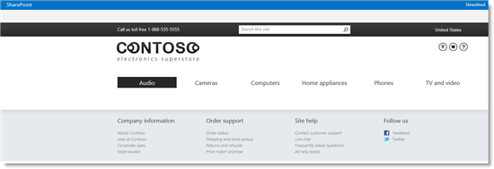
  
This is good, because when we created a category page in [Stage 7: Upload page layouts and create new pages in a publishing site in SharePoint Server](stage-7-upload-page-layouts-and-create-new-pages-in-a-publishing-site.md), we created an empty page. To display content, we'll have to add Search Web Parts. We'll explain how to do this in the next article.
    
### About the friendly URL for category pages

When you use managed navigation, the friendly URLs that visitors see are composed of the terms from the term set that drives site navigation. To see how friendly URLs are composed, on the **Term Store Management Tool** page, click a term, for example "Audio," and then click the **TERM-DRIVEN PAGES** tab. 
  
The friendly URL is displayed in the **Configure Friendly URL for this term** section. 
  
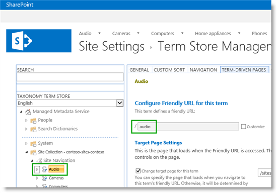
  
Similarly, when you click on "Car audio," you'll see the friendly URL for this page.
  
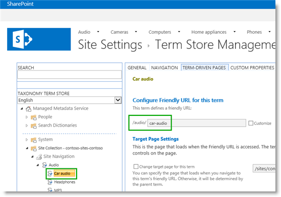
  
If you want to change a friendly URL, for example from "audio" to "audio players," you should change the actual term itself. That way, the friendly URL and the term that is used to tag your content will remain consistent.
  
If this was somewhat confusing, don't worry. We'll explain more about how Search Web Parts work in the next article..
  
### Next article in this series

[Stage 9: Configure the query in a Content Search Web Part on a category page in SharePoint Server](stage-9-configure-the-query-in-a-content-search-web-part-on-a-category-page.md)
  
## See also

#### Concepts

[Overview of managed navigation in SharePoint Server](overview-of-managed-navigation.md)
  
[Assign a category page and a catalog item page to a term in SharePoint Server](assign-a-category-page-and-a-catalog-item-page-to-a-term.md)
#### Other Resources

[Plan to show catalog content in SharePoint publishing sites](plan-sharepoint-publishing-sites-for-cross-site-publishing.md#BKMK_DisplayCatalogContent)

