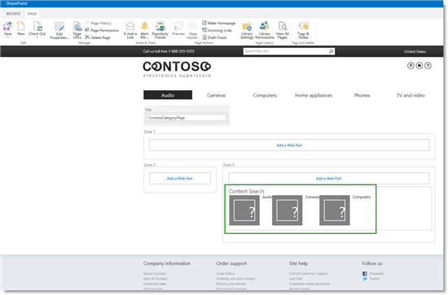
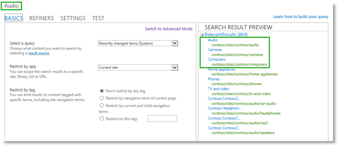
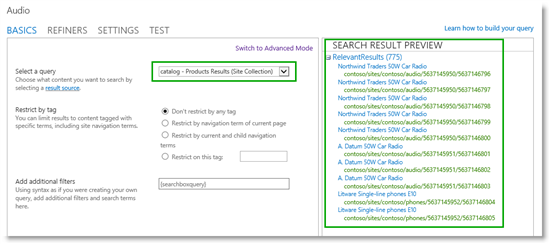
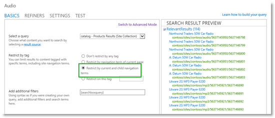
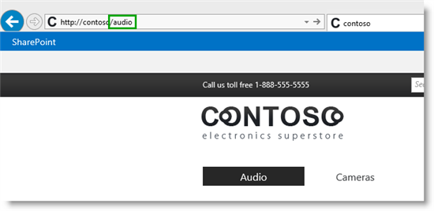
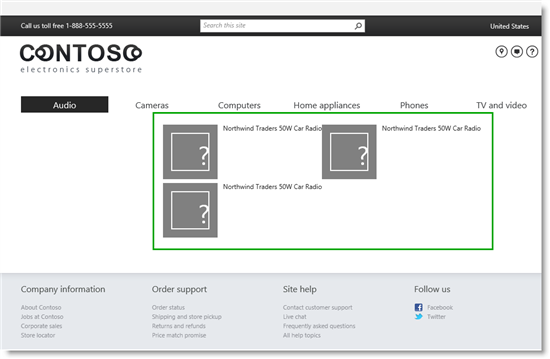
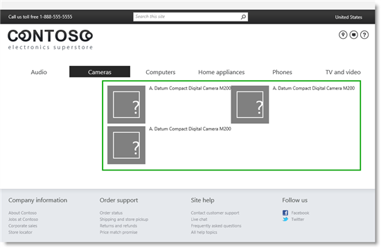
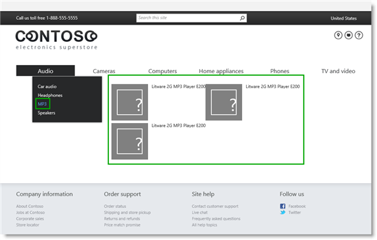
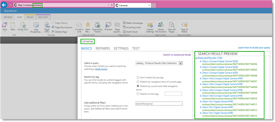
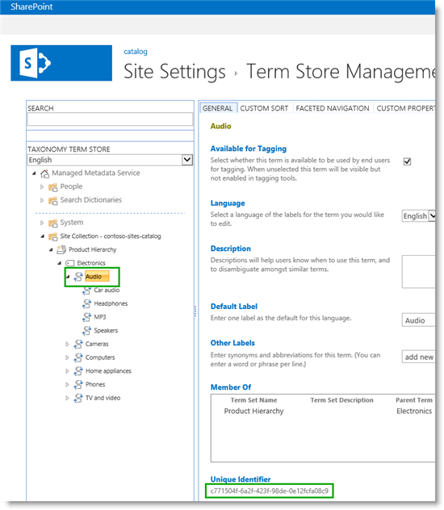

# Stage 9: Configure the query in a Content Search Web Part on a category page in SharePoint Server

[!INCLUDE[appliesto-2013-2016-2019-xxx-md](../includes/appliesto-2013-2016-2019-xxx-md.md)]
  
> [!NOTE]
> Most of the features described in this series are available only for private sites collections in SharePoint Online. 
  
## Quick Overview

Previous stages of this series explained the following:
  
- [Stage 7: Upload page layouts and create new pages in a publishing site in SharePoint Server](stage-7-upload-page-layouts-and-create-new-pages-in-a-publishing-site.md) explained how to create a category page and a catalog item page. 
    
- [Stage 8: Assign a category page and a catalog item page to a term in SharePoint Server](stage-8-assign-a-category-page-and-a-catalog-item-page-to-a-term.md) explained how to assign the two pages that were created in Stage 7 to terms within the **Site Navigation** term set. 
    
When we browsed to the "Audio" category, we couldn't see any content. That was because when we created the category page, we didn't add any Web Parts.
  
In this stage, we'll start to merge pieces of what we have done in previous stages. In this article, you'll learn:
  
- [About the Content Search Web Part](stage-9-configure-the-query-in-a-content-search-web-part-on-a-category-page.md#BKMK_AboutTheContentSearchWebPart)
    
- [How to add a Content Search Web Part to a page](stage-9-configure-the-query-in-a-content-search-web-part-on-a-category-page.md#BKMK_HowToAddAContentSearchWebPartToAPage)
    
- [How to configure a query in a Content Search Web Part on a category page](stage-9-configure-the-query-in-a-content-search-web-part-on-a-category-page.md#BKMK_HowToConfigureAQueryInAContentSearchWebPartOnACategoryPage)
    
- [About the query configuration](stage-9-configure-the-query-in-a-content-search-web-part-on-a-category-page.md#BKMK_AboutTheQueryConfiguration)
    
- [How to view details of the query configuration](stage-9-configure-the-query-in-a-content-search-web-part-on-a-category-page.md#BKMK_HowToViewDetailsOfTheQueryConfiguration)
    
## Start stage 9

To display content on our Contoso website, we'll use the Content Search Web Part.
  
### About the Content Search Web Part

The Content Search Web Part (CSWP) uses, as its name implies, search technology.
  
Most of us use search technology daily. Think about how many times a day that you enter query terms in a search box, for example on **bing.com**, how after you press **Enter**, you scan search results that are almost immediately displayed on a search results page. 
  
When visitors browse to a page that contains a CSWP, they're probably not aware of this, but they're actually issuing a query. But, the thing that differs with CSWPs is that instead of entering query terms in a search box, the query is contained within the Web Part itself. This means that when a visitor browses to a page that contains a CSWP, this query is issued automatically.
  
Another thing that differs from the bing.com search scenario is that search results aren't displayed on a separate search results page, but within the CSWP. In most cases, visitors won't even know that search technology is being used to display the content they're viewing. To them, it will behave like any other webpage.
  
### How to add a Content Search Web Part to a page

Browse to the page where you want to add the CSWP. In our scenario, let's browse to "Audio."
  
1. Click the **Settings** menu, and then click **Edit Page**. 
    
2. In the Web Part Zone where you want to add the Web Part, click **Add a Web Part**. 
    
3. In the **Categories** list, click **Content Rollup**. 
    
4. In the **Parts** list, click **Content Search**, and then click **Add**. 
    
In our scenario, we'll add a CSWP to Zone 3.
  

  
The CSWP contains a default query. Therefore, it already displays some content (Audio, Cameras and Computers). But it does not display the content we want to display. To make the Web Part display Contoso catalog content, we must configure the query in the Web Part.
  
### How to configure a query in a Content Search Web Part on a category page

1. In the Web Part, click the **Web Part Menu**, and then click **Edit Web Part**. 
    
     
  
2. In the Web Part tool pane, click **Change query**. This opens a dialog box. 
    
     
  
In the dialog box, notice that "Audio" is shown in the upper-left corner. This is the category we navigated to, and from which we selected to edit the page. Also notice that in the **RelevantResults** section, the top three results,  *Audio*  ,  *Cameras*  , and  *Computers*  , are listed. These are the same three results that were shown in the Web Part when we added it. 
    
     
  
3. From the **Select a query** list, select your catalog result source. In our scenario, it's  *catalog - Products Results*  . 
    
     
  
A result source narrows the scope from which search results can be retrieved. In [Stage 5: Connect your publishing site to a catalog in SharePoint Server](stage-5-connect-your-publishing-site-to-a-catalog.md), when we connected our publishing site to our catalog, SharePoint Server 2016 automatically created a result source for our catalog. In our scenario, this result source is named  *catalog - Products Results*  . By selecting this result source, only search results from our catalog are retrieved. 
    
    For more information about result sources, see [Plan result sources and query rules](plan-search-for-sharepoint-cross-site-publishing-sites.md#BKMK_PlanResultSourcesAndQueryRules).
    
    When we selected this result source, the number of **RelevantResults** changed from 864 to 775. Because 775 is the number of items we have in our catalog, selecting this result source confirms that we're on the right way to configuring the query. 
    
4. In the **Restrict by tag** section, select **Restrict by current and child navigation terms**. 
    
     
  
A key phrase in this selection is  *navigation terms*  . This refers to the category in the site navigation the visitor is browsing. In this particular case, the visitor is browsing the "Audio" category. 
    
     
  
Remember, one of the first things we did in this series was import catalog content into a list. We also imported terms into the term set **Product Hierarchy**. In [Stage 2: Import list content into the Product Catalog Site Collection in SharePoint Server](stage-2-import-list-content-into-the-product-catalog-site-collection.md), we associated each item in the list with a term from the term set. In [Stage 5: Connect your publishing site to a catalog in SharePoint Server](stage-5-connect-your-publishing-site-to-a-catalog.md), we specified that the full site navigation should contain terms from the **Product Hierarchy** term set. Because we have used  *the same term set*  to tag the items in our catalog and to build our site navigation, we can use a term from our site navigation to search for catalog items that are tagged with that same term. 
    
    Our query in the CSWP will therefore display search results for items that are in the  *catalog - Products Results result source*  , and are tagged with either "Audio", or any child of "Audio", for example "MP3 players" or "Speakers". 
    
    This selection reduced the relevant search results to 114, which is the number of items in our catalog that belong to the "Audio" group.
    
    Another key phrase from the selection **Restrict by current and child navigation** terms is  *current*  . More information about the importance of this phrase is provided in [About the query configuration](stage-9-configure-the-query-in-a-content-search-web-part-on-a-category-page.md#BKMK_AboutTheQueryConfiguration) in the next section 
    
5. Click **OK**, and save the page. 
    
    On the "Audio" category, the search results have changed to show different results.
    
     
  
If we browse to the "Cameras" category, we'll see three other search results displayed.
    
     
  
If we browse to the "MP3" category, we'll see three other different search results are displayed.
    
     
  
If you are now thinking "OK, I understand how we got the correct search results for the "Audio" category, because that is the category we clicked, and where we changed the query in the Web Part. But why do we see different search results when we browse the catalog? And shouldn't we change the query for all the other categories also?"
  
Let's take a closer look at what's going on.
  
### About the query configuration

We only had to configure one query because the same page is used for all categories. Remember, in [Stage 8: Assign a category page and a catalog item page to a term in SharePoint Server](stage-8-assign-a-category-page-and-a-catalog-item-page-to-a-term.md), when we assigned the page  *ContosoCategoryPage.aspx*  to all terms within the **Site Navigation** term set. We assigned this page to  *all terms*  . Therefore, even though we edited this page in the "Audio" category, we could have edited it in any other category, and achieved the same result. 
  
We only had to configure the query one time, because the query issued from the Web Part differs depending on which category we browse to. Remember that the CSWP contains a query that is automatically issued when someone browses to a page that contains a CSWP, and that search results are displayed in the Web Part. Also, remember that we selected **Restrict by current and child navigation terms** when we configured the query in the Web Part. The word "current" is very important here, because it means that the query issued by the CSWP will change depending on the category the visitor is currently browsing. If you edit the Web Part from another category, you can see that the Web Part has changed. 
  
For example, if we browse to the "Cameras" category and take a closer look at the CSWP, we see that:
  
- "cameras" is included in the URL.
    
- "Cameras" is in the upper-right corner of the query configuration.
    
- The number of **RelevantResults** has changed to 118, which is the number of items in the catalog that belong to the "Cameras" group. 
    

  
So, when we browse to the "Audio" category, the CSWP issues a query for catalog items that are tagged with "Audio" or any child of "Audio", and displays search results. When we browse to the "Cameras" category, the same CSWP (remember, we only used one page for all categories) issues a different query, this time for catalog items that are tagged with "Cameras" or any child of "Cameras", therefore different results are displayed.
  
### How to view details of the query configuration

To view details of the query configuration, click on the **TEST** tab. The actual query issued by the CSWP, is shown in the **Query text** field. 
  

  
In our scenario, the query that is issued by the CSWP from the "Audio" category looks as follows:
  
 `(contentclass:sts_listitem OR IsDocument:True) SPSiteUrl:http://contoso/sites/catalog ListId:3a3f66cd-9741-4f15-b53a-b4b23c3187ea owstaxidProductCatalogItemCategory:#c771504f-6a2f-423f-98de-0e12fcfa08c9`
  
If this doesn't make any sense now, don't worry! There is logic to it, and we'll break it down to make it clearer.
  
-  `(contentclass:sts_listitem OR IsDocument:True) SPSiteUrl:http://contoso/sites/catalog ListId:3a3f66cd-9741-4f15-b53a-b4b23c3187ea` is our catalog result source,  *catalog - Products Results* 
    
-  `owstaxidProductCatalogItemCategory`is the managed property for the site column **Item Category** (remember from [Stage 2: Import list content into the Product Catalog Site Collection in SharePoint Server](stage-2-import-list-content-into-the-product-catalog-site-collection.md) how our **Product Hierarchy** term set is tied to the Managed Metadata site column **Item Category** ). 
    
-  `#c771504f-6a2f-423f-98de-0e12fcfa08c9`is the GUID of the term in the current navigation, in this case "Audio."
    
In our Product catalog site collection, in the **Product Hierarchy** term set, you can see that the GUID represents the term **Audio**. 
  

  
So now we have configured the query for the CSWP on our category page. We still have to do some configuration to make it display more than three search results, and also give it a "Contoso look." This will be explained later in this series.
  
The next step is to add a CSWP to our catalog item page
  
#### Next article in this series

[Stage 10: Configure the query in a Content Search Web Part on a catalog item page in SharePoint Server](stage-10-configure-the-query-in-a-content-search-web-part-on-a-catalog-item-page.md)
  
## See also

#### Concepts

[Configure Search Web Parts in SharePoint Server](configure-search-web-parts.md)

