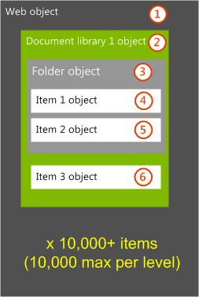
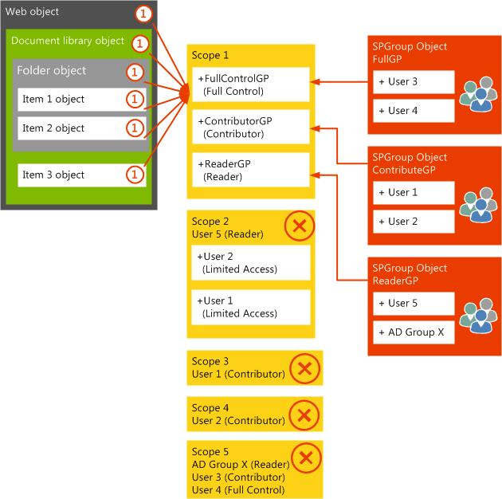
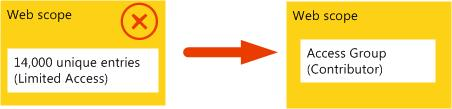
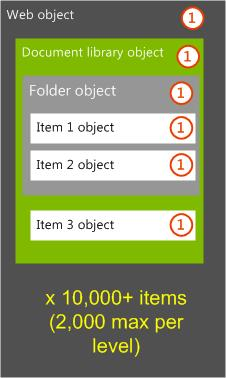
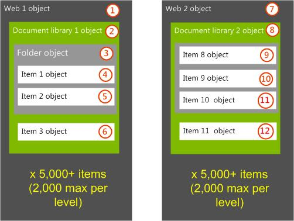
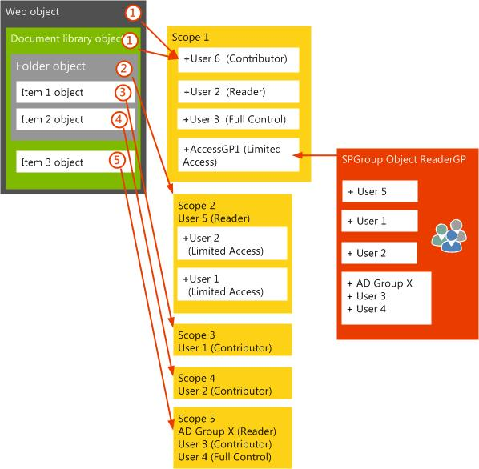

# Troubleshoot common fine-grained permissions issues for SharePoint Server

[!INCLUDE[appliesto-2013-2016-2019-xxx-md](../includes/appliesto-2013-2016-2019-xxx-md.md)]
  
After you implement fine-grained permission, a SharePoint environment could experience security or performance issues. Review the following information to help resolve issues that might be related to fine-grained permissions.
  
## Recommended issues and resolutions for common fine-grained permissions performance issues

The following issues can help reduce the effect of performance issues that are related to the extensive use of fine-grained permissions. Each of the following issues covers changes to the environment security, object hierarchy or custom code that is contributing to the performance issues that are related to fine-grained permissions. Each issue starts with the following example environment where a single web contains multiple document libraries, each with many uniquely-permissioned child objects.
  

  
### Issue 1: Remove fine-grained permissions and use security enforcement only at web level

To re-architect the environment so that it no longer requires fine-grained permissions, an environment cleanup process can be implemented, and then the number of scoped items can be adjusted to improve the scalability of the environment over the longer term. The following recommendations describe the environment cleanup and architectural security changes that are required to achieve this solution.
  
#### Environmental security cleanup

When a user is removed from the web-level scope, the internal Object Model must remove the user from every scope below the web level. Removing individual users to clean up existing permissions is a time-consuming process. Instead, first remove each unique item-level scope so that the item is set to inherit permissions from its parent object. This will take less time than trying to remove users first, because it has to act on only a single scope for the item.
  
> [!IMPORTANT]
> If the current web is not at the root of the site collection, and if the web is then set to inherit permissions from its parent web, all the unique scopes under it will be removed, and all the Limited Access memberships will be overwritten at the same time in a single SQL Server round trip. 
  

  
After all item-level scopes are removed, individual scope memberships at the web-level scope can be replaced with one or more group memberships to allow access.
  

  
#### Environmental security architecture redesign

After the existing fine-grained permissions and scopes are removed, the long-term architecture plan should be to maintain a unique scope only at the web level. The following diagram shows how this might be structured so that only the web-level scope remains. The core requirement in the architecture is not to have too many items at the same level of hierarchy in the document libraries, because the time that is required to process items in the views increases.
  
 **Resolution:**
  
The maximum count of items or folders at any level in the hierarchy should be about 2,000 items.
  

  
If additional changes are needed to the architecture, consider moving document libraries to different webs or site collections. The number of document libraries could also be changed to more closely support business needs and scaling recommendations that are based on the taxonomy or audience of the stored content.
  
### Issue 2: Use fine-grained permissions by hierarchical structure changes

To re-architect the environment so that it still uses fine-grained permissions, but without causing too many updates to or sizing of a single web scope, consider moving differently secured document libraries to different webs.
  
#### Environment hierarchy redesign

In the following diagram, the physical architecture was changed so that each document library is in a uniquely-permissioned web. Additionally, when item-level fine-grained permissions must be preserved, as a best practice the cumulative number of security principals who will be granted access should be limited to approximately 2,000, although this is not a fixed limit. Therefore, the effective membership of each web that includes all Limited Access members users, should be no more than approximately 2,000 users. This keeps each web-level scope from growing too large.
  

  
The number of uniquely-scoped children is not a significant issue, and can scale to large numbers. However, the number of principles that will be added as limited access up the chain of scopes to the first uniquely permissioned web will be a limiting factor. 
  
Lastly, although not specifically an issue about fine-grained permissions, the folder structure should guarantee that no single hierarchical level of the document library ever exceeds about 2,000 items. This limit can help guarantee good performance of views requested by users.
  
### Issue 3: Use fine-grained permissions by scope structure changes

To re-architect the environment so that it still uses fine-grained permissions, but without causing too many updates to or sizing of a single web scope, consider using a different process of securing items. This is mainly applicable if the cause of the large number of unique scopes was an automated process such as an event handler or workflow that dynamically changed object permissions. The recommendation in this case is to make a code change to whatever process was creating the unique security scopes.
  
#### Dynamic security changing code redesign

In the following diagram, the scope architecture was changed so that scope membership does not cause ACL recalculation at the parent document library and web. As mentioned earlier, the effective membership of the web that includes all Limited Access members, should be no more than approximately 2,000 to keep the web-level scope from growing too large. In this case, by implementing a new SharePoint group to hold all members who should have Limited Access rights, the scope won't grow too large. When users are added to individual scopes under the web level by using the SharePoint Server **SPRoleAssignmentCollection.AddToCurrentScopeOnly** method, they can also be added, by additional code, to the new group that was established as having Limited Access rights at the web and document library level. 
  

  
 **Resolution:**
  
When item-level fine-grained permissions must be preserved, the cumulative number of security principals who will be granted access should be limited to about 2,000, although this is not a fixed limit. When the number of security principals increases it takes longer to recalculate the binary ACL. If the membership of a scope is changed, the binary ACL must be recalculated. The addition of users at a child item unique scope will cause parent scopes to be updated with the new Limited Access members, even if this ultimately results in no change to the parent scope membership. When this occurs, the binary ACL for the parent scopes must also be recalculated.
  
As in the previous solution, the number of uniquely scoped children is not a significant issue, and can scale to large numbers. The number of principles that will be added as limited access up the chain of scopes to the first uniquely-permissioned web will be a limiting factor.
  
## See also

#### Other Resources
  
[Best practices for using fine-grained permissions in SharePoint Server](/sharepoint/sites/best-practices-for-using-fine-grained-permissions-in-sharepoint-server)

