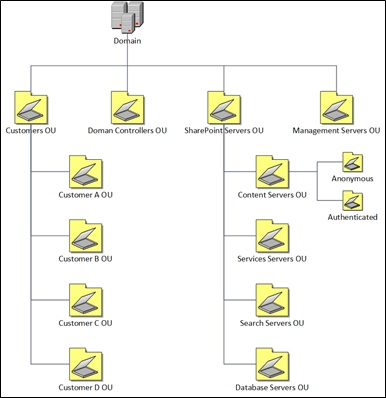
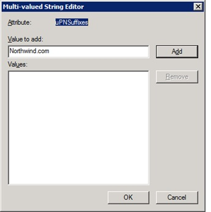
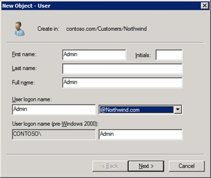
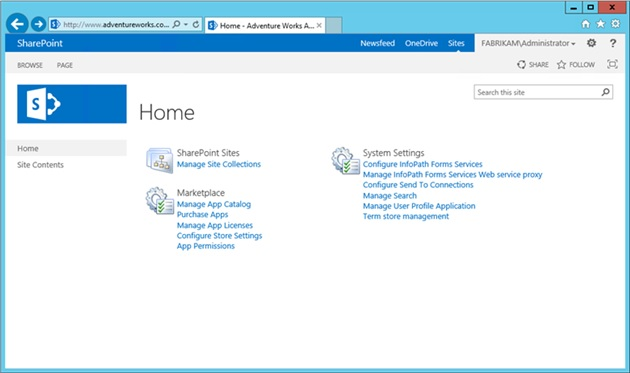
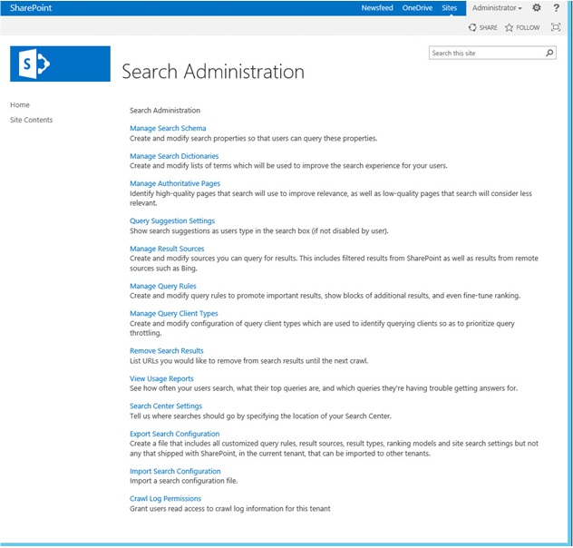
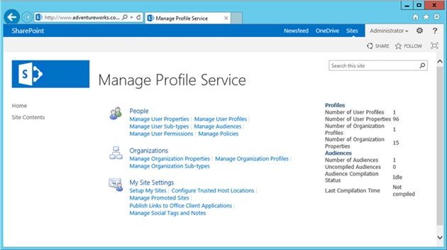
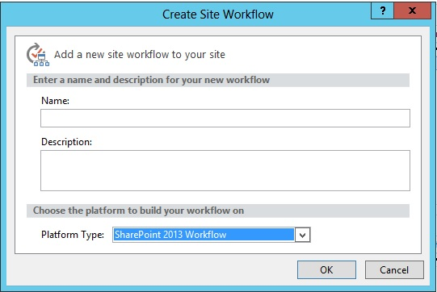

# Understanding multi-tenancy in SharePoint Server 2013

[!INCLUDE[appliesto-2013-xxx-xxx-xxx-md](../includes/appliesto-2013-xxx-xxx-xxx-md.md)]
  
This article describes the components and services related to multi-tenancy in SharePoint Server 2013 and also provides architectural, security, operational, and management guidance to help service providers in gaining an understanding of multi-tenancy in SharePoint Server 2013 for planning, designing, building, and managing a multi-tenant SharePoint Server 2013 hosting platform.
  
> [!NOTE]
> OneDrive for Business with Yammer integration doesn't work for multi-tenancy or partitioned service applications for on-premises deployments. 
  
## Before you begin
<a name="begin"> </a>

## Introduction to multi-tenancy in SharePoint Server 2013
<a name="begin"> </a>

### What is multi-tenancy?

Before we introduce the multi-tenancy functionality in SharePoint Server 2013, you should understand the general concept of multi-tenancy and its related characteristics; doing this will help you make the appropriate decisions for planning, designing, operating, and managing your multi-tenant SharePoint Server 2013 hosting platform.
  
Multi-tenancy refers to the ability to manage and partition data of sites and otherwise shared services or software in order to accommodate multiple tenants. This is in contrast to running multiple instances of a service, or setting up separate hardware. In Microsoft products and technologies, multi-tenancy of services creates a hosting environment wherein server farm resources are maximized. Before learning about hosting environments, it is important to understand the services architecture.
  
### Key components and services for enabling multi-tenancy in SharePoint Server 2013

This section describes key components and services for enabling multi-tenancy in SharePoint Server 2013.
  
#### Web application

A SharePoint 2013 web application is composed of an Internet Information Services (IIS) web site that acts as a logical unit of management and security for the site collections that you create. Each web application is represented by a different IIS website that uses a unique or shared application pool. When you create a web application, you also create a content database and define the authentication method that is used to connect to the database(s).
  
#### Host-named site collection

Host-named site collections enable you to assign a unique DNS name to site collections. For example, you can address them as http://TeamA.contoso.com and http://TeamB.fabrikam.com. This lets you deploy many sites that use unique DNS names in the same web application. It also enables service providers to scale an environment to many customers. If you do not use host-named site collections, the SharePoint web application will contain many path-based site collections that share the same host name (DNS name). For example, Team A would have a site collection at http://contoso.com/sites/teamA and Team B would have a site collection at http://fabrikam.com/sites/teamB.
  
Host Named Site Collections are fundamentally the only way to scale for multi-tenancy environments, and provide ultimate flexibility with respect to the URL namespace used. If using path-based sites with multi-tenancy the software boundary for managed paths will be reached extremely quickly.
  
For additional information about how to plan for host-named site collections for SharePoint Server 2013, see [Host-named site collection architecture and deployment (SharePoint 2013)](host-named-site-collection-architecture-and-deployment.md).
  
#### Service groups (proxy groups)

A  *service group*  , also known as  *proxy group*  , is a group of service applications that are selected for use by a web application. 
  
By default, all service applications are included in the default group unless another group is specified at the time that the service application is created. You can add and remove service applications from the default group at any time. When you create a web application, you can select the default group, or you can create a custom group of services. You create a custom group of services by selecting only the service applications that you want the web application to use.
  
Custom groups are not reusable across multiple web applications. Each time that you select "custom" when you create a web application, you are selecting services only for the web application that you are creating.
  
#### Service proxy

When you create a service application, a proxy for the service application is created at the same time. A proxy is a virtual entity that connects web applications to service applications. Proxies are listed on the Manage Service Applications page in the SharePoint Central Administration website.
  
Proxies are automatically created if you use Central Administration or the SharePoint 2016 Products Configuration Wizard to create service applications. If you use Microsoft PowerShell to create service applications, proxies are not always automatically created and must be created by using Microsoft PowerShell.
  
Some proxies might include settings that can be changed. For example, if a web application is connected to multiple instances of the managed metadata service, you must indicate the proxies that are connected to the primary service application that hosts the corporate taxonomy. Generally speaking these settings move to tenant level configuration when using multi-tenancy.
  
#### Service applications

A service application is a logical representation of a given service, and its security and management configuration which defines its operational behavior. Examples include Managed Metadata and User Profiles. Different service applications are implemented in different ways and this will influence the design of multi-tenant solutions.
  
To determine the list of service applications that is available in SharePoint Server 2013 and their availability across SharePoint editions with multi-tenancy feature, see the **Services and Functionalities** section in [General guidance for hosters in SharePoint Server 2013](general-guidance-for-hosters-in-sharepoint-server-2013.md)
  
#### Feature packs and licensing

A feature pack in SharePoint is a way to group a set of site-scoped or web-scoped features together. Once the SharePoint features are grouped, they can be associated with a site subscription (i.e., tenant). All site collections in that site subscription (tenant) can use only the site-scoped or web-scoped features that are part of the feature pack. This capability enables service providers to provide tiered service offerings based on different sets of features.
  
In SharePoint Server 2013, a new feature has been added for assigning different SharePoint licenses on a per-user basis. It also turns on SharePoint license checks at run time. This feature provides additional flexibility for a service provider to build different service offerings throughout a simplified deployment model. In previous SharePoint versions, service providers had to build different SharePoint deployment models for each SharePoint version. For additional information about SharePoint features, see the **SharePoint feature availability across on-premises solutions** section of the following article: [SharePoint Online Service Description](/office365/servicedescriptions/sharepoint-online-service-description/sharepoint-online-service-description).
  
#### Information Rights Management

Information Rights Management integration in SharePoint Server 2013 adds support for multi-tenancy, which enables the ability to manage tenant-level Information Rights Management settings.
  
## Architecture design considerations
<a name="begin"> </a>

This section describes various considerations for architecting a multi-tenancy SharePoint Server 2013 environment. As described earlier in the document, multi-tenancy brings some unique characteristics to consider when architecting and designing your SharePoint Server 2013 environment. You have to weigh those factors based on your requirements to make the appropriate decisions.
  
### Understand boundaries and limits in SharePoint Server 2013

Understanding the software boundaries and limits of SharePoint Server 2013 will help you make the right decisions for selecting the appropriate architecture for a multi-tenancy SharePoint environment. For additional information about key boundaries and limits for a content database and site collection as they apply to a multi-tenancy environment of SharePoint Server 2013, see [Software boundaries and limits for SharePoint Server 2016](/SharePoint/install/software-boundaries-and-limits#ContentDB) and [Software boundaries and limits for SharePoint Server 2016](/SharePoint/install/software-boundaries-and-limits#SiteCollection).
  
#### Shared farm vs. dedicated farm

Using a shared farm to host multi-tenant site collections on a single web application provides better scalability compared to using a dedicated web application per tenant.
  
Use a dedicated web application and application pool per customer only if you need to satisfy requirements for isolation.
  
Do not allow full-trust code to be deployed to sites.
  
Do not allow customizations that affect shared resources, such as the web.config file.
  
Use host-named site collections to create multiple, root-level site collections (domain-named sites) throughout a web application.
  
#### One web application vs. multiple web applications

Use dedicated web applications for tenants that require customizations affecting resources that are shared across a web application, such as the web.config file.
  
When combining multiple tenants in a single farm, use a dedicated SharePoint web application for all authenticated content and a separate dedicated web application for all anonymous content. This will require two separate subscriptions IDs for tenants with both types of content. This will also simplify licensing.
  
Some SharePoint features are bound to web application level, such as the Self-Service Site Collection Creation setting. After it's turned on, all tenants under the same web application will be able to create site collections.
  
#### Single farm environment design

In a multi-organization hosting environment in which tenant data and administration are isolated, the configuration of partitioned and shared services is very important. This example provides a practical implementation of partitioned services and also provides recommendations about how to deploy customer sites.
  
This example details the following ways in which customer sites can be deployed in a farm:
  
- Dedicated application pool and web application
    
- Shared application pool and dedicated web application
    
- Shared web application
    
  - Authenticated sites
    
  - Unauthenticated sites
    
Use a dedicated application pool per customer only if you need to satisfy requirements for isolation. Use dedicated web applications for tenants that require customizations affecting resources that are shared across a web application, such as the web.config file.
  
When combining multiple tenants in a single web application, use a dedicated web application for all authenticated content and a separate dedicated web application for all anonymous content. This will require two separate subscriptions IDs for tenants with both types of content. This will also simplify licensing.
  
Do not allow full-trust code to be deployed to sites.
  
Do not allow customizations that affect shared resources, such as the web.config file.
  
In the following example (authenticated sites), a different host-named site collection is used for each company. Company C includes two different host-named site collections. Beneath each top-level host-named site collection, a managed path is used to create a second tier of top-level site collections for sites such as team sites, My Sites, published intranet content, or separate divisional sites.
  
#### Tiered environment design

As described earlier, there are many things to consider when you plan your multi-tenant SharePoint Server 2013 hosting platform, among these factors are cost, simplified management, resource isolation, performance, and scalability.
  
As your customer base grows, you may find it difficult to meet all of the requirements of all of your customers in a single environment. At that point, certain tradeoffs would have to occur when you seek to balance those factors.
  
In a case such as this, an alternative that you might want to consider is a tiered-environment design in which multiple SharePoint environments meet the various needs of your customers. Each environment would focus on different aspects of your service offerings, such as low cost, high density, higher resource isolation, and better quality of services (QoS) with higher costs, and so on.
  
This tiered-environment design approach could provide different service level agreements to your customers. As a result, you could serve a broader range of customers, simplify your management and operations, lower your management costs, and increase your profit margins.
  
## Security considerations
<a name="begin"> </a>

This section discusses various security considerations for planning and designing a multi-tenant SharePoint Server 2013 hosting platform. From this point forward, any section, such as the Organization Unit (OU) section, that talks about people picker configuration only works without additional customization with Windows authentication.
  
SharePoint Server 2013 supports many authentication methods and authentication providers for the following authentication types:
  
- Windows authentication
    
- Forms-based authentication
    
- SAML token-based authentication
    
The Windows authentication type takes advantage of your existing Windows authentication provider and the authentication protocols that a Windows domain environment uses to validate the credentials of connecting clients. Windows authentication methods, which are used by both claims-based authentication and classic mode, include the following:
  
- NTLM
    
- Kerberos
    
- Digest
    
- Basic
    
Forms-based authentication is a claims-based identity management system that is based on ASP.NET membership and role provider authentication. Forms-based authentication can be used against credentials that are stored in an authentication provider, such as the following:
  
- Active Directory Domain Services (AD DS)
    
- A database such as a SQL Server database
    
- A Lightweight Directory Access Protocol (LDAP) data store such as Novell eDirectory, Novell Directory Services (NDS), or Sun ONE
    
Forms-based authentication validates users based on credentials that users enter into a logon form (typically a webpage). Unauthenticated requests are redirected to a logon page, where a user must provide valid credentials and submit the form. The system issues a cookie for authenticated requests that contains a key for reestablishing the identity for later requests.
  
To use forms-based authentication to authenticate users against an identity management system that is not based on Windows or one that is external, you must register the membership provider and role manager in several web.config files. SharePoint Server 2013 uses the standard ASP.NET role manager interface to collect group information about the current user. Each ASP.NET role is treated as a domain group by the authorization process in SharePoint Server 2013. You register a role manager in a web.config file exactly as you register a membership provider for authentication.
  
If you want to manage membership users or roles from the Central Administration website, you must register the membership provider and the role manager in the web.config file of the Central Administration website. You must also register the membership provider and the role manager in the web.config file of the web application that hosts the content and in the web.config file of the Security Token Service.
  
SAML token-based authentication in SharePoint Server 2013 uses the SAML 1.1 protocol and the WS-Federation Passive Requestor Profile (WS-F PRP). It requires coordination with administrators of a claims-based environment, whether it is your own internal environment or a partner environment. If you use Active Directory Federation Services (AD FS) 2.0, you have a SAML token-based authentication environment.
  
For web applications that use claims-based authentication, People Picker is a control that is available within SharePoint Server 2013. The People Picker control uses claims providers to list, resolve, search, and determine the "friendly" display of users, groups, and claims. For additional information about people picker configuration, see [People Picker and claims providers overview](/SharePoint/administration/people-picker-and-claims-providers-overview).
  
Zones represent different logical paths to gain access to the same sites in a web application. Each web application can include as many as five zones. When you create a web application, Central Administration creates the zone named **Default**. To create additional zones, extend the web application and select one of the remaining zone names: **Intranet**, **Extranet**, **Internet**, or **Custom**.
  
### Organizational Units

Organizational Units (OUs) organize users and computers objects in the Active Directory environment. For purposes of hosting, the Organizational Unit structure could be organized as shown in the following diagram.
  

  
At a minimum you'll want to link a Group Policy to the Domain root, Domain Controllers OU, SharePoint Servers OU, and Customers OU.
  
#### Domain Root

Security that will apply to the whole domain is applied in the Domain Policy. These settings are contained in Group Policy Objects (GPOs) that apply to the whole domain.
  
#### Domain Controllers OU

Domain controllers hold the most sensitive data in your organization, data that controls the security configuration itself. GPOs applied at this level are used to configure and protect the domain controllers in the domain.
  
#### SharePoint Servers OU

The SharePoint servers have a unique role not included in other servers in the directory. Putting these servers in their own OU allow unique policies to be applied to these servers. They can also be segregated from other servers in the directory. Sub OUs can be created when different GPOs have to be created (such as anonymous access content servers versus authenticated content servers).
  
#### Customers OU

This top-level OU lets all user accounts to be segregated from the rest of the directory. The next level of OUs contains the customer OUs. There is one OU for each customer. This lets all user accounts and computer accounts of a customer to be segregated from those of other customers. Furthermore this is the required OU structure to support User Profile Synchronization in multi-tenant deployments.
  
To give the users the impression they are logging into their own custom domain, use the Active Directory Service Interfaces Editor (ADSI Edit) or another AD tool to edit the **uPNSuffixes** attribute of each Customer OU as shown in the following diagram. 
  

  
Once the **uPNSuffixes** attribute of a Customer OU is configured, its value will be available to associate with a user account within that Customer OU, as shown in the following diagram. 
  

  
#### User authentication

User authentication is the validation of a user's identity against an authentication provider, which is a directory or database that contains the user's credentials and can confirm the user submitted them correctly. An example of an authentication provider is Active Directory Domain Services (AD DS). Other common names for an authentication provider are  *user directory*  and  *attribute store*  . 
  
An authentication method is a specific exchange of account credentials and other information that assert a user's identity. The result of the authentication method is proof, typically in the form of a token that contains claims, that an authentication provider has authenticated a user.
  
An authentication type is a specific way of validating credentials against one or more authentication providers, sometimes using an industry standard protocol. An authentication type can use multiple authentication methods.
  
After a user's identity is validated, the authorization process determines the sites, content, and other features the user can access.
  
Planning for user authentication types and methods should determine the following items:
  
- The user authentication types and methods for each web application and zone.
    
- The authentication infrastructure needed to support the determined authentication types and methods.
    
- How to migrate your current web applications and zones that use classic mode authentication to use claims-based authentication.
    
#### Active Directory Federation Services (AD FS)

SharePoint Server 2013 supports claims-based authentication. Active Directory Federation Services (AD FS) can be configured to act as an Identity Provider Security Token Service (IP-STS) for a SharePoint Server 2013 web application. In this configuration, AD FS issues SAML-based security tokens consisting of claims so that client computers can access web applications that use claims-based authentication. You can use an alternative identity provider than AD FS. But it must support the WS-Federation standard. Also using AD FS configuration, custom code is required.
  
For additional information about how to configure SAML-based claims authentication with AD FS for SharePoint Server 2013, see [Configure SAML-based claims authentication with AD FS in SharePoint Server](/sharepoint/security-for-sharepoint-server/security-for-sharepoint-server).
  
## Management and operational considerations
<a name="begin"> </a>

This section discusses various management and operational considerations for a multi-tenant SharePoint Server 2013 environment.
  
### Capacity management

Capacity management is an ongoing process because no implementation remains static about content and usage. You have to plan for growth and change so that the SharePoint Server 2013 environment can continue to deliver an effective business solution. For additional information about capacity management in SharePoint Server 2013, see [Capacity management and sizing overview for SharePoint Server 2013](/previous-versions/office/ff758647(v=office.15)).
  
#### App management

The apps for SharePoint provide a new method to deliver specific information or functionality to a SharePoint site. An app for SharePoint is a small, easy-to-use, stand-alone app that solves a specific end-user or business need. Site owners can discover and download apps for SharePoint from a public SharePoint Store or from their organization's internal App Catalog and install them on their SharePoint sites. These apps for SharePoint integrate the best of the web with SharePoint Server 2013. They do not replace SharePoint features and solution packages, which customize or increase SharePoint sites. Unlike features and solutions, which farm or site collection administrators have to install, apps for SharePoint are stand-alone applications that owners of sites can add to their SharePoint sites. The apps for SharePoint have a simple life-cycle: they can be installed, upgraded, and uninstalled by site owners.
  
The App Management Service in SharePoint Server 2013 is multi-tenancy aware. Most of app configuration and management functionality is exposed through the Tenant Administration site and allows each tenant administrator to configure their individual settings.
  
#### Backup and restore

When performing tenant-agnostic backup and restore operations on a multi-tenant SharePoint Server 2013 hosting platform, you can follow the general guidance for performing backup and restore operations on SharePoint Server 2013 environments, see [Backup and restore in SharePoint Server](/SharePoint/administration/backup-and-recovery-overview).
  
Notice that in SharePoint Server 2013, the Workflow platform is separate from the SharePoint platform. Therefore, backup and restore operations on the Workflow Manager should be coordinated with SharePoint backup and restore operations to ensure both remain in sync with one another. For additional guidance about how to plan backup and restore operations for Workflow Service Manager, see [Disaster Recovery and Scope Restore in Workflow Manager 1.0](/previous-versions/dotnet/workflow-manager/jj730570(v=azure.10))
  
When you perform tenant-specific backup and restore operations on a multi-tenant SharePoint Server 2013 hosting platform, you might have to keep the following tenant-aware components in sync with one another: service applications, workflow, content databases, and site collections.
  
#### Service applications

Service applications that are configured in Partition Mode have one or more associated databases that contain tenant-specific data. While you can perform general backup and restore operations on these service applications at both the application and database levels, limited commands exist to perform tenant-specific detailed backup and restore operations on these service applications or their databases.
  
#### Service application considerations

 **App Management Service**
  
The App Management service is the service application used for managing the app for SharePoint feature that is introduced in SharePoint Server 2013. The apps for SharePoint provide a new method to deliver specific information or functionality to a SharePoint site. An app for SharePoint is a small, easy-to-use, stand-alone app that solves a specific end-user or business need. The App Management Service does not support Partition Mode, however it is natively Site Subscription aware. In the multi-tenant SharePoint environment, most of App Management functionality (that is, Manage App Catalog, Manage App Licenses, App Permissions, and so on.) is obtained by using the Tenant Administration Site.
  
The following diagram shows App Management on the Tenant Administration Site.
  

  
#### Business Data Connectivity service

Once configured in partition mode, all configuration of the Business Data Connectivity service moves to tenant administration. However the Tenant Administration site template does not include the link to this page, which can be added using the customization technique in the Extending the Tenant Administration site template section
  
#### Secure Store service

Once configured in partition mode, the generation of encryption keys remains a farm level configuration performed either via Central Administration or Windows PowerShell. The remainder of the Secure Store service configuration moves to tenant administration. However the Tenant Administration site template does not include the link to this page, which can be added using the customization technique in the Extending the Tenant Administration site template section.
  
#### Managed metadata service

Once configured in partition mode, all configuration moves to tenant administration, and Content Type publishing is enabled by default.
  
#### Search service

Many tenant-specific search configuration related functions are exposed in the Tenant Administration site as shown by the following diagram.
  

  
> [!NOTE]
> Many of the \*.EnterpriseSearch\* Microsoft PowerShell cmdlets are now partition-aware and can be used to automate some configuration and management functions exposed in the Tenant Administration site. 
  
#### User Profile service

A large number of configuration elements move to tenant administration, however much of the configuration for Profile Synchronization remains at a farm level and is applicable to all tenants as illustrated in the following figure.
  

  
#### Workflow

As noted previously, in SharePoint Server 2013 the Workflow platform is separate from the SharePoint platform. The Workflow platform itself uses one or more databases. While you can perform general database-level backup and restore operations on these databases, there exist no commands or utilities to perform tenant-specific backup and restore operations on these Workflow databases.
  
#### Content databases

If a tenant has exclusive use of one or more dedicated content databases, you can perform general database-level backup and restore operations on these databases.
  
> [!NOTE]
> Having an exclusive use of one or more dedicated content databases can't be achieved by using standard product features, for example, self-service site creation. This is an example of where customization is required in order to meet a particular service level offering. 
  
The following Microsoft PowerShell script shows how to perform an initial backup action on a tenant content database.
  
```
Add-PSSnapin microsoft.sharepoint.powershell -ea SilentlyContinue
Backup-SPFarm -Directory "c:\backups\alpha" -Item "HostingFarm_Content_Hosting" -BackupMethod Full
Write-Host "Tenant Content Database Backup Script Completed!"
The following Windows PowerShell script shows how to perform a restore operation on a tenant site collection:
Add-PSSnapin microsoft.sharepoint.powershell -ea SilentlyContinue
Restore-SPFarm -Directory "c:\backups\alpha" -Item "HostingFarm_Content_Hosting" -RestoreMethod Overwrite
Write-Host "Tenant Content Database Restore Script Completed!"

```

#### Site collections

You can perform specific backup and restore operations on a tenant site collection. The tool that you choose to use depends on the size of the site collection itself. Microsoft PowerShell cmdlets are an appropriate choice for small- to medium-sized site collections.
  
The following Microsoft PowerShell script shows how to perform a backup action on a tenant site collection.
  
```
Add-PSSnapin microsoft.sharepoint.powershell -ea SilentlyContinue
Backup-SPSite -Identity "http://alpha.contoso.com" -Path "c:\backups\alpha\root.bak" -UseSqlSnapshot
Write-Host "Tenant Site Collection Backup Script Completed!"
The following script shows how to perform a restore operation on a tenant site collection:
Add-PSSnapin microsoft.sharepoint.powershell -ea SilentlyContinue
Restore-SPSite -Identity "http://alpha.contoso.com" -Path "c:\backups\alpha\root.bak" -DatabaseServer "SQLServer01" -DatabaseName "HostingFarm_Content_Hosting" -HostHeaderWebApplication "http://$ENV:COMPUTERNAME" -GradualDelete - Confirm: $false -Force
Write-Host "Tenant Site Collection Restore Script Completed!"

```

#### Monitoring

There are many tools that allow you to monitor SharePoint Server 2013 and troubleshoot problems. Different tools cover different aspects of the environment, although there may be overlapping areas. Consider which tools can maximize your monitoring benefits. For additional guidance about how to plan monitoring for SharePoint Server 2013, see [Plan for monitoring in SharePoint Server](/SharePoint/administration/monitoring-planning).
  
#### Feature pack management

As described earlier, a feature pack can be used for grouping different features together and associating them with a site subscription (that is, tenant). All site collections in the site subscription (tenant) can use only the site-scoped or web-scoped features that are part of the feature pack. This capability enables service providers to provide tiered service offerings based on different sets of features. Feature packs are created that use the **New-SPSiteSubscriptionFeaturePack** cmdlet to create the feature pack container and the **Add-SPSiteSubscriptionFeaturePackMember** cmdlet to add the individual features to the container. 
  
The following Microsoft PowerShell script shows how to create a tenant-level feature pack representing SharePoint Foundation 2013 features, and stores the Feature Pack ID in the farm's property bag.
  
> [!NOTE]
> The Subscription Settings service application must be present before executing scripts which work with Feature Packs. 
  
```
<#
   Feature Packs.ps1
    Creates a new Feature Pack comprised of SharePoint Foundation 2013 Features
    Adds the Feature Pack ID with a friendly name to the Farm's Property Bag for future use.
    
#>
asnp Microsoft.SharePoint.PowerShell
# Create an alias for Add-SPSiteSubscriptionFeaturePackMember 
Set-Alias AddFeature Add-SPSiteSubscriptionFeaturePackMember
# create a new feature pack, and store it in the Farm's Property Bag
$ffp = New-SPSiteSubscriptionFeaturePack
$farm = Get-SPFarm
$farm.Properties.Add("Foundation_FeaturePack", $ffp.Id);
$farm.Update();
# add foundation features to the feature pack
# web scoped features...
AddFeature -identity $ffp -FeatureDefinition  XmlFormLibrary
AddFeature -identity $ffp -FeatureDefinition  LinksList
AddFeature -identity $ffp -FeatureDefinition  WorkflowProcessList
AddFeature -identity $ffp -FeatureDefinition  GridList
AddFeature -identity $ffp -FeatureDefinition  WorkflowHistoryList
AddFeature -identity $ffp -FeatureDefinition  TeamCollab
AddFeature -identity $ffp -FeatureDefinition  GanttTasksList
AddFeature -identity $ffp -FeatureDefinition  PictureLibrary
AddFeature -identity $ffp -FeatureDefinition  IssuesList
AddFeature -identity $ffp -FeatureDefinition  DiscussionsList
AddFeature -identity $ffp -FeatureDefinition  ContactsList
AddFeature -identity $ffp -FeatureDefinition  ExternalList
AddFeature -identity $ffp -FeatureDefinition  TasksList
AddFeature -identity $ffp -FeatureDefinition  WebPageLibrary
AddFeature -identity $ffp -FeatureDefinition  AnnouncementsList
AddFeature -identity $ffp -FeatureDefinition  WikiPageHomePage
AddFeature -identity $ffp -FeatureDefinition  CustomList
AddFeature -identity $ffp -FeatureDefinition  DocumentLibrary
AddFeature -identity $ffp -FeatureDefinition  SurveysList
AddFeature -identity $ffp -FeatureDefinition  EventsList
AddFeature -identity $ffp -FeatureDefinition  DataSourceLibrary
AddFeature -identity $ffp -FeatureDefinition  NoCodeWorkflowLibrary
AddFeature -identity $ffp -FeatureDefinition  OsrvLinks
AddFeature -identity $ffp -FeatureDefinition  FCGroupsList
AddFeature -identity $ffp -FeatureDefinition  TenantAdminBDC
AddFeature -identity $ffp -FeatureDefinition  OssNavigation
AddFeature -identity $ffp -FeatureDefinition  IMEDicList
AddFeature -identity $ffp -FeatureDefinition  CallTrackList
AddFeature -identity $ffp -FeatureDefinition  SSSvcAdmin
AddFeature -identity $ffp -FeatureDefinition  MpsWebParts
AddFeature -identity $ffp -FeatureDefinition  GBWWebParts
AddFeature -identity $ffp -FeatureDefinition  FacilityList
AddFeature -identity $ffp -FeatureDefinition  ScheduleList
AddFeature -identity $ffp -FeatureDefinition  ObaProfilePages
AddFeature -identity $ffp -FeatureDefinition  GBWProvision
AddFeature -identity $ffp -FeatureDefinition  OSSSearchSearchCenterUrlFeature
AddFeature -identity $ffp -FeatureDefinition  WikiWelcome
AddFeature -identity $ffp -FeatureDefinition  MaintenanceLogs
AddFeature -identity $ffp -FeatureDefinition  TenantAdminLinks
AddFeature -identity $ffp -FeatureDefinition  HolidaysList
AddFeature -identity $ffp -FeatureDefinition  GroupWork
AddFeature -identity $ffp -FeatureDefinition  WhereaboutsList
AddFeature -identity $ffp -FeatureDefinition  CirculationList
AddFeature -identity $ffp -FeatureDefinition  TenantAdminSecureStore
AddFeature -identity $ffp -FeatureDefinition  SearchAdminWebParts
AddFeature -identity $ffp -FeatureDefinition  ObaSimpleSolution
AddFeature -identity $ffp -FeatureDefinition  TimecardList
AddFeature -identity $ffp -FeatureDefinition  WhatsNewList
AddFeature -identity $ffp -FeatureDefinition  MobilityRedirect
AddFeature -identity $ffp -FeatureDefinition  AdminLinks
AddFeature -identity $ffp -FeatureDefinition  SearchCenterLiteFiles
AddFeature -identity $ffp -FeatureDefinition  CorporateCatalog
AddFeature -identity $ffp -FeatureDefinition  BlogContent
AddFeature -identity $ffp -FeatureDefinition  PromotedLinksList
AddFeature -identity $ffp -FeatureDefinition  AppLockdown
AddFeature -identity $ffp -FeatureDefinition  AppRequestsList
AddFeature -identity $ffp -FeatureDefinition  SearchCenterUpgrade
AddFeature -identity $ffp -FeatureDefinition  SearchConfigFields
AddFeature -identity $ffp -FeatureDefinition  PhonePNSubscriber
AddFeature -identity $ffp -FeatureDefinition  SearchConfigContentType
AddFeature -identity $ffp -FeatureDefinition  GettingStarted
AddFeature -identity $ffp -FeatureDefinition  GettingStartedWithAppCatalogSite
AddFeature -identity $ffp -FeatureDefinition  ExternalSubscription
AddFeature -identity $ffp -FeatureDefinition  SearchCenterFiles
AddFeature -identity $ffp -FeatureDefinition  BcsEvents
AddFeature -identity $ffp -FeatureDefinition  OfficeExtensionCatalog
AddFeature -identity $ffp -FeatureDefinition  MDSFeature
AddFeature -identity $ffp -FeatureDefinition  TenantSearchAdmin
AddFeature -identity $ffp -FeatureDefinition  SiteAssets
AddFeature -identity $ffp -FeatureDefinition  PremiumSearchVerticals
AddFeature -identity $ffp -FeatureDefinition  AccessRequests
AddFeature -identity $ffp -FeatureDefinition  SearchConfigList
AddFeature -identity $ffp -FeatureDefinition  ReportAndDataSearch
AddFeature -identity $ffp -FeatureDefinition  MBrowserRedirect
AddFeature -identity $ffp -FeatureDefinition  BlogHomePage
AddFeature -identity $ffp -FeatureDefinition  SearchConfigListTemplate
AddFeature -identity $ffp -FeatureDefinition  SiteNotebook
AddFeature -identity $ffp -FeatureDefinition  HierarchyTasksList
AddFeature -identity $ffp -FeatureDefinition  BlogSiteTemplate
AddFeature -identity $ffp -FeatureDefinition  SearchCenterLiteUpgrade
# Site Scoped features...                                                                                                                                                                                               
AddFeature -identity $ffp -FeatureDefinition  BasicWebParts
AddFeature -identity $ffp -FeatureDefinition  OSSSearchEndUserHelpFeature
AddFeature -identity $ffp -FeatureDefinition  HelpLibrary
AddFeature -identity $ffp -FeatureDefinition  OfficeWebApps
AddFeature -identity $ffp -FeatureDefinition  WordServerViewing
AddFeature -identity $ffp -FeatureDefinition  OnenoteServerViewing
AddFeature -identity $ffp -FeatureDefinition  SiteHelp
AddFeature -identity $ffp -FeatureDefinition  ctypes
AddFeature -identity $ffp -FeatureDefinition  OSSSearchSearchCenterUrlSiteFeature
AddFeature -identity $ffp -FeatureDefinition  OpenInClient
AddFeature -identity $ffp -FeatureDefinition  ExcelServerEdit
AddFeature -identity $ffp -FeatureDefinition  AdminReportCore
AddFeature -identity $ffp -FeatureDefinition  fields
AddFeature -identity $ffp -FeatureDefinition  SearchServerWizardFeature
AddFeature -identity $ffp -FeatureDefinition  OSearchHealthReports
AddFeature -identity $ffp -FeatureDefinition  SearchWebParts
AddFeature -identity $ffp -FeatureDefinition  IssueTrackingWorkflow
AddFeature -identity $ffp -FeatureDefinition  ShareWithEveryone
AddFeature -identity $ffp -FeatureDefinition  MonitoredApps
AddFeature -identity $ffp -FeatureDefinition  SearchTaxonomyRefinementWebParts
AddFeature -identity $ffp -FeatureDefinition  SearchTaxonomyRefinementWebPartsHtml
AddFeature -identity $ffp -FeatureDefinition  SearchMaster
AddFeature -identity $ffp -FeatureDefinition  EnableAppSideLoading
AddFeature -identity $ffp -FeatureDefinition  Developer
AddFeature -identity $ffp -FeatureDefinition  AutohostedAppLicensing
AddFeature -identity $ffp -FeatureDefinition  AppRegistration
Write-Host "Feature Pack Created! " + $ffp.ID
```

#### Licensing management

In SharePoint Server 2013, a new licensing management capability has been added. Farm administrators can now assign licenses to users and enable runtime license checks. By using this new functionality, you can ensure that only users who have the appropriate license can use a specific feature. The functionality also simplifies the deployment model because you no longer have to build separate farms for standard and enterprise editions of SharePoint Server.
  
User licenses are assigned by mapping claims to a known type of license. For example, a claim can be an Active Directory Domain Services (AD DS) Security group. By mapping the **ContosoFinanceDept** security group to an Enterprise license, you effectively assign an Enterprise license to all members of that group. Users who log on to SharePoint Server are assigned claims. SharePoint Server examines the claims of users to determine their license, if a user does not have a license to use a particular feature, SharePoint will block access to that feature at run time. 
  
This SharePoint Server 2013 license implementation is managed by using new Microsoft PowerShell cmdlets. By default, licensing is disabled in SharePoint Server. However administrators can opt to turn it on by using Microsoft PowerShell. For additional information about how to configure licensing in SharePoint Server 2013, see [Configure licensing in SharePoint Server](/SharePoint/administration/monitoring-planning).
  
#### Lifecycle management

Whilst this white paper outlines the key infrastructure considerations when designing a multi-tenant SharePoint 2013 solution and it provides baseline scripts for configuration the overall management of the lifecycle of operations is imperative. For example custom tenant administration, de-provisioning of subscriptions, archiving, user management, self-service password reset and quotas are all common areas which require some combination of additional Windows PowerShell and customization effort in order to deliver a complete service offering. Each service provider will have different requirements in this sphere and it is incredibly important to ensure that these requirements are part of the initial scoping and design work for the infrastructure platform.
  
## Setup and configuration
<a name="begin"> </a>

This section outlines the general steps for setting up and configuring a multi-tenant hosting SharePoint Server 2013 platform.
  
## Acknowledgements
<a name="begin"> </a>

This section provides details and contains PowerShell scripts that demonstrate the creation and configuration of various components. These scripts are generally provided to demonstrate the configuration requirements for multi-tenancy and therefore do not represent the optimal provisioning order, however they can serve as the basis for developing your own customized end-to-end scripting solution.
  
The Microsoft PowerShell scripts contained in the following sub-sections are based (either whole or in part) on the work of **Spencer Harbar** (http://www.harbar.net) and are reproduced here with his gracious consent. Please refer to the following documents for his original work. 
  
- http://www.harbar.net/articles/sp2013mt.aspx
    
- http://gallery.technet.microsoft.com/scriptcenter
    
The PowerShell scripts provided include variables, which should be modified to suit your environment.
  
### Deployment example

This section presents a deployment example which makes use of a single hosting web application using host named site collections and host header managed paths. It is deployed on a single server for the sake of simplicity, this is the intended design model for multi-tenancy with SharePoint 2013 and can be extended to a deployment where service instance roles are articulated across multiple computers. The deployment example uses HTTP for the web application. In a real deployment SSL should be used to protect sign-in, content and the authorization tokens used with SharePoint Apps and other OAuth2 related services such as Workflow Manager.
  
#### DNS configuration

Because host-named site collections will be used for a multi-tenant SharePoint environment, you must configure your DNS (that is, create appropriate DNS records, etc.) accordingly based on your plan. For additional guidance about how to plan host-named site collections for SharePoint Server 2013, see [Host-named site collection architecture and deployment (SharePoint 2013)](host-named-site-collection-architecture-and-deployment.md).
  
If you also plan to support apps for SharePoint, you must also configure DNS to support your environment. For additional information about how to configure an apps environment for SharePoint Server 2013, see [Configure an environment for apps for SharePoint Server](/SharePoint/administration/configure-an-environment-for-apps-for-sharepoint).
  
#### Active Directory configuration

As described earlier, to support multi-tenancy in SharePoint, Active Directory must be correctly structured by creating a hierarchical Organization Unit structure to support User Profile Synchronization for each subscription. You also have to create appropriate service accounts for your environment. For additional information about how to plan service accounts for SharePoint Server 2013, see [Plan for administrative and service accounts in SharePoint Server](/SharePoint/security-for-sharepoint-server/plan-for-administrative-and-service-accounts). In this deployment example, the following three service accounts are used:
  
- **SPFarm** - the SharePoint Farm Account 
    
- **SPServices** - the Application Pool identity which hosts Service Application endpoints 
    
- **SPContent** - the Application Pool identity which hosts the Content Web Application 
    
#### SharePoint farm creation and configuration

The following Microsoft PowerShell script shows how to create a SharePoint farm.
  
```
<#
    1. Farm Creation.ps1
    Creates a new SharePoint Farm
    Creates Central Administration on Port 8080
    Update initial variables as needed to reflect your environment
    Script will prompt for the password of the farm account
#>
asnp Microsoft.SharePoint.PowerShell
$databaseServer = "SQLSP1"
$configDatabase = "HostingFarm_Config"
$adminContentDB = "HostingFarm_Content_Admin"
$passphrase = "Password1"
$farmAccountName = "FABRIKAM\spfarm"
  
$farmAccount = Get-Credential $farmAccountName
$passphrase = (ConvertTo-SecureString $passphrase -AsPlainText -force)
Write-Host "Creating Configuration Database and Central Admin Content Database..."
New-SPConfigurationDatabase -DatabaseServer $databaseServer -DatabaseName $configDatabase `
    -AdministrationContentDatabaseName $adminContentDB `
    -Passphrase $passphrase -FarmCredentials $farmAccount
    
$spfarm = Get-SPFarm -ErrorAction SilentlyContinue -ErrorVariable err        
if ($spfarm -eq $null -or $err) {
   throw "Unable to verify farm creation."
}
Write-Host "ACLing SharePoint Resources..."
Initialize-SPResourceSecurity
Write-Host "Installing Services ..."
Install-SPService   
Write-Host "Installing Features..."
Install-SPFeature -AllExistingFeatures
Write-Host "Creating Central Administration..."              
New-SPCentralAdministration -Port 8080 -WindowsAuthProvider NTLM
Write-Host "Installing Help..."
Install-SPHelpCollection -All        
Write-Host "Installing Application Content..."
Install-SPApplicationContent
Write-Host "Farm Creation Done!" 
```

#### Proxy Group, Hosting Web Application and Managed Paths

Initially a Managed Account is created for the application pool hosting the content web application. A new proxy group is created, followed by the web application. Finally, configuration of the Web Application to allow self-service site creation and the creation of shared managed paths is performed. It is extremely important to create a "root" site collection in the hosting web application even though this site collection will not be accessed by end users. This is required for supportability and correct operational behavior of SharePoint 2013.
  
> [!NOTE]
> This example uses HTTP for the web application. 
  
```
<#
    2. Proxy Group, Web Application &amp; Farm Settings.ps1
    Creates a new Managed Account
    Creates a new Proxy Group
    Creates a new Web Application for HNSC, in a new Application Pool, in the new Proxy Group
    Creates an empty root Site Collection
    Enables Self Service Site Creation
    Creates Managed Paths for HNSC
    
    Update initial variables as needed to reflect your environment
    Update the Managed Paths section to use the paths you need
    Script will prompt for the password of the App Pool account used for the Web App
    You will need to configure the SSL certificate manually or via IIS PowerShell
#>
asnp Microsoft.SharePoint.PowerShell
## UPDATE THESE VARS ##
$waAppPoolUserName = "FABRIKAM\spcontent"
$waAppPoolName = "SharePoint Hosting"
$proxyGroupName = "Hosting Proxy Group"
$waUrl = "http://$ENV:COMPUTERNAME"
$webAppName = "SharePoint Hosting"
$contentDBName = "HostingFarm_Content_Hosting"
$ownerEmail = "administrator@contoso.com"
$ownerAlias = "FABRIKAM\administrator"
## END VARS ##
# Create Managed Account
Write-Host "Please supply the password for the $waAppPoolUserName Account..."
$appPoolCred = Get-Credential $waAppPoolUserName
Write-Host "Creating Managed Account..."
$waAppPoolAccount = New-SPManagedAccount -Credential $appPoolCred
# Create a new Proxy Group
Write-Host "Creating Proxy Group..."
$proxyGroup = New-SPServiceApplicationProxyGroup -Name $proxyGroupName
# Create a new Web App in the new Proxy Group using Windows Claims on Port 80 with no host header
Write-Host "Creating Web Application..."
# SSL example, not used
#$webApp = New-SPWebApplication -ApplicationPool $waAppPoolName -ApplicationPoolAccount $waAppPoolAccount -Name $webAppName -Port 443 -SecureSocketsLayer:$true -AuthenticationProvider (New-SPAuthenticationProvider) -DatabaseName $contentDBName -ServiceApplicationProxyGroup $proxyGroup
# following line is to use port 80
$webApp = New-SPWebApplication -ApplicationPool $waAppPoolName -ApplicationPoolAccount $waAppPoolAccount -Name $webAppName -Port 80 -AuthenticationProvider (New-SPAuthenticationProvider) -DatabaseName $contentDBName -ServiceApplicationProxyGroup $proxyGroup 
# Create a empty root Site Collection, required for support and SSSC
Write-Host "Creating empty root Site Collection..."
New-SPSite -Url $waUrl -owneralias $ownerAlias -ownerEmail $ownerEmail
# Enable Self Service Site Creation 
Write-Host "Enabling Self Service Site Creation..."
$webApp.SelfServiceSiteCreationEnabled = $true
$webApp.RequireContactForSelfServiceSiteCreation = $false
$webApp.Update()
# Create Managed Paths for all 2013 Tenancy capabilities (remove the ones you don't want)
# the default /sites path is removed to prevent creation of sites from CA
Write-Host "Creating HNSC Managed Paths..."
Remove-SPManagedPath "sites" -WebApplication $webApp -Confirm:$false
New-SPManagedPath "admin" -HostHeader -Explicit # Tenant Administration
New-SPManagedPath "apps" -HostHeader -Explicit  # App Catalog
New-SPManagedPath "cthub" -HostHeader -Explicit # Content Type Hub
New-SPManagedPath "my" -HostHeader -Explicit    # MySite Host
New-SPManagedPath "my/sites" -HostHeader        # MySites
New-SPManagedPath "edisc" -HostHeader -Explicit # E-Discovery Hub
Write-Host "Proxy Group and Web Application done!"
```

#### Non-partitioned services

At this stage the non-partitioned service applications can be created. These service applications are either required in the farm for normal operations (for example the State Service) or do not require to be partitioned in order to support multi-tenancy as they do not store any data. To do this another managed account is required, and then each service application is created in turn.
  
The following Microsoft PowerShell script shows how to create the non-partitioned service applications.
  
```
<#
    3. Non Partitioned Services.ps1
    Creates a new Managed Account
    Creates a new Service Application Pool
    
    Starts the Service Instances for and creates non partitioned Service Applications and Proxies:
        State Service
        Usage and Health Data Collection Service
        Subscription Settings Service
        App Management Service
        Work Management Service
    ...in the new Proxy Group 
    Adds any configured Workflow Service Proxy to the new Proxy Group
    Update initial variables as needed to reflect your environment
    Script will prompt for the password of the Service Application Pool account
    
#>
asnp Microsoft.SharePoint.PowerShell
## UPDATE THESE VARS ##
$proxyGroupName = "Hosting Proxy Group"
$saAppPoolName = "SharePoint Web Services Default"
$saAppPoolUserName = "FABRIKAM\spservices"
# Service Application and DB names
$stateName = "State Service"
$stateDBName = "HostingFarm_StateService"
$usageName = "Usage and Health Data Collection Service"
$usageDBName = "HostingFarm_Usage"
$subsName = "Subscription Settings Service"
$subsDBName = "HostingFarm_SubscriptionSettings"
$appsName = "App Management Service"
$appsDBName = "HostingFarm_AppManagement"
$wmsName = "Work Management Service"
$pasName = "PowerPoint Automation Service"
## END VARS ##
# Create Managed Account and App Pool for Service App Endpoints
Write-Host "Please supply the password for the $saAppPoolUserName Account..."
$appPoolCred = Get-Credential $saAppPoolUserName
Write-Host "Creating Managed Account..."
$saAppPoolAccount = New-SPManagedAccount -Credential $appPoolCred
Write-Host "Creating Service Application Pool..."
$saAppPool = New-SPServiceApplicationPool -Name $saAppPoolName -Account $saAppPoolAccount
# Grab the Proxy Group
$proxyGroup = Get-SPServiceApplicationProxyGroup $proxyGroupName
# Create State Service Application and Proxy, add to Proxy Group
Write-Host "Creating $stateName Application and Proxy..."
$stateDB = New-SPStateServiceDatabase -Name $stateDBName
$state = New-SPStateServiceApplication -Name $stateName -Database $stateDB
$proxy = New-SPStateServiceApplicationProxy -Name "$stateName Proxy" -ServiceApplication $state
$proxyGroup | Add-SPServiceApplicationProxyGroupMember -Member $proxy
# Create Usage Service Application and Proxy, add to Proxy Group, and provision it's Proxy
Write-Host "Creating $usageName Application and Proxy..."
$serviceInstance = Get-SPUsageService
New-SPUsageApplication -Name $usageName -DatabaseName $usageDBName -UsageService $serviceInstance
$proxy = Get-SPServiceApplicationProxy | ? { $_.TypeName -eq "Usage and Health Data Collection Proxy" }
$proxyGroup | Add-SPServiceApplicationProxyGroupMember -Member $proxy
$proxy.Provision();
# Start the Subscription Settings Service Instance, create the Service Application and Proxy, add to Proxy Group
Write-Host "Creating $subsName Application and Proxy..."
Get-SPServiceInstance | where { $_.TypeName -eq "Microsoft SharePoint Foundation Subscription Settings Service" } | Start-SPServiceInstance
$subs = New-SPSubscriptionSettingsServiceApplication -ApplicationPool $saAppPool -Name $subsName -DatabaseName $subsDBName
$proxy = New-SPSubscriptionSettingsServiceApplicationProxy -ServiceApplication $subs 
$proxyGroup | Add-SPServiceApplicationProxyGroupMember -Member $proxy
# Start the App Management Service Instance, create the  Service Application and Proxy, add to Proxy Group
Write-Host "Creating $appsName Application and Proxy..."
Get-SPServiceInstance | where { $_.TypeName -eq "App Management Service"} | Start-SPServiceInstance
$apps = New-SPAppManagementServiceApplication -ApplicationPool $saAppPool -Name $appsName -DatabaseName $appsDBName
$proxy = New-SPAppManagementServiceApplicationProxy -ServiceApplication $apps -Name "$appsName Proxy"
$proxyGroup | Add-SPServiceApplicationProxyGroupMember -Member $proxy
# Start the Work Management Service Instance, create the Service Application and Proxy, add to Proxy Group
Write-Host "Creating $wmsName Application and Proxy..."
Get-SPServiceInstance | ? { $_.TypeName -eq "Work Management Service" } | Start-SPServiceInstance
$wms = New-SPWorkManagementServiceApplication -ApplicationPool $saAppPool -Name $wmsName
$proxy = New-SPWorkManagementServiceApplicationProxy -ServiceApplication $wms -Name "$wmsName Proxy"
$proxyGroup | Add-SPServiceApplicationProxyGroupMember -Member $proxy
# Start the PowerPoint Automation Service Instance, create the Service Application and Proxy, add to Proxy Group
Write-Host "Creating $pasName Application and Proxy..."
Get-SPServiceInstance | ? { $_.TypeName -eq "PowerPoint Conversion Service" } | Start-SPServiceInstance
$pas = New-SPPowerPointConversionServiceApplication -ApplicationPool $saAppPool -Name $pasName
$proxy = New-SPPowerPointConversionServiceApplicationProxy -ServiceApplication $pas -Name "$pasName Proxy"
$proxyGroup | Add-SPServiceApplicationProxyGroupMember -Member $proxy
# Adds any Workflow Service proxy to the Proxy Group (if it exists)
$wfProxy = Get-SPServiceApplicationProxy | ? {$_.TypeName -like "*Workflow Service*" }
if ($wfProxy -ne $null) {
    Write-Host "Adding Workflow Service Proxy to Proxy Group..."
    # should probably remove from the default group as well
    Add-SPServiceApplicationProxyGroupMember -Identity $proxyGroup -Member $wfProxy
}
Write-Host "Non Partitioned Service Applications done!"
```

### Partitioned Service applications creation and configuration

The following sections describe the Microsoft PowerShell procedures necessary to create and configure each service application which supports partitioning. The same general pattern applies to each service application with the exception of Search and User Profiles. However there are small differences related to the service application proxies.
  
### Business Data Connectivity service

The following Microsoft PowerShell script displays how to create the Business Data Connectivity service application in Partition Mode and add it to a custom Service Proxy group.
  
```
$proxyGroupName = "Hosting Proxy Group"
$saAppPoolName = "SharePoint Web Services Default"
$bcsName = "Business Data Connectivity Service"
$bcsDBName = "HostingFarm_BusinessDataConnectivity"
# Grab the Service Application Pool and Proxy Group
Write-Host "Getting Service Application Pool and Proxy Group..."
$saAppPool = $saAppPoolName | Get-SPServiceApplicationPool
$proxyGroup = Get-SPServiceApplicationProxyGroup $proxyGroupName
# Start Business Data Connectivity Service Instance, create the Service Application and Proxy, add to Proxy Group
Write-Host "Creating $bcsName Application and Proxy..."
Get-SPServiceInstance | ? { $_.TypeName -eq "Business Data Connectivity Service" } | Start-SPServiceInstance
$bcs = New-SPBusinessDataCatalogServiceApplication -PartitionMode -Name $bcsName -ApplicationPool $saAppPool -DatabaseName $bcsDBName 
$proxy = Get-SPServiceApplicationProxy | ? { $_.Name -eq "$bcsName" }
$proxyGroup | Add-SPServiceApplicationProxyGroupMember -Member $proxy

```

### Managed metadata service

The following Microsoft PowerShell script displays how to create the managed metadata service application in Partition Mode and add it to a custom Service Proxy group.
  
```
$proxyGroupName = "Hosting Proxy Group"
$saAppPoolName = "SharePoint Web Services Default"
$mmsName = "Managed Metadata Service"
$mmsDBName = "HostingFarm_ManagedMetadata"
# Grab the Service Application Pool and Proxy Group
Write-Host "Getting Service Application Pool and Proxy Group..."
$saAppPool = $saAppPoolName | Get-SPServiceApplicationPool
$proxyGroup = Get-SPServiceApplicationProxyGroup $proxyGroupName
# Start the Managed Metadata Service Instance, create the Service Application and Proxy, add to Proxy Group
Write-Host "Creating $mmsName Application and Proxy..."
Get-SPServiceInstance | ? { $_.TypeName -eq "Managed Metadata Web Service" } | Start-SPServiceInstance
$mms = New-SPMetadataServiceApplication -PartitionMode -Name $mmsName -ApplicationPool $saAppPool -DatabaseName $mmsDBName
$proxy = New-SPMetadataServiceApplicationProxy -PartitionMode -Name "$mmsName Proxy" -ServiceApplication $mms
$proxyGroup | Add-SPServiceApplicationProxyGroupMember -Member $proxy
```

### Machine Translation service

The Machine Translation service supports multi-tenancy by creating its service application in Partition Mode. There is no tenant-specific configuration and the service is managed at the farm level. Its database is effectively acting as a queue and therefore has to be partition/tenant aware.
  
The following Microsoft PowerShell script shows how to create the Machine Translation service application in Partition Mode.
  
```
$proxyGroupName = "Hosting Proxy Group"
$saAppPoolName = "SharePoint Web Services Default"
$mtsName = "Machine Translation Service"
$mtsDBName = "HostingFarm_MachineTranslation"
# Grab the Service Application Pool and Proxy Group
Write-Host "Getting Service Application Pool and Proxy Group..."
$saAppPool = $saAppPoolName | Get-SPServiceApplicationPool
$proxyGroup = Get-SPServiceApplicationProxyGroup $proxyGroupName
# Start Machine Translation Service Instance, create the Service Application and Proxy, add to Proxy Group
Write-Host "Creating $mtsName Application &amp; proxy..."
Get-SPServiceInstance | ? { $_.TypeName -eq "Machine Translation Service" } | Start-SPServiceInstance
$mts = New-SPTranslationServiceApplication -PartitionMode -Name $mtsName -ApplicationPool $saAppPool -DatabaseName $mtsDBName
Get-SPServiceApplicationProxy | ? {$_.Name -eq $mtsName} | Remove-SPServiceApplicationProxy -Confirm:$false
$proxy = New-SPTranslationServiceApplicationProxy -PartitionMode -Name "$mtsName Proxy" -ServiceApplication $mts
$proxyGroup | Add-SPServiceApplicationProxyGroupMember -Member $proxy
```

### Secure Store service

Once configured in partition mode, the generation of encryption keys remains a farm level configuration performed either via Central Administration or Windows PowerShell. The remainder of the Secure Store service configuration moves to tenant administration. However the Tenant Administration site template does not include the link to this page, which can be added using the customization technique in the Extending the Tenant Administration site template section.
  
The following Microsoft PowerShell script shows how to create the Secure Store Service application in Partition Mode and add it to a custom Service Proxy group.
  
```
$proxyGroupName = "Hosting Proxy Group"
$saAppPoolName = "SharePoint Web Services Default"
$sssName = "Secure Store Service"
$sssDBName = "HostingFarm_SecureStore"
$sssAuditing = $false
$sssSharing = $false
$sssAuditLogMaxSize = ""
# Grab the Service Application Pool and Proxy Group
Write-Host "Getting Service Application Pool and Proxy Group..."
$saAppPool = $saAppPoolName | Get-SPServiceApplicationPool
$proxyGroup = Get-SPServiceApplicationProxyGroup $proxyGroupName
# Start Secure Store Service Instance, create the Service Application and Proxy, add to Proxy Group
Write-Host "Creating $sssName Application &amp; Proxy..."
Get-SPServiceInstance | ? { $_.TypeName -eq "Secure Store Service" } | Start-SPServiceInstance
$sss = New-SPSecureStoreServiceApplication -PartitionMode -Name $sssName -ApplicationPool $saAppPool -DatabaseName $sssDBName -auditingEnabled:$sssAuditing -AuditlogMaxSize $sssAuditLogMaxSize -Sharing:$sssSharing
$proxy = New-SPSecureStoreServiceApplicationProxy -Name "$sssName Proxy" -ServiceApplication $sss
$proxyGroup | Add-SPServiceApplicationProxyGroupMember -Member $proxy 

```

### Search service

The following Microsoft PowerShell script shows how to create the Search service application in Partition Mode. 
  
> [!NOTE]
> The script for this service application uses the **Partitioned** parameter rather than **PartitionMode** parameter. 
  
```
$proxyGroupName = "Hosting Proxy Group"
$saAppPoolName = "SharePoint Web Services Default"
$searchServerName = "$ENV:COMPUTERNAME" 
$searchName = "Search Service"
$searchDBName = "HostingFarm_Search"
# Grab the Service Application Pool and Proxy Group
Write-Host "Getting Service Application Pool and Proxy Group..."
$saAppPool = $saAppPoolName | Get-SPServiceApplicationPool
$proxyGroup = Get-SPServiceApplicationProxyGroup $proxyGroupName
# Start Search Service Instances, create the Service Application and Proxy, add to Proxy Group, configure Topology
Write-Host "Starting Search Service Instances..."
Start-SPEnterpriseSearchServiceInstance $searchServerName
Start-SPEnterpriseSearchQueryAndSiteSettingsServiceInstance $searchServerName
Write-Host "Creating Search Service Application and Proxy..."
$search = New-SPEnterpriseSearchServiceApplication -Partitioned -Name $searchName -ApplicationPool $saAppPool -DatabaseName $searchDBName
$proxy = New-SPEnterpriseSearchServiceApplicationProxy -Partitioned -Name "$searchName Proxy" -SearchApplication $search
$proxyGroup | Add-SPServiceApplicationProxyGroupMember -Member $proxy
# Clone the default Topology (which is empty) and create a new one and then activate it
Write-Host "Configuring Search Component Topology..."
$clone = $search.ActiveTopology.Clone()
$searchServiceInstance = Get-SPEnterpriseSearchServiceInstance
New-SPEnterpriseSearchAdminComponent -SearchTopology $clone -SearchServiceInstance $searchServiceInstance
New-SPEnterpriseSearchContentProcessingComponent -SearchTopology $clone -SearchServiceInstance $searchServiceInstance
New-SPEnterpriseSearchAnalyticsProcessingComponent -SearchTopology $clone -SearchServiceInstance $searchServiceInstance 
New-SPEnterpriseSearchCrawlComponent -SearchTopology $clone -SearchServiceInstance $searchServiceInstance 
New-SPEnterpriseSearchIndexComponent -SearchTopology $clone -SearchServiceInstance $searchServiceInstance
New-SPEnterpriseSearchQueryProcessingComponent -SearchTopology $clone -SearchServiceInstance $searchServiceInstance
$clone.Activate()
Write-Host "Search complete!"

```

#### Word Automation Services

The Word Automation Services service application supports Partition Mode. There is no cmdlet for creating a proxy.
  
The following Microsoft PowerShell script shows how to create the Word Automation Services service application in Partition Mode.
  
```
$proxyGroupName = "Hosting Proxy Group"
$saAppPoolName = "SharePoint Web Services Default"
$wasName = "Word Automation Service"
$wasDBName = "HostingFarm_WordAutomation"
# Grab the Service Application Pool and Proxy Group
Write-Host "Getting Service Application Pool and Proxy Group..."
$saAppPool = $saAppPoolName | Get-SPServiceApplicationPool
$proxyGroup = Get-SPServiceApplicationProxyGroup $proxyGroupName
# Start Word Automation Service Instance, create the Service Application and Proxy, add to Proxy Group
Write-Host "Creating $wasName Application &amp; Proxy..."
Get-SPServiceInstance | ? { $_.TypeName -eq "Word Automation Services" } | Start-SPServiceInstance
$was = New-SPWordConversionServiceApplication -PartitionMode -Name $wasName -ApplicationPool $saAppPool -DatabaseName $wasDBName 
# we cannot change the name of this proxy as there is no New-SPWordConversionServiceApplicationProxy
$proxy = Get-SPServiceApplicationProxy | ? { $_.Name -eq $wasName }
$proxyGroup | Add-SPServiceApplicationProxyGroupMember -Member $proxy 

```

#### User Profile Service

The creation of the User Profile Service by using PowerShell as required when provisioning in partitioned mode presents a challenge when not running the Windows PowerShell as the SharePoint Farm account. In order to work around this, and in order to successfully start the User Profile Synchronization service, we leverage the **Start-Process** cmdlet and simulate executing the script as the farm account. 
  
Two scripts are required, the first script creates the UPA and the second script calls the first script.
  
The following Microsoft PowerShell script shows how to create the User Profile Service application in Partition Mode and add it to a custom Service Proxy group…
  
> [!NOTE]
> This script should **NOT** be run directly otherwise it will be impossible to start the User Profile Synchronization service instance. This script should be saved locally and its location noted. 
  
```
<#
    partitionedUPAcreation.ps1
    External dependency to create UPA under farm account creds
    
#>
asnp Microsoft.SharePoint.PowerShell
$proxyGroupName = "Hosting Proxy Group"
$saAppPoolName = "SharePoint Web Services Default"
$upaName = "User Profile Service"
$upaProfileDBName = "HostingFarm_UserProfile_Profile"
$upaSocialDBName = "HostingFarm_UserProfile_Social"
$upaSyncDBName = "HostingFarm_UserProfile_Sync"
# Grab the Proxy Group
$proxyGroup = Get-SPServiceApplicationProxyGroup -Identity $mtProxyName
# Grab the Appplication Pool for Service Application Endpoint
$saAppPool = Get-SPServiceApplicationPool $saAppPoolName
<# Creates UPA Service Application &amp; Proxy, and User Profile Service Instance
     If omitted, -ProfileSyncDBServer, -SocialDBServer &amp; -ProfileDBServer are the SharePoint Default DB Server
     If omitted, -SyncInstanceMachine is the local machine 
#>
Write-Host "Creating $upaName Application &amp; Proxy..."
$upa = New-SPProfileServiceApplication -PartitionMode -Name $upaName -ApplicationPool $saAppPoolName -ProfileDBName $upaProfileDBName -SocialDBName $upaSocialDBName -ProfileSyncDBName $upaSyncDBName
$proxy = New-SPProfileServiceApplicationProxy -PartitionMode -Name "$upaName Proxy" -ServiceApplication $upa
$proxyGroup | Add-SPServiceApplicationProxyGroupMember -Member $proxy
# Check it worked
Get-SPServiceApplication | ? {$_.Name -eq $upaName} 

```

The second script below performs the necessary work to call the UPA creation script and start the required service instances. The location of the UPA creation script should be updated in the **$upaScriptFile** variable. Additionally some required permissions are set on the UPA. 
  
```
$proxyGroupName = "Hosting Proxy Group"
$saAppPoolName = "SharePoint Web Services Default"
$upaScriptfile = "c:\partitionedUPAcreation.ps1"
$upaName = "User Profile Service"
$user = "FABRIKAM\Administrator"
$serviceUser = "FABRIKAM\spservices"
# Grab the Service Application Pool and Proxy Group
Write-Host "Getting Service Application Pool and Proxy Group..."
$saAppPool = $saAppPoolName | Get-SPServiceApplicationPool
$proxyGroup = Get-SPServiceApplicationProxyGroup $proxyGroupName
# Start User Profile Service Instance
Write-Host "Starting User Profile Service Instance..."
Get-SPServiceInstance | ? { $_.TypeName -eq "User Profile Service" } | Start-SPServiceInstance
Write-Host "Restarting SPTimerV4..."
Restart-Service SPTimerV4
# Grab the Farm Account credentials
Write-Host "Please enter the Farm Account Password:"
$farmAcct = (Get-SPFarm).DefaultServiceAccount
$cred = Get-Credential $farmAcct.Name
# Create a new process to initiate User Profile Service Application creation under UAC elevation
Write-Host "Creating new process for UPA creation..."
Start-Process $PSHOME\powershell.exe -Credential $cred -ArgumentList "-Command Start-Process $PSHOME\powershell.exe -ArgumentList `"'$upaScriptfile'`" -Verb Runas" -Wait
Get-Date
Write-Host "UPA Created!"
# Start the User Profile Synchronization Service Instance
Write-Host "Starting the UPS Service Instance..."
Get-Date
$upa = Get-SPServiceApplication | where-object {$_.Name -eq $upaName}
$upsInstanceName = "User Profile Synchronization Service"
[String]$password = [Runtime.InteropServices.Marshal]::PtrToStringAuto([Runtime.InteropServices.Marshal]::SecureStringToBSTR($cred.Password)); 
Get-SPServiceInstance | where-object {$_.TypeName -eq $upsInstanceName} | % {
    $_.Status = [Microsoft.SharePoint.Administration.SPObjectStatus]::Provisioning
    $_.IsProvisioned = $false
    $_.UserProfileApplicationGuid = $upa.Id
    $_.Update()
    $upa.SetSynchronizationMachine($_.Server.Address, $_.Id, $cred.UserName, $password) # this can cause update conflicts
    Start-SPServiceInstance $_
}
Write-Host "Waiting on $upsInstanceName to provision..."
Write-Host "Baseline time is 130 seconds"
[int]$time = 0
$ups = Get-SPServiceInstance | where-object {$_.TypeName -eq $upsInstanceName}
while(-not ($ups.Status -eq "Online")){
   sleep 10;
    Write-Host "Still waiting... ($time seconds elapsed)"
    $ups = Get-SPServiceInstance | where-object {$_.TypeName -eq $upsInstanceName}
    $time = $time + 10
  }
Write-Host "$upsInstanceName provisioned, it took $time seconds."
Get-Date
Write-Host "UPS Service Instance Started"
# UPA Settings and Permissions, do this after UPS SI Started and Get it again to prevent update conflicts
Write-Host "Configuring NETBios Domain Names and UPA Permissions..."
$upa = Get-SPServiceApplication | where-object {$_.Name -eq $upaName}
$upa.NetBIOSDomainNamesEnabled=1
$upa.Update()   
function Grant-ServiceAppPermission($app, $user, $perm, $admin) {
    $sec = $app | Get-SPServiceApplicationSecurity -Admin:$admin
    $claim = New-SPClaimsPrincipal -Identity $user -IdentityType WindowsSamAccountName
    $sec | Grant-SPObjectSecurity -Principal $claim -Rights $perm
    $app | Set-SPServiceApplicationSecurity -ObjectSecurity $sec -Admin:$admin
}
Grant-ServiceAppPermission $upa $user "Full Control" $false
Grant-ServiceAppPermission $upa $serviceUser "Full Control" $false
```

#### Information Rights Management configuration

Information Rights Management support for multi-tenancy can be turned on by using the the SharePoint Central Administration website or the updated Microsoft PowerShell cmdlets. 
  
 **Turn on Information Rights Management by using Central Administration**
  
1. Verify that the user account that is performing this procedure is a member of the Farm Administrators SharePoint group and the Administrators group on the computer that is running Central Administration.
    
2. From the Central Administration website, go to **Security**.
    
3. On the **Security** page, go to **Configure information rights management**
    
4. On the **Information Rights Management** page, click **Use this RMS Server**.
    
5. Make sure to place a check in the check box named **Check this box in multi-tenant configurations to allow tenants to configure tenant level IRM settings**.
    
 **Turn on Information Rights Management by using Microsoft PowerShell**
  
1. Verify that you have the following memberships:
    
  - **securityadmin** fixed server role on the SQL Server instance. 
    
  - **db_owner** fixed database role on all databases that are to be updated. 
    
  - Administrators group on the server on which you are running the PowerShell cmdlets.
    
    An administrator can use the **Add-SPShellAdmin** cmdlet to grant permissions to use SharePoint Server 2013 cmdlets. 
    
    > [!NOTE]
    > If you do not have permissions, contact your setup administrator or SQL Server administrator to request permissions. For additional information about PowerShell permissions, see [Add-SPShellAdmin](/powershell/module/sharepoint-server/Add-SPShellAdmin?view=sharepoint-ps). 
  
2. Open the **SharePoint Management Shell**.
    
3. At the PowerShell command prompt, type the following command:
    
  ```
  Set-SPIRMSettings -IrmEnabled -UseActiveDirectoryDiscovery -SubscriptionScopeSettingsEnabled
  ```

There are no built-in configuration options for IRM within the Tenant Administration site. To apply the configuration, use the **Set-SPSiteSubscriptionIRMConfig** cmdlet as shown in the following script: 
  
```
$subscription=Get-SPSiteSubscription "http://www.contoso.com"
Set-SPSiteSubscriptionIRMConfig -identity $subscription -IrmEnabled -CertificateServerUrl "http://rms.contoso.com" 
```

Generally such configuration is performed as part of tenant provisioning.
  
## Tenant provisioning and management
<a name="begin"> </a>

This section describes the processes and approaches for provisioning tenants and customizing the multi-tenant environment.
  
## Tenant provisioning
<a name="begin"> </a>

To create a tenant, follow the steps in the table. 
  
|||
|:-----|:-----|
|**Tasks** <br/> |**Steps** <br/> |
|1. Create a site subscription.  <br/> |At the Microsoft PowerShell command prompt, type the following syntax:  <br/> ```$sub = New-SPSiteSubscription```|
|2. Assign a feature pack to the site subscription and configure custom OU by using People Picker.  <br/> |At the Microsoft PowerShell command prompt, type the following syntax:  <br/> ```Set-SPSiteSubscriptionConfig -id $sub -FeaturePack $customerFeatures -UserAccountDirectoryPath "OU=$customerName,OU=Customers,DC=contoso,DC=com"```|
|3. Create one or more site collections to be assigned to the site subscription.  <br/> |At the Microsoft PowerShell command prompt, type the following syntax:  <br/> ```Write-Host "Creating Member Site..." New-SPSite -url "http://$customerName.contoso.com" -SiteSubscription $sub -HostHeaderWebApplication $webApp -owneralias $customerTenantAdmin -owneremail $customerTenantAdminEmail -template sts#0 -ContentDatabase $contentDBName``````# create Tenant Admin site  Write-Host "Creating Tenant Admin site..." New-SPSite -url "http://$customerName.contoso.com/admin" -SiteSubscription $sub -HostHeaderWebApplication $webApp -owneralias $customerTenantAdmin -owneremail $customerTenantAdminEmail -template tenantadmin#0 -AdministrationSiteType TenantAdministration -ContentDatabase $contentDBName``````Write-Host "Creating My Site Host..."     New-SPSite -url "http://$customerName.contoso.com/mysites" -SiteSubscription $sub -HostHeaderWebApplication $webApp -owneralias $customerTenantAdmin -owneremail $customerTenantAdminEmail -template SPSMSITEHOST#0 -ContentDatabase $contentDBName```|
   
The following PowerShell script shows how to create a tenant admin site that uses the **TENANTADMIN#0** template. If the tenant is configured to use an Enterprise Feature Pack, the Microsoft PowerShell script performs additional operations, that is, it creates the My Sites collection. 
  
```
Add-PSSnapin Microsoft.SharePoint.Powershell -EA 0  
 
# farm details (update to reflect your environment) 
$hostingMainURL = "http://$ENV:COMPUTERNAME"
$upaProxyName = "Tenant User Profile Service Proxy" 
$mmsProxyName = "Tenant Managed Metadata Service" 
$contentDBName = "HostingFarm_Content_Hosting" 
$farm = Get-SPFarm
$foundationFeaturePack = $farm.Properties.Foundation_FeaturePack
#$standardFeaturePack = $farm.Properties.Standard_FeaturePack
#$enterpriseFeaturePack = $farm.Properties.Enterprise_FeaturePack
# tenant-specific information (vary by tenant)
$customerName = "Customer A" 
$customerTenantAdmin = "CONTOSO\customerA-Admin"
$customerTenantAdminEmail = "admin@customerA.com"
$customerFeatures = $enterpriseFeatures
# Note: 
# this script assumes that the Content Web App and necessary Managed Paths exist. 
# grab the web app 
$webApp = Get-SPWebApplication $hostingMainURL 
 
# create new Site Subscription 
Write-Host "Creating Site Subscription..." 
$sub = New-SPSiteSubscription 
 
# assign feature pack and set the OU to be used by the People 
Write-Host "Assigning Feature Pack and configuring People Picker..." 
Set-SPSiteSubscriptionConfig -id $sub -FeaturePack $customerFeatures -UserAccountDirectoryPath "OU=$customerName,OU=Customers,DC=contoso,DC=com" 
 
# create the "main" member site (we need a site at the root to use Host Headers and Managed Paths in the following cmdlets) 
Write-Host "Creating Member Site..." 
New-SPSite -url "http://$customerName.contoso.com" -SiteSubscription $sub -HostHeaderWebApplication $webApp -owneralias $customerTenantAdmin -owneremail $customerTenantAdminEmail -template sts#0 -ContentDatabase $contentDBName
 
# create Tenant Admin site  
Write-Host "Creating Tenant Admin site..." 
New-SPSite -url "http://$customerName.contoso.com/admin" -SiteSubscription $sub -HostHeaderWebApplication $webApp -owneralias $customerTenantAdmin -owneremail $customerTenantAdminEmail -template tenantadmin#0 -AdministrationSiteType TenantAdministration -ContentDatabase $contentDBName
 
# everything else needs standard 
if (!($customerFeatures -eq $foundationFeatures)) 
{ 
    Write-Host "Tenant has SharePoint Server features" 
    # create a mysite host 
    Write-Host "Creating My Site Host..." 
    New-SPSite -url "http://$customerName.contoso.com/mysites" -SiteSubscription $sub -HostHeaderWebApplication $webApp -owneralias $customerTenantAdmin -owneremail $customerTenantAdminEmail -template SPSMSITEHOST#0 -ContentDatabase $contentDBName
    # configure the MySites host, MySites path, Naming Resolution and Profile Sync OU for the Subscription 
    Write-Host "Configuring Tenant Profile Config..." 
    $upaProxy = Get-SPServiceApplicationProxy | where-object {$_.DisplayName -eq $upaProxyName} 
    Add-SPSiteSubscriptionProfileConfig -id $sub -SynchronizationOU $customerName -MySiteHostLocation "http://$customerName.contoso.com/mysites" -MySiteManagedPath "/mysites/personal" -SiteNamingConflictResolution "None" -ProfileServiceApplicationProxy $upaProxy 
 
    # create a site for the Content Type Gallery 
    Write-Host "Creating Content Type Gallery..." 
    New-SPSite -url "http://$customerName.contoso.com/cthub" -SiteSubscription $sub -HostHeaderWebApplication $webApp -owneralias $customerTenantAdmin -owneremail $customerTenantAdminEmail -template sts#0 -ContentDatabase $contentDBName
 
    # configure the Content Type Gallery for the Subscription 
    Write-Host "Configuring Tenant Content Type Gallery..." 
    $mmsProxy = Get-SPServiceApplicationProxy | where-object {$_.DisplayName -eq $mmsProxyName} 
    # ContentTypeHub feature activation may fail - if so activate manually 
    Set-SPSiteSubscriptionMetadataConfig -identity $sub -serviceProxy $mmsProxy -huburi "http://$customerName.contoso.com/cthub" -SyndicationErrorReportEnabled 
    Write-Host "Activating Content Type Hub..." 
    Enable-SPFeature -Identity ContentTypeHub -url "http://$customerName.contoso.com/cthub" 
} 
     
Write-Host "Tenant Provisioning Script Completed!"  

```

This approach can be further customized to contain other tenant configuration such as for Workflow, Apps and IRM. Generally such script is encapsulated into a function or custom cmdlets which enables it to be run repeatedly for future tenants.
  
## Workflow service
<a name="begin"> </a>

SharePoint Server 2013 brings a major advancement to workflow, including enterprise features such as fully declarative authoring, REST and Service Bus messaging, elastic scalability, and managed service reliability. SharePoint 2013 can use a new workflow service built on the Windows Workflow Foundation components of the .NET Framework 4.5. The new service is called Workflow Manager and it is designed to play a central role in the enterprise.
  
The SharePoint 2013 Workflow platform becomes available to you, and your tools, only after you download and install the new Workflow Manager Service and configure it to communicate with the SharePoint Server 2013 farm. For additional information about how to install and configure the Workflow Manager Service for SharePoint 2013, see [Install and configure workflow for SharePoint Server](/SharePoint/governance/install-and-configure-workflow-for-sharepoint-server).
  
To configure the Workflow Service, use the **Register-SPWorkflowService** cmdlet to register the farm with the Workflow Service Manager in Partition Mode. In doing this, use the **SPSite** parameter to pass the URL of any existing tenant site collection from your Farm and use the **ScopeName** parameter to define a named workflow scope for your farm. 
  
The following Windows PowerShell script shows how to register the SharePoint farm with the Workflow Service Manager in Partition Mode.
  
```
Add-PSSnapin microsoft.sharepoint.powershell -ea SilentlyContinue 
# Register the Farm with the Workflow Service and create a workflow scope
# Note: any tenant site will suffice
Register-SPWorkflowService -SPSite "http://tenant.contoso.com" -WorkflowHostUri "http://WFSvr01:12291" -PartitionMode -AllowOAuthHttp -Force -ScopeName "HostingFarm"
 
Write-Host "Farm Workflow Registration Script Completed!"
```

To enable a specific tenant for SharePoint Workflow, you must configure the workflow service proxy. In doing this, obtain a reference to the root site collection of the tenant and register it with the workflow service proxy.
  
The following PowerShell script shows how to enable a tenant for SharePoint Workflow.
  
```
Add-PSSnapin microsoft.sharepoint.powershell -ea SilentlyContinue 
#Get the Workflow Service Application Proxy
$wfProxy  = Get-SPWorkflowServiceApplicationProxy
#Create a credential object
$user = New-Object System.Net.NetworkCredential ("domain\Admin", "Password")
#Get the SPSite object of the root site collection of the tenant
$site = Get-SPSite http://tenant.domain.com
#Set the Workflow address for the tenant site (reference our workflow scope)
$wfProxy.SetWorkflowServiceAddress($site,"http://WFSvr01:12291/HostingFarm")
#Register the proxy with tenant site collection
$wfProxy.Register($site,$user)
#Connect the tenant site collection to the proxy
$wfProxy.Connect($site)  
Write-Host "Tenant Workflow Registration Script Completed!" 
```

After the tenant is configured to use Workflow Service Manager, you are then able to use SharePoint Designer to create workflows using the SharePoint 2013 Workflow option as shown in the following diagram.
  

  
## Extending the Tenant Administration site template
<a name="begin"> </a>

### Adding or removing links

Use the Custom Action Definition Schema to add and remove links on the main page of the Tenant Administration site. 
  
The following feature definition shows how to add a new group, several links, and remove the link to the Manage Site Collections page.
  
```
<Elements xmlns="http://schemas.microsoft.com/sharepoint/">
  <CustomActionGroup
       Id="TenantAdmin_HostingUserAccounts"
       Location="Microsoft.SharePoint.TenantAdministration"
       Title="User Accounts"
       Sequence="90"
       ImageUrl="_layouts/images/SiteSettings_UsersAndPermissions_48x48.png">
    <UrlAction
        Url="" />
  </CustomActionGroup>
  <CustomAction
      Id="TenantAdmin_HostingUserAccounts_AddUser"
      GroupId="TenantAdmin_HostingUserAccounts"
      Location="Microsoft.SharePoint.TenantAdministration"
      Sequence="10"
      Title="Create User">
    <UrlAction
        Url="_layouts/UserAccountsWebParts/UA_AddUsers.aspx" />
  </CustomAction>
  <CustomAction
      Id="TenantAdmin_HostingUserAccounts_ManageUsers"
      GroupId="TenantAdmin_HostingUserAccounts"
      Location="Microsoft.SharePoint.TenantAdministration"
      Sequence="30"
      Title="Manage Users">
    <UrlAction
        Url="_layouts/UserAccountsWebParts/UA_ManageUsers.aspx" />
  </CustomAction>
  <HideCustomAction
    GroupId = "TenantAdmin_Sites"
    HideActionId = "TenantAdmin_Sites_ManageSiteCollections" 
    Location="Microsoft.SharePoint.TenantAdministration" />
</Elements>

```

For additional information about custom actions, such as the default IDs for built-in links, see [Custom Action Definition Schema](https://msdn.microsoft.com/en-us/library/ms465980%28v=office.14%29.aspx).
  
#### Customizing the ribbon

The Server ribbon in SharePoint Server 2013 can be customized by using Server ribbon XML and ECMAScript (JavaScript, JScript). The XML defines the controls on the ribbon. The ECMAScript performs actions on a page or an object on the page. You can use ECMAScript that exists in the SharePoint **FoundationECMAScript** object model or built-in ECMAScript functions. You can also add your own ECMAScript to the page and use it to interact with the ribbon. 
  
When customizing the Server ribbon, you can add, replace, and remove controls, groups, and tabs. Customizations to the ribbon are defined by using Server ribbon XML in a feature and can be deployed in a solution package (.wsp file). Ribbon customizations can be scoped to a particular list type by using the **RegistrationId** and **RegistrationType** attributes. Customizations can also be scoped to a site or to a particular web application by using the **Scope** attribute in the Feature.xml file. 
  
The following XML shows how to replace the functionality of the **Disk Quota** button on the **Manage Site Collections** page. 
  
```
<Elements xmlns="http://schemas.microsoft.com/sharepoint/" >
  <CustomAction Id="Ribbon.Library.Actions.ReplacementButton"
      Location="CommandUI.Ribbon"
      Title="Replace a Ribbon Button">
    <CommandUIExtension>
      <CommandUIDefinitions>
        <CommandUIDefinition
          Location="Ribbon.SiteCollections.Manage.DiskQuota">
          <Button Id="Ribbon.SiteCollections.Manage.DiskQuota.Replacement"
            Command="ReplacementButtonCommand"
            Image32by32="/_layouts/1033/images/formatmap32x32.png?vk=4536"
                  Image32by32Left="-256"
                  Image32by32Top="-224"
            LabelText="Disk Quota"
            TemplateAlias="o1" />
        </CommandUIDefinition>
      </CommandUIDefinitions>
      <CommandUIHandlers>
        <CommandUIHandler
          Command="ReplacementButtonCommand"
          CommandAction="javascript: 
         function demoCallback(dialogResult, returnValue)  
          {  
          }  
              var options = {               
                url: 'HostingTenantAdmin/DiskQuota.aspx', 
                tite: 'Manage Disk Quota', 
                allowMaximize: true, 
                showClose: true, 
                width: 610, 
                height: 450,
            dialogReturnValueCallback: demoCallback  }; 
              SP.UI.ModalDialog.showModalDialog(options);" />
      </CommandUIHandlers>
    </CommandUIExtension>
  </CustomAction>
</Elements>

```

For additional information about how to customize the Server ribbon, see [Customizing the Server Ribbon](http://msdn.microsoft.com/en-us/library/ee539395%28office.14%29.aspx).
  
#### Extending a site subscription using custom properties

The Site Subscription Service Application can store both administrative custom properties and tenant custom properties. Supported property types include the following values:
  
- string
    
- int
    
- long
    
- bool
    
- Guid
    
- DateTime
    
You can use custom properties to extend tenant management functionality, such as tenant quota management. 
  
The following PowerShell script shows how to access custom properties. 
  
```
Add-PSSnapin microsoft.sharepoint.powershell -ea SilentlyContinue
#-----------------------------------------------------
# Load Assemblies
#-----------------------------------------------------
[void] [Reflection.Assembly]::Load("Microsoft.SharePoint, Version=14.0.0.0, Culture=neutral, PublicKeyToken=71e9bce111e9429c")
#-----------------------------------------------------
# Functions
#-----------------------------------------------------
function GetSPSiteSubscription([string]$url)
{
    [Microsoft.SharePoint.SPSiteSubscription]$sub = Get-SPSiteSubscription $url;
    
    return $sub;
}
function GetSiteSubAdminProperties([string]$url)
{
    [Microsoft.SharePoint.SPSiteSubscription]$sub = GetSPSiteSubscription -url $url;
    [Microsoft.SharePoint.SPSiteSubscriptionSettingsManager] $manager =  [Microsoft.SharePoint.SPSiteSubscriptionSettingsManager]::Local;
    if ($manager -eq $null)
    {
        throw("Bad Manager!");
    }
    [Microsoft.SharePoint.SPSiteSubscriptionPropertyCollection]$props = $manager.GetAdminProperties($sub);
    if ($props -eq $null)
    {
        throw("Bad Props!");
    }
    return $props; 
}
function AddOrSetSiteSubAdminProperty([string]$url, [string]$theKey, $theValue)
{
    [Microsoft.SharePoint.SPSiteSubscription]$sub = GetSPSiteSubscription -url $url;
    [Microsoft.SharePoint.SPSiteSubscriptionSettingsManager] $manager =  [Microsoft.SharePoint.SPSiteSubscriptionSettingsManager]::Local;
    if ($manager -eq $null)
    {
        throw("Bad Manager!");
    }
    [Microsoft.SharePoint.SPSiteSubscriptionPropertyCollection]$props = $manager.GetAdminProperties($sub);
    if ($props -eq $null)
    {
        throw("Bad Props!");
    }
    if ($props.ContainsKey($theKey) -eq $true)
    {
        $props.SetValue($theKey, $theValue);
    }
    else
    {
        $props.Add($theKey, $theValue);
    }
    $props.Update(); 
}
function GetSiteSubAdminProperty([string]$url, [string]$theKey)
{
    [Microsoft.SharePoint.SPSiteSubscription]$sub = GetSPSiteSubscription -url $url;
    [Microsoft.SharePoint.SPSiteSubscriptionSettingsManager] $manager =  [Microsoft.SharePoint.SPSiteSubscriptionSettingsManager]::Local;
    if ($manager -eq $null)
    {
        throw("Bad Manager!");
    }
    [Microsoft.SharePoint.SPSiteSubscriptionPropertyCollection]$props = $manager.GetAdminProperties($sub);
    if ($props -eq $null)
    {
        throw("Bad Props!");
    }
    $theValue = "";
    if ($props.ContainsKey($theKey) -eq $true)
    {
        foreach ($prop in $props)
        {
            if ($prop.Key -eq $theKey) 
            {
                $theValue = $prop.Value;
                break;
            }
        }
        return $theValue;
    }
    else 
    {
        return $null;
    }
}
function RemoveSiteSubAdminProperty([string]$url, [string]$theKey)
{
    [Microsoft.SharePoint.SPSiteSubscription]$sub = GetSPSiteSubscription -url $url;
    [Microsoft.SharePoint.SPSiteSubscriptionSettingsManager] $manager =  [Microsoft.SharePoint.SPSiteSubscriptionSettingsManager]::Local;
    if ($manager -eq $null)
    {
        throw("Bad Manager!");
    }
    [Microsoft.SharePoint.SPSiteSubscriptionPropertyCollection]$props = $manager.GetAdminProperties($sub);
    if ($props -eq $null)
    {
        throw("Bad Props!");
    }
    if ($props.ContainsKey($theKey) -eq $true)
    {
        $props.Remove($theKey);
        $props.Update();
    }
}
function GetSiteSubTenantProperties($url)
{
    [Microsoft.SharePoint.SPSiteSubscription]$sub = GetSPSiteSubscription -url $url;
    [Microsoft.SharePoint.SPSiteSubscriptionSettingsManager] $manager =  [Microsoft.SharePoint.SPSiteSubscriptionSettingsManager]::Local;
    if ($manager -eq $null)
    {
        throw("Bad Manager!");
    }
    
    [Microsoft.SharePoint.SPSiteSubscriptionPropertyCollection]$props = $manager.GetProperties($sub);
    if ($props -eq $null)
    {
        throw("Bad Props!");
    }
    return $props; 
}
function AddOrSetSiteSubTenantProperty([string]$url, [string]$theKey, $theValue)
{
    [Microsoft.SharePoint.SPSiteSubscription]$sub = GetSPSiteSubscription -url $url;
    [Microsoft.SharePoint.SPSiteSubscriptionSettingsManager] $manager =  [Microsoft.SharePoint.SPSiteSubscriptionSettingsManager]::Local;
    if ($manager -eq $null)
    {
        throw("Bad Manager!");
    }
    [Microsoft.SharePoint.SPSiteSubscriptionPropertyCollection]$props = $manager.GetProperties($sub);
    if ($props -eq $null)
    {
        throw("Bad Props!");
    }
    if ($props.ContainsKey($theKey) -eq $true)
    {
        $props.SetValue($theKey, $theValue);
    }
    else
    {
        $props.Add($theKey, $theValue);
    }
    $props.Update(); 
}
function GetSiteSubTenantProperty([string]$url, [string]$theKey)
{
    [Microsoft.SharePoint.SPSiteSubscription]$sub = GetSPSiteSubscription -url $url;
    [Microsoft.SharePoint.SPSiteSubscriptionSettingsManager] $manager =  [Microsoft.SharePoint.SPSiteSubscriptionSettingsManager]::Local;
    if ($manager -eq $null)
    {
        throw("Bad Manager!");
    }
    [Microsoft.SharePoint.SPSiteSubscriptionPropertyCollection]$props = $manager.GetProperties($sub);
    if ($props -eq $null)
    {
        throw("Bad Props!");
    }
    $theValue = "";
    if ($props.ContainsKey($theKey) -eq $true)
    {
        foreach ($prop in $props)
        {
            if ($prop.Key -eq $theKey) 
            {
                $theValue = $prop.Value;
                break;
            }
        }
        return $theValue;
    }
    else 
    {
        return $null;
    }
}
function RemoveSiteSubTenantProperty([string]$url, [string]$theKey)
{
    [Microsoft.SharePoint.SPSiteSubscription]$sub = GetSPSiteSubscription -url $url;
    [Microsoft.SharePoint.SPSiteSubscriptionSettingsManager] $manager =  [Microsoft.SharePoint.SPSiteSubscriptionSettingsManager]::Local;
    if ($manager -eq $null)
    {
        throw("Bad Manager!");
    }
    [Microsoft.SharePoint.SPSiteSubscriptionPropertyCollection]$props = $manager.GetProperties($sub);
    if ($props -eq $null)
    {
        throw("Bad Props!");
    }
    if ($props.ContainsKey($theKey) -eq $true)
    {
        $props.Remove($theKey);
        $props.Update();
    }

```

## See also
<a name="begin"> </a>

#### Concepts

[General guidance for hosters in SharePoint Server 2013](general-guidance-for-hosters-in-sharepoint-server-2013.md)

