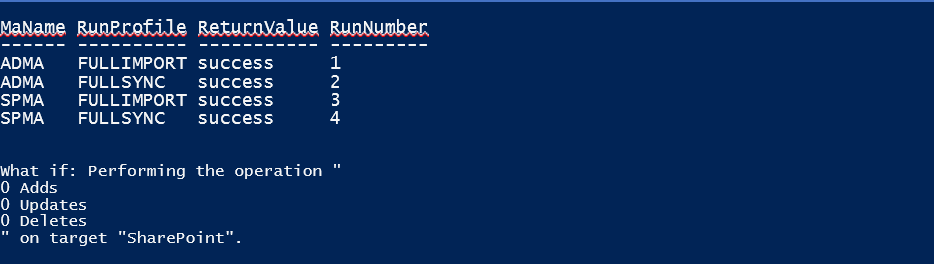
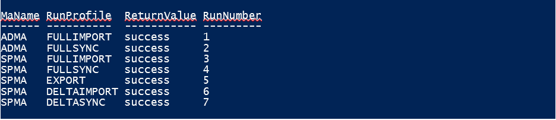

# Use a sample MIM solution in SharePoint Servers 2016 and 2019

[!INCLUDE[appliesto-xxx-2016-2019-xxx-xxx-md](../includes/appliesto-xxx-2016-2019-xxx-md.md)]
  
The article outlines a solution that will help you to install and synchronize accounts to SharePoint Server using Microsoft Identity Management, or MIM. MIM 2016 is the successor to a profile synchronization technology leveraged by previous versions of SharePoint Server that was known as Forefront Identity Manager, or FIM. FIM is no longer included as part of the product as of SharePoint Server 2016. However, MIM is not the only synchronization solution that SharePoint Server 2016 offers. If you would prefer to use the Active Directory Direct Import that is built-in with SharePoint Server 2016, please see the configuration article [here](/SharePoint/administration/configure-profile-synchronization-by-using-sharepoint-active-directory-import). Otherwise, follow the steps in this article to configure a new installation of MIM for your User Profile Synchronization.
  
- [Download the solutions files that you need](use-a-sample-mim-solution-in-sharepoint-server-2016.md#BKMK_Download)
    
- [Gather the configuration details you need](use-a-sample-mim-solution-in-sharepoint-server-2016.md#BKMK_Gather)
    
- [The Microsoft PowerShell to install the SharePoint Server Synchronization Configuration file](use-a-sample-mim-solution-in-sharepoint-server-2016.md#BKMK_InstallConfigfile)
    
- [The Microsoft PowerShell to start the SharePoint Synchronization Configuration](use-a-sample-mim-solution-in-sharepoint-server-2016.md#BKMK_StartSyncConfig)
    
> [!IMPORTANT]
> The solutions files referenced in this article are available for download [here](https://github.com/OfficeDev/PnP-Tools/tree/master/Solutions/UserProfile.MIMSync). You will need a GitHub account for access. See the section 'Download the solutions files that you need' for more details. > Microsoft Identity Manager 2016 is available for download from the [Microsoft Volume Licensing Center](https://www.microsoft.com/Licensing/servicecenter/default.aspx). (Log in and search on the product name.) > On your MIM server, be sure to install Service Pack 1 (https://aka.ms/mim2016sp1upgrade). 
  
## Download the solutions files that you need
<a name="BKMK_Download"> </a>

Download the files used by this solution into a folder on SharePoint Server. Make certain you're logged in as a Farm Administrator and have a local administrator rights on this server.
  
1. **SharePointSync.psm1** - Microsoft PowerShell module for deploying and starting the synchronization solution. 
    
2. **MA-AD.xml** - This is the MIM management agent for Active Directory. 
    
3. **MA-SP.xml** - This is the MIM management agent for SharePoint Server. 
    
4. **MV.xml** - This XML file contains additional User Profile Synchronization configuration. 
    
## Gather the configuration details you need
<a name="BKMK_Gather"> </a>

To run the Microsoft PowerShell commands involved in this solution, you'll need to catalog some information from your Active Directory and your SharePoint Server configuration as well. You should include this information in any build-documentation you keep on the User Profile Synchronization process.
  
**Active Directory**

|**Item**|**Description**|
|:-----|:-----|
|ForestDnsName  <br/> |This is the DNS name of the Active Directory forest to be synchronized.  <br/> |
|ForestCredential  <br/> |This is the username and password of the account that will be used to read objects from Active Directory. This account must have Replicate-Directory-Changes permissions in the Active Directory that is to be synchronized.  <br/> |
|OrganizationalUnit  <br/> |This is the distinguished name of the Active Directory container to be synchronized. You can add more containers after the configuration is loaded. To add more containers, use the Synchronization Service Manager GUI interface to modify the 'AD' management agent.  <br/> |
   
**SharePoint Connection Details**

|**Item**|**Description**|
|:-----|:-----|
|SharePointUrl  <br/> |This is the URL of the SharePoint Server running the User Profile Service application, for example, http://SharePoint01:8080.  <br/> |
|SharePointCredential  <br/> |The username and password of the account used to read and write objects into the SharePoint User Profile.  <br/> |
   
## The Microsoft PowerShell to install the SharePoint Server Synchronization Configuration file
<a name="BKMK_InstallConfigfile"> </a>

Once you've downloaded the solution files and cataloged the configuration details you can begin running the Microsoft PowerShell command for installing the SharePoint Synchronization Configuration. 
  
The configuration is installed by loading SharePointSync.psm1 and calling Install-SharePointSyncConfiguration as shown in the following code.
  
```XML
### Load the SharePoint Sync Module
Import-Module C:\SharePointSync\SharePointSync.psm1 -Force
### Install the SharePoint Sync Configuration
Install-SharePointSyncConfiguration `
  -Path C:\SharePointSync `
  -ForestDnsName litware.ca `
  -ForestCredential (Get-Credential LITWARE\adSyncAccount) `
  -OrganizationalUnit 'ou=Litwarians,dc=Litware,dc=ca' `
  -SharePointUrl http://SharePointServer:5555 `
  -SharePointCredential (Get-Credential LITWARE\spUserProfileAdmin) `
  -Verbose 

```

## Preview the impact of your SharePoint Synchronization
<a name="BKMK_InstallConfigfile"> </a>

Once the synchronization configuration is installed, it's ready to be started. Before you make further changes, you can examine the impact your synchronization will have by running the Start-SharePointSync cmdlet with '-WhatIf'.
  
```XML
### Run the Synchronization Service management agents
Start-SharePointSync -WhatIf -Verbose 

```


  
## The Microsoft PowerShell to start the SharePoint Synchronization Configuration
<a name="BKMK_StartSyncConfig"> </a>

To start the SharePoint Server synchronization service on-demand, run the Start-SharePointSync cmdlet.
  
```XML
### Run the Synchronization Service management agents 
Start-SharePointSync -Verbose 

```


  
## How to add more Active Directory Domains
<a name="BKMK_StartSyncConfig"> </a>

Now that you've loaded the initial configuration, you can add more domains for synchronization. Follow these steps in the Synchronization Service manager.
  
 **1. Add another domain or domains**
  
1. Open the Synchronization Service Manager.
    
2. In the Management Agents tab, select the ADMA management agent > **Properties** > **Actions**.
    
3. In the **Properties** dialog box > **Configure Directory Partitions**. 
    
4. In the list of directory partitions, select any domain you want to synchronize (and remember that credentials for these domains may be required).
    
5. Click **OK** to save the management agent properties. 
    
Each run profile for the ADMA management agent must be updated for each domain that was added. To update your profiles do the following:
  
 **2. Update your run profile**
  
1. In the **Management Agents** tab > select **ADMA Management** agent > select **Configure Run Profiles**.
    
2. Select **FullImport** run profile > New Step. 
    
3. Choose a step type of **Full Import (Stage Only)** > **Next**.
    
4. Choose the partition that matches the domain you just added and click **Finish**. The run profile should now have two steps.
    
5. Select the **FullSync** run profile next > New Step. 
    
6. Choose a step type of **Full Synchronization** > **Next**.
    
7. Choose the partition that matches the domain you just added > **Finish**. The Run profile will now have two steps.
    
8. Click **DeltaImport** in the run profiles next > New Step. 
    
9. Choose a step of type **Delta Import (Stage Only)** > **Next**.
    
10. Choose the partition that matches the domain that was just added > **Finish**. The run profile should now have two steps.
    
11. Select the **DeltaSync** run profile > **New Step**.
    
12. Choose a step of type **Delta Synchronization** > **Next**.
    
13. Choose the partition that matches the domain that was just added > **Finish**. The run profile should now have two steps.
    
14. Click **Apply** to save all the run profile changes > **OK**.
    

