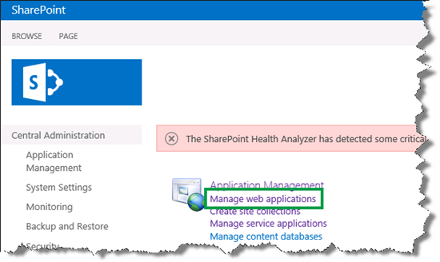
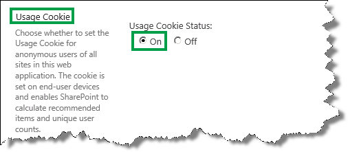
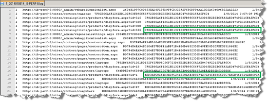
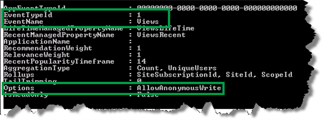
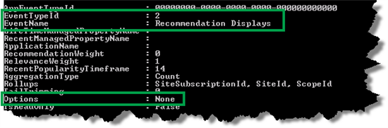
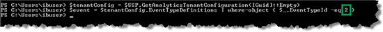
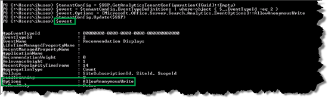
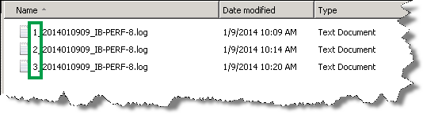

# Use recommendations and popular items on websites with anonymous users in SharePoint Server

[!INCLUDE[appliesto-2013-2016-2019-xxx-md](../includes/appliesto-2013-2016-2019-xxx-md.md)]
  
The previous article in this series, [Add and configure the Recommended Items and Popular Items Web Part in SharePoint Server](add-and-configure-the-recommended-items-and-popular-items-web-part.md), explained how to add and configure Recommended Items and Popular Items Web Part. In this article you'll learn:
  
- [Enable usage cookies to generate unique user IDs](use-recommendations-and-popular-items-on-websites-with-anonymous-users.md#BKMK_EnableUsageCookiestoGenerateUniqueUserIDs)
    
- [Enable the recording of a usage event for anonymous users](use-recommendations-and-popular-items-on-websites-with-anonymous-users.md#BKMK_EnabletheRecordingofaUsageEventforAnonymousUsers)
    
> [!NOTE]
> The examples in this series are based on an on-premises SharePoint Server deployment. 
  
## Enable usage cookies to generate unique user IDs
<a name="BKMK_EnableUsageCookiestoGenerateUniqueUserIDs"> </a>

The previous article in this series explained how to generate recommendations by inviting some co-workers to a to a "[Why you should simulate the generation of Views usage events](change-the-content-search-web-part-display-template-and-use-windows-powershell-t.md#BKMK_WhyYouShouldSimulateTheGenerationOfViewsUsageEvents)." All users who participated in the click party were logged in. When users are logged in, each user has a unique user ID. In the event store file we were therefore able to verify that different user IDs were recorded for the usage events.
  

  
So how can usage events be recorded with a unique user ID when users are not logged in, that is, when they're anonymous visitors? The answer is usage cookies. By default, usage cookies are not enabled for a SharePoint Server web application, but you can enable them. These usage cookies generate a unique GUID that is used as a user ID when usage event data is processed. The GUID is available for 14 days, the lifetime of the cookie.
  
> [!IMPORTANT]
> Local legal restrictions might apply when you enable usage cookies on websites that have anonymous users. 
  
To enable usage cookies, do the following:
  
1. In Central Administration, click **Manage web applications**. 
    
     
  
2. Select the web application that contains your publishing site, and then click **General Settings**. 
    
     
  
3. In the **Web Application General Settings** dialog, in the **Usage Cookie** section, for **Usage Cookie Status**, click **On**. 
    
     
  
4. Click **OK** to save your changes. 
    
    To verify that the  *Views*  usage events were correctly recorded on our Contoso website, ask two colleagues to click around on the Contoso Electronics pages. They are both anonymous users. Then start search analytics, and push the usage events to the Event store (this was explained in [Run Microsoft PowerShell scripts to start search analytics and push usage events to the Event store](change-the-content-search-web-part-display-template-and-use-windows-powershell-t.md#BKMK_RunWindowsPowerShellToStartSearchAnalyticsAndPushUsageEventsToTheEventStore)). In the usage event file, verify that two user IDs are recorded.
    
     
  
## Enable the recording of a usage event for anonymous users
<a name="BKMK_EnabletheRecordingofaUsageEventforAnonymousUsers"> </a>

When you enable usage cookies, only the  *Views*  usage event can be recorded for anonymous users. So, before you can record other usage events, for example  *Recommendation Displays*  , for anonymous users, you have to change a parameter value on the usage event. 
  
The  *Options*  parameter specifies whether the usage event can be recorded for anonymous users. For example, for the  *Views*  usage event, the  *Options*  parameter is by default set to  *AllowAnonymousWrite*  . This means that the  *Views*  usage event can be recorded for anonymous users. 
  

  
For the  *Recommendation Displays*  usage event, the  *Options*  parameter is by default set to  *None*  . This means that the  *Recommendation Displays*  usage event cannot be recorded for anonymous users. 
  

  
Here are the steps to enable the recording of a usage event for anonymous users:
  
1. On the server where SharePoint Server is installed, open the **SharePoint 2013 Management Shell**. 
    
2. At the Microsoft PowerShell command prompt, type the following commands:
    
  ```
  # View the EventTypeId's for all usage events:
  $SSP = Get-SPEnterpriseSearchServiceApplicationProxy
  $SSP.GetAnalyticsEventTypeDefinitions([Guid]::Empty, 3) | ft
  ```

  ```
  # Get a usage event:
  $tenantConfig = $SSP.GetAnalyticsTenantConfiguration([Guid]::Empty)
  $event = $tenantConfig.EventTypeDefinitions | where-object { $_.EventTypeId -eq <EventTypeId> }
  ```

     `<EventTypeID>` is the number of the usage event that you want to enable for anonymous users, for example  *2*  , which is the  *Recommendation Displays*  usage event. 
    
     
  
  ```
  # Enable the recording of a usage event for anonymous users:
  $event.Options = [Microsoft.Office.Server.Search.Analytics.EventOptions]::AllowAnonymousWrite
  $tenantConfig.Update($SSP)
  ```

     
  
  ```
  # Verify that the recording of a usage event for anonymous users has been enabled:
  $event
  ```

     
  
After enabling  *Recommendations Displays*  and  *Recommendations Clicked*  for anonymous users, you have to verify that these usage events are recorded. So, again ask some colleagues to click around on the Contoso website as anonymous users. Then start search analytics, and push the usage events to the Event store, as explained in [Run Microsoft PowerShell scripts to start search analytics and push usage events to the Event store](change-the-content-search-web-part-display-template-and-use-windows-powershell-t.md#BKMK_RunWindowsPowerShellToStartSearchAnalyticsAndPushUsageEventsToTheEventStore).
    
    Remember, in the Event store, each usage event type is recorded in a separate file. Each file name starts with the EventTypeID. Therefore, a file name that begins with  *1*  contains the  *Views*  usage events. A file name that begins with  *2*  contains the  *Recommendations Displays*  usage events. 
    
    In the Event store, you can verify that three usage event types are logged. Nice!
    
     
  
So now you know how to configure and display recommendations and popular items on your website. If you want more details about the number of views for a specific item or category, you can do this by looking in the usage analytics reports on your catalog. We'll show you how you can do that in the next article. Now you know how to configure and display recommendations and popular items on your website. In the you want more details about the number of views for a specific item or category, look in the usage analytics reports on your catalog.
  
### Next article in this series

[View and configure usage analytics reports in SharePoint Server](view-and-configure-usage-analytics-reports.md)
  

