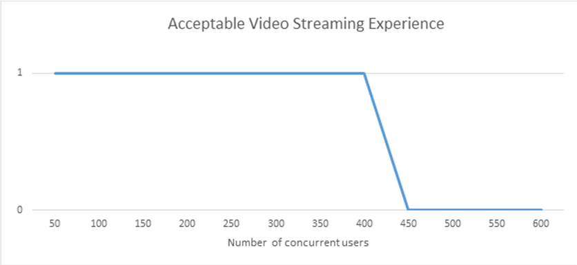
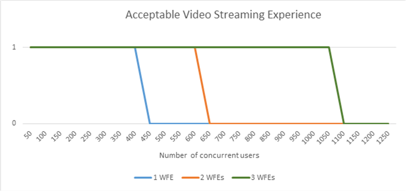

# Estimate capacity and performance for video content management in SharePoint Server 2013

[!INCLUDE[appliesto-2013-xxx-xxx-xxx-md](../includes/appliesto-2013-xxx-xxx-xxx-md.md)] 
  
SharePoint Server 2013 supports the video content type and the video player page, where you can use the Rich Media Web Part to play videos. This article contains test data to help you optimize the video playing experience for users in a SharePoint Server 2013 environment.
  
    
Videos are known as digital assets or rich media in SharePoint Server 2013. SharePoint Server 2013 provides an asset library to store videos so that users can visit a central location to view them. For more information, see [Overview of managing digital assets in SharePoint Server 2013](../sites/managing-digital-assets-overview.md).
  
> [!IMPORTANT]
> SharePoint Online has different performance and scalability properties than on-premises SharePoint Server 2013 installations. Although SharePoint Online can stream video, this capability should be reserved for videos that are not very large, or for videos that have limited distribution. For video scenarios that do not fit these criteria, for best results, consider storing videos externally, and streaming them using a partner service such as Azure Media Services. > You can also search the Office Store to find partner apps that enable video integration into SharePoint Online. 
  
## Introduction

We tested two scenarios in our video capacity and performance testing. The first scenario stores videos in a location that is not part of the SharePoint deployment. The second scenario stores videos in a SharePoint asset library. We look at the performance characteristics for both scenarios.
  
## Video storage locations

Videos in SharePoint Server 2016 use a new content type named Video, much like a document set. When you create a video, SharePoint Server 2013 uses one of the following methods to store it: 
  
- Store the video content as a Binary Large Object (BLOB) in the content database
    
- Store a reference to a URL for the video
    
- Store an embedded code that contains the reference to an external video and player
    
The following advantages and disadvantages can help you decide where to store videos:
  
- If you store videos in a SharePoint asset library, we recommend that you turn on BLOB cache for the computers that run as the front-end web server role. The BLOB cache size must be appropriate to ensure a smooth streaming experience for users.
    
    > [!NOTE]
    > This option increases the size of the content database as more videos are added. 
  
- If users are in the same geographical region, and the total sizes of the videos are large (such as HD videos), or you have many videos, consider hosting the videos on a web or file server instead of the content database to reduce your SQL Server storage costs.
    
- If users are geographically distributed over long distances, you can store the videos in a content delivery network so that users who are farthest from the SharePoint farm do not have to stream videos over a high latency network connection.
    
When you store videos outside a SharePoint deployment, ensure that the videos are correctly secured so that unauthorized users cannot access them.
  
If you find that you can't upload files larger than a certain size, you can change this on the **Web Application Settings** page of the SharePoint Central Administration website. Note that you can also change the Web Page Security Validation to use a larger time-out value if users upload videos that take more than 30 minutes to upload. This is also done on the **Web Application Settings** page in Central Administration. 
  
## Size the BLOB cache to ensure smooth video streaming experiences

When you store videos in SharePoint Server 2013, the size of the BLOB cache can help you optimize the streaming experience for users. We recommend that you size the BLOB cache to a certain percentage of the total size of unique videos viewed in a week. For example, consider an environment where the total size of unique videos viewed in seven days is 100 GB. For this environment you can size your BLOB cache to be 80 GB, which is 80 percent of the total size of the unique videos. This ensures that the most frequently viewed videos are always kept in the BLOB cache where there is no additional load on the content database to retrieve these videos multiple times. This also ensures an optimal user streaming experience. The ideal size will differ based on the video viewing patterns in the SharePoint deployment.
  
To optimize performance, do not place the BLOB cache on the same drive as the system drive.
  
Note that bigger BLOB cache sizes enable SharePoint Server 2013 to store more videos. So if you have the available disk space on the front-end web servers and know that you'll store many videos, increase the BLOB cache size. Note that if the BLOB cache size is set lower than a certain threshold that users can experience choppy video streaming.
  
## Dataset and test scenarios

The following table describes the video library that we used for our tests:
  
|**Variable**|**Value**|
|:-----|:-----|
|**Number of videos**   |350    |
|**Size of videos**   |1 MB - 1 GB each, total size of 14 GB    |
   
We used this set of videos in different tests:
  
1. Uploaded the videos to SharePoint Server 2013 and turned on the BLOB cache.
    
2. Uploaded the videos to a Windows Server 2008 R2.
    
We ran our tests in the following farm topology:
  
**Figure 1: Video content management test topology**

  
The following list shows the computers that we used:
  
- One computer that is hosting SQL Server
    
- One computer that is hosting SharePoint service applications and runs as the front-end web server
    
### Test lab results

To produce the test lab results, we created a load test where we navigated to different pages. We accessed either the video player page or the publishing page that uses the Rich Media control. We then requested the video file that the page referenced by using varying numbers of Visual Studio Team System (VSTS) users. Applying this load to our SharePoint deployment, we manually navigated to a video player page and a publishing page that uses the video control to make sure that the video streaming experience was acceptable. We define an acceptable experience as follows:
  
1. Video starts to play within 2 seconds of going to the page
    
2. Video seeking experience works as expected
    
Note that all of the computers in our tests are on a network that used 1 Gbps network connections. We found that in many of the tests, we managed to reach a point where the network was the bottleneck instead of the computers that served the content.
  
The tests started with a 50 user load and then increased the number of concurrent users until the experience is no longer acceptable. On a single computer that is running SharePoint Server 2013 and servicing only videos, we found that we had an acceptable experience until we increased the load to 400 concurrent users. After we passed that point, we began to see that the page took longer to load and the video seek experience became slower.
  
The following graph shows this:
  
**Figure 2: Acceptable video streaming experience**

  
To see how this experience scales, we gradually added more computers to our SharePoint deployment and continued to increase the load. The following graph shows the results.
  
**Figure 3: Acceptable video streaming with more test computers and users**

  
### Effect of IIS Bit Rate Throttling

We used Internet Information Services (IIS) Bit Rate Throttling on our test servers. This extension to IIS allows the bandwidth to be used more effectively while you are streaming videos. For more information about Bit Rate Throttling, see [Bit Rate Throttling](https://go.microsoft.com/fwlink/p/?linkid=155151).
  
Note that there is no significant difference according to the number of concurrent users supported when we used IIS Bit Rate Throttling versus when we did not use it. However, the video viewing experience feels smoother when it is turned on.
  
### Using videos that are stored external to SharePoint Server 2013

When you store videos outside a SharePoint Server 2013 environment, the load shifts from SharePoint Server 2013 to the external location. SharePoint Server 2013 only loads the video player page or the publishing page that uses the Rich Media control. The streaming is performed by the external location's source.
  
In our lab environment, we set up an IIS server to host and stream the videos. We updated our dataset to refer to the external URL for videos in our SharePoint video library. We ran the same test again and found that we could stream up to 650 videos concurrently and still have an acceptable experience. We did not test for more concurrent users.
  
Note that videos that are stored outside a SharePoint environment do not receive the same authentication benefit as videos in a SharePoint library. Take this into consideration when you design your topology and decide how to store your videos.
  
## See also

#### Concepts

[Manage web parts in SharePoint Server](../sites/manage-web-parts.md)
#### Other Resources

[Digital asset library planning in SharePoint Server 2013](/previous-versions/office/sharepoint-server-2010/ee428298(v=office.14))

