# View and configure usage analytics reports in SharePoint Server

[!INCLUDE[appliesto-2013-2016-2019-xxx-md](../includes/appliesto-2013-2016-2019-xxx-md.md)] 
  
The previous article in this series, [Use recommendations and popular items on websites with anonymous users in SharePoint Server](use-recommendations-and-popular-items-on-websites-with-anonymous-users.md), explained how to display recommendations on a website with anonymous users. In this article you'll learn:
  
- [About the usage analytics reports](view-and-configure-usage-analytics-reports.md#BKMK_AbouttheUsageAnalyticsReports)
    
- [View the Most Popular Items report for a catalog](view-and-configure-usage-analytics-reports.md#BKMK_ViewtheMostPopularItemsReportforaCatalog)
    
- [Change the Recent time period for a usage event](view-and-configure-usage-analytics-reports.md#BKMK_ChangetheRecentTimePeriodforaUsageEvent)
    
- [Narrow the Most Popular Items report to a specific attribute or category](view-and-configure-usage-analytics-reports.md#BKMK_NarrowtheMostPopularItemsReporttoaSpecificAttributeorCategory)
    
- [View the Popularity Trends report for an item](view-and-configure-usage-analytics-reports.md#BKMK_ViewthePopularityTrendsReportforanItem)
    
- [About the TailTrimming parameter](view-and-configure-usage-analytics-reports.md#BKMK_AbouttheTailTrimmingParameter)
    
> [!NOTE]
> The examples in this series are based on an on-premises SharePoint Server deployment. 
  
## About the usage analytics reports
<a name="BKMK_AbouttheUsageAnalyticsReports"> </a>

The usage analytics reports show statistics of how visitors have interacted with the content on your website, for example which item is viewed the most. The reports are broken down per usage event. By default, this means that you'll be able to see:
  
- The number of  *views*  for an item 
    
- The number of  *recommendations displayed*  per item 
    
- The number of  *recommendations clicked*  per item 
    
SharePoint Server creates two usage analytics reports:
  
-  *Most Popular Items*  shows usage event statistics for all items in a library or list. 
    
-  *Popularity Trends*  shows usage event statistics for an item, a site or a site collection. 
    
The reports are automatically updated every 24 hours, when the Usage analytics job is run.
  
## View the Most Popular Items report for a catalog
<a name="BKMK_ViewtheMostPopularItemsReportforaCatalog"> </a>

In a cross-site publishing scenario where you are displaying catalog content on a Publishing site, you view the Most Popular Items report on your authoring site. Here are the steps:
  
1. On your authoring site, go to your catalog.
    
2. Click the **LIST** tab -> **Most Popular Items**. 
    
     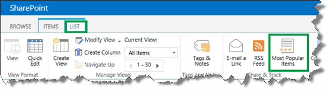
  
3. On the **Most Popular Items** page, use the menu to select the usage event for which you want to view statistics. 
    
     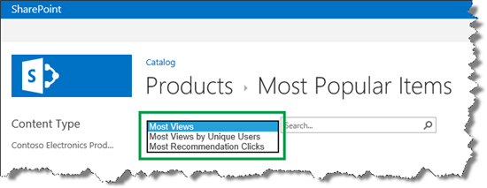
  
    > [!NOTE]
    > You can view statistics for the  *Recommendations Displays*  usage event in the [View the Popularity Trends report for an item](view-and-configure-usage-analytics-reports.md#BKMK_ViewthePopularityTrendsReportforanItem). 
  
## Change the Recent time period for a usage event
<a name="BKMK_ChangetheRecentTimePeriodforaUsageEvent"> </a>

On the **Most Popular Items** page, there are two time periods: **Recent** and **Ever**. 
  
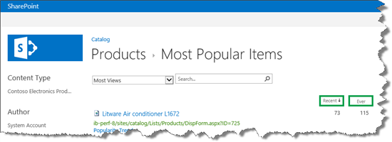
  
The **Ever** time period shows statistics from the first day a usage event was recorded. By default, the Recent time period is set to the last 14 days. T Here are the steps to view the default settings of a usage event: 
  
1. On the server where SharePoint Server is installed, open the **SharePoint 2013 Management Shell**. 
    
     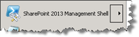
  
2. At the Microsoft PowerShell command prompt, type the following commands:
    
  ```
  $SSP = Get-SPEnterpriseSearchServiceApplicationProxy
  $tenantConfig = $SSP.GetAnalyticsTenantConfiguration([Guid]::Empty)
  $event = $tenantConfig.EventTypeDefinitions | where-object { $_.EventTypeId -eq <EventTypeId> }
  $event
  ```

     `<EventTypeId>` is the numeric [View the usage event definitions](an-introduction-to-recommendations-and-popular-items.md#BKMK_ViewtheUsageEventDefinitions) of the usage event that you want to view. In the following example, we'll view the  *Views*  event. Therefore, we'll enter  *1*  . 
    
     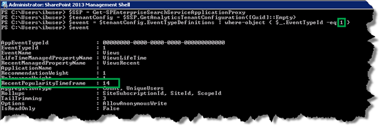
  
The **Recent** time period is defined by the  *RecentPopularityTimeframe*  property. We can change the **Recent** time period to anything between one and 14 days. Here are the steps to change the time period: 
    
3. In the SharePoint 2016 Management Shell, at the Microsoft PowerShell command prompt, type the following commands:
    
  ```
  $SSP = Get-SPEnterpriseSearchServiceApplicationProxy
  $tenantConfig = $SSP.GetAnalyticsTenantConfiguration([Guid]::Empty)
  $event = $tenantConfig.EventTypeDefinitions | where-object { $_.EventTypeId -eq <EventTypeId> }
  $event.RecentPopularityTimeFrame = <TimeFrame>
  $tenantConfig.Update($SSP)
  ```

     `<EventTypeId>` is the numeric [View the usage event definitions](an-introduction-to-recommendations-and-popular-items.md#BKMK_ViewtheUsageEventDefinitions) of the usage event that we want to change.  `<TimeFrame>` is the new time period we want to set for the usage event. 
    
    In the following example, to change the  *Views* **Recent** time to a week, enter  *1*  and  *7*  . 
    
     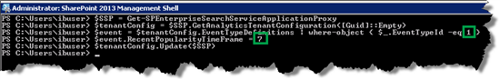
  
4. To verify the change, at the Microsoft PowerShell command prompt, type the following command:
    
  ```
  $event
  ```

     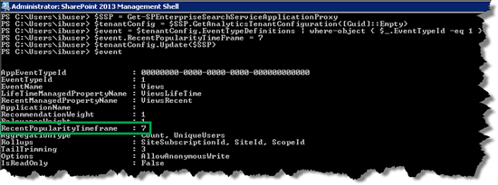
  
Notice that the value for the  *RecentPopularityTimeframe*  parameter has changed to  *7*  . 
    
## Narrow the Most Popular Items report to a specific attribute or category
<a name="BKMK_NarrowtheMostPopularItemsReporttoaSpecificAttributeorCategory"> </a>

Viewing usage reports per usage event is useful when we want to see how visitors are interacting with our site. But many times we want to narrow the report to a specific attribute or category, for example all items that are on sale or all Laptops. To do this, we can use [Keyword Query Language (KQL)](https://go.microsoft.com/fwlink/p/?LinkId=400770) If you don't know KQL, don't worry. You can easily narrow your Most Popular Items report without having much knowledge of the KQL syntax. 
  
In our Contoso catalog, we have a site column called  *RetOnSale*  . For each item, the value of  *RetOnSale*  specifies whether the item is on sale or not. 
  
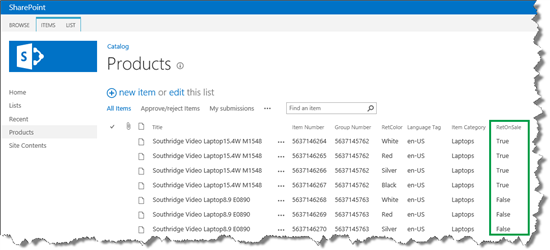
  
To narrow the Most Popular Items report to only show items that are on sale, we'll use the managed property that represents the  *RetOnSale*  site column. In our Contoso scenario, this is  *RetOnSale*  (see [How to find a managed property name](../search/how-to-display-values-from-custom-managed-properties-in-search-resultsoption-1.md#BKMK_HowtoFindaManagedPropertyName)).
  
In the Search Schema, we can see that the  *RetOnSale*  managed property is  *Queryable*  . This means that we can use it to narrow the Most Popular Items report. 
  
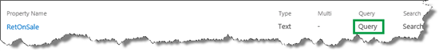
  
To see  *Views*  usage event statistics for items that are on sale, on the **Most Popular Items** page, select **Most Views**, and enter  *RetOnSale=True*  . 
  

  
And just like that, only items that are on sale are shown.
  
You can also narrow usage event statistics to a specific category, for example all  *Laptops*  . In our Contoso scenario, the  *Item Category*  site column is used to specify the category for each item. 
  
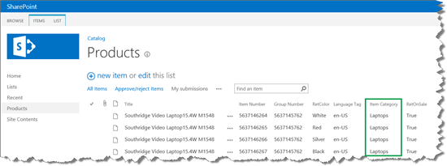
  
The managed property name of the  *Item Category*  column is  *owstaxIdProductCatalogItemCategory*  . The  *owstaxIdProductCatalogItemCategory*  managed property is  *queryable*  , which means that we can use it to narrow the Most Popular Items report. 
  
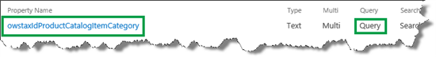
  
To see which laptops are viewed most by visitors, on the **Most Popular Items** page, select **Most Views**, and enter  *owstaxIdProductCatalogItemCategory:Laptops* 
  
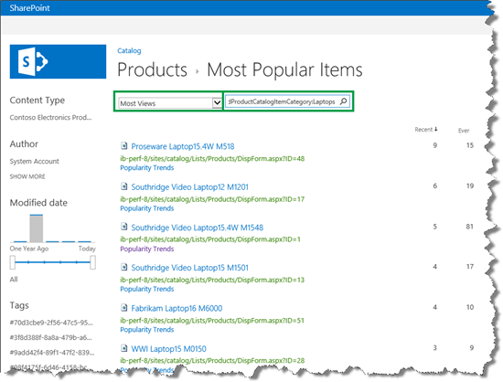
  
By narrowing the  *Views*  usage event statistics to a specific category, we can verify that the **Popular Items Web Part** is working correctly on our publishing site. For example, on the  *Laptops*  page, notice that the three items that are displayed in the **Popular Items Web Part** are the same that are shown to have the most  *Views*  in the Most Popular Items report that we just narrowed to  *Laptops*  . 
  
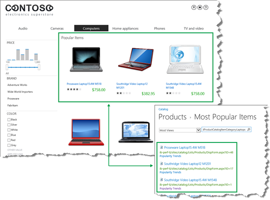
  
## View the Popularity Trends report for an item
<a name="BKMK_ViewthePopularityTrendsReportforanItem"> </a>

There are two ways that you can access the Popularity Trends report for an item:
  
- On your catalog, select the item for which want to view the Popularity Trends report. In the ribbon, click **ITEMS** --> **Popularity Trends**. 
    
     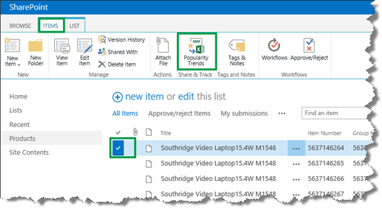
  
- On the **Most Popular Items** page, click **Popularity Trends**. 
    
     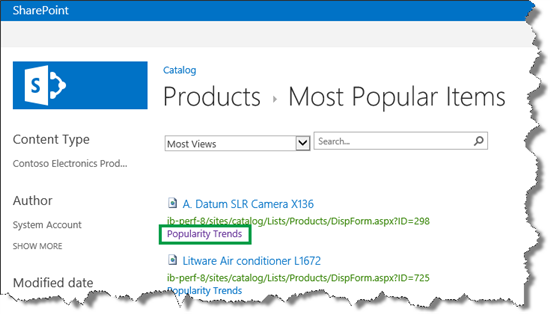
  
Both of these options will open a Microsoft Excel sheet where you can view the daily and monthly statistics for the item. Each usage event is shown in a separate tab.
  
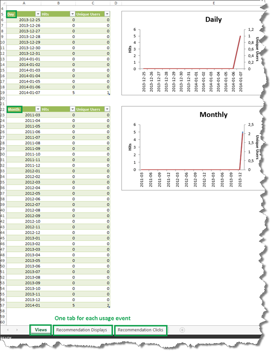
  
## About the TailTrimming parameter
<a name="BKMK_AbouttheTailTrimmingParameter"> </a>

While we're on the subject of usage analytics reports, one usage event parameter that is worth mentioning is  *TailTrimming*  . This parameter specifies when the numbers that are shown in the usage analytics reports should be updated. 
  
> [!IMPORTANT]
> This parameter does not affect how recommendations are calculated. 
  
For example, for the Views usage event the  *TailTrimming*  parameter is by default set to 3. 
  
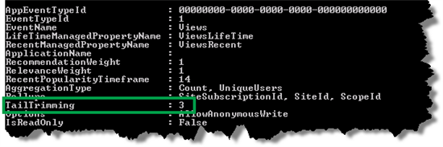
  
This means that the usage analytics reports will be updated for an item when the item was viewed a minimum three times within the past 24 hours. For example, if the item  *Fabrikam Laptop16 M6000*  was viewed two times within the past 24 hours, these two views won't be displayed in the usage analytics reports. If within the next 24 hours the  *Fabrikam Laptop16 M6000*  item is viewed 4 times, the usage analytics report will be updated with 4 views. 
  
The reason the  *TailTrimming*  parameter is set to 3 is to avoid having to update items that almost none of your website visitors are interacting with. By not updating these items, you reduce the load on your system. On the other hand, when the  *TailTrimming*  parameter is set to 3, the usage analytics reports can be somewhat inaccurate. In the example with the  *Fabrikam Laptop16 M6000*  , the two views in the first 24 hours won't be displayed up in the usage analytic reports. Total number of views of  *Fabrikam Laptop16 M6000*  over the last 48 hours will show 4, but in reality, it was viewed 6 times. 
  
If you want the usage analytics reports to be updated regardless of minimum amount of views within the last 24 hours, do the following:
  
1. In the SharePoint 2016 Management Shell, at the Microsoft PowerShell command prompt, type these commands:
    
  ```
  $SSP = Get-SPEnterpriseSearchServiceApplicationProxy
  $tenantConfig = $SSP.GetAnalyticsTenantConfiguration([Guid]::Empty)
  $event = $tenantConfig.EventTypeDefinitions | where-object { $_.EventTypeId -eq <EventTypeId> }
  $event.TailTrimming = <TailTrimming>
  $tenantConfig.Update($SSP)
  ```

    Where < `EventTypeId`> is the numeric [View the usage event definitions](an-introduction-to-recommendations-and-popular-items.md#BKMK_ViewtheUsageEventDefinitions) of the usage event that you want to change, and <  `TailTrimming`> is the minimum number of times the usage event has to occur within 24 hours for the usage analytics reports to be updated.
    
    In the following example, we wanted the usage analytics reports for the  *Views*  usage event to be updated if a  *Views*  usage event occurs within 24 hours. Therefore, we entered  *1*  and  *0*  . 
    
     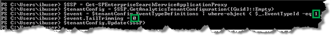
  
2. To verify the change, at the Microsoft PowerShell command prompt, type the following command:
    
  ```
  $event
  ```

     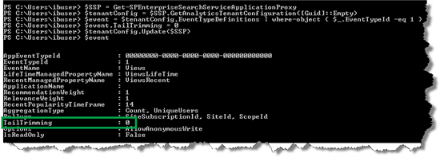
  
Notice that the value of the  *TailTrimming*  parameter has changed to 0. 
    
So with that, this series has come to an end. Hopefully you now have a better understanding of how recommendations and popular items work, and can start adding them to your website.
  

