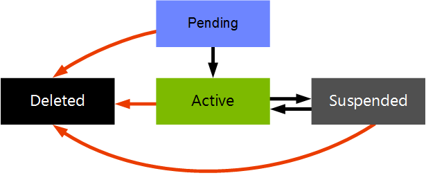

# Viva Engage networks, groups, and users overview

[!INCLUDE[appliesto-2013-2016-2019-SUB-xxx-md](../includes/appliesto-2013-2016-2019-SUB-xxx-md.md)]
  
This article describes Viva Engage networks, groups, and users, which together serve as a foundation for providing you with a rich Viva Engage experience within SharePoint.
  
Viva Engage supports both internal and external networks. An internal network is restricted to users inside the organization, while an external network is open to users outside the organization's domain. Users in external networks must be invited. External networks are considered extensions of, and are always associated with, a single internal network.
  
An internal network is associated with one primary domain. Viva Engage creates a network for the primary email domain in your organization so that when users log on, they're routed to the same Viva Engage network as their email domain. Only people with a valid organization email address can join the organization's network. For example, in the following diagram, Jane is in the contoso.com network, and John is in the northwindtraders.com network. They can both log on as guests to sites in the external networks for both organizations. But they can only log on as users in their internal networks.
  
**Viva Engage networks and users**

  
For organizations with multiple email domains, the Viva Engage network is associated with only one domain. Users with email addresses from valid alternate domains within that organization can still log on by using their alternate domain email address. For example, Coho Vineyard and Winery might have one domain for the parent organization, cohovineyardandwinery.com, and separate domains for each division, cohovineyard.com and cohowinery.com. The Viva Engage network is associated with the domain cohovineyardandwinery.com, but users can log on with their separate cohovineyard.com or cohowinery.com email address.
  
## Viva Engage networks

Viva Engage offers two types of networks to help users communicate and collaborate in the most convenient and effective ways possible:
  
- **Internal network:** Also known as a home network. This is a private collaboration space where organization employees can connect with their coworkers. Only employees with a valid corporate email address can join the internal network and access its content and users. Users from one internal network can't view the content or interact with users from another network unless they have a valid email address for that network. Messages posted within your internal network are owned by your organization and cannot be shared externally. Administrators can invite external users as guests to the internal network.
    
- **External network:** A separate extension of your internal network. It includes invited users from outside your organization. It's a private collaboration space for your organization to engage with outside partners, like customers, suppliers, or investors. Although external networks can accommodate users who have different email domains, access is by invitation only. 
    
## Viva Engage groups

By using Viva Engage groups, you can create a workspace dedicated to a certain topic, like a functional team within your organization, a project taskforce, or a group of people with a shared interest. By using Viva Engage groups, a team can collaborate and seamlessly share information, such as documents, notes, and links. Viva Engage has two types of groups:
  
- By using **public groups**, anyone in the network can view content and participate in the group activity. By default, Viva Engage groups are public.
    
- By using **private groups**, you can limit membership and participation to invitation or approval only from group administrators. You can hide private groups from the group's directory.
    
> [!NOTE]
>Viva Engage groups aren't security principals like SharePoint groups, or Active Directory Domain Services (AD DS) groups, and synchronizing groups with AD DS isn't supported. With Viva Engage, if you [Enforce Microsoft 365 identity for Viva Engage users](/viva/engage/configure-your-viva-engage-network/enforce-office-365-identity), groups can be [Viva Engage and Microsoft 365 Groups](/viva/engage/manage-viva-engage-groups/viva-engage-and-office-365-groups).
  
## Viva Engage users

Users are the core of the enterprise social network, and you can add users individually or in bulk from the Viva Engage **Admin** page. Viva Engage users can be [Manage Viva Engage users across their lifecycle from Microsoft 365](/viva/engage/manage-viva-engage-users/manage-users-across-their-lifecycle).
  
Viva Engage users exist in a limited number of states, as shown in the following diagram:

  
## See also

[About Viva Engage networks and Microsoft 365 organizations](/viva/engage/configure-your-viva-engage-network/viva-engage-and-office-365)

[Create and manage an external network in Viva Engage](/viva/engage/work-with-external-users/create-and-manage-an-external-network)

#### Concepts

[Integrate Viva Engage with on-premises SharePoint Server environments](integrate-viva-engage-with-on-premises-sharepoint-server-environments.md)
  
[Social scenarios with Viva Engage and SharePoint Server](social-scenarios-with-viva-engage-and-sharepoint-server.md)

