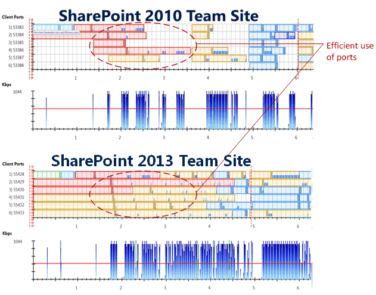
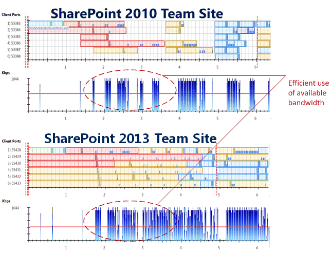
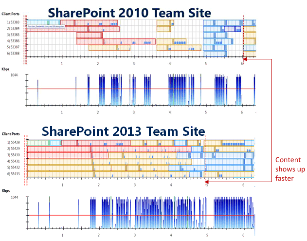
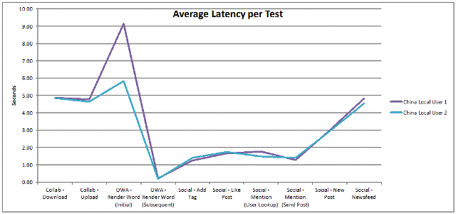
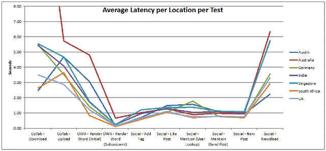

# Testing WAN connections for SharePoint 2013 architectures

[!INCLUDE[appliesto-2013-2016-2019-xxx-md](../includes/appliesto-2013-2016-2019-xxx-md.md)]
  
SharePoint Server 2013 is optimized to perform well over WAN connections. This article describes performance improvements and methods for testing WAN connections to help you determine if you need to deploy more than one farm geographically. It also includes example test results from companies that participated in the prerelease program.
    
## Key concepts

- Bandwidth — The data transfer capacity, or speed of transmission, of a digital communications system as measured in bits-per-second (bps).
    
- Latency — The time that is required for a request to travel from one point on a network to another point.
    
- Network congestion - The condition of a network when the current load approaches or exceeds the available resources and bandwidth that are designed to handle that load at a particular location in the network. Packet loss and delays are associated with congestion.
    
## WAN performance improvements

SharePoint Server 2013 responds to incoming requests 50% faster the previous version. It utilizes available bandwidth between the server and the client almost 40% more efficiently than the previous version. These performance gains were quantified in Microsoft's environment with the busiest SharePoint farms in the world. 
  
A Microsoft Office 365 environment demands higher levels of performance over WAN connections because many customers are geographically distributed. As a result, Office 365 was extensively tested under WAN conditions. Testing scenarios included latencies up to 300 milliseconds, which is much higher than latencies between the North America and Asia.
  
To achieve up to 40% improvement in the use of available bandwidth (compared to the previous version), optimizations were targeted to various layers of the network stack:
  
- IIS compression and image compression are more effective on the server side.
    
- Servers respond to http and https requests much faster.
    
- Low-level TCP/IP optimizations result in better use of the communication ports that are open between the client and the server. The ports ramp up quicker and are used more efficiently.
    
Users benefit not only from the performance gains but also from additional features that improve the experience:
  
- Active download management and script on demand — these optimizations prioritize resources and JavaScript to download the content that is most meaningful to users first.
    
- Smooth page transitions with animations provide a rich, interactive browser experience.
    
- Minimal download strategy — As users browse SharePoint content, only changes to a page are downloaded and sent to the client.
    
## WAN product-team test results

The following diagrams detail the effect of WAN performance optimizations on one of the most popular pages in SharePoint — Teamsite. The diagrams show network traces of Teamsite for both SharePoint 2010 and SharePoint Server 2013 with the following network conditions:
  
- Approximately 300 ms latency roundtrip
    
- 1 mpbs bandwidth connection between the server and clients
    
These conditions represent higher latencies and lower bandwidths than are typical for global WAN connections. However, some customers who have extremely remote sites find themselves within this range (for example, mining, oil and gas, and global construction companies). 1 mpbs bandwidth connection is lower than a typical mobile phone connection.
  
The following diagram demonstrates that SharePoint Server 2013 makes better use of available communication ports.
  

  
In the two network traces, the horizontal rows represent the ports that are open. The colored blocks represent content that is traveling over the wire, such as the images, JavaScript, and HTML. In the SharePoint 2010 network trace, the white spaces between the colored blocks represent idle time in which the client or server is waiting for something to happen before completing the next action. In the SharePoint Server 2013 network trace, the network pipe is filled almost 100%. Communication between the client and server is ongoing until the transaction is complete. There is very little or no idle time between actions. These improvements are provided by the optimizations described earlier in this article (minimal download strategy, active download management, and script on demand).
  
The following diagram calls attention to the improvement in bandwidth utilization. The blue graphs in both network traces represent the bandwidth utilization. The use of available bandwidth is more efficient in SharePoint Server 2013.
  

  
This following diagram of the network traces shows that the content that users interact with on the page (the document library, prompts, navigational elements, etc.) are downloaded a full second faster in SharePoint Server 2013 compared to SharePoint 2010. Users can interact with the site much sooner.
  

  
Compared to SharePoint 2010, WAN optimizations in SharePoint Server 2013 achieve the following improvements for this network scenario:
  
- Downloads 65% fewer bytes for images because of better use of image compression.
    
- Downloads 20% more bytes for the JavaScript which provides quicker and improved functionality in the browser.
    
- Downloads 15% fewer bytes total.
    
## Simple WAN unit testing

The simplest method to test performance over WAN connections is to have a user at a remote location connect to a SharePoint site and perform several user actions. For example, you can host an online meeting, talk the user through the actions, and count the number of seconds for actions to be completed. Or, you can connect to a computer remotely and perform the tasks. 
  
For example, during the early adoption phase of SharePoint Server 2013, Microsoft worked with Teck to evaluate WAN performance between the mining company's two datacenters in Santiago, Chile, and Calgary, Canada. Mahmood Jaffer, IT Specialist and SharePoint Architect, created a remote connection from his Canadian office to the datacenter in Santiago, Chile. From a computer in Santiago, he connected to a server running SharePoint Server 2013 in the Calgary datacenter and uploaded several files. He also connected to a server running SharePoint 2010 in Calgary and uploaded files that have the same characteristics. The following table records the results.
  
**Teck unit test — File upload from Santiago to Calgary (140ms latency) with Riverbed device**

|**File size and type**|**SharePoint 2010**|**SharePoint 2013**|
|:-----|:-----|:-----|
|1 mg pdf    |5 seconds    |\<1 second    |
|10 mg .zip    |25 seconds    |12 seconds    |
   
An important consideration for this user test is the use of a WAN accelerator device between the two locations. Teck uses a Riverbed device to accelerate traffic. WAN accelerators look for patterns within packets of data and potentially only send packets that are unique, replacing duplicate packets with content that is cached on the other end. For Teck to obtain accurate results, it was important to use files that have different content for each test, instead of just renaming files. 
  
To repeat this unit test, the Microsoft SharePoint writing team had colleagues in the Beijing office connect to SharePoint sites in the Redmond office. In this scenario, two writers repeated the test multiple times throughout the day and produced a range of results. Files with different content were used each time to avoid potential caching issues, although a WAN accelerator device is not used between the two locations. The following table records the results.
  
**Microsoft writing team unit test — File upload from Beijing to Redmond (144ms latency)**

|**File size and type**|**SharePoint 2010**|**SharePoint 2013**|
|:-----|:-----|:-----|
|1 mg pdf    |8-9 seconds    |7-8 seconds    |
|10 mg .zip    |53-140 seconds    |49-63 seconds    |
   
Several observations result from a comparison of these two sets of results:
  
- Testing multiple times throughout a day or week will produce a range of results.
    
- The range of results for SharePoint Server 2013 is narrower than the range of results for SharePoint 2010. The result is in a more predictable experience with SharePoint.
    
- Network environment characteristics can affect results more than latency. Both tests were conducted over WAN connections with similar latencies. However, the results are slower for the WAN connection from Beijing to Redmond. Network environment characteristics include routing patterns, network congestion, packet loss, and other factors. Some global regions and international telecommunications companies are less optimized for WAN traffic.
    
- Simple unit testing can provide meaningful data. In these two cases, the real-world experience is unlikely to be duplicated by plugging numbers for bandwidth and latency into a WAN simulation device.
    
Here are recommendations if you conduct your own simple unit testing:
  
- Use different files that have different content to avoid optimization of WAN accelerator devices on second upload.
    
- Test multiples times throughout a day or week to capture results for different network loads.
    
- Be aware that a file upload in SharePoint Server 2013 might be slower than in SharePoint 2010 due to the new Efficient File I/O features. Efficient File I/O is a storage method in which a file is split into pieces that are stored and updated separately, and streamed together when a user requests the file. As a result, the performance of the first upload might be slower. Subsequent downloads and uploads of the file will be faster as only the pieces that change are updated. However, you might see slower performance for SharePoint Server 2013 when you test the versions side-by-side in or near the same location as the servers. The results of the two unit tests described in this article demonstrate that the WAN optimizations in SharePoint Server 2013 more than offset the performance overhead of the Efficient File I/O feature for high latency connections.
    
## WAN test tools and scenarios for systematic testing

Before you begin any type of systematic load testing across a WAN environment make, sure that you understand the nature of your network. You should have data about bandwidth, latency, network congestion, packet loss and types of devices between users and the SharePoint front-end web server. This data is not always easy to obtain. However tools, such as System Center Operations Manager, can make it easier.
  
After you understand the network environment, you'll know whether you must address items before you test over the WAN. For initial testing, minimize network congestion and packet loss. Also remove or disable network optimization devices. This will leave you with bandwidth and latency as the two primary factors that will impact your end-users from a network perspective.
  
### Test tools

After you address WAN constraints, you can start to use a combination of tools to testing WAN efficiency. Prescriptive tools, such as Visual Studio 2012 Update 1, provide repeatable unit and load testing capabilities. Non-prescriptive tools, such as Microsoft Network Monitor (Netmon) with Visual Round Trip Analyzer, provide end-user oriented monitoring. Both types of tools can be useful because they each provide a different approach to WAN testing and data collection. The combined results can provide a complete view of the impact of WAN connections on user performance.
  
The following chart lists the strengths of both tools.
  
|**Visual Studio 2012 Update 1**|**Network Monitor with Visual Round Trip Analyzer**|
|:-----|:-----|
|Repeatable unit and load test capabilities    Data capture across servers and load test agents    Plug-ins to test SharePoint loads    Export to Excel with Pivot capability    Real and simulated bandwidth and latency capability    |End-user oriented monitoring (true end-user experience capture)    Network packet and port analysis    Low barrier to entry (free and easy setup)    Real bandwidth, latency, congestion, packet loss and optimization is reflected    |
   
### Test scenarios

Create test scenarios that reflect the types of actions users will perform as part of their jobs. Common scenarios include the following:
  
- Browse a team site
    
- Fill out a form
    
- Upload a document
    
- Download a document
    
- View a document in Office Web Apps Server
    
- Edit a document in Office Online Server
    
- Add a newsfeed post
    
- Add a social tag
    
The goal is to have a well-rounded set of unit tests which capture actions that end-users perform in a SharePoint environment and expose any potential latency-sensitive transactions.
  
Finally, make sure that you conduct rounds of tests at various times throughout the day to capture differences in network utilization patterns. For example, 09:00 on Monday morning may have a very different network and performance pattern compared to 23:00 on Friday. Also, be aware of events in other geographical regions, such as a natural disaster that results in region-wide power outages, that might impact WAN routing or performance. A comprehensive set of tests spread across different time intervals will provide insight and set expectations about what your end-users will experience when they use SharePoint Server 2013 across the WAN.
  
### Example WAN test using Visual Studio 2013

For an example test case, see [SharePoint 2013 SharePoint 2013 WAN testing with Visual Studio 2012 walkthrough](https://go.microsoft.com/fwlink/p/?LinkId=280285). This 3 megabyte Visio slide deck shows how to build a web test and load test for WAN testing that uses Visual Studio 2013.
  
### Example test results

Fabrikam is a fictional company that represents a large, world-wide manufacturing company that participated in the SharePoint Server 2013 prerelease program. Fabrikam used Visual Studio to script a load test made up of many unit tests and then ran the load test from multiple geographic locations. 
  
In this first set of results, two users in the Fabrikam Shanghai, China, office ran the load test against the servers running SharePoint Server 2013 in the Texas, USA datacenter. Latency is around 190 ms. The upload, download, and Office Online Server tests were conducted with a 1 mb file.
  
**Fabrikam — WAN performance across the feature set for Shanghai to Texas**

  
The test results show that performance is good, especially for the social tasks. 
  
The next set of results shows performance for the same load test across a larger set of geographic locations where Fabrikam employees work. The SharePoint servers are located in Texas, USA.
  
**Fabrikam— Results across the feature set for differentlocations**

  
Even though there are varying degrees of latency, performance is good for users across the globe. The Fabrikam test results provide an example of systematic WAN testing that uses a load test made up of many SharePoint tasks that are important to the company. 
  
Fabrikam is an example of a world-wide company that succeeds with a central datacenter model, instead of deploying SharePoint Server 2013 to multiple regions across the world. If you plans include a move from a central datacenter model to multiple SharePoint sites in different geographical regions, make sure that you conduct WAN testing to see whether it is really necessary.
  
## See also

#### Concepts

[Global architectures for SharePoint 2013](global-architectures.md)

