# Estimate capacity and performance for Web Content Management (SharePoint Server 2013)

[!INCLUDE[appliesto-2013-xxx-xxx-xxx-md](../includes/appliesto-2013-xxx-xxx-xxx-md.md)]
  
Enterprises often use SharePoint Server 2013 to publish content that anonymous users access on an Internet site or that authenticated users access on an intranet site. This article contains capacity and performance data to help plan the number of computers to use and the types of computers that are required to publish content and manage web content in SharePoint Server 2013.
  
    
SharePoint publishing includes different types of publishing sites and associated methods that are available for each site. The publishing features of SharePoint Server 2013 are intended to help create branded Internet, intranet, and extranet sites. For more information about SharePoint Server 2013 publishing, see [Overview of publishing to Internet, intranet, and extranet sites in SharePoint Server](overview-of-publishing-to-internet-intranet-and-extranet-sites.md).
  
## Introduction
<a name="intro"> </a>

This article discusses the following scenarios: 
  
- **Internet presence site**
    
    Provides information to customers, partners, investors, and potential employees. This type of site lets anonymous Internet users find information about a corporation. Typically, these sites are branded and the company tightly controls the content.
    
- **Internet business site**
    
    Promotes products and services that a company offers to customers. These sites can show a catalog of products that the company offers.
    
- **Intranet site**
    
    A company publishes this site internally inside an organization. These sites share information for authenticated users and companies either tightly manage the site to restrict access or open to all jnternal users.
    
- **Extranet site**
    
    Provides access to targeted content to remote employees, partners, and customers. These sites can provide access to knowledge bases that use authored content tagged with metadata to categorize articles. Users can search or browse for specific information such as troubleshooting and support articles.
    
 Cross-Site Collection Publishing and the Content Search Web Part enable content reuse across site collections in these scenarios. These features and functionality affect how you plan for capacity. For more information, see [Overview of cross-site publishing in SharePoint Server](overview-of-cross-site-publishing.md). 
  
> [!NOTE]
> Cross-Site Collection Publishing is known as cross-site publishing in this article. 
  
 Managed navigation in SharePoint Server 2013 provides taxonomy-driven navigation for a publishing site. For more information, see [Overview of managed navigation in SharePoint Server](overview-of-managed-navigation.md). 
  
The capacity and performance data in this article contain two parts. The first part is the new cross-site publishing method and managed navigation. The second part uses the author-in-place model.
  
> [!NOTE]
> The scenarios that are addressed in this article can be achieved by both cross-site publishing and author-in-place sites. The cross-site publishing and managed navigation features do not depend on one another and can be used independently. 
  
The following two key metrics are addressed in the models that are used in this article:
  
- **Throughput**
    
    The number of page views per second that the site can sustain
    
- **Server Response Time**
    
    The time that is required for the server to process a request, affecting the time it takes for a user to view the page. The server response times that we provide in this document are the 95th and 50th percentile values. These values mean that 95 percent and 50 percent of requests are faster than the value that is provided, respectively. We measure these values by using the "Duration" recorded in the SharePoint Usage database for a given request.
    
- **Content freshness**
    
    The time that is required for an updated item to be reflected in search results is a good metric to consider when you work with cross-site publishing scenarios.
    
The scenarios in this article use the following two states:
  
- **Green Zone**
    
    The servers are under 60 percent utilization. This should be the target for most of the time that the servers are running.
    
- **Red Zone**
    
    The servers are close to full utilization. This can be considered a state where the SharePoint site is under more load than usual. In the Red Zone, the server response time values start to increase as the server tries to meet the demand of incoming requests.
    
## Prerequisite information
<a name="prereq"> </a>

Before you read this article, make sure that you understand the key concepts behind SharePoint Server 2013 capacity management. The following articles help you learn about the recommended approach to capacity management and provide context to help you understand how to make effective use of the information in this article.
  
Note that some other new features that affect publishing scenarios functionally do not appear in this article. These scenarios include device channels, SEO optimization, display templates and query rules. Additionally, the functionality and configuration of a cross-site publishing site is not described in detail in this article. For more information, see [Plan for cross-site publishing in SharePoint Server](plan-for-cross-site-publishing.md) and [Configure web content management solutions in SharePoint Server](configure-web-content-management-solutions.md).
  
For more information about capacity and performance to help understand the data in this article, see [Performance planning in SharePoint Server 2013](performance-planning-in-sharepoint-server-2013.md).
  
## Cross-site publishing using managed navigation
<a name="crosssite"> </a>

This section provides our test data for two areas: cross-site publishing with anonymous users and author-in-place publishing. 
  
### Cross-site publishing with Anonymous users

Test results in this section are based on a basic cross-site publishing site model to provide capacity planning guidance. When you plan a SharePoint deployment for anonymous users to access a web site, use this guidance and adjust your deployment specifications accordingly.
  
The test case in our tests uses the cross-site publishing feature. This scenario provides content in multiple site collections that are marked as catalogs, and then crawled by the SharePoint Search Service application. Web Parts that use search technology, for example the Content Search Web Part, and the Catalog-Item Reuse Web Part, display content on pages in another site. For more information, see [Overview of cross-site publishing in SharePoint Server](overview-of-cross-site-publishing.md).
  
We used the following characteristics in the model site, which we built to test cross-site publishing:
  
- Publishing web site that has approximately 5 million pages or items.
    
- The items are associated with about 1,000 categories.
    
- The content is located in other site collections in one or more catalogs.
    
- The web site uses managed navigation that is linked to the categories that the items are associated with.
    
- For the baseline deployment topology described later in this list, the web site receives up to 80 page views per second on average. Peak periods reach up to 100 page views per second. To scale this throughput number up, add computes to the topology. To scale this throughput number down, remove computers from the topology.
    
- The Search crawler runs with continuous crawls for a 1-minute interval with five updates per second to the catalog.
    
- The web site has the following page and traffic patterns:
    
  - Home page that has three Content Search Web Parts and a Refinement Panel Web Part (receives 15 percent of the traffic).
    
  - Category pages that have three Content Search Web Parts, one Taxonomy Refinement Panel Web Part, and one Refinement Panel Web Part receive 45 percent of the traffic.
    
  - Catalog Item pages that have Catalog-Item Reuse Web Part and two Content Search Web Parts receive 40 percent of the traffic.
    
- Each Content Search and Catalog-Item Reuse Web Part issues a synchronous query.
    
- The catalog item pages do not use the Anonymous Search Results Cache because they receive a small amount of traffic.
    
- The farm has the binary large object (BLOB) cache turned on for the computers that are run as the front-end web servers. 
    
The server topology that we used to test this scenario is in the following diagram: 
  
**Figure 1: Test lab server topology**

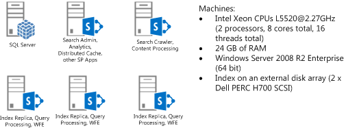
  
- one computer that hosts SQL Server with all of the databases that SharePoint uses
    
- one computer that hosts SharePoint service applications, distributed cache service, search analytics processing, and search administration roles
    
- one computer that hosts the search crawler and content processing (CPC) roles
    
- three computers that host search index nodes with query processing and serve as front-end web servers
    
> [!NOTE]
> The computers in this test are physical computers that run Windows Server 2008 R2. Refer to the Search capacity planning and [Capacity planning for SharePoint Server 2013](capacity-planning.md) for recommendations about how to use virtual machines and Windows Server 2012. 
  
> [!IMPORTANT]
> The configuration for our test lab topology is optimized for search-driven publishing scenarios. This configuration is different from collaboration types of SharePoint deployments. For example, our configuration uses the front-end web servers as search index servers to get the best performance. > In our test lab topology we learned that the computer that hosts the application server was underutilized. As a result, we put the Distributed Cache Service on this application server instead of on a dedicated server. You may decide to host the Distributed Cache Service on a dedicated server in your environment. For best performance we do not recommend that you host the Distributed Cache Service on a front-end web server that has the search index server role. 
  
### Test lab reports

We used the topology in figure 1 for our test lab with physical computers and a Visual Studio Team System (VSTS) load test. For more information, see [Visual Studio Team System](https://go.microsoft.com/fwlink/p/?LinkId=196252). Technical specifications for the test computers are in the following tables.
  
> [!NOTE]
> We did not use browser caching or dependent requests, such as images or JavaScript files in our VSTS tests. Depending on how you customize your publishing site, the amount of dependent requests that occur can vary considerably. > The pages that we used in our tests made almost 50 page load time 1 (PLT1) request types (empty browser cache) and about 3 requests for PLT2 request types (subsequent requests with results from the browser cache). Usually, SharePoint BLOB Cache serves requests for these items and will not alter our performance numbers significantly. 
  
|**Server Components**|**Servers running SharePoint Server**|
|:-----|:-----|
|**Processors** <br/> |Intel Xeon CPUs @2.27GHz (2 processors, 8 cores total, 16 threads total)  <br/> |
|**RAM** <br/> |24 GB  <br/> |
|**Operating system** <br/> |Windows Server 2008 R2 Enterprise SP1, 64-bit  <br/> |
|**Size of the SharePoint drive** <br/> |200 GB on internal disk  <br/> |
|**Storage used for Search Index** <br/> |78 GB on an external disk array (2 x Dell PERC H700 SCSI)  <br/> |
|**Number of network adapters** <br/> |2  <br/> |
|**Network adapter speed** <br/> |1 gigabit  <br/> |
|**Authentication** <br/> |None ─ Anonymous  <br/> |
|**Software version** <br/> |SharePoint Server 2013  <br/> |
   
|**Server Components**|**Database servers**|
|:-----|:-----|
|**Processors** <br/> |Intel Xeon CPUs L5520 @2.27GHz (2 processors, 8 cores total, 16 threads total  <br/> |
|**RAM** <br/> |24 GB  <br/> |
|**Operating system** <br/> |Windows Server 2008 R2 Enterprise SP1, 64-bit  <br/> |
|**Disk Array** <br/> |2 x Dell H700 SCSI  <br/> |
|**Number of network adapters** <br/> |2  <br/> |
|**Network adapter speed** <br/> |1 gigabit  <br/> |
|**Authentication** <br/> |NTLM  <br/> |
|**Software version** <br/> |Microsoft SQL Server 2008 R2 SP1  <br/> |
   
Results from a 10 minute run are as follows:
  
|**Test Features**|**Green Zone**|**Red Zone**|
|:-----|:-----|:-----|
|**Number of VSTS users (simulating concurrent users):** <br/> |60  <br/> |100  <br/> |
|**Server Response Time 50th percentile\*:** <br/> |219 ms.  <br/> |302 ms.  <br/> |
|**Server Response Time 95th percentile\*:** <br/> |412 ms.  <br/> |635 ms.  <br/> |
|**Page views per second:** <br/> |78  <br/> |98  <br/> |
   
This is a cross-site publishing scenario that displays content from the search index. It may be interesting to examine the number of queries that the servers that host search queries serve, and the number of queries that the Anonymous Results Cache serves. In this model, the Anonymous Results Cache serves about 60 percent of the queries. The Anonymous Results Cache is discussed later in this article.
  
|**Test Features**|**Green Zone**|**Red Zone**|
|:-----|:-----|:-----|
|**Total queries per second:** <br/> |235  <br/> |294  <br/> |
|**Queries served from Anonymous Results Cache:** <br/> |145  <br/> |182  <br/> |
|**Queries served from Search:** <br/> |90  <br/> |112  <br/> |
   
The values for the average CPU and peak memory usage for these computers while the tests were running are as follows:
  
|**Test Features**|**Green Zone**|**Red Zone**|
|:-----|:-----|:-----|
|**Average CPU (Search index nodes per front-end web server)** <br/> |59%  <br/> |80%  <br/> |
|**Average CPU (application server including Distributed Cache)** <br/> |8%  <br/> |9%  <br/> |
|**Average CPU (Search CPC nodes)** <br/> |5%  <br/> |5%  <br/> |
|**Average CPU (SQL Server)** <br/> |Not measured  <br/> |Not measured  <br/> |
|**Peak Memory usage (Search index nodes per front-end web server)** <br/> |7.5 GB  <br/> |7.5 GB  <br/> |
|**Peak memory usage (application server including Distributed Cache)** <br/> |10.1 GB  <br/> |10 GB  <br/> |
|**Peak memory usage (Search CPC nodes)** <br/> |6.5 GB  <br/> |6.5 GB  <br/> |
   
Note that the memory usage may differ somewhat because various timer jobs run on the server during normal usage. We found that the index/front-end web server nodes were using as much as 12 GB of memory after a two week test run with a sustained load.
  
#### How Search Web Parts display content on cross-site publishing pages

If a publishing page contains a Search Web Part, such as the Content Search Web Part, the browser starts to process the page before the search query is complete. This improves the perceived latency of the page. After the search query finishes, the complete results of the query are sent to the browser, and the connection to the browser is closed. Users might think that the search results are loaded asynchronously. However, the queries are still issued from the server while the page is being requested.
  
Note that there is a separate asynchronous mode for the Content Search Web Part, where the queries are issued from the browser after a page is loaded.
  
#### Effect of load changes on your cross-site publishing site

We varied the number of VSTS users (similar to the number of concurrent users who access the site) who were used in the load test. The following graph shows that the server response time increases as load increases, and there is some incremental increase in number of pages served per second. We recommend that the server response times are kept under 750 ms. to make sure that users have a responsive experience with the SharePoint deployment.
  
**Figure 2: Chart showing throughput and server response times with different loads**

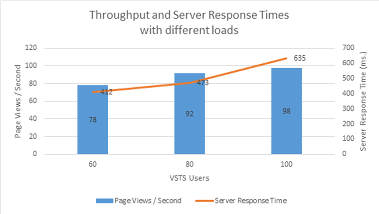
  
#### Scaling out your cross-site publishing site

If the SharePoint deployment is expected to receive more or less traffic compared to the baseline case described earlier, you may want to change the number of computers that are running with the Index and front-end web server role on the farm to accommodate that traffic. The following graph shows the results for scaling out the same cross-site publishing site that has different load patterns and varying number of computers that are used as front-end web servers with Index nodes, starting with a single computer in the front-end web server role with Index nodes, and going up to six computers:
  
**Figure 3: Scaling out your deployment**

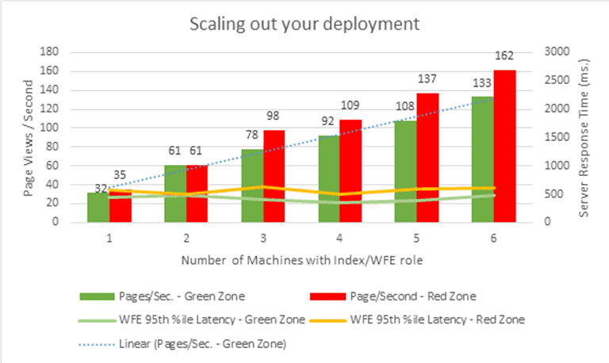
  
In each of the configurations, we adjusted the load to have server response times at similar values compared to the baseline in the previous section.
  
Note that as number of computers increased, the complexity of the topology starts to overtake the gains. Each additional computer has less throughput compared to computers that are already in the environment. These numbers are provided to show the pattern for scaling out. Actual performance will change depending on how the SharePoint deployment is built.
  
#### Guidelines to plan your site

The majority of our performance testing used the deployment that was described in the earlier sections. The guidelines in the following list are meant to help you make correct capacity planning decisions when your deployments differ from the ones we used in our test lab.
  
- More items in the search index generally mean higher latency. Each index partition can contain up to 10 million items. Typical websites rarely have more than 10 million items to show. So they only need one partition as in the topology we described earlier. You can use more index partitions to either host more than 10 million items or to have more, smaller, and faster index partitions. If you plan to use multiple index partitions, refer to [Scale search for Internet sites in SharePoint Server](../search/scale-search-for-internet-sites.md) to correctly size your search topology. 
    
- Each control or Web Part that you add to a page (or page layout) will add some overhead to the server response time for the page.
    
- Avoid using more than five synchronous Content Search Web Parts or Catalog-Item Reuse Web Parts on a page. While processing a request for a page, SharePoint Server 2013 executes as many as five queries in parallel and returns the results. If more than five queries are on a page, SharePoint Server 2013 executes the first five queries before it starts to execute the next set of five queries. If pages require more than five Content Search Web Parts or Catalog-Item Reuse Web Parts, you might run the additional Content Search Web Parts in asynchronous mode or use query rules and result blocks.
    
- Content Search Web Parts and Catalog-Item Reuse Web Parts have an asynchronous mode. The query that is associated with the Web Part is executed after the browser loads the page. Use this mode for slow queries so that the rest of the page appears faster for users. Otherwise, we recommend that you use synchronous queries for best page load times.
    
- A Refinement Panel Web Part that has many refiners increases the time to process a query. You can change the number of refiners to show for a managed property. For more information, see [Configure refiners and faceted navigation in SharePoint Server](configure-refiners-and-faceted-navigation.md)
    
- If you use the Taxonomy Refinement Panel Web Part when you have a deep hierarchy of navigation nodes, the time to process a query increases. We do not recommend the use of the Taxonomy Refinement Panel Web Part on a page that has more than 200 navigation nodes under it. The large number of navigation nodes may cause slow server response times and decrease throughput.
    
- If you must design a SharePoint deployment for high availability, you must add the following:
    
  - An additional computer that runs with the service applications in distributed cache roles in case the existing computer is not available
    
  - Additional computers to sustain the load if one or more of the front-end web server computers with Index nodes are not available
    
  - An additional computer in the CPC roles to make sure updates are still reflected in your site when the computer that has the CPC role is not available
    
  - A SQL Server topology that continues to serve database queries if one of the database servers is not available
    
#### Search crawl speed and content freshness

In our testing, we also conducted tests for the process that updates the catalog content that was being published. We then observed the amount of time that elapsed before an updated item appeared in the publishing site. In our experiments, we made five updates per second to the catalog and set the continuous crawls on the catalog to a one minute interval. We observed that the average time for the changes to appear in the publishing site were about two minutes. The minimum time was just under a minute and the maximum time was three minutes. We did not see a significant change from these numbers when we increased the number of computers that were running with the CPC role.
  
For the full crawl of the catalog, however, an increase in the number of computers that are running with the CPC role increased the number of items processed per second. The following graph shows the relationship of items processed per second and the number of computers in the farm with the CPC role. Note that this test data was obtained from a SharePoint deployment other than the one used in the baseline tests. The findings should apply to the SharePoint deployments because the addition of more CPC nodes results in improved full crawl times.
  
**Figure 4: Effect of content processing (CPC) computers on a full crawl**

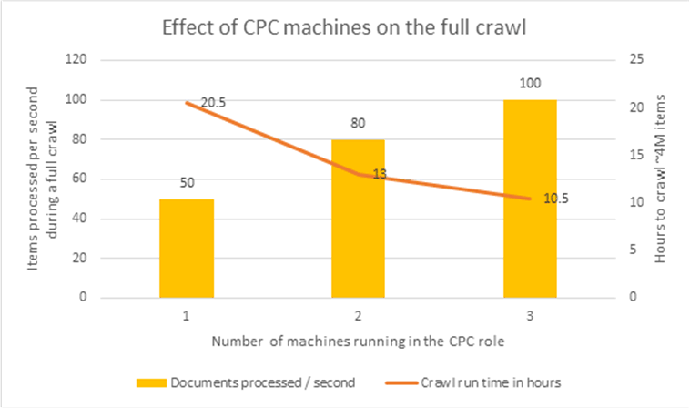
  
Therefore, if you require faster full crawls for your catalogs, you can increase the number of computers that use the CPC role in your deployment.
  
#### Load on Managed Metadata Service application

Our testing shows that publishing scenarios that involve sites that use managed navigation do not have significant memory or CPU requirements on the Managed Metadata service application. For a deployment such as the one we have described earlier, the Managed Metadata service application can be run on a computer that is running other SharePoint service applications. The Managed Navigation feature makes one connection to the service application when it receives the first request for a site. Subsequent requests use values that front-end web servers cache. Therefore there is no load on the Managed Metadata service application while front-end web servers fulfill requests.
  
#### Anonymous Search Results Cache
<a name="anon"> </a>

The Anonymous Search Results Cache stores results of a query, refinement data for the query, and additional result tables that are returned from the SharePoint Distributed Cache Service. Each cache entry depends on the parameters of a query, such as the sort order of the results, the requested refiners, and any dynamic reordering rules. The cache affects all queries that a web application handles including queries from Search Web Parts and the queries from CSOM clients. For more information, see [Overview of search architecture in SharePoint Server](../search/search-architecture-overview.md) and [Scale search for Internet sites in SharePoint Server](../search/scale-search-for-internet-sites.md).
  
This cache is not used for queries that are authenticated because of security concerns.
  
We recommend that you configure the Distributed Cache Service to run only on the computer that runs the SharePoint service applications for best results. The Distributed Cache Service should not run on the computers that are in the front-end web server roles.
  
By default, the Anonymous Search Results Cache refreshes items every 15 minutes. You can use Microsoft PowerShell to configure the cache duration on the web application where the cache is configured:
  
```
$webapp.Properties["SearchResultsCacheTTL"] = <number of seconds to keep in cache> 
$webapp.Update()
```

If you want search results to be fresher than the default value, you lower the value. Note that this increases the number of queries that the Search service will need to serve.
  
We recommend that you always use the cache on publishing pages that receive heavy traffic. Some examples for these types of pages are the site home page and category pages that use Search Web Parts. We do not recommend caching for catalog item pages. Because an individual catalog item page would be accessed much less frequently than a home page, and it may not be worthwhile to store the item in cache.
  
When we turned off the Anonymous Search Results Cache in our test environment that has the same load patterns, server response times increased significantly and throughput in number of page views per second declined. Here's a graph that shows this relationship:
  
**Figure 5: Effect of Anonymous Search Results Cache**

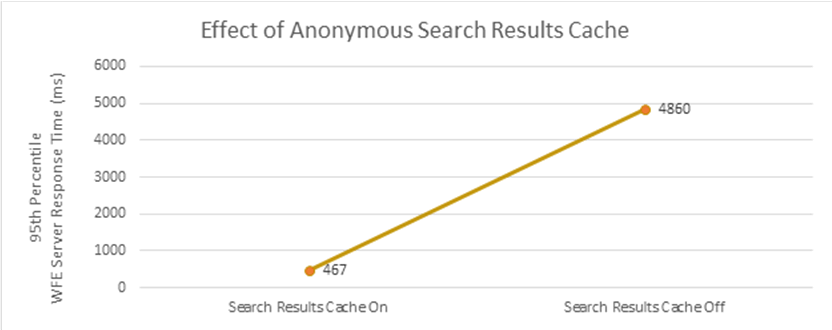
  
By default, Content Search Web Parts are configured to use the Anonymous Search Results Cache. Catalog-Item Reuse Web Parts, which are used on catalog item pages, are not configured to use it due to the sparse access patterns these pages generally exhibit.
  
To configure the caching behavior for an individual Web Part to use (or not use) the Anonymous Search Results Cache, set the value of the sub-property "TryCache" in the  `DataProviderJSON` property of the Web Part. If the value is "true", the query uses the cache. If the value is "false", the query does not use the cache for Anonymous search queries.
  
#### Effect of output cache
<a name="anon"> </a>

Output caching is an effective way to reduce the load on SharePoint Server 2013 in publishing scenarios. For more details about how Output Cache works in this article, see [Output Caching and Cache Profiles](https://msdn.microsoft.com/library/aa661294.aspx).
  
A SharePoint deployment may benefit from Output Caching to reduce the load on SharePoint content databases and the search service application. Here are some example situations:
  
- You are receiving lots of traffic on some of your pages.
    
- You are receiving lots of traffic on SharePoint content databases,
    
- Computers that serve search queries are running with high CPU utilization.
    
We recommend that you use Output Caching for very popular pages on your site, such as the site's home page or top level category pages and certain item pages that receive large amounts of traffic.
  
> [!IMPORTANT]
> There is a known issue in SharePoint Server 2013 when pages that have Output Caching enabled also contain Content Search Web Parts. To avoid this issue in your deployment, install [SharePoint Server 2013 update: March 12, 2013](https://go.microsoft.com/fwlink/p/?LinkID=286308). 
  
The following graph shows some results from our test environment where we use Output Caching on the homepage and category pages that receive 60 percent of the site traffic. 
  
**Figure 6: Effect of output caching for home page and category pages**

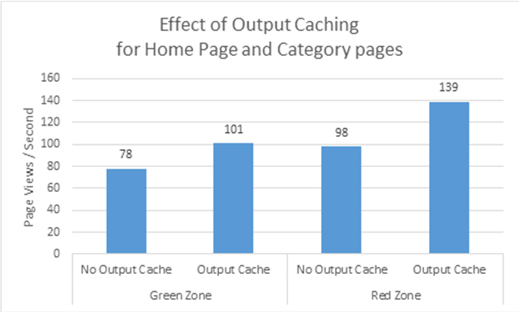
  
> [!NOTE]
> Content Search Web Parts have a setting to run in asynchronous mode. Output Caching does not apply to the load from asynchronous Content Search Web Parts. 
  
#### Usage analytics processing
<a name="anon"> </a>

To have information about usage analytics ready to use, SharePoint Server 2013 processes information that's in the usage database. In our topology Analytics Processing occurs on the node that contains the Search Admin node, Distributed Cache service and other service applications. For more information, see [Overview of analytics processing in SharePoint Server](../search/overview-of-analytics-processing.md)
  
We took some analytics processing time measurements by using the cross-site publishing site that we used in our earlier tests. We measured the time that SharePoint Server 2013 takes to process a large amount of click events on the pages in the site. While these results are from a cross-site publishing site, they also apply to sites that use the author-in-place publishing method.
  
For our tests around usage analytics processing, we generated the following mock events, every day for a week:
  
- 27.5 million click events spread across 3 million list items and 400,000 users.
    
    Zipf distribution was used so that some items and users have many events, but others have less.
    
This generated a total of 7.5 million events per day, simulating different users generating different traffic patterns for the site.
  
We triggered the analysis runs seven times to simulate one week of traffic. We ran the Usage Analytics job every day for the data that we accumulated over six days. Then we measured the time, the seventh day took. The seventh day will be the day that takes longest to process as the complete week's items are processed and the relationship graph is updated. The runtime and disk usage for Day 8 will resemble Day 1.
  
The analytics processing did not have a significant impact on the computer that it ran on, and we continued to successfully serve queries and keep content fresh on the search-driven site.
  
The results are summarized in the following table:
  
|**Test Schedule**|**Update Relationship Graph**|**Runtime (hours)**|**Total Peak Disk Usage**|**Usage Analytics Peak Disk Usage**|
|:-----|:-----|:-----|:-----|:-----|
|**Day 1** <br/> |No  <br/> |02:35  <br/> ||2.65 GB  <br/> |
|**Day 2** <br/> |No  <br/> |02:43  <br/> |||
|**Day 3** <br/> |No  <br/> |03:23  <br/> |||
|**Day 4** <br/> |No  <br/> |04:39  <br/> |||
|**Day 5** <br/> |No  <br/> |06:08  <br/> |||
|**Day 6** <br/> |No  <br/> |07:35  <br/> |||
|**Day 7** <br/> |Yes  <br/> |08:29  <br/> |82.4 GB  <br/> |4 GB  <br/> |
   
The following graph displays the runtimes for the different days:
  
**Figure 7: Runtime hours per day**

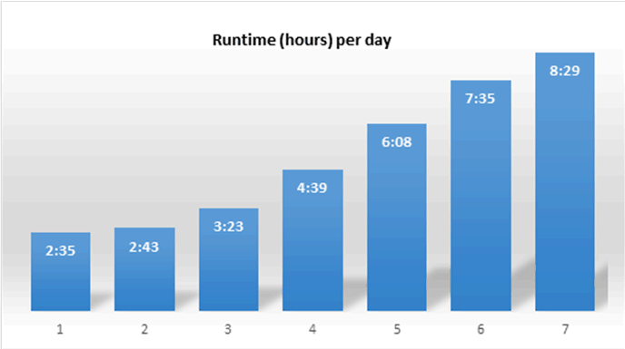
  
#### Cross-site publishing with authenticated users
<a name="anon"> </a>

 SharePoint publishing is used commonly on intranet sites. By using SharePoint Server 2013, these sites can also be powered by cross-site publishing. The following sections show some important distinctions to consider when you plan for a cross-site publishing site that uses authenticated users. Other than the exceptions mentioned in the following sections, the rules that apply to anonymously accessed sites still apply to sites that authenticated users access. 
  
#### Lack of Anonymous Search Results Cache

As mentioned in the [Anonymous Search Results Cache](#anon) section earlier, this cache only takes effect for users who are accessing the SharePoint site anonymously. Compared to anonymously accessed sites that use the Anonymous Search Results Cache, the throughput capacity of sites that are accessed by authenticated users will be significantly lower. Typically intranet sites rarely receive loads as high as the ones mentioned in the previous section (up to 100 page views / second). However, this is an important distinction to consider. 
  
Use of the output cache can ease the lack of Anonymous Search Results Cache to a degree for these scenarios. Cross-site publishing sites that expect multiple page views per second should consider enabling output cache for their sites.
  
> [!IMPORTANT]
>  Content Search Web Parts have a setting that, if it is enabled, causes them to run in asynchronous mode. The output cache does not apply to the load from asynchronous Content Search Web Parts. 
  
#### Larger Search index

Depending on the size of the enterprise that deploys SharePoint Server 2013, intranet deployments for SharePoint Server 2013 will typically index larger numbers of documents. This means that the required Search topology to index those documents will be different compared to the topology described in the previous section. Refer to [Plan search in SharePoint Server](../search/search-planning.md) to size your SharePoint deployment appropriately. 
  
## Author-in-place publishing
<a name="author"> </a>

This section provides guidance and results that use SharePoint Server 2013, but it does not detail the different features that affect capacity planning. For details in this area, see [Web content management in SharePoint Server](web-content-management.md).
  
### Author-in-place publishing with anonymous users

For our tests we worked with a website that has the following characteristics:
  
- Website with up to 20,000 article pages divided into 20 folders of 1,000 pages each across 50 sites in a single site collection.
    
- The site uses structured navigation.
    
- The site generally receives a minimum of 50 to 100 page views per second.
    
- Traffic patterns hit the following mix of pages:
    
  - 20 pages that contain a single Content Query Web Part that issues content database queries of varying scopes (20 percent of the traffic)
    
  - 30 pages that include multiple Content Query Web Parts that issue content database queries of varying scopes (30 percent of the traffic)
    
  - 1,600 articles with 40k of text and two images (receives 50 percent of the traffic)
    
The recommended server topology is in the following diagram:
  
**Figure 8: Author-in-place publishing test topology**

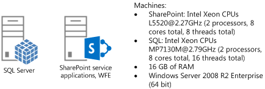
  
- 1 computer hosting SQL Server
    
- 1 computer hosting SharePoint service applications as the front-end web server
    
#### Test lab results

We used the topology shown in the previous diagram in our test lab by using physical computers and a Visual Studio Team System load test.
  
The following table shows the technical specifications that we used in the computers that we tested:
  
|**Server Components**|**SharePoint Servers**|
|:-----|:-----|
|**Processors** <br/> |Intel Xeon CPUs @2.33GHz (2 processors, 8 cores total, 8 threads total)  <br/> |
|**RAM** <br/> |24 GB  <br/> |
|**Operating system** <br/> |Windows Server 2008 R2 Enterprise, 64-bit  <br/> |
|**Number of network adapters** <br/> |2  <br/> |
|**Network adapter speed** <br/> |1 Gbps  <br/> |
|**Authentication** <br/> |None ─ Anonymous  <br/> |
|**Load balancer type** <br/> |Windows software load balancer  <br/> |
|**Software version** <br/> |SharePoint Server 2013  <br/> |
   
|**Server Components**|**Database server**|
|:-----|:-----|
|**Processors** <br/> |Intel Xeon CPUs MP7130M @2.79GHz (2 processors, 8 cores total, 16 threads total  <br/> |
|**RAM** <br/> |16 GB  <br/> |
|**Operating system** <br/> |Windows Server 2008 R2 Enterprise, 64-bit  <br/> |
|**Disk array** <br/> |2 x Dell PERC 5/E  <br/> |
|**Number of network adapters** <br/> |1  <br/> |
|**Network adapter speed** <br/> |1 gigabit or Gbps  <br/> |
|**Authentication** <br/> |NTLM  <br/> |
|**Software version** <br/> |Microsoft SQL Server 2008 R2 SP1  <br/> |
   
The following table shows our results for a 10-minute run:
  
|**Test Features**|**Green Zone**|**Red Zone**|
|:-----|:-----|:-----|
|**Number of VSTS users:** <br/> |5  <br/> |15  <br/> |
|**Server Response Time 50th percentile:** <br/> |69 ms.  <br/> |112 ms.  <br/> |
|**Server Response Time 95th percentile:** <br/> |92 ms.  <br/> |221 ms.  <br/> |
|**Page views per second:** <br/> |57  <br/> |93  <br/> |
|**Average CPU (application server and front-end web server)** <br/> |55  <br/> |97  <br/> |
|**Average CPU (SQL Server)** <br/> |7  <br/> |9  <br/> |
|**Peak memory usage (application server and front-end web server)** <br/> |8.9 GB  <br/> |8.9 GB  <br/> |
   
#### Effect of output cache

Output caching is an effective way to reduce the load on SharePoint Server 2013 in publishing scenarios. For more information, see [Plan for caching and performance in SharePoint Server](caching-and-performance-planning.md).
  
The following table shows our results for a 10-minute run with output cache enabled and a 90 percent hit ratio:
  
|**Test Features**|**Green Zone**|**Red Zone**|
|:-----|:-----|:-----|
|**Number of VSTS users:** <br/> |5  <br/> |15  <br/> |
|**Server Response Time 50th percentile:** <br/> |2 ms.  <br/> |2 ms.  <br/> |
|**Server Response Time 95th percentile:** <br/> |74 ms.  <br/> |88 ms.  <br/> |
|**Page views per second:** <br/> |190  <br/> |418  <br/> |
|**Average CPU (application server and front-end web server)** <br/> |58  <br/> |85  <br/> |
|**Average CPU (SQL Server)** <br/> |5  <br/> |7  <br/> |
|**Peak memory usage (application server and front-end web server)** <br/> |9.2 GB  <br/> |9.4 GB  <br/> |
   
The test results show that using output caching can significantly increase the throughput of a SharePoint publishing site and reduce server response times. For requests served from the output cache, the response times are almost instant.
  
The following graph shows a summary of our testing results:
  
**Figure 9: Effect of output caching with 90% cache hit ratio**

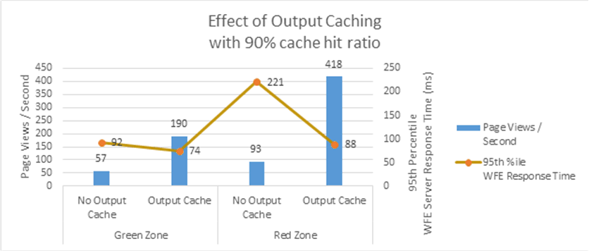
  
#### Effect of managed navigation

In SharePoint Server 2013, publishing sites can also use managed navigation. For details on how to set this up, see [Overview of managed navigation in SharePoint Server](overview-of-managed-navigation.md).
  
We ran the same set of tests for our test site using managed navigation as we used for the structured navigation tests. Our tests show that there is no significant difference in performance when sites use managed navigation or structured navigation.
  
|**Test Features**|**Green Zone**|**Red Zone**|
|:-----|:-----|:-----|
|**Number of VSTS users:** <br/> |5  <br/> |15  <br/> |
|**Server Response Time 50th percentile:** <br/> |70 ms.  <br/> |111 ms.  <br/> |
|**Server Response Time 95th percentile:** <br/> |95 ms.  <br/> |215 ms.  <br/> |
|**Page views per second:** <br/> |56  <br/> |94  <br/> |
|**Average CPU (application server and front-end web server)** <br/> |54  <br/> |97  <br/> |
|**Average CPU (SQL Server)** <br/> |7  <br/> |9  <br/> |
|**Peak memory usage (application server and front-end web server)** <br/> |8 GB  <br/> |8 GB  <br/> |
   
The following graph shows the different types of navigation for the same site:
  
**Figure 10: Managed Navigation versus Structured Navigation**

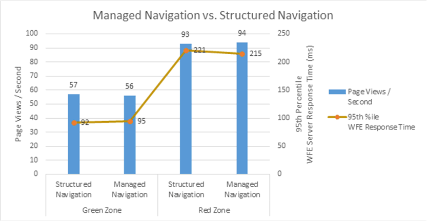
  
#### Effect of adding computers (scaling out)

If you find that you need more throughput from a SharePoint deployment, scaling out (increasing the number of computers that host SharePoint Server 2013) is an option to consider. The following graph shows how throughput increases as we add more computers to the farm:
  
**Figure 11: Effect on throughput by adding front-end web servers**

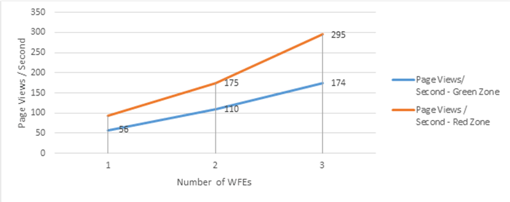
  
In our tests we increased the load on the server running SharePoint Server 2013 for each computer that was added so that the server response times were approximately the same (around 11 milliseconds for the green zone, around 250 milliseconds for the red zone).
  
### Author-in-place publishing sites with authenticated users

The SharePoint publishing feature is used commonly in the intranet where users who access a site are authenticated. This section shows our tests that used authenticated users and the effects.
  
The following table shows the test results of author-in-place publishing sites that authenticated users accessed by using claims-based authentication with NTLM. Note that these tests use identical hardware as the tests in the previous section.
  
|**Test Features**|**Green Zone**|**Red Zone**|
|:-----|:-----|:-----|
|**Number of VSTS users:** <br/> |5  <br/> |15  <br/> |
|**Server Response Time 50th percentile:** <br/> |76 ms.  <br/> |107 ms.  <br/> |
|**Server Response Time 95th percentile:** <br/> |103 ms.  <br/> |194 ms.  <br/> |
|**Page views per second:** <br/> |54  <br/> |100  <br/> |
|**Average CPU (application server and front-end web server)** <br/> |50  <br/> |97  <br/> |
|**Average CPU (SQL Server)** <br/> |6  <br/> |9  <br/> |
|**Peak Memory Usage (application server and front-end web server)** <br/> |9.5 GB  <br/> |9.5 GB  <br/> |
   
The numbers show that there is no significant difference between anonymous versus authenticated requests according to the server response times and throughput.
  
The following graph shows the different types of requests for the same site:
  
**Figure 12: Anonymous requests versus authenticated requests**

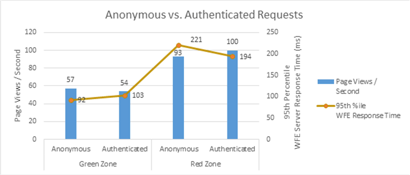
  
#### Effect of Output Cache in authenticated scenarios

Authenticated requests to the server require a roundtrip to the content database to make sure that the account that is accessing the content has permissions to view the content. This means that the output caching performance characteristics of authenticated sites are different compared to anonymous sites.
  
The following table shows the results we received for a 10 minute run with output cache enabled and a 90 percent cache hit ratio:
  
|**Test Features**|**Green Zone**|**Red Zone**|
|:-----|:-----|:-----|
|**Number of VSTS users:** <br/> |6  <br/> |18  <br/> |
|**Server Response Time 50th percentile:** <br/> |17 ms.  <br/> |29 ms.  <br/> |
|**Server Response Time 95th percentile:** <br/> |87 ms.  <br/> |118 ms.  <br/> |
|**Page views per second:** <br/> |114  <br/> |236  <br/> |
|**Average CPU (application server and front-end web server)** <br/> |50  <br/> |97  <br/> |
|**Average CPU (SQL Server)** <br/> |7  <br/> |10  <br/> |
|**Peak Memory Usage (application server and front-end web server)** <br/> |9.9 GB  <br/> |10 GB  <br/> |
   
The following graph shows the summary of these results:
  
**Figure 13: Effect of authenticated output caching**

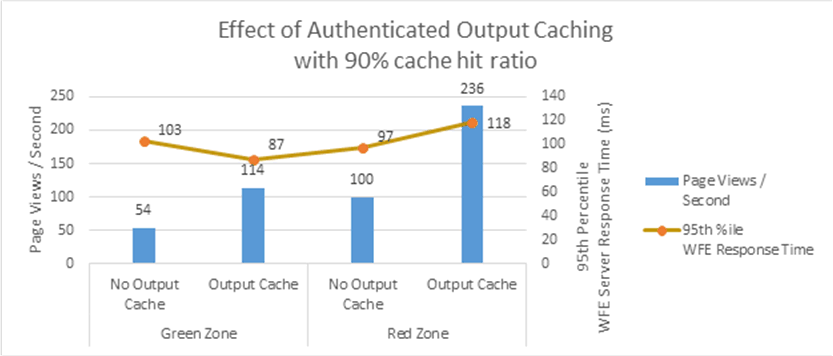
  
## See also
<a name="author"> </a>

#### Concepts

[Web content management in SharePoint Server](web-content-management.md)
  
[Configure web content management solutions in SharePoint Server](configure-web-content-management-solutions.md)
  
[Configure cache settings for a web application in SharePoint Server](cache-settings-configuration-for-a-web-application.md)
  
[Plan for caching and performance in SharePoint Server](caching-and-performance-planning.md)

