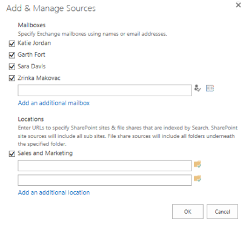

# Add content to a case and place sources on hold in the eDiscovery Center

[!INCLUDE[appliesto-2013-2016-2019-xxx-md](../includes/appliesto-2013-2016-2019-xxx-md.md)]

Content that is part of an eDiscovery case - such as potential evidence for litigation, audits and investigations -can be managed in an eDiscovery Set. Each case can have multiple eDiscovery Sets. You can also filter the source content you include, such as by author or sender, by a date range, or by search keywords. 
  
When a content source is part of a case, you can place it on hold so that a copy is preserved. This includes SharePoint sites, documents, or pages . In SharePoint Server, you can also hold content on searchable file shares. When items are placed on hold, people can continue to work on them without disruption. Content that is being managed by policies will not expire when it is placed on hold.
  
After you have defined content sources, you can run queries and export the content to provide to authorities. The exported content includes a load file based on the Electronic Discovery Reference Model standard. 
  
> [!NOTE]
>  Once you add content sources or queries to an eDiscovery case, changing the regional settings for the site is not supported. 
  
## Create an eDiscovery Set to manage content sources

This procedure creates an eDiscovery Set and adds content sources to it. To also place content on hold, follow the next procedure, Place content sources on hold.
  

  
> [!NOTE]
>  To include sources in a case, they must first be indexed by the SharePoint search service. For more information, see the person that manages the sites and mailboxes you want to include. 
  
1. If your case is not already open, in an eDiscovery Center, click **Cases**, and then click the case that you want to add content sources to.
    
2. Under **eDiscovery Sets**, click **New Item**.
    
3. Type a name for the eDiscovery Set, such as Executive Correspondence.
    
4. Next to **Sources**, click **Add &amp; Manage Sources**.
    
5. Under **Locations**, type the URL for the content you want to use as the source. In SharePoint Server, you can also type a file share address. Any content you include must be indexed by search. 
    
6. Click **Save**.
    
7. In the box under **Filter**, type any keywords you want to use to narrow down the source.
    
8. To narrow down content by a date range, enter the **Start Date** and **End Date**.
    
9. To limit results to the author of a document or list item, or to a specific sender of e-mail messages, type the names or e-mail addresses in the **Author/Sender** box. 
    
10. Click the **Apply Filter** button. 
    
11. To verify that you've selected the right content, click **Preview Results**.
    
12. Click **Save**.
    
> [!NOTE]
>  You can add and remove content sources after you create an eDiscovery Set. To see a list of content sources in an eDiscovery Set, click **Sources**. 
  
## Place content sources on hold

> [!NOTE]
>  To include sources in a case, they must first be indexed by the SharePoint search service. For more information, see the person that manages the sites and mailboxes you want to include. 
  
1. If your case is not already open, in an eDiscovery Center, click **Cases**, and then click the case in which you want to place on hold.
    
2. Under **eDiscovery Sets**, click **New Item**.
    
3. Type a name for the eDiscovery Set, such as Executive Correspondence.
    
4. Next to **Sources**, click **Add &amp; Manage Sources**.
    
5. Under **Locations**, type the URL for the content you want to use as the source. In SharePoint Server, you can also type a file share address. Any content you include must be indexed by search. 
    
6. Click **Save**.
    
7. In the box under **Filter**, type any keywords you want to use to narrow down the source.
    
8. To narrow down content by a date range, enter the **Start Date** and **End Date**.
    
9. To limit results to the author of a document or list item, or to a specific sender of e-mail messages, types the names or e-mail addresses in the **Author/Sender** box. 
    
10. Click the **Apply Filter** button. 
    
11. Click **Enable In-Place** hold. 
    
12. To verify that you've selected the right content, click **Preview Results**.
    
13. Click **Save**.
    
> [!NOTE]
>  After you've placed content on hold, if you want to see a list of content sources for a case, click **Sources**. 
  
## Remove a hold from content sources

1. If your case is not already open, in an eDiscovery Center, click **Cases**, and then click the case in which you want to remove a hold.
    
2. Click **eDiscovery Sets**.
    
3. Under **Sources**, click the name of the source whose hold you want to remove. 
    
4. Click **Disable In-Place Hold**.

  
## Remove an eDiscovery Set from a case

1. If your case is not already open, in an eDiscovery Center, click **Cases**, and then click the case in which you want to remove an eDiscovery Set.
    
2. Click to the left of the eDiscovery Set to select it, so that a check mark appears besides its name.
    
3. Click the three dots **…** to display the **Open Menu**.
    
4. Click **Delete Item**.
    
5. When prompted whether to send the item to the Recycle Bin, click **OK**.

  
## Learn more about holds

- These types of content can be placed on hold as part of a case: 
    
  - Documents
    
  - Lists (including blogs and wiki content)
    
  - Pages (including pages that host blogs and wikis)
    
  - In SharePoint Server, content on file shares that have been crawled by search. 
    
- When you place a hold on the content sources in an eDiscovery set, the hold status for each source is displayed in the **In-Place Hold Status** column in the list of content sources. The following list describes each hold status value. 
    
  - **On hold** Indicates that the entire content source is on hold. This value is displayed when the box under **Filter** is left blank, and In-Place Hold is enabled for the sources in the eDiscovery set. The result is that all content in the specified source is placed on hold. 
    
  - **On hold with filter** Indicates that items that meet the search criteria that's specified in the box under **Filter** in the content source is on hold, and In-Place Hold is enabled for the sources in the eDiscovery set. The result is that content that meets the search criteria in the specified source is placed on hold. 
    
  - **Not on hold** Indicates that the content source is not on hold. 
    
  - **Cannot hold** Indicates that the content source can't be put on hold. 
    
  - **Failed** Indicates that the request to place the content source on hold failed. 
    
  - **Processing** Indicates that the hold request is in progress. This status is displayed after you click **Enable In-Place Hold** and then click **Save** in an eDiscovery set. After a few moments, refresh the eDiscovery set page and this value is replaced with one of the previous values. 
    
- When a hold is placed on a SharePoint site, you can't remove an app from the site. 
    
- When a hold is placed on a SharePoint site, a preservation hold library is created, if one doesn't already exist. Users can still work with the content, but a copy of the content as it was at the time that you initiated the hold is preserved as users change the content. Regular users with typical permissions can't see the preservation hold library. Only users with Web application- level permissions, or users who have been granted specific permissions, can view the preservation hold library.
    
- If a user attempts to change or delete content in a site that is on hold, SharePoint first checks whether the content was changed since the hold was applied. If this is the first modification since the hold was applied, SharePoint copies the content to the preservation hold library, and then allows the user to change or delete the original content.
    
- A user will receive an error if they try to delete a library, list, or site collection that's on hold. Users will also receive an error if they try to delete a folder that contains a file that's on hold. If users want to delete a folder that contains one or more files that are on hold, they have to delete those files before they can delete the folder.
    
- To store all versions of content in a site, you have to enable document versioning for the document libraries in the site. If a document is deleted from a site that's on hold and document versioning is enabled, all versions of the deleted document will be preserved. If document versioning isn't enabled, the version of content that is current at the time that the hold was applied is the only version that is preserved. If the content is changed multiple times after the hold is applied, intermediate versions of the content are not preserved, so that storage space is used more efficiently. Most content in a site typically does not change, and content that is not changed is not copied to the preservation hold library.
    
- If you remove a hold from a site, all files in the preservation hold library will be deleted (moved to the first-stage Recycle Bin) within 7 seven days of removing the hold. That's because a timer job for the preservation hold library runs once every 7 days and identifies items to delete. Files will be deleted the next time the timer job runs after the hold is removed from the site.
    
## Find more information about eDiscovery

For more information about eDiscovery cases, see the following articles:
  
[Scenario: eDiscovery in SharePoint Server 2013 and Exchange Server 2013](/sharepoint/)
  
[Plan and manage cases in the eDiscovery Center](/sharepoint/governance/plan-and-manage-cases-in-the-ediscovery-center)
  
[Create and run queries in the eDiscovery Center](create-and-run-queries-in-the-ediscovery-center.md)
  
[Searching and using keywords in the eDiscovery Center](searching-and-using-keywords-in-the-ediscovery-center.md)
  
[Export content and create reports in the eDiscovery Center](export-content-and-create-reports-in-the-ediscovery-center.md)
