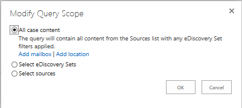

# Create and run queries in the eDiscovery Center

[!INCLUDE[appliesto-2013-2016-2019-xxx-md](../includes/appliesto-2013-2016-2019-xxx-md.md)]

Once you have defined your sources, and placed them on hold if necessary, you can run queries to narrow down and extract exactly the content you need for a particular case. 
  
Efficient queries can make it much easier for you and other people involved in the case to manage the content, because it reduces the overall volume and helps ensure that the content that you deliver is more likely to be relevant.
  
Before creating queries, you should add content sources to your case. Find more information about working with content sources in the article [Add content to a case and place sources on hold in the eDiscovery Center](add-content-to-a-case-and-place-sources-on-hold-in-the-ediscovery-center.md).
  
> [!NOTE]
>  A query can contain a maximum of 100 SharePoint sources, and 500 keywords. 
  
By default, a query searches across all content sources, you can choose which discovery sets or sources a query searches if you don't need to search them all, which can make your queries run faster. You can also refine your queries in other ways. For more information, see [Searching and using keywords in the eDiscovery Center](searching-and-using-keywords-in-the-ediscovery-center.md).
  
1. If your case is not already open, in an eDiscovery Center, click **Cases**, and then open the case you want to create queries for. The case should already have content sources, such as Web sites.
    
2. In the **Search and Export** section, under **Queries**, click **New Item**.
    
3. Type a descriptive name for your query.
    
4. In the **Query** box, type the keywords you want to use to narrow down your query. Find tips for writing queries in the **See Also** section. 
    
5. To narrow down content by a date range, enter the **Start Date** and **End Date**.
    
> [!NOTE]
>  If you type the dates in the **Start Date** and **End Date** boxes, use the format  *mm/*  *dd*  */*  *yyyy*  ; for example, you would use 03/01/2013 to specify March 1, 2013. Use the  *mm/*  *dd*  */*  *yyyy*  format even if the regional settings on the local computer are configured with a different format, such as  *dd*  */mm/*  *yyyy*  . Alternatively, select the start and end dates using the date picker. 
  
1. To limit results to the author of a document or list item, or to a specific sender of e-mail messages, type the names or e-mail addresses in the **Author/Sender** box. 
    
2. If you have multiple sources and Discovery Sets, but don't need to search them all, click **Modify Query Scope**. Then, specify the discovery sets or content sources you want.
    
    
  
3. To narrow down your query by specific types of content, click the **SharePoint** tabs, and then select the checkboxes for the type of content you want. For example, you can select only only PowerPoint slides for SharePoint. 
    
4. To analyze or further refine your query, click **Advanced Query Options**., and do one or more of the following. 
    
  - To examine the syntax and structure of your query, view the **SharePoint Query** sections, and the table of sources that shows filters, queries, and refiners, 
    
5. When you are ready to run your query, click **Search**. The results are ranked based on relevance, such as how frequently a search term appears.
    
> [!NOTE]
>  Once you add queries or content sources to an eDiscovery case, changing the regional settings for the site is not supported. 
  
## Add more content sources while creating a query

1. On the Query:New Item page, in the **Sources** section, click **Modify Query Scope**.
    
2. In the dialog that appears, click **All case content**,
    
3. Click **Add location** for SharePoint content. 
    
4. Specify the person's Web site you want to add.
    
5. Click **OK**.
    
> [!NOTE]
>  If you update a query and rerun it, only the first page of the new results will be refreshed. If you are viewing multiple pages of query results, and you are not viewing the first page, the page will not be refreshed with the new results. 
  
## Find more information about eDiscovery

For more information about eDiscovery cases, see the following articles:
  
[Scenario: eDiscovery in SharePoint Server 2013 and Exchange Server 2013](/sharepoint/)
  
[Plan and manage cases in the eDiscovery Center](/sharepoint/governance/plan-and-manage-cases-in-the-ediscovery-center)
  
[Add content to a case and place sources on hold in the eDiscovery Center](add-content-to-a-case-and-place-sources-on-hold-in-the-ediscovery-center.md)
  
[Searching and using keywords in the eDiscovery Center](searching-and-using-keywords-in-the-ediscovery-center.md)
  
[Export content and create reports in the eDiscovery Center](export-content-and-create-reports-in-the-ediscovery-center.md)
  

