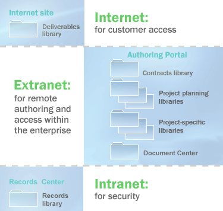
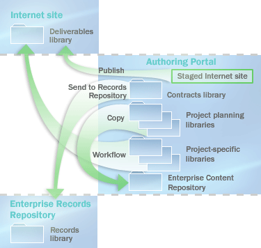

# Plan document libraries in SharePoint Server

[!INCLUDE[appliesto-2013-2016-2019-xxx-md](../includes/appliesto-2013-2016-2019-xxx-md.md)] 
  
This article describes how to plan document libraries in your SharePoint Server document management solution.
  
Document libraries are collections of files on SharePoint Server that you share with other site users. Most document management features are delivered through document libraries. As part of document management planning, you should determine the kind of document libraries that best fit your organization's needs. If you plan document libraries for multiple sites, you might have to plan the flow of content from one site to another. If you plan to use document libraries as storage locations, you can customize the Office **Open** dialog box and the **Save** dialog box to ensure that documents are stored in the preferred location. 
  
Before reading this article, you should understand the document management process described in [Overview of document management in SharePoint 2013](/previous-versions/office/sharepoint-server-2010/cc261933(v=office.14)) . 
  
> [!NOTE]
> The publishing feature, Document Center, Records Center, and Published Links web service are not available in SharePoint Foundation 2013. All other content in this topic applies to SharePoint Server 2016, SharePoint Server 2013 and SharePoint Foundation 2013 unless otherwise noted. 
  
## Determine library type

When you identify which document libraries best match your organization's needs, you might also determine that that you want multiple sites or site collections. For example, if you are authoring content for publication to external customers, you might need one site in which to author and review content and a separate site, perhaps in a separate SharePoint Server installation, in which to publish your content.
  
When you plan document libraries for multiple sites, you might also have to plan how content flows from one site to another — by manual processes, workflows, or custom solutions. For more information, see [Plan the flow of content](#plan_doclib_flow), later in this article.
  
The following table lists typical uses of document libraries.
  
**Table: How document libraries are used**

|**Library**|**Purpose**|
|:-----|:-----|
|Library in a team site    |Collaboration; easy sharing of content among peers; content control, such as versioning; SharePoint Server search.    |
|Library in a portal area    |Content that is intended for a wider audience in the organization; similar to a library in a team site, but typically implemented by using a stricter review and approval process.    |
|Library in a Document Center site (SharePoint Server 2016 and SharePoint Server 2013 only.)    |A large-scale library useful as an enterprise knowledge base or historical archive; includes features to help users navigate, search, and manage lots of documents in a deep hierarchy by using a set of specialized Web Parts.    |
|Library in a Records Center (SharePoint Server 2016 and SharePoint Server 2013 only.)    |Specialized records management; each library corresponds to a record type, such as contract, that the organization must retain for legal compliance purposes; libraries retain documents, metadata, and associated audits and are meant to be read-only.    |
|Library in an Internet site (HTML) (SharePoint Server 2016 and SharePoint Server 2013 only.)    |Content in web pages to incorporate into an Internet or intranet website; SharePoint Server supports editing web pages directly and manages the underlying document libraries for each page automatically.    |
|Library in an Internet site (hybrid) (SharePoint Server 2016 and SharePoint Server 2013 only.)    |Content available for downloading from a website; you can present content from document libraries on an Internet site.    |
   
The following example shows how to use the analysis that you completed in the [Analyze document usage](identify-users-and-analyze-document-usage.md#section2) section in [Identify users and analyze document usage in SharePoint Server](identify-users-and-analyze-document-usage.md) to help you plan document library organization for your enterprise. In this example, Contoso Ltd. delivers content to clients based on market research. The content is created primarily by consultants who operate remotely. This is performed in a cycle in which the following steps occur: 
  
1. A partner evaluates engagement ideas and requests for proposals.
    
2. After a contract is established, a project manager assembles a team of consultants and creates an engagement-specific working site in which the results of the research are recorded and the project is completed.
    
3. When the project is finished, the deliverable documents are published to a secured Internet site, where customers have access to them.
    
4. The team writes best practices documents and case studies based on the project.
    
5. Knowledge managers collect, organize, and archive the best practices and other documents.
    
6. Deliverables, contracts, and other documents are retained as corporate records.
    
7. By using the content maintained by the knowledge managers, partners evaluate opportunities and create new proposals.
    
The following table shows a document usage analysis for this scenario.
  
**Table: Document usage analysis**

|**Documents**|**Purpose**|**Author**|**Users**|**Format**|
|:-----|:-----|:-----|:-----|:-----|
|Engagement ideas and requests    |Develop new customer engagements    |Project leader    |Sales manager; project leader    |.docx    |
|Proposals    |Describe a proposed customer engagement    |Project leader    |Project managers; project team members; customers    |.docx    |
|Contracts    |Commit to a consulting engagement    |Lawyer    |Project leader; project manager; sales manager; customers    |.docx    |
|Research results and project deliverable drafts    |Generate documents related to the customer engagement    |Project leader; project contributor; consultant    |Editors; technical reviewers    |.docx and other types    |
|Deliverable documents    |Generate final deliverables, probably converted from .docx format    |Project leader    |Customers    |.pdf    |
|Best practices and case study documents    |Capture organizational knowledge    |Project contributor; consultant; knowledge manager    |All team members    |Various types    |
|Corporate records - (SharePoint Server 2013 only.)    |Retain some content, such as contracts, as corporate records    |All    |Corporate records managers; corporate lawyers    |All    |
   
This document usage analysis suggests the following requirements:
  
- Project leaders need libraries in team sites for storing engagement ideas, engagement requests, and proposal drafts.
    
- Lawyers need libraries in a portal or on a centralized document management site for storing contract templates and active contracts.
    
- Project leaders and contributors need libraries in team sites for authoring research results, deliverables, and case studies.
    
- Customers need libraries in an Internet site for viewing final deliverables. (SharePoint Server 2016 and SharePoint Server 2013 only.)
    
- All members of the enterprise need access to a Document Center site for viewing best practices and case study documents. (SharePoint Server 2016 and SharePoint Server 2013 only.)
    
- Corporate records managers and lawyers need access to an enterprise Records Center to maintain corporate records. (SharePoint Server 2016 and SharePoint Server 2013 only.)
    
The following figure shows how these libraries might be distributed. The sites are hosted in three site collections: an Internet site collection for customer access, an extranet site collection for remote authoring by team members, and an intranet site collection for secure maintenance of the records management site. (SharePoint Server 2016 and SharePoint Server 2013 only.)
  
**Figure: How document libraries might be distributed**

  
## Plan the flow of content

Content in a document management solution is often dynamic, moving from one site to another as needed to meet users' needs. When you plan document libraries, therefore, you often plan the flow of content from one library or site to another. SharePoint Server 2013 includes the following ways to move content, either manually or dynamically:
  
- You can create custom workflows that copy or move content from one site or library to another. A workflow guides a document through a business process and assigns tasks to participants when their role in the document's life cycle becomes active. A workflow can be designed to move a document from one site or library to another. For information about how to plan workflows, see [Plan content types and workflows in SharePoint 2013](/previous-versions/office/sharepoint-server-2010/cc262735(v=office.14)).
    
- Authors can copy a document to a library in any site in which they have authoring permissions. The relationship between the source and the destination document is maintained so that the copy can be refreshed as needed.
    
- Web pages and whole websites can be staged and published from one site to another, either manually or automatically based on a schedule. (SharePoint Server 2016 andSharePoint Server 2013 only.)
    
- Content can be sent to the records management site by using the SharePoint Server user interface, by using a workflow, or by using a custom solution that is based on the SharePoint Server object model. (SharePoint Server 2016 and SharePoint Server 2013 only.)
    
- By using Web Folders or Network Places, an author can manually copy or move the content of a document library from one library or site to another.
    
Returning to the example, the following figure shows how to apply some of these content flow techniques. Note that the Staged Internet site has been added to the Authoring portal site. (SharePoint Server 2016 and SharePoint Server 2013 only.) 
  
**Figure: How to apply content flow techniques**

  
- By using publishing features, an author can publish web pages to the Internet site. (SharePoint Server 2016 and SharePoint Server 2013 only.)
    
- By using the Copy command, an author can copy documents to the Document Center site.
    
- By using a custom workflow, an author can copy documents to document libraries on the Internet site.
    
- By using the **Send To** command, an author can send contracts to the enterprise records repository. (SharePoint Server 2016 and SharePoint Server 2013 only.) 
    
## Promoting document libraries from Office client applications

> [!IMPORTANT]
> This section only applies to SharePoint Server 2016 and SharePoint Server 2013. 
  
You can customize the Office **Open** dialog box and the **Save** dialog box to encourage organization members to use document libraries as storage locations. By adding sites to the **My Places** bar next to the **Open** dialog box and the **Save** dialog box, you can provide single-click access to the locations where users should store their documents. This makes it possible for team members to interact with the document libraries when they use **Save** from Office client applications, instead of having to go directly to the server to upload their documents.
  
To promote using sites in the **Open** dialog box and the **Save** dialog box, you can publish them by using a web service. This service provides a list of sites targeted to specific users based on their roles or the sites that they are members of. An Office client application can automatically discover this web service through the user's My Sites. Other server products can also implement this web service and provide the location of the service to the Office client application. After the web service is configured, Office adds an entry to the My Places bar and populates it with the locations that are defined by the web service. For more information about the Published Links web service, see [Published Links web service](https://msdn.microsoft.com/library/ms551085.aspx) in the MSDN Library.
  
Or, administrators can set registry keys to add specific sites to the My Places bar in the Office **Open** dialog box and the **Save** dialog box. Registry keys are deployed by using Group Policy and an Active Directory directory service template that is provided in the Office 2013 Resource Kit.
  
You can limit the locations that organization members can save content to by using the Office **Save** dialog box. For example, you can restrict the ability to save files to desktops and force users to save content in a document library. In Office, you can control where users can browse to save their documents. This guides users to save in approved locations. Note that this does not guarantee that users will not save files to their local computers or other unapproved locations. There are many ways to move files onto a computer, and motivated people can work around most restrictions. However, by limiting access to these locations through the Office **Save** dialog box, you can significantly reduce the number of team members who use these unapproved locations.
  
To restrict the locations available in the Office **Save** dialog box, use Group Policy to set the appropriate registry keys to enable this setting and define the approved local, network, or server locations. When this setting is enabled, any location not defined in this manner — including standard links to the Desktop and My Network Places folders — will be removed from the My Places bar. 
  
The list of approved locations can be limited to one or more Office applications. For example, an administrator can restrict save locations in Access while allowing other Office applications to save anywhere.
  

