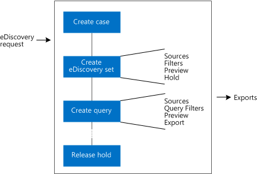
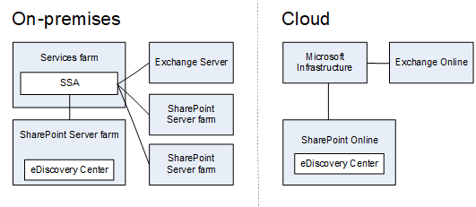

# eDiscovery and in-place holds in SharePoint Server

[!INCLUDE[appliesto-2013-2016-2019-xxx-md](../includes/appliesto-2013-2016-2019-xxx-md.md)]

Electronic discovery, or eDiscovery, is the process of identifying and delivering electronic information that can be used as evidence. The eDiscovery Center, is a type of site collection that serves as a portal for managing eDiscovery cases. From this central location you can discover content in the SharePoint farm, in Exchange Servers 2013, 2016, and 2019, on file shares, and in other SharePoint farms. You can apply a hold to SharePoint and Exchange content that you discover. The hold ensures that a copy of the content is preserved, while still allowing users to work with their content. When you have identified the specific items that you will have to deliver, you can export them in an industry-standard format.
  
    
## Managing an eDiscovery case

When you receive a new request for eDiscovery, you create an eDiscovery case in the eDiscovery Center. An eDiscovery case is a collaboration site that you can use to organize information related to the eDiscovery request. From within an eDiscovery case, you can search for content, apply a hold to content, export content, and view the status of holds and exports that are associated with the case. 
  
The two primary components of an eDiscovery case are eDiscovery sets and queries. Use an eDiscovery set to find content and apply a hold. Use a query to find content and export it.
  
**eDiscovery process flow**

  
To find and preserve content, create an eDiscovery set. Each eDiscovery set contains the following:
  
- Sources, which are locations to be searched. Exchange mailboxes, SharePoint sites, and file shares can all be sources.
    
- A filter, which defines what you are searching for. A filter can include search terms, a date range, and an author's name.
    
- An option to apply an in-place hold to the sources that contain content that matches the filter.
    
To find and export content, create a query. Each query contains the following:
  
- Query filters, which define what you are searching for. Query filters resemble a filter in an eDiscovery set, and can include search terms, a date range, and an author's name. However, query filters in a query can also use stemming.
    
- Sources to be searched. Exchange mailboxes, SharePoint sites, file shares, and eDiscovery sets can all be sources in a query.
    
When you run a query, you can see statistics about the items that were found, you can preview the results, and you can filter the results by message type (for Exchange results) or by file type (for SharePoint results). When you are finished, you can export the results of the query.
  
The content that you export by using a query is formatted according to the Electronic Data Reference Model (EDRM) specification so that it can be imported into a review tool. An export can include the following:
  
- Documents: Documents are exported from file shares. Documents and their versions can be exported from SharePoint Server.
    
- Lists: If a list item is included in the query results, the whole list is exported as a comma-separated values (.csv) file.
    
- Pages: SharePoint pages, such as wiki pages or blogs, are exported as MIME HTML (.mht) files.
    
- Exchange objects: Items in an Exchange Server mailbox, such as tasks, calendar entries, contacts, email messages and attachments are exported as a .pst file. If Skype for Business conversations are archived in Exchange, those can be discovered and exported, too.
    
- Crawl log errors.
    
- An XML manifest that provides an overview of the exported information.
    
## How eDiscovery works in SharePoint products

The Search service application is a key component of the search system in SharePoint Server. You can associate an eDiscovery Center with a Search service application. Any content that's indexed by the Search service application can be discovered from the eDiscovery Center. If you configure the Search service application to crawl file shares, you can use the eDiscovery Center to discover content on the file shares. If you configure the Search service application to crawl other websites - for example, a team site that was created by using SharePoint Server 2010 - you can use the eDiscovery Center to discover content on the websites. For SharePoint Server farms, you can also put the content on hold. If you add Exchange Server to the Search service application as a result source, you can discover content within Exchange mailboxes from the eDiscovery Center and put the mailboxes on hold. If you archive content from Skype for Business in Exchange, you can also discover Skype for Business content.
  
If your environment includes two isolated Search service applications - for example, SharePoint Online and SharePoint Server on-premises - you need to have two eDiscovery Centers to discover content across the farms. 
  
**A separate eDiscovery Center for each isolated Search service application.**

  
As the Search system crawls content, it creates a search index. The search index stores data that's used to provide the results for search queries. The search index also stores information about the permissions that are required to access each piece of content. When a user performs a search, the search system uses the search index to identify the appropriate search results. Before displaying the results, the Search service application performs security trimming, by which the system compares the user's permissions to the permissions that are required to access content that search results link to, and then "trims" the results to show only those results that the user has permissions to view.
  
## In-place holds

SharePoint Server 2013 introduced the concept of an in-place hold. When you apply an in-place hold to a site, content in the site remains in its original location. Users can still work with the content, but a copy of the content as it was at the time that you initiated the hold is preserved. Additionally, if an in-place hold is applied to a site, any new content that's created or added to the site after it was put on hold will be discoverable, and will be preserved if it's deleted. Also, users don't have to know that their content is on hold.
  
> [!IMPORTANT]
> If SharePoint Server runs on a server that uses Alternate Access Mapping (AAM), host-named site collections, or SSL termination format, then users will not be able to edit web pages in a site that has an in-place hold applied. To allow users to edit pages in sites that are on hold, you need to disable loopback checking as described in Method 2 of [KB article 896861](https://go.microsoft.com/fwlink/p/?LinkId=272340). 
  
An in-place hold is applied at the level of a site. When a hold is placed on a SharePoint site, a preservation hold library is created, if one doesn't already exist. The preservation hold library is only visible to site collection administrators so most users can't view it. The search crawler also has special permissions to crawl content in the preservation hold library.
  
> [!NOTE]
> There is one case in which a user can view the preservation hold library. Users who are granted permissions at the web application level can view all content in all site collections within the web application. 
  
If a user attempts to modify or delete content in a site that's on hold, SharePoint first checks whether the content has been modified since the hold was applied. If this is the first modification since the hold was applied, SharePoint copies the content to the preservation hold library, and then allows the user to modify or delete the original content. Note that any content in the site can be copied to the preservation hold library, even if the content doesn't match the filter of the eDiscovery set that initiated the hold.
  
A user receives an error if they try to delete a library, list, or site collection that's on hold. Users also receive an error if they try to delete a folder that contains a file that's on hold. If users want to delete a folder that contains one or more files that are on hold, they have to delete those files before they can delete the folder.
  
The Hold Processing and Reporting timer job generates reports about items on hold and removed item from hold libraries that are pending release. The timer job runs daily and processes eDiscovery in SharePoint Server.
  
Consider the following when planning for in-place holds:
  
- To store all versions of content in a site, you have to enable document versioning for the document libraries in the site. For more information about versioning, see [Enable and configure versioning for a list or library](https://go.microsoft.com/fwlink/?LinkId=275820).
    
- If a document is deleted from a site that's on hold and document versioning is enabled, all versions of the deleted document will be preserved.
    
- As previously mentioned, if a site is put on hold, any new content that's created or added to the site after it was put on hold will be preserved if it's deleted.
    
- If document versioning isn't enabled and an item is placed on hold multiple times, SharePoint preserves the version that's current at the time each hold is placed. For example, if version 27 of an item is the most recent when the site is placed on hold the first time, and version 51 is the most recent when the site is placed on hold the second time, versions 27 and 51 are preserved.
    
- Storage space is used efficiently when an in-place hold is implemented. Most content in a site does not change, and content that's not changed is not copied to the preservation hold library.
    
## Integration with Exchange

You can manage the discovery process for Exchange Servers 2013, 2016, and 2019 from a SharePoint eDiscovery Center. You can do the following:
  
- Add Exchange mailboxes as sources to either an eDiscovery set or a query.
    
- Preview content that's discovered in an Exchange mailbox.
    
- Apply a hold to an Exchange mailbox.
    
- Export content that's discovered in an Exchange mailbox.
    
To discover content in Exchange mailboxes, you must first configure a trust relationship between SharePoint and Exchange. You must also grant specific Exchange permissions to the users of the eDiscovery Center. For more information about these tasks, see [Configure eDiscovery in SharePoint Server](configure-ediscovery-0.md).
  
