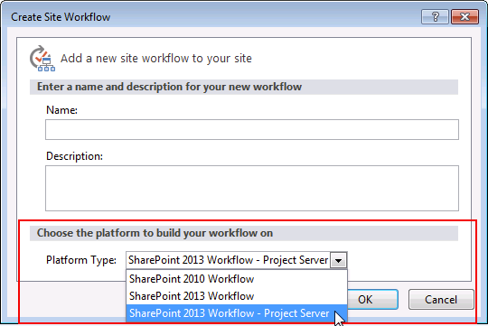
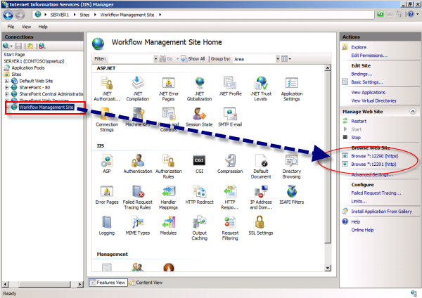

# Install and configure workflow for SharePoint Server

[!INCLUDE[appliesto-2013-2016-2019-xxx-md](../includes/appliesto-2013-2016-2019-xxx-md.md)]
  
This article contains the information and procedures required to configure workflow in SharePoint Server.
  
> [!IMPORTANT]
> The steps in this article apply to SharePoint Server. The SharePoint 2013 Workflow platform is not supported in SharePoint Foundation 2013. 
  
> [!NOTE]
> You can watch a video series that walks through the process of installing and configuring the SharePoint 2013 Workflow platform. To view the videos, see [Video series: Install and configure Workflow in SharePoint Server 2013](video-series-install-and-configure-workflow-in-sharepoint-server-2013.md)
  
## Overview
<a name="section1"> </a>

A new option exists when you build a workflow for SharePoint Server. This option is called **Platform Type**. The figure shows the **Platform Type** option when you are creating a new workflow by using SharePoint Designer 2013. 
  
**Figure: SharePoint Server includes three workflow platform options.**


  
The only platform available when you first install SharePoint Server is the SharePoint 2010 Workflow platform. The SharePoint 2013 Workflow platform and the Project Server platform require additional steps. The three workflow platforms are outlined in the following table.
  
**Workflow Platform types available in SharePoint Server**

|**Platform Type**|**Platform Framework**|**Requirements**|
|:-----|:-----|:-----|
|**SharePoint 2010 Workflow** <br/> |Windows Workflow Foundation 3  <br/> |Installs automatically with SharePoint Server.  <br/> |
|**SharePoint 2013 Workflow** <br/> |Windows Workflow Foundation 4  <br/> |Requires SharePoint Server and Workflow Manager.  <br/> |
|**SharePoint 2013 Workflow - Project Server** <br/> |Windows Workflow Foundation 4  <br/> |Requires SharePoint Server, Workflow Manager, and Project Server.  <br/> |

> [!NOTE]
> Workflow Manager must be downloaded and installed separately from SharePoint Server. It does not install automatically when you install SharePoint Server.

## Install Workflow Manager

Workflow Manager may be installed on the same servers as SharePoint or on separate, dedicated servers. Workflow Manager can be deployed with the Web PI tool. For more information on Web PI, see [Using the Microsoft Web Platform Installer](https://docs.microsoft.com/iis/install/web-platform-installer/using-the-microsoft-web-platform-installer).
   
## Install and configure SharePoint Server
<a name="section3"> </a>

You must install and configure SharePoint Server. To do so, see [Install and deploy SharePoint 2013](/sharepoint/).
  
> [!NOTE]
> The SharePoint 2010 Workflow platform installs automatically when you install SharePoint Server. The SharePoint 2013 Workflow platform requires Workflow Manager and must be installed separately and then configured to work with your SharePoint Server farm. > To function correctly SharePoint 2013 Workflows require to have App Management Service and Site Subscription Service provisioned. It is not required to setup a wildcard certificate and DNS registration but both instances need to be running. 
  
## Configure Workflow Manager to work with the SharePoint Server farm
<a name="section5"> </a>

You must consider the following two key factors before configuring Workflow Manager to work with SharePoint Server.
  
- Is Workflow Manager installed on a server that is part of the SharePoint farm?
    
- Will communication between Workflow Manager and SharePoint Server use **HTTP** or **HTTPS** ? 
    
These factors translate into four scenarios. Each scenario configures a SharePoint Server farm to communicate and function with the Workflow Manager farm. Follow the scenario that matches your circumstance.
  
|||
|:-----|:-----|
|1: Workflow Manager is installed on a server that is part of the SharePoint Server farm. Communication takes place by using HTTP.  <br/> |2: Workflow Manager is installed on a server that is part of the SharePoint Server farm. Communication takes place by using HTTPS.  <br/> |
|3: Workflow Manager is installed on a server that is NOT part of the SharePoint Server farm. Communication takes place by using HTTP.  <br/> |4: Workflow Manager is installed on a server that is NOT part of the SharePoint Server farm. Communication takes place by using HTTPS.  <br/> |
   
> [!NOTE]
> For security reasons, we recommend HTTPS for a production environment. 
  
> [!TIP]
> For information about least-privilege configuration, see [Least Privilege Configuration for Workflow Manager with SharePoint Server 2013](http://blogs.msdn.com/b/briangre/archive/2013/02/20/least-privilege-configuration-for-windows-azure-workflow-with-sharepoint-2013.aspx). 
  
 **To configure Workflow Manager on a server that is part of the SharePoint Server farm and on which communication takes place by using HTTP**
  
1. Log on to the computer in the SharePoint Server farm where Workflow Manager was installed.
    
2. Open the SharePoint Management Shell as an administrator. This is accomplished by right-clicking the **SharePoint Management Shell** and choosing **Run as administrator**.
    
3. Run the **Register-SPWorkflowService** cmdlet. 
    
    **Example**:
    
  ```
  Register-SPWorkflowService -SPSite "http://myserver/mysitecollection" -WorkflowHostUri "http://workflow.example.com:12291" -AllowOAuthHttp
  ```

4. Log on to each server in the SharePoint Server farm.
    
    Each server in the SharePoint Server farm must have the Workflow Manager Client installed.
    
    > [!NOTE]
    > When you install Workflow Manager on a server it automatically installs the Workflow Manager Client on that server. You will still need to install the Workflow Manager Client on any additional servers. For example, if you have a farm that contains five servers and you install Workflow Manager on one of those servers you will still need to install the Workflow Manager Client on the four additional servers. 
  
5. Install the Workflow Manager Client on each server in the SharePoint farm.
    
    Download and install the Workflow Manager Client here: [http://go.microsoft.com/fwlink/p/?LinkID=268376](http://go.microsoft.com/fwlink/p/?LinkID=268376)
    
 **To configure Workflow Manager on a server that is part of the SharePoint Server farm and on which communication takes place by using HTTPS**
  
1. Determine if you need to install Workflow Manager certificates in SharePoint.
    
    Under some circumstances, you have to obtain and install Workflow Manager certificates. If your installation requires that you obtain and install these certificates, you must complete that step before continuing. To learn whether you need to install certificates, and for instructions, see [Install Workflow Manager certificates in SharePoint Server](install-workflow-manager-certificates-in-sharepoint-server.md).
    
2. Log into the computer in the SharePoint Server farm where Workflow Manager was installed.
    
3. Open the SharePoint Management Shell as an administrator. This is accomplished by right-clicking the **SharePoint Management Shell** and choosing **Run as administrator**.
    
4. Run the **Register-SPWorkflowService** cmdlet. 
    
    **Example**:
    
  ```
  Register-SPWorkflowService -SPSite "https://myserver/mysitecollection" -WorkflowHostUri "https://workflow.example.com:12290"
  ```

5. Log on to each server in the SharePoint Server farm.
    
    Each server in the SharePoint Server farm must have the Workflow Manager Client installed.
    
    > [!NOTE]
    > When you install Workflow Manager on a server it automatically installs the Workflow Manager Client on that server. You will still have to install the Workflow Manager Client on any additional servers. For example, if you have a farm that contains five servers and you install Workflow Manager on one of those servers you will still need to install the Workflow Manager Client on the four additional servers. 
  
6. Install the Workflow Manager Client on each server in the SharePoint farm.
    
    Download and install the Workflow Manager Client here: [http://go.microsoft.com/fwlink/p/?LinkID=268376](http://go.microsoft.com/fwlink/p/?LinkID=268376)
    
 **To configure Workflow Manager on a server that is NOT part of the SharePoint Server farm and on which communication takes place by using HTTP**
  
1. Log on to each server in the SharePoint Server farm.
    
2. Install the Workflow Manager Client on each server in the SharePoint farm.
    
    Before you can run the workflow pairing cmdlet, you must install Workflow Manager Client on each of the servers in the SharePoint farm.
    
    Download and install the Workflow Manager Client here: [http://go.microsoft.com/fwlink/p/?LinkID=268376](http://go.microsoft.com/fwlink/p/?LinkID=268376)
    
3. Open the SharePoint Management Shell as an administrator. This is accomplished by right-clicking the **SharePoint 2013 Management Shell** command and choosing **Run as administrator**.
    
4. Run the **Register-SPWorkflowService** cmdlet. The cmdlet should be run only once and can be run from any of the servers in the SharePoint farm. 
    
    **Example**:
    
  ```
  Register-SPWorkflowService -SPSite "http://myserver/mysitecollection" -WorkflowHostUri "http://workflow.example.com:12291" -AllowOAuthHttp
  ```

> [!IMPORTANT]
> You must install the Workflow Manager Client on each server in the SharePoint farm before you run the pairing cmdlet. 
  
 **To configure Workflow Manager on a server that is NOT part of the SharePoint Server farm and on which communication takes place by using HTTPS**
  
1. Determine whether you need to install Workflow Manager certificates in SharePoint 2013.
    
    Under some circumstances, you have to obtain and install Workflow Manager certificates. If your installation requires that you obtain and install these certificates, you must complete that step before continuing. To learn whether you need to install certificates, and for instructions, see [Install Workflow Manager certificates in SharePoint Server](install-workflow-manager-certificates-in-sharepoint-server.md).
    
2. Log on to each server in the SharePoint Server farm.
    
3. Install the Workflow Manager Client on each server in the SharePoint farm.
    
    Before you can run the workflow pairing cmdlet, you must install Workflow Manager Client on each of the servers in the SharePoint farm.
    
    Download and install the Workflow Manager Client here: [http://go.microsoft.com/fwlink/p/?LinkID=268376](http://go.microsoft.com/fwlink/p/?LinkID=268376)
    
4. Open the SharePoint Management Shell as an administrator. This is accomplished by right-clicking the **SharePoint Management Shell** command and choosing **Run as administrator**.
    
5. Run the **Register-SPWorkflowService** cmdlet. 
    
    **Example**:
    
  ```
  Register-SPWorkflowService -SPSite "https://myserver/mysitecollection" -WorkflowHostUri "https://workflow.example.com:12290"
  ```

> [!IMPORTANT]
> You must install the Workflow Manager Client on each server in the SharePoint farm before you run the pairing cmdlet. 
  
## Validate the installation
<a name="section6"> </a>

Use these steps to validate that you have successfully installed and configured the required components.
  
 **To validate the installation**
  
1. Add a user to your SharePoint site, and grant the user Site Designer permissions.
    
2. Install SharePoint Designer 2013 and create a workflow based on the SharePoint 2013 Workflow platform. For more information, see [Creating a workflow by using SharePoint Designer 2013 and the SharePoint 2013 Workflow platform](http://msdn.microsoft.com/library/jj554671%28v=office.15%29).
    
3. Run this workflow from the SharePoint user interface.
    
## Troubleshooting
<a name="section7"> </a>

For security reasons, the Setup account cannot be used to create a workflow based on the SharePoint 2013 Workflow platform. If you try to create a workflow based on the SharePoint 2013 Workflow platform by using SharePoint Designer 2013, you receive a warning that the list of workflow actions do not exist, and the workflow is not created.
  
The user who deploys and runs a workflow must be added to the User Profile service. Check the User Profile service application page in Central Administration to confirm that the user you are using to validate workflow installation is in the User Profile service.
  
You can determine which ports SharePoint Server and Workflow Manager are using for both HTTP and HTTPS by using IIS Manager as shown in the figure.
  
**Figure: Use IIS Manager to view the ports used by Workflow Manager**


  
Workflow Manager communicates by using TCP/IP or Named Pipes. Make sure that the appropriate communication protocol is enabled on the SQL Server instance that hosts the Workflow Manager databases.
  
The SQL Browser Service must be running on the SQL Server instance that hosts the Workflow Manager databases.
  
The System Account cannot be used to develop a workflow.
  
To troubleshoot SharePoint Server, see [Troubleshooting SharePoint Server](../administration/troubleshoot.md).
  

