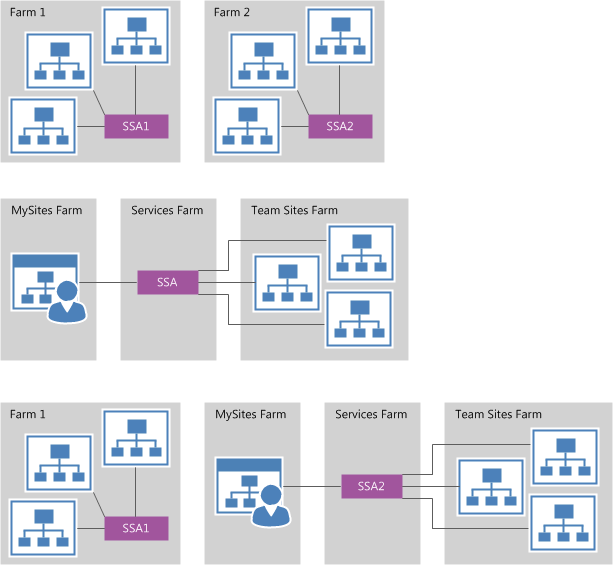

# Plan for eDiscovery in SharePoint Server

[!INCLUDE[appliesto-2013-2016-2019-xxx-md](../includes/appliesto-2013-2016-2019-xxx-md.md)] 
  
There are several factors to consider before you implement eDiscovery. First, determine how many eDiscovery Centers you need and where to put the eDiscovery Centers. Then identify the locations that contain content that can be discovered. Finally, consider the permissions that you have to grant to eDiscovery users. The decisions that you make when you plan for eDiscovery might affect other systems that your organization uses, such as Exchange Servers 2019, 2016, or 2013. Accordingly, you might have to coordinate with the people who manage those systems when you create and implement your plan.
  
To implement your plan, follow the instructions in the article [Configure eDiscovery in SharePoint Server](configure-ediscovery-0.md). The decisions that you make during planning determine which tasks to do.
  
Before you read this article, you should understand the concepts that are presented in the article [eDiscovery and in-place holds in SharePoint Server](ediscovery-and-in-place-holds-in-sharepoint-server.md).
  
## Decide how many eDiscovery Centers

The following factors affect the number of eDiscovery Centers that you have to create:
  
- How many Search service applications you have.
    
- What content each Search service application crawls.
    
If you have only one Search service application, or if there is a single Search service application that crawls all of the sites that contain discoverable content, you can have a single eDiscovery Center. If different Search service applications crawl subsets of the discoverable content, you have to have multiple eDiscovery Centers. Associate eDiscovery Centers with Search service applications so that all discoverable content is crawled by a Search service application that is associated with an eDiscovery Center.
  
The following figure presents three examples of farm topologies and illustrates how many eDiscovery Centers are required for each example.
  
**How many Search service applications you have influences how many eDiscovery Centers you have.**

  
A Search service application in an on-premises SharePoint farm cannot crawl content in SharePoint Online. If you have discoverable content in SharePoint Online, you will also have to create an eDiscovery Center in SharePoint Online.
  
Record how many eDiscovery Centers you will have.
  
An eDiscovery Center must be in a web application that supports claims authentication. For each eDiscovery Center, record the farm that will contain the eDiscovery Center and the Search service application with which to associate the eDiscovery Center.
  
## Identify discoverable content

After you have determined how many eDiscovery Centers you will have and where the eDiscovery Centers will be, identify the content that each Search service application will crawl.
  
To be discoverable, content on file shares, in SharePoint sites, or on other web sites must be crawled by a Search service application that is associated with an eDiscovery Center.
  
> [!NOTE]
> A file on a file share whose file name is longer than 259 characters cannot be discovered. 
  
List all the locations that contain content that must be discoverable. If you have more than one eDiscovery Center, indicate which Search service application will crawl each content source.
  
If you want to manage the discovery of Exchange Servers 2019, 2016, or 2013 content from a SharePoint Server eDiscovery Center, you must configure a Search service application to include Exchange Server 2019, 2016, or 2013 as a result source. If you want to manage the discovery of Skype for Business Server 2015 content from a SharePoint Server eDiscovery Center, you must configure Skype for Business Server 2015 to archive content to either Exchange Server 2019, 2016 or 2013.

> [!NOTE]
> SharePoint Server 2019 with Exchange 2019, enables Outlook on the web users to link to and share documents that are stored in OneDrive for Business instead of attaching files to messages. Users in SharePOint Server 2019 can collaborate on files the same way as in Office 365. You'll need to run Office Online Server in your environment to do this. For more information, see the [Document collaboration](/Exchange/new-features/new-features?view=exchserver-2019#document-collaboration) section in **What's new in Exchange Server**.
  
> [!NOTE]
> To manage discovery of Exchange content through SharePoint Server 2013, you must be using Exchange Server 2013. To manage discovery of Lync content through SharePoint, you must be using both Lync Server 2013 and Exchange Server 2013. 
  
## Determine how to manage permissions

People who perform eDiscovery must be able to view all content that is potentially discoverable. We recommend that you create a security group for eDiscovery users, and add the appropriate users to the security group. Then you can grant permissions to the security group, instead of to individual users. Choose a name for the security group, and record this name and also record which users will be members of the security group.
  
Within SharePoint Server, eDiscovery users must be able to view all content. This includes content that is in the preservation hold library. (For more information about the preservation hold library, see [eDiscovery and in-place holds in SharePoint Server](ediscovery-and-in-place-holds-in-sharepoint-server.md). There are two ways to achieve this:
  
1. Grant eDiscovery users access to all content in a web application by using web application user policy.
    
2. Add eDiscovery users as site collection administrators for every site collection that contains discoverable content.
    
We recommend that you grant permissions at the web application level, if that is possible in your environment.
  
> [!NOTE]
> Because SharePoint Online is a hosted service, administrators cannot access web applications directly. Therefore, in SharePoint Online you must explicitly add eDiscovery users as site collection administrators on each site collection that contains discoverable content. 
  
Decide whether you will grant permissions by web application or by site collection. If you will grant permissions at the web application level, identify which web applications you will have to grant access to eDiscovery users. (It is likely that this will be all web applications.) If you will grant permissions at the site collection level, identify which site collections eDiscovery users will need access to and record your decisions.
  
Generally, when you export content for eDiscovery, you will also want to export a list of things that could not be indexed. The search crawl log contains this information. Therefore, eDiscovery users also have to have access to the search crawl log.
  
## See also

#### Concepts

[eDiscovery and in-place holds in SharePoint Server](ediscovery-and-in-place-holds-in-sharepoint-server.md)
  
[Configure eDiscovery in SharePoint Server](configure-ediscovery-0.md)

[Search and place a hold on public folders using In-Place eDicovery](/Exchange/policy-and-compliance/ediscovery/search-public-folders?view=exchserver-2019)
