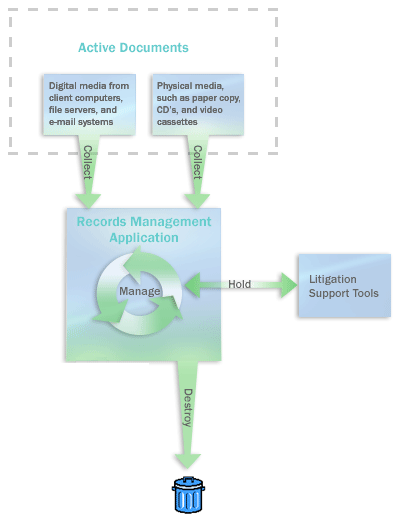

# Records management in SharePoint Server

[!INCLUDE[appliesto-2013-2016-2019-xxx-md](../includes/appliesto-2013-2016-2019-xxx-md.md)] 
  
A record is a document or other electronic or physical entity in an organization that serves as evidence of an activity or transaction performed by the organization and that requires retention for some time period. Records management is the process by which an organization: 
  
- Determines what kinds of information should be considered records.
    
- Determines how active documents that will become records should be handled while they are being used, and determines how they should be collected after they are declared to be records.
    
- Determines in what manner and for how long each record type should be retained to meet legal, business, or regulatory requirements.
    
- Researches and implements technological solutions and business processes to help ensure that the organization complies with its records management obligations in a cost-effective and non-intrusive way.
    
- Performs records-related tasks such as disposing of expired records or locating and protecting records that are related to external events such as lawsuits.
    
Determining which documents and other physical or electronic items in your organization are records is the responsibility of corporate compliance officers, records managers, and lawyers. By carefully categorizing all enterprise content in your organization, these people can help you ensure that documents are retained for the appropriate period of time. A well-designed records management system helps protect an organization legally, helps the organization demonstrate compliance with regulatory obligations, and increases organizational efficiency by promoting the disposition of out-of-date items that are not records.
  

  
A records management system includes the following elements:
  
- **A content analysis** that describes and categorizes content in the enterprise that can become records, that provides source locations, and that describes how the content will move to the records management application. 
    
- **A file plan** that indicates, for each kind of record in the enterprise, where they should be retained as records, the policies that apply to them, how long they must be retained, how they should be disposed of, and who is responsible for managing them. 
    
- **A compliance requirements document** that defines the rules that the organization's IT systems must follow to ensure compliance and the methods that are used to ensure the participation of enterprise team members. 
    
- **A method for collecting records that are no longer active** from all record sources, such as collaboration servers, file servers, and email systems. 
    
- **A method for auditing records** while they are active. 
    
- **A method for capturing records' metadata** and audit histories and for maintaining them. 
    
- **A process for holding records** (suspending their disposition) when events such as litigations occur. 
    
- **A system for monitoring and reporting on the handling of records** to ensure that employees are filing, accessing, and managing them according to defined policies and processes. 
    
SharePoint Server includes features that can help organizations implement integrated records management systems and processes.
  
## Overview of records management planning

This topic describes the planning steps that you should take to help make sure that the records management system that you implement based on SharePoint Server will achieve your organization's records management goals. The following is a preview of the records management planning process:
  
1. **Identify records management roles** Successful records management requires specialized roles, such as the following: 
    
  - Records managers and compliance officers to categorize the records in the organization and to run the records management process.
    
  - IT personnel to implement the systems that efficiently support records management.
    
  - Content managers to find where organizational information is kept and to make sure that that their teams follow records management practices.
    
2. **Analyze organizational content** Before creating a file plan, records managers and content managers survey document usage in the organization to determine which documents and other items can become records. 
    
3. **Develop a file plan** After you have analyzed your organizational content and determined retention schedules, fill in the rest of the file plan. File plans differ from organization to organization, but generally they describe the kinds of items the enterprise acknowledges to be records, indicate where they are stored, describe their retention periods, and provide other information, such as who is responsible for managing them and which broader category of records they belong to. 
    
4. **Develop retention schedules** For each record type, determine when it is no longer active (being used), how long it should be retained after that, and how it should ultimately be disposed of. 
    
5. **Evaluate and improve document management practices** Make sure that required policies are being applied in document repositories. For example, make sure that that content is being appropriately audited so that suitable audits are retained together with records. 
    
6. **Design the records management solution** Determine whether to create a records archive, to manage records in place, or to use a combination of the two approaches. Based on your file plan, design the record archive, or determine how to use existing sites to contain records. Define content types, libraries, policies, and, when it is required, metadata that determines the location to route a document to. 
    
7. **Plan how content becomes records** If you are using SharePoint Server for both active document management and records management, you can create custom workflows to move documents to a records archive. If you are using either SharePoint Server or an external document management system, you can plan and develop interfaces that move content from those systems to the records archive, or that declare a document to be a record but do not move the document. You also create a training plan to teach users how to create and work with records. 
    
8. **Plan email integration** Determine whether you will manage email records within SharePoint Server , or whether you will manage email records within the email application itself. 
    
9. **Plan compliance for social content** If your organization uses social media such as blogs, wikis, or My Sites, determine how this content will become records. 
    
10. **Plan compliance reporting and documentation** To verify that your organization is performing its required records management practices, and to communicate these practices, you should document your records management plans and processes. If your enterprise becomes engaged in records-related litigation, you might have to produce these records management guidelines, implementation plans, and metrics on effectiveness. 
    

