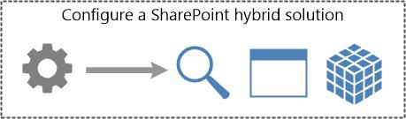

# Configure a hybrid solution for SharePoint Server

[!INCLUDE[appliesto-2013-2016-2019-SPO-md](../includes/appliesto-2013-2016-2019-SPO-md.md)] 
  

  
Configuring and deploying one or more SharePoint hybrid solutions takes place in the final phase of the SharePoint hybrid environment deployment process and is the ultimate reason for configuring a SharePoint hybrid environment.
  
Be sure you're [following a roadmap](configuration-roadmaps.md) when you read the articles in this section. 
  

