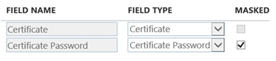

# Configure connectivity from Office 365 to SharePoint Server

[!INCLUDE[appliesto-2013-2016-2019-SPO-md](../includes/appliesto-2013-2016-2019-SPO-md.md)]
  
 **This article is part of a roadmap of procedures for configuring SharePoint hybrid solutions. Be sure you're [following a roadmap](configuration-roadmaps.md) when you do the procedures in this article. **
  
This article contains guidance the SharePoint hybrid environment deployment process, which integrates SharePoint Server and SharePoint Online.
  
## Before you begin
<a name="begin"> </a>

 **Accessibility note:**SharePoint Server supports the accessibility features of common browsers to help you administer deployments and access sites. For more information, see [Accessibility for SharePoint 2013](/SharePoint/accessibility-guidelines).
  
If you haven't already done this, read [Plan connectivity from Office 365 to SharePoint Server](plan-connectivity-from-office-365-to-sharepoint-server.md) before you start to configure anything.This is important because the planning article helps you make important decisions and record them on the [SharePoint hybrid deployment worksheet](https://go.microsoft.com/fwlink/?LinkId=391835), referred to in the rest of this article as the worksheet. This in turn informs which procedures in this article to use and which you can skip over.
  
If you've read the planning article, you should have already done the following:
  
- Decided which site collection strategy you'll configure for hybrid.
    
- Decided whether to use an existing web application or create one for hybrid.
    
|||
|:-----|:-----|
||These decisions are recorded in Table 2 of the worksheet. If not, go back and read [Plan connectivity from Office 365 to SharePoint Server](plan-connectivity-from-office-365-to-sharepoint-server.md) and make these decisions before you go any further.  <br/> |
   
### Worksheet tips

Things will go a lot easier if all of the applicable information is entered on the [SharePoint hybrid worksheet](https://go.microsoft.com/fwlink/?LinkId=391835) before you start to configure anything. At a minimum, you need to know the following things to use this article. 
  
**Table: Decisions that should already be recorded on the SharePoint hybrid worksheet**

|**Decision**|**Location on the worksheet**|
|:-----|:-----|
|Will you use an existing web application for hybrid or create one?  <br/> |**New or existing web application** row of Table 2  <br/> |
|What site collection strategy will you use?  <br/> |**Site collection strategy** row of Table 2  <br/> |
|What's the External URL?  <br/> |**External URL** row of Table 3  <br/> |
|What's the IP address of the Internet-facing endpoint on the reverse proxy device that the external URL is associated with?  <br/> |**IP address of the external endpoint** row of Table 3  <br/> |
   
Verify that these decisions are entered on the worksheet before you continue.
  
### Configuration phases

In order to configure the environment infrastructure, you'll need both SharePoint Server interfaces, such as the SharePoint Central Administration website, and the Administration pages in SharePoint Online. To prevent you from having to switch between these interfaces more than necessary, we've organized the configuration steps into the following phases:
  
- [Prepare your public domain](configure-inbound-connectivity.md#preparedomain)
    
- [Configure SharePoint Server](configure-inbound-connectivity.md#configureSPServer)
    
- [Create and configure a target application for the SSL certificate in SharePoint Online](configure-inbound-connectivity.md#configurespo)
    
- [Validation and next steps](configure-inbound-connectivity.md#more)
    
Please complete each configuration step in the order shown in this article.
  
> [!IMPORTANT]
> It is recommended that you thoroughly document your deployment strategy and that you maintain detailed work logs during the hybrid environment configuration process. In any complex implementation project, a detailed record of every design decision, server configuration, procedure, and output is a very important reference for troubleshooting, support, and awareness. 
  
## Prepare your public domain
<a name="preparedomain"> </a>

In order for Office 365 to send requests to the external endpoint of your reverse proxy device, you need to have the following things:
  
- A public domain registered with a domain registrar, such as GoDaddy.com, that the URL of the external endpoint of the reverse proxy device is associated with.
    
- An A record in your public domain's DNS zone that's associated with the published SharePoint site (which is the External URL, such as spexternal.adventureworks.com). This enables Office 365 to send requests to the external endpoint on the reverse proxy device that's configured for hybrid. This A record maps the External URL to the IP address of the Internet-facing endpoint of the reverse proxy device. For more information, see [Plan connectivity from Office 365 to SharePoint Server](plan-connectivity-from-office-365-to-sharepoint-server.md).
    
If you don't yet have a public domain that you want to use for this purpose (such as adventureworks.com), get one now, and then create this A record. If you already took care of this during the planning phase, the name of your public domain and the IP address that you need to create this A Record are recorded in Table 3 of the worksheet.
  
You have to complete the steps in the [Add your domain to Office 365](https://go.microsoft.com/fwlink/?LinkId=392208) article to add the host name of your public domain to Office 365. 
  
## Configure SharePoint Server
<a name="configureSPServer"> </a>

This section tells you how to configure the SharePoint Server farm for use in an inbound hybrid solution. We've organized the steps for this section into the following phases. For the most reliable outcome, complete the procedures in the order shown.
  
- Configure a site collection strategy
    
- Assign a UPN domain suffix
    
- Synchronize user profiles
    
- Configure OAuth over HTTP (if it's required)
    
> [!NOTE]
> The procedures in this section assume that you have an existing SharePoint Server farm that you intend to use for hybrid functionality. 
  
### Configure a site collection strategy
<a name="configsitecoll"> </a>

In a hybrid environment, data is exchanged between the root site collection in SharePoint Online and a specific web application in the on-premises SharePoint farm that's configured for hybrid. We call this the primary web application. This web application is the focal point on which your site collection strategy is configured.
  
During the planning phase, you should have decided whether you'll use an existing web application or create one and which site collection strategy you'll configure. If so, your decisions are listed in the **Site collection strategy** row of Table 2 of the worksheet. If you haven't decided yet, review the [Plan connectivity from Office 365 to SharePoint Server](plan-connectivity-from-office-365-to-sharepoint-server.md) article and make these decisions before you go any further. 
  
Choose one of the following site collection strategies to configure:
  
- [Configure a site collection strategy by using a host-named site collection](configure-inbound-connectivity.md#hostnamedsc)
    
- [Configure a site collection strategy by using a path-based web application without AAM](configure-inbound-connectivity.md#pathbasedwoaam)
    
- [Configure a site collection strategy by using a path-based web application with AAM](configure-inbound-connectivity.md#pathbasedwaam)
    
#### Configure a site collection strategy by using a host-named site collection
<a name="hostnamedsc"> </a>

If you want to configure a site collection strategy by using a host-named site collection for the SharePoint hybrid environment, complete these steps in the order shown:
  
1. Ensure that the web application and root site collection exist.
    
2. Ensure that an SSL binding exists on the primary web application.
    
3. Create the host-named site collection.
    
4. Configure split DNS.
    
5. Create an A record in the on-premises DNS.
    
For more information about site collection strategy decisions, see the [Choose a site collection strategy](plan-connectivity-from-office-365-to-sharepoint-server.md#scstrategy) section of [Plan connectivity from Office 365 to SharePoint Server](plan-connectivity-from-office-365-to-sharepoint-server.md).
  
#### Ensure that the primary web application and root site collection exist
<a name="hn_webapp"> </a>

The host-named site collection that you'll create a bit later has to be created in a web application that's configured to use the following:
  
- Integrated Windows Authentication with NTLM
    
- https protocol (Secure Sockets Layer) 
    
You also need a path-based site collection to use as the root site collection in this web application.
  
|||
|:-----|:-----|
||If you identified a web application that you want to use during planning, it should be listed in the **Primary web application URL** row of Table 5a of the worksheet. |
   
If the web application and root site collection don't exist, you'll have to create them. You can do this by using either Central Administration or the SharePoint 2016 Management Shell. If they already exist, go to [Ensure that an SSL binding exists on the primary web application](configure-inbound-connectivity.md#hnsc_sslbinding).
  
 **Here's an example for how to create a web application by using SharePoint 2016 Management Shell.**
  
```
New-SPWebApplication -Name 'Adventureworks Web app' -SecureSocketsLayer -port 443 -ApplicationPool AdventureworksAppPool -ApplicationPoolAccount (Get-SPManagedAccount 'adventureworks\abarr') -AuthenticationProvider (New-SPAuthenticationProvider -UseWindowsIntegratedAuthentication)
```

Where:
  
- The name of the web application is Adventureworks Web app.
    
- The port number of the web application is 443.
    
|||
|:-----|:-----|
||Record the port number that you chose in the **Port number of the web application** row of Table 5a of the worksheet. |
   
- The new web application uses a web application pool named AdventureworksAppPool.
    
- The web application runs as the managed account adventureworks\abarr.
    
- The web application is created by using Windows Integrated Authentication with NTLM.
    
 **Here's an example for how to create the root site collection by using the SharePoint 2016 Management Shell.**
  
```
New-SPSite 'https://sharepoint' -Name 'Portal' -Description 'Adventureworks Root site collection' -OwnerAlias 'adventureworks\abarr' -language 1033 -Template 'STS#0'
```

Where:
  
- The host name of the SharePoint farm is "sharepoint".
    
- The primary administrator is adventureworks\abarr.
    
- The site template uses the English language (1033).
    
- The template (STS#0) is the Team Site template.
    
For more information about how to create a web application and root site collection for a host-named site collection, see [Create claims-based web applications in SharePoint Server](/previous-versions/office/sharepoint-server-2010/ee806885(v=office.14)) and [Host-named site collection architecture and deployment in SharePoint Server](/previous-versions/office/sharepoint-server-2010/cc424952(v=office.14)).
  
#### Ensure that an SSL binding exists on the primary web application
<a name="hnsc_sslbinding"> </a>

Because this web application is configured to use SSL, you have to ensure that an SSL certificate is bound to the primary web application. For production environments, this certificate should be issued by a public certification authority (CA). For test and development environments, this can be a self-signed certificate. We call this the on-premises SharePoint SSL certificate.
  
> [!TIP]
> This is typically a separate certificate from the one that you'll later install on the reverse proxy device. For more information about these certificates, see the [Plan SSL certificates](plan-connectivity-from-office-365-to-sharepoint-server.md#certificates) section of [Plan connectivity from Office 365 to SharePoint Server](plan-connectivity-from-office-365-to-sharepoint-server.md). 
  
After the certificate is bound to the web application, you'll be able to see this host name in the **Issued To** field in the **Server Certificates** dialog box in Internet Information Services (IIS). For more information, see [How to Set Up SSL on IIS 7.0](https://go.microsoft.com/fwlink/p/?LinkId=187887).
  
#### Create the host-named site collection
<a name="hn_sitecoll"> </a>

After the web application and root site collection are in place, the next step is to create a host-named site collection within the primary web application. The public URL of this site collection must be identical to the external endpoint URL.
  
> [!NOTE]
> Host-named site collections must be created by using the SharePoint 2016 Management Shell. You can't use Central Administration for creating this type of site collection. 
  
 **Here's an example of how to create a host-named site collection by using the SharePoint 2016 Management Shell.**
  
```
New-SPSite 'https://spexternal.adventureworks.com' -HostHeaderWebApplication 'https://sharepoint' -Name 'https://spexternal.adventureworks.com' -Description 'Site collection for hybrid' -OwnerAlias 'adventureworks\abarr' -language 1033 -Template 'STS#0'
```

Where:
  
- https://spexternal.adventureworks.com is the URL of the host-named site collection. This URL must be identical to the External URL. 
    
- https://sharepoint is the web application that the site collection is created in. 
    
For more information, see [Host-named site collection architecture and deployment in SharePoint Server](/previous-versions/office/sharepoint-server-2010/cc424952(v=office.14)).
  
#### Configure split DNS
<a name="hn_configdns"> </a>

You have to configure split DNS. This is a common configuration that's used to help ensure that on-premises client computers resolve a server name to internal IP addresses, even though public DNS resolution resolves the same service name to a completely different public IP address. This enables users to be redirected to an endpoint that uses standard SharePoint security-enhanced mechanisms for authentication, but queries from Office 365 can be directed through a reverse proxy configured to use certificate authentication.
  
For more information about how to use split DNS in a hybrid topology, see [Architecture Design Recommendation for SharePoint 2013 Hybrid Search Features](https://go.microsoft.com/fwlink/?LinkId=392219). For information about how to configure a split DNS, see [A faulty split-brain DNS configuration can prevent a seamless SSO sign-in experience](https://support.microsoft.com/kb/2715326).
  
#### Create an A record in the on-premises DNS
<a name="hn_arecord"> </a>

The reverse proxy device must be able to resolve the internal URL of the host-named site collection. You can do this by creating an A record in the desired on-premises DNS namespace. This doesn't have to be in the same namespace as the reverse proxy device. However, the reverse proxy device must be able to resolve this namespace. This A record maps the host name of the External URL to the IP address of the on-premises SharePoint farm. Here's an example of an A record where the External URL is https://spexternal.adventureworks.com, and the IP address of the network load balancer for the SharePoint farm is 10.0.0.13.
  

  
|||
|:-----|:-----|
||The External URL is recorded in the **External URL** row of Table 3 of the worksheet. |
   
You have finished configuring the site collection strategy by using a host-named site collection for hybrid. Now, skip ahead to _Assign a UPN domain suffix_.
  
#### Configure a site collection strategy by using a path-based web application without AAM
<a name="pathbasedwoaam"> </a>

If you want to configure a site collection strategy by using a path-based web application without the need to create an Alternate Access Mapping (AAM) for the SharePoint hybrid environment, complete these steps in the order shown:
  
1. Ensure that the web application exists.
    
2. Ensure that an SSL binding exists on the primary web application.
    
3. Configure split DNS.
    
4. Create an A record in the on-premises DNS.
    
> [!NOTE]
> When you configure a site collection strategy without AAM, the public URL of the primary web application must be identical to the External URL. 
  
For more information, see the [Choose a site collection strategy](plan-connectivity-from-office-365-to-sharepoint-server.md#scstrategy) section of [Plan connectivity from Office 365 to SharePoint Server](plan-connectivity-from-office-365-to-sharepoint-server.md).
  
#### Ensure that the primary web application exists
<a name="woaam_webapp"> </a>

You can use an existing web application as the primary web application, or you can create one. You should have made this decision during planning and recorded it in the **New or existing web application** row of Table 2 of the worksheet. If you haven't made this decision yet, refer to [Plan connectivity from Office 365 to SharePoint Server](plan-connectivity-from-office-365-to-sharepoint-server.md) and decide before you go any further. Remember that when you configure a site collection strategy without AAM, the public URL of the primary web application must be identical to the External URL. 
  
If during planning, you decided which existing web application to use as the primary web application, its URL should be recorded in the **Primary web application URL** row of Table 5b of the worksheet. If so, skip ahead to [Ensure that an SSL binding exists on the primary web application](configure-inbound-connectivity.md#ensuresslwoaam). Otherwise, to create a web application to use as the primary web application, use the procedures in [Create claims-based web applications in SharePoint Server](/previous-versions/office/sharepoint-server-2010/ee806885(v=office.14)).
  
In general, you should use the default settings. However, the following configuration settings are required.
  
**Required configuration settings**

|**Location**|**Description**|
|:-----|:-----|
|In the **IIS Web Site** section, in the **Port** box  <br/> |Type the port number that you want this web application to use—for example, 443.  <br/> |
|In the **Security Configuration** section  <br/> |Ensure that **Allow Anonymous** is set to **No**.  <br/> |
|In the **Security Configuration** section  <br/> |Ensure that **Use Secure Sockets Layer (SSL)** is set to **Yes**. You'll have to bind an SSL certificate to the web application, which we discuss more in the next section.  <br/> |
|In the **Claims Authentication Types** section  <br/> |Select the **Enable Windows Authentication** check box, select the **Integrated Windows authentication** check box, and in the drop-down menu, select **NTLM**.  <br/> |
|In the **Public URL** section, in the **URL** box  <br/> |Type the External URL—for example, https://spexternal.adventureworks.com.  <br/> By default, SharePoint appends the port number to the default URL that it recommends for this field. When you replace that URL with the external URL, don't append the port number.  <br/> |
   
To make things easier for yourself in later procedures, we recommend that you do the following.
  
|||
|:-----|:-----|
||Get the URL from the **Public URL** section of the **Create New Web Application** page in Central Administration, and record it in the **Primary web application URL** row of Table 5b of the worksheet. |
   
#### Ensure that an SSL binding exists on the primary web application
<a name="ensuresslwoaam"> </a>

You have to ensure that an SSL certificate is bound to the primary web application. For production environments, this certificate should be issued by a public certification authority (CA). For test and development environments, this can be a self-signed certificate. We call this the on-premises SharePoint SSL certificate.
  
> [!TIP]
> This is typically a separate certificate from the one that you'll later install on the reverse proxy device, but you can use the Secure Channel SSL certificate for this if you want to. For more information about these certificates, see the [Plan SSL certificates](plan-connectivity-from-office-365-to-sharepoint-server.md#certificates) section of [Plan connectivity from Office 365 to SharePoint Server](plan-connectivity-from-office-365-to-sharepoint-server.md). 
  
The host name of the web application must be in the **Subject** field of the SSL certificate. After the certificate is bound to the web application, you can see this host name in the **Issued To** field in the **Server Certificates** dialog box in Internet Information Services (IIS). For more information, see [How to Set Up SSL on IIS 7.0](https://go.microsoft.com/fwlink/p/?LinkId=187887).
  
#### Configure split DNS
<a name="woaam_splitdns"> </a>

You have to configure split DNS. This is a common configuration that's used to help ensure that on-premises client computers resolve a server name to internal IP addresses, even though public DNS resolution resolves the same service name to a completely different public IP address. This enables users to be redirected to an endpoint that uses standard SharePoint security-enhanced mechanisms for authentication, but queries from Office 365 can be directed through a reverse proxy that's configured to use certificate authentication.
  
For more information about how to use split DNS in a hybrid topology, see [Architecture Design Recommendation for SharePoint 2013 Hybrid Search Features](https://go.microsoft.com/fwlink/?LinkID=392219). For information about how to configure a split DNS, see [A faulty split-brain DNS configuration can prevent a seamless SSO sign-in experience](https://support.microsoft.com/kb/2715326).
  
#### Create an A record in the on-premises DNS
<a name="woaam_arecord"> </a>

The reverse proxy device must be able to resolve the internal URL of the host-named site collection. You can do this by creating an A record in the desired on-premises DNS namespace. This doesn't have to be in the same namespace as the reverse proxy device. However, the reverse proxy device must be able to resolve this namespace. This A record maps the host name of the External URL to the IP address of the on-premises SharePoint farm. Here's an example of an A record where the External URL is https://spexternal.adventureworks.com and the IP address of the network load balancer for the SharePoint farm is 10.0.0.13.
  

  
|||
|:-----|:-----|
||The External URL is recorded in the **External URL** row of Table 3 of the worksheet. |
   
You have finished configuring the site collection strategy by using a path-based site collection without AAM for hybrid. Now, skip ahead to _Assign a UPN domain suffix_.
  
#### Configure a site collection strategy by using a path-based web application with AAM
<a name="pathbasedwaam"> </a>

If you want to use a path-based web application with Alternate Access Mapping (AAM) for your site collection strategy, complete these steps in the order shown:
  
1. Ensure that the primary web application exists.
    
2. Extend the primary web application, and configure AAM.
    
3. Ensure that an SSL binding exists on the primary web application (if it is needed).
    
4. Configure AAM.
    
5. Create a CNAME record.
    
If you've already configured a different name mapping type, go to _Assign a UPN domain suffix_.
  
The following video demonstrates how a site collection strategy works with a path-based web application with AAM.
  
**Video: Understanding URLs and host names**

> [!VIDEO https://www.microsoft.com/videoplayer/embed/273c8df4-baf4-4896-b142-aaab0eb4316f?autoplay=false]
#### Ensure that the primary web application exists

You can use an existing web application as the primary web application, or you can create one. If you haven't made this decision yet, refer to [Plan connectivity from Office 365 to SharePoint Server](plan-connectivity-from-office-365-to-sharepoint-server.md) and decide before you go any further. 
  
If during planning, you decided which existing web application to use as the primary web application, its URL should be recorded in the **Primary web application URL** row of Table 5c of the worksheet. If so, skip ahead to [Extend the primary web application](configure-inbound-connectivity.md#waam_extendwebapp). Otherwise, to create a web application to use as the primary web application, use the procedures in [Create claims-based web applications in SharePoint Server](/previous-versions/office/sharepoint-server-2010/ee806885(v=office.14)). The SharePoint hybrid configuration is not affected by the initial configuration of this web application when you configure this site collection strategy. This is because you'll apply the settings that you need for hybrid when you extend the web application a bit later. So you can use any settings that you want when you create a web application.
  
|||
|:-----|:-----|
||To make things easier for yourself in later procedures, we recommend that you record this information when you create the web application:  <br/> Get the URL from the **Public URL** section of the **Create New Web Application** page in Central Administration, and record it in the **Primary web application URL** row of Table 5c of the worksheet.  <br/> |
   
#### Extend the primary web application
<a name="waam_extendwebapp"> </a>

This section explains how to extend your web application. Extending the web application creates a new IIS website that you'll assign the External URL to as the public URL.
  
When you've completed the procedures in this section, you'll have two IIS websites. Both are connected to the same content database. The original IIS website will be unchanged and can continue to be accessed by internal users. The extended web application will use a different zone, such as the Internet zone, and will be configured to use the External URL as the public URL. This extended web application is used only for servicing SharePoint hybrid requests.
  
> [!IMPORTANT]
> Ensure that you perform these procedures on the specific web applications that you intend to use as the primary web application for SharePoint hybrid solutions. The URL of this web application that you have to extend is recorded in the **Primary web application URL** row of Table 5c of the worksheet. 
  
To extend the web application, use the procedures in [Extend claims-based web applications in SharePoint](../administration/extend-a-claims-based-web-application.md). In general, you should use the default settings. But, the following configuration settings are required.
  
**Required configuration settings**

|**Location**|**Description**|
|:-----|:-----|
|In the **IIS Web Site** section, in the **Port** box  <br/> | Ensure that the value is set to the appropriate port number for one of the following:  <br/>  If you decide to extend the primary web application for unencrypted **HTTP** connections, use port **80** or the HTTP port specified by the network administrator who configures the reverse proxy device. All inbound service connections from the reverse proxy device to the web application's site collection have to use **HTTP**.  <br/>  If you decide to configure the primary web application for encrypted **HTTPS** connections, use port **443** or the SSL port specified by the network administrator who configures the reverse proxy device. All inbound service connections from the reverse proxy device to the web application's site collection have to use **HTTPS**.  <br/> |
|In the **Security Configuration** section  <br/> |Ensure that **Allow Anonymous** is set to **No**.  <br/> |
|In the **Security Configuration** section  <br/> |Choose the appropriate value for **Use Secure Sockets Layer (SSL)**. If you choose **No**, the web application will use unencrypted **HTTP**. If you choose **Yes**, the web application will use encrypted **HTTPS**, and you must bind an SSL certificate to the extended web application. We discuss this certificate more in the next section.  <br/> |
|In the **Claims Authentication Types** section  <br/> |Select the **Enable Windows Authentication** check box, select the **Integrated Windows authentication** check box, and in the drop-down menu, select **NTLM**.  <br/> |
|In the **Public URL** section, in the **URL** box  <br/> |Type the External URL—for example, https://spexternal.adventureworks.com.  <br/> Note that by default, SharePoint appends the port number to the default URL that it recommends for this field. When you replace that URL with the external URL, don't append the port number.  <br/> |
|In the **Public URL** section, in the **Zone** list  <br/> |Select the zone that you want to assign to this extended web application. We recommend that you set the **Zone** value to **Internet** if it's available.  <br/> |
   
#### Ensure that an SSL binding exists on the primary web application (if it's needed)
<a name="waam_sslbinding"> </a>

If you configured the extended web application to use SSL, you'll have to ensure that an SSL certificate is bound to the web application that you extended in the previous section. Otherwise, if you configured the extended web application for **HTTP** (unencrypted), skip ahead to [Configure AAM](configure-inbound-connectivity.md#waam_configureaam).
  
For production environments, this certificate should be issued either by a public or an enterprise certification authority (CA). For test and development environments, this can be a self-signed certificate. We call this the on-premises SharePoint SSL certificate.
  
> [!IMPORTANT]
> This certificate must have the bridging host name of the URL in the **Subject** field. For example, if the bridging URL is https://bridge, the **Subject** field of the certificate must contain **bridge**. Therefore, this certificate can't be created by using IIS. But you can use a certificate creation tool such as MakeCert.exe to create it. After the certificate is bound to the web application, you can see this host name in the **Issued To** field in the **Server Certificates** dialog box in Internet Information Services (IIS). 
  
> [!TIP]
> This is typically a separate certificate from the one that you'll later install on the reverse proxy device. For more information about these certificates, see the [Plan SSL certificates](plan-connectivity-from-office-365-to-sharepoint-server.md#certificates) section of [Plan connectivity from Office 365 to SharePoint Server](plan-connectivity-from-office-365-to-sharepoint-server.md). 
  
For more information about how to set up SSL, see [A guide to https and Secure Sockets Layer in SharePoint 2013](https://go.microsoft.com/fwlink/?LinkId=392233).
  
#### Configure AAM
<a name="waam_configureaam"> </a>

To enable SharePoint Server to dynamically translate links in requests by using the External URL, follow these steps.
  
 **To configure AAM**
  
1. In Central Administration, in the Quick Launch, click **Application Management**.
    
2. In the **Web Applications** section, click **Configure alternate access mappings**.
    
3. On the **Alternate Access Mappings** page, click **Add Internal URLs**.
    
4. In the **Alternate Access Mapping Collection** section, click the down arrow, and then click **Change Alternate Access Mapping Collection**. In the dialog box that is displayed, select the primary web application that you're configuring for hybrid.
    
|||
|:-----|:-----|
||The URL of this web application is recorded in the **Primary web application URL** row of Table 5c of the worksheet. |
   
5. In the **Add Internal URL** section, in the **URL protocol, host and port** box, type the URL you want to use as the bridging URL. This URL must have the same protocol as the extended web application, either **http** or **https**. For example, if you configured the extended web application by using **https**, the URL will resemble **https://bridge**. 
    
|||
|:-----|:-----|
||
The protocol that you used is recorded in the Protocol of the extended web application  row of Table 5c of the worksheet. Record this URL in the Bridging URL  row of Table 5c of the worksheet. |
   
6. In the **Zone** drop-down menu, select the same zone that you used when you extended the web application. 
    
|||
|:-----|:-----|
||This zone is recorded in the **Zone of the extended web application** row of Table 5c of the worksheet |
   
7. Click **Save**.
    
    The URL that you specified in step 5 appears in the **Internal URL** column of the **Alternate Access Mappings** page. 
    
#### Create a CNAME record
<a name="waam_createcname"> </a>

You need to create a CNAME record in the on-premises DNS. This record maps the host name of the Bridging URL to the fully qualified domain name of the on-premises SharePoint farm. The Bridging URL is the one that you assigned to the AAM in the previous section. The reverse proxy device must be able to query DNS to resolve the alias to the IP address of the on-premises SharePoint farm.
  
Here's an example CNAME record where the host name is **Bridge**, based on the bridging URL, **https://bridge**. 
  

  
To verify that the alias name you chose for your CNAME record is resolving to the SharePoint Server farm, do the following verification step.
  
 **Verification step**
  
1. Log on to the reverse proxy device as administrator and open a Windows command prompt.
    
2. Ping the alias name in the CNAME record. For example, if the alias name is Bridge, then type the following and press Enter.
    
  ```
  ping bridge
  
  ```

    The command prompt should return the IP address of the SharePoint farm that's specified in the CNAME record. If not, verify that the fully qualified domain name of the SharePoint farm is correctly specified in the CNAME record and then repeat these verification steps.
    
    > [!NOTE]
    > If the  `ping` command is blocked on the network, try using either the  `tracert -4` or the  `pathping -4` command instead. 
  
## Create and configure a target application for the SSL certificate in SharePoint Online
<a name="configurespo"> </a>

In this section, you create and configure a Secure Store target application in SharePoint Online. This target application is used to store the Secure Channel SSL certificate and enable it so that it can be used by SharePoint Online services when users request data from the on-premises SharePoint farm. We refer to this target application as the Secure Channel Target Application.
  
|||
|:-----|:-----|
||To follow these steps, you need the information recorded in Table 4a of the worksheet. |
   
> [!NOTE]
> You can use either a certificate that contains a private key, such as a Private Information Exchange (.pfx) file or you can use an Internet Security Certificate File (.cer). If you use a .pfx file, you must provide a password for the private key later in this procedure. 
  
When you configure SharePoint hybrid solutions in Phase 4: Configure a hybrid solution, you'll provide the name of the target application that you created so that SharePoint Online Search and Business Connectivity Services can get the Secure Channel SSL certificate that's needed to authenticate with the reverse proxy device.
  
 **To create a target application to store the Secure Channel SSL certificate**
  
1. Verify that you're logged on to Office 365 as a global administrator.
    
2. In the SharePoint Online Administration Center, in the navigation pane, choose **secure store**.
    
3. On the **Edit** tab, choose **New**.
    
4. In the **Target Application Settings** section, do the following: 
    
1. In the **Target Application ID** box, type the name (which will be the ID) that you want to use for the target application—for example, we recommend that you name it **SecureChannelTargetApplication**. Do not use spaces in this name. 
    
    > [!NOTE]
    > You create the ID in this step—you do not receive the ID from elsewhere. This ID is a unique target application name that cannot be changed. 
  
|||
|:-----|:-----|
||Record this name in the **Target Application ID** row of Table 6 of the worksheet. |
   
2. In the **Display Name** box, type the name that you want to use as the display name for the new target application. For example, **Secure Channel Target App**. 
    
|||
|:-----|:-----|
||Record this name in the **Target Application Display Name** row of Table 6 of the worksheet. |
   
3. In the **Contact E-mail** box, type the name of the primary contact for this target application. 
    
5. In the **Credential Fields** section, do the following: 
    
1. In the **Field Name** column, in the first row, delete any existing text that is in the box, and then type **Certificate**.
    
2. In the **Field Type** column, in the first row, in the drop-down list, select **Certificate**.
    
3. In the **Field Name** column, in the second row, delete any existing text that is in the box, and then type **Certificate Password**.
    
    > [!NOTE]
    > You must follow this step only if you are importing the certificate from a certificate that contains a private key, such as a Private Information Exchange (.pfx) file. 
  
4. In the **Field Type** column, in the second row, in the drop-down list, select **Certificate Password**.
    
    The credentials section should resemble the following illustration.
    
     
  
6. In the **Target Application Administrators** section, in the box, type the names of users who will have access to manage the settings of this target application. Make sure to add any users who will test the hybrid configuration so that they can make changes, if it's needed. 
    
7. In the **Members** section, in the box, type the names of the Azure AD users and groups that you want to enable to use hybrid solutions. 
    
    The Office 365 global administrator can create Azure AD groups. These are domain groups, not SharePoint groups.
    
|||
|:-----|:-----|
||A list of these users, or the group they were added to, is listed in the **Federated Users** row of Table 1 of the worksheet. |
   
8. Click **OK**.
    
9. Select the check box next to the ID of the target application that you created—for example, **SecureChannelTargetApp**. 
    
|||
|:-----|:-----|
||This name is listed in the **Target Application Display Name** row of Table 6 of the worksheet. |
   
10. On the **Edit** tab, in the **Credentials** group, click **Set**.
    
11. In the **set credentials for secure store target application** dialog box, do the following: 
    
1. Next to the **Certificate** field, click **Browse**.
    
2. Browse to the location of the Secure Channel SSL certificate, select the certificate, and then click **Open**.
    
|||
|:-----|:-----|
||The name and location of this certificate is recorded in the **Secure Channel SSL Certificate location and filename** row of Table 4b of the worksheet. |
   
3. If the certificate you're using contains a private key, such as a Private Information Exchange (.pfx) file, then in the **Certificate Password** field, type the password of the certificate. Otherwise, go to step 12. 
    
|||
|:-----|:-----|
||The password is recorded in the **Secure Channel SSL Certificate password** row of Table 4b of the worksheet. |
   
4. In the **Confirm Certificate Password** field, retype the password of the certificate. 
    
12. Click **OK**.
    
For more information, see [Configure the Secure Store Service in SharePoint Server](../administration/configure-the-secure-store-service.md).
  
## Validation and next steps
<a name="more"> </a>

After you complete the configuration tasks in this topic, you should validate the following items:
  
- Verify that your public Internet domain name can be resolved in DNS.
    
- Verify that you can connect to the primary web application by using both the internal and external URLs.
    
- Verify that you can successfully access an on-premises site collection within the primary web application from the Internet by using the external URL of your reverse proxy endpoint. The computer that you use for this validation step must have the Secure Channel SSL certificate installed in the Personal certificate store of the computer account.
    
After you have completed and validated the configuration tasks in this topic, return to your [configuration roadmap](configuration-roadmaps.md).
  

