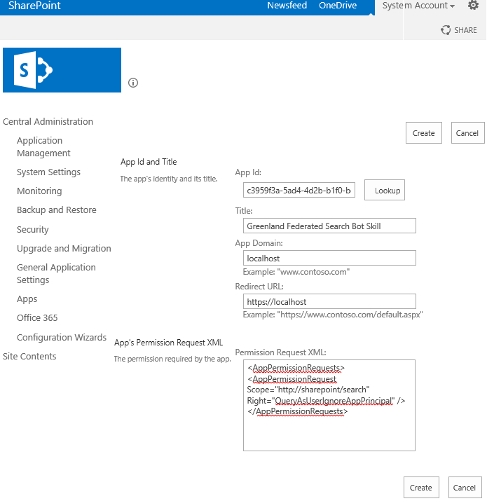

# Configure server-to-server authentication from SharePoint Server to SharePoint in Microsoft 365

[!INCLUDE[appliesto-2013-2016-2019-SUB-SPO-md](../includes/appliesto-2013-2016-2019-SUB-SPO-md.md)]

This article is part of a roadmap of procedures for configuring SharePoint hybrid solutions. Be sure you're [following a roadmap](configuration-roadmaps.md) when you do the procedures in this article.

> [!NOTE]
> We recommend using the [SharePoint Hybrid Configuration Wizard](hybrid-configuration-wizard-in-the-sharepoint-online-admin-center.md#hybrid-configuration-wizard-in-the-sharepoint-admin-center) to establish the Server-to-Server authentication between SharePoint Server and SharePoint in Microsoft 365. If you are unable to use the Hybrid Configuration Wizard for any reason, follow the steps in this article to enable server-to-server authentication.

## Configure server-to-server authentication

This article provides guidance for the SharePoint hybrid environment deployment process, which integrates SharePoint Server and SharePoint in Microsoft 365.

> [!TIP]
> For the most reliable outcome, complete the procedures in the order they are shown in this article.

## Verify web application settings
<a name="verifywebapp"> </a>

In SharePoint hybrid, federated users can send requests to SharePoint in Microsoft 365 from any SharePoint Server web application that's configured to use Integrated Windows authentication with NTLM.

For example, you have to make sure that the on-premises search center site(s) that you want to use in your solution are configured to use Integrated Windows authentication with NTLM. If they're not, you have to either reconfigure the web application to use Windows authentication with NTLM or use a search center site on a web application that meets this requirement. You also have to make sure that the users who expect search results to be returned from SharePoint in Microsoft 365 are federated users.

### To verify that a web application meets the requirement

1. Confirm that the user account that will do this procedure is a member of the Farm Admins SharePoint group.

2. In Central Administration, select **Application Management**, and then select **Manage web applications**.

3. In the **Name** column, select the web application that you want to verify, and on the ribbon, select **Authentication Providers**.

4. In the **Authentication Providers** dialog box, in the **Zone** column, select the zone the search center site is associated with.

5. In the **Edit Authentication** dialog box, verify that Integrated Windows authentication and NTLM are selected as shown in the following picture.

     :::image type="content" alt-text="Authentication type setting for a web application." source="../media/ClaimType.jpg":::

## Configure OAuth over HTTP (if it is required)
<a name="configOAuth"> </a>

By default, OAuth in SharePoint Server requires **HTTPS**. If you configured your primary web application to use **HTTP** instead of SSL, you have to enable OAuth over **HTTP** on every web server in your SharePoint Server farm.

> [!NOTE]
> If you configured your primary web application to use SSL, this step is not required.

To enable OAuth over HTTP, run the following commands as a farm administrator account from the SharePoint 2016 Management Shell command prompt on each web server in your SharePoint Server farm.

```powershell
$serviceConfig = Get-SPSecurityTokenServiceConfig
$serviceConfig.AllowOAuthOverHttp = $true
$serviceConfig.Update()
```

If you have enabled OAuth over HTTP for testing but want to reconfigure your environment to use SSL, you can disable OAuth over HTTP by running the following commands as a farm administrator account from the SharePoint 2016 Management Shell command prompt on each web server in your SharePoint Server farm.

```powershell
$serviceConfig = Get-SPSecurityTokenServiceConfig
$serviceConfig.AllowOAuthOverHttp = $false
$serviceConfig.Update()
```

## Configure server-to-server authentication between on-premises SharePoint Server and SharePoint in Microsoft 365
<a name="s2s"> </a>

This section will help you set up server-to-server authentication among:

- SharePoint Server

- SharePoint in Microsoft 365

- Microsoft Entra ID

When you set up server-to-server authentication for hybrid environments, you create a **trust relationship** between your **on-premises SharePoint farm** and your **SharePoint in Microsoft 365** **tenant**, which uses Microsoft Entra ID as a trusted token signing service. By adding the required PowerShell modules and snap-ins, this process can occur in a single PowerShell window on an on-premises SharePoint web server.

> [!TIP]
> You'll want to keep a record of your steps, the PowerShell cmdlets you run, and any errors that you might encounter. You should capture all the contents of the PowerShell buffer when you have finished and before you close the window. This will give you a history of the steps that you took, which will be helpful if you have to troubleshoot or explain the process to others. This can also be useful to refresh your memory if the setup happens in stages.

Here's a high-level view of the procedures you have to complete in this section:

1. Install online service management tools on a web server in your SharePoint Server farm.

2. Configure server-to-server authentication:

   - Set variables you'll be using in later steps.

   - Upload the built-in SharePoint Server STS certificate to SharePoint in Microsoft 365.

   - Add a Service Principal Name (SPN) to Azure.

   - Register the SharePoint in Microsoft 365 application principal object ID with on-premises SharePoint Server.

   - Configure a common authentication realm between your on-premises SharePoint Server farm and SharePoint in Microsoft 365.

   - Configure a Microsoft Entra application proxy on-premises.

### Install online service management tools and configure the Windows PowerShell window
<a name="step2"> </a>

To continue, you need to install these tools on an on-premises SharePoint Server web server:

- Microsoft Graph PowerShell

- SharePoint in Microsoft 365 Management Shell

This is most easily accomplished on a web server in your SharePoint farm because it's easier to load the  *Microsoft.SharePoint.PowerShell*  snap-in on the web servers than on servers that don't have SharePoint Server installed.

Authentication to SharePoint Server, SharePoint in Microsoft 365, and Microsoft Entra ID requires different user accounts. For information about how to determine which account to use, see [Accounts needed for hybrid configuration and testing](accounts-needed-for-hybrid-configuration-and-testing.md).

> [!NOTE]
> To make it easier to complete the steps in this section, we'll open a PowerShell Command Prompt window on a SharePoint Server web server and add the modules and snap-ins that let you connect to SharePoint Server, SharePoint in Microsoft 365, and Microsoft Entra ID. (We'll give you detailed steps on how to do this later in this article.) We'll then keep this window open to use for all the remaining PowerShell steps in this article.

To install the online service management tools and configure the PowerShell window:

1. Install the [latest version of the Microsoft Graph PowerShell](/powershell/microsoftgraph/installation)

2. Install the SharePoint in Microsoft 365 Management Shell:

    [SharePoint in Microsoft 365 Management Shell (64 bit version)](https://go.microsoft.com/fwlink/?LinkId=392323)

    For additional info, see [Introduction to the SharePoint in Microsoft 365 Management Shell](/powershell/sharepoint/sharepoint-online/introduction-sharepoint-online-management-shell).

3. Open a PowerShell window.

4. To help ensure that you don't fill the buffer and lose any of your command history, increase the buffer size of the PowerShell window:

5. Select the upper-left corner of the PowerShell window, and then select **Properties**.

6. In the PowerShell Properties window, select the **Layout** tab.

7. Under Screen Buffer Size, set the **Height** field to **9999**, and then select **OK**.

8. This step loads the modules you downloaded so you can use them in your PowerShell session. Copy the following commands into your PowerShell session, and press **Enter**.

   ```powershell
   Add-PSSnapin Microsoft.SharePoint.PowerShell
   Import-Module Microsoft.PowerShell.Utility
   Import-Module Microsoft.Graph
   ```

   If you need to run any of the configuration steps again later, remember to run these commands again to load the required modules and snap-ins in PowerShell.

9. Enter the following commands to sign in to SharePoint in Microsoft 365, from the PowerShell command prompt:

   ```powershell
      Connect-MgGraph -Scopes "Group.ReadWrite.All","RoleManagement.ReadWrite.Directory",”Organization.ReadWrite.All”
   ```

   You are prompted to sign in. You need to sign in using a Microsoft 365 global admin account. You can explore [other ways to connect to Microsoft Graph](/powershell/microsoftgraph/authentication-commands).

   Leave the PowerShell window open until you've completed all the steps in this article. You need it for a variety of procedures in the following sections.

### Configure server-to-server (S2S) authentication
<a name="step2"> </a>

Now that you installed the tools to enable you to remotely administer Microsoft Entra ID and SharePoint in Microsoft 365, you're ready to set up server-to-server authentication.

#### About the variables you'll create

This section describes the variables you will set in the procedure that follows. These variables contain important information used in many of the remaining configuration steps.

|Variable|Comments|
|:-----|:-----|
|$spcn|The root domain name of your public domain. This value should not be in the form of a URL; it should be the **domain name only**, with **no protocol**.  <br/> An example is adventureworks.com.|
|$spsite|The internal URL of your on-premises primary web application, such as **http://sharepoint** or **`https://sharepoint.adventureworks.com`**. This value is a full URL using the proper protocol (either **http:** // or **https://** ).  <br/> This is the internal URL of the web application that you are using for hybrid functionality.  <br/> An example is http://sharepoint or `https://sharepoint.adventureworks.com`.|
|$site|The object of your on-premises primary web application. The command that populates this variable gets the object of the site you specified in the **$spsite** variable.  <br/> This variable is automatically populated.|
|$spoappid|The SharePoint in Microsoft 365 application principal ID is always 00000003-0000-0ff1-ce00-000000000000. This generic value identifies SharePoint in Microsoft 365 objects in a Microsoft 365 organization.|
|$spocontextID|The context ID (ObjectID) of your SharePoint in Microsoft 365 tenant. This value is a unique GUID that identifies your SharePoint in Microsoft 365 tenant.  <br/> This value is automatically detected when you run the command to set the variable.|
|$metadataEndpoint|The URL that is used by your Microsoft Entra ID proxy to connect to your Microsoft Entra tenancy.  <br/> You don't need to input a value for this variable.|

#### Step 1: Set variables
<a name="step3"> </a>

Now that you identified the variables that you need to set, use these instructions to set them. Pre-populating the most commonly used variables should help you do the remaining steps faster. These variables remain populated as long as you don't close the PowerShell session. Be careful to provide accurate information wherever you see angle brackets (< >), and always remove the angle brackets before you run the command. Don't alter the code  *outside*  of the angle brackets.

> [!NOTE]
> If you have to do any of these configuration steps again later, you should begin by running the following PowerShell commands in this step to repopulate the important variables.

Copy the following variable declarations and paste them into a text editor like Notepad. Set the input values specific to your organization. From the PowerShell command prompt you configured with the online service management tools, run the commands.

```powershell
$spcn="*.<public_root_domain_name>.com"
$spsite=Get-Spsite <principal_web_application_URL>
$site=Get-Spsite $spsite
$spoappid="00000003-0000-0ff1-ce00-000000000000"
$spocontextID = (Get-MgOrganization).Id
$metadataEndpoint = "https://accounts.accesscontrol.windows.net/" + $spocontextID + "/metadata/json/1"
```

After you populate these variables, you can view their values by entering the variable name in the PowerShell window. For example, entering  `$metadataEndpoint` returns a value similar to the following:

`https://accounts.accesscontrol.windows.net/00fceb75-246c-4ac4-a0ad-7124xxxxxxxx/metadata/json/1`

#### Step 2: Upload the STS certificate to SharePoint in Microsoft 365
<a name="step4"> </a>

In this step, you upload the STS certificate for your SharePoint Server farm to your SharePoint in Microsoft 365 tenant, which enables SharePoint Server and SharePoint in Microsoft 365 to connect to and consume each other's service applications.


The commands in this step add the on-premises STS certificate (public key only) to the SharePoint in Microsoft 365 *principal object*  of your Microsoft 365 organization.

From the PowerShell command prompt, type the following commands.

```powershell
$Cert = (Get-SPSecurityTokenServiceConfig).LocalLoginProvider.SigningCertificate

$principal = Get-MgServicePrincipal -Filter "AppId eq '$spoappid’” -Property "Id,DisplayName,KeyCredentials,AppId"

$existingCerts = $principal.KeyCredentials

$keyCredentials = @(@{ Type = "AsymmetricX509Cert"; Usage = "Verify"; Key = $Cert.RawData; KeyId = New-Guid; StartDateTime = $Cert.NotBefore; EndDateTime = $Cert.NotAfter; })

$noUpdate = $false

foreach($existingCert in $existingCerts) {

    if ([string]$existingCert.Key -eq [string]$Cert.RawData) {

        $noUpdate = $true

        break

    }

    else {

        $existingCert.Key = $null

        $keyCredentials += $existingCert

    }
}

if (-Not $noUpdate) {

     Update-MgServicePrincipal -ServicePrincipalId $principal.Id -KeyCredentials $keyCredentials

}
```

<a name='step-3-add-an-spn-for-your-public-domain-name-to-azure-active-directory'></a>

#### Step 3: Add an SPN for your public domain name to Microsoft Entra ID
<a name="step5"> </a>

In this step, you add a service principal name (SPN) to your Microsoft Entra tenant. The SharePoint in Microsoft 365 principal object and your company's public DNS namespace form the SPN.

Just like SPNs function in Active Directory, creating this SPN registers an object in Microsoft Entra ID that is used to support mutual authentication between SharePoint Server and SharePoint in Microsoft 365. The basic syntax for the SPN is:

**\<service type\>/\<instance name\>**

Where:

- \<service type\> is the SharePoint in Microsoft 365 principal object, which is the same for all SharePoint in Microsoft 365 tenants.

- \<instance name\> is the URL of your company's public DNS domain namespace, which is always expressed as a wildcard, even if the Secure Channel SSL Certificate is a SAN certificate.

Here's an example:

 `00000003-0000-0ff1-ce00-000000000000/*.<public domain name>.com`

If the common name in your certificate is sharepoint.adventureworks.com, the syntax of the SPN will look like this:

 `00000003-0000-0ff1-ce00-000000000000/*.adventureworks.com`

Using a wildcard value lets SharePoint in Microsoft 365 validate connections with  *any host*  in that domain. This is useful if you ever need to change the host name of the external endpoint (if your topology includes one) or if you want to change your SharePoint Server web application, in the future.

To add the SPN to Microsoft Entra ID, enter the following commands in the Microsoft Graph PowerShell command prompt.

```powershell
$msp = Get-MgServicePrincipal -Filter "AppId eq '$spoappid'"
$params =@{
  "servicePrincipalNames"="$spoappid/$spcn"
}
Update-MgServicePrincipal -ServicePrincipalId $msp.Id -BodyParameter $params
```

To validate that the SPN was set, enter the following commands in the Microsoft Graph PowerShell command prompt.

```powershell
$msp = Get-MgServicePrincipal -Filter "AppId eq '$spoappid'"
$spns = $msp.ServicePrincipalNames
$spns
```

You should see a current list of SPNs for SharePoint in Microsoft 365 in your Microsoft 365 organization, and one of the SPNs should include your public root domain name, prefaced by the SharePoint in Microsoft 365 application principal ID. This registration is a wildcard registration and should look like the following example:

`00000003-0000-0ff1-ce00-000000000000/*.<public domain name>.com`

This should be the  *only*  SPN in the list that includes your public root domain name.

#### Step 4: Register the SharePoint in Microsoft 365 application principal object ID with SharePoint Server
<a name="step6"> </a>

This step registers the SharePoint in Microsoft 365 application principal object ID with the on-premises SharePoint in Microsoft 365 Application Management Service, which allows SharePoint Server to authenticate to SharePoint in Microsoft 365 using OAuth.

From the PowerShell command prompt, type the following commands.

```powershell
 $spoappprincipalID  = (Get-MgServicePrincipal -Filter "AppId eq '$spoappid'").Id
$sponameidentifier = "$spoappprincipalID@$spocontextID"
$appPrincipal = Register-SPAppPrincipal -site $site.rootweb -nameIdentifier $sponameidentifier -displayName "SharePoint"
```

To validate this step, from the PowerShell command prompt, type the $appPrincipal variable:

```powershell
$appPrincipal | fl
```

The expected output is a description of the registered application principal with the name **SharePoint Online**, which should look something like this.


#### Step 5: Set the SharePoint in Microsoft 365 authentication realm
<a name="step7"> </a>

This step sets the authentication realm of your SharePoint Server farm to the context ID of the organization's Microsoft 365 organization.

From the PowerShell command prompt, enter the following command:

```powershell
Set-SPAuthenticationRealm -realm $spocontextID
```

To validate this step, from the PowerShell command prompt, enter the following commands:

```powershell
$spocontextID
Get-SPAuthenticationRealm
```

The output of each of these commands is the GUID that represents the context ID of the SharePoint in Microsoft 365 tenancy. These GUIDs should be identical.

> [!IMPORTANT]
> If you have configured farm setup scripts that specify the farm authentication realm value, you should update the setup scripts with this new value before you run them again. > For more information about the requirements for realm values in farm setup scripts, see [Plan for server-to-server authentication in SharePoint Server](../security-for-sharepoint-server/plan-server-to-server-authentication.md). Because you have now configured this SharePoint farm to participate in the hybrid configuration, the SharePoint farm authentication realm value must always match the tenant context identifier. If you change this value, the farm will no longer participate in hybrid functionality.

<a name='step-6-configure-an-on-premises-proxy-for-azure-active-directory'></a>

#### Step 6: Configure an on-premises proxy for Microsoft Entra ID
<a name="step8"> </a>

In this step, you create a Microsoft Entra ID proxy service in the SharePoint Server farm. This enables Microsoft Entra ID as a  *trusted token issuer*  that SharePoint Server will use to sign and authenticate claims tokens from SharePoint in Microsoft 365.

From the PowerShell command prompt, enter the following commands.

```powershell
New-SPAzureAccessControlServiceApplicationProxy -Name "ACS" -MetadataServiceEndpointUri $metadataEndpoint -DefaultProxyGroup
New-SPTrustedSecurityTokenIssuer -MetadataEndpoint $metadataEndpoint -IsTrustBroker:$true -Name "ACS"
```

To validate the **New-SPAzureAccessControlServiceApplicationProxy** command:

1. Browse the SharePoint 2016 Central Administration website, and select **Security** > **General Security** > **Manage trust**.

2. Make sure you have an entry with a name that begins with **ACS**, and the enter **Trusted Service Consumer**.

    To validate this step, from the PowerShell command prompt, enter the following command.

    ```powershell
    Get-SPTrustedSecurityTokenIssuer
    ```

    The output that's expected is a description of the farm's trusted token issuer, where the value of the **RegisteredIssuerName** property is the following:

    `00000001-0000-0000-c000-000000000000@<context ID>`

    Where:

    - \<context ID\> is the context ID of your SharePoint in Microsoft 365 tenancy, which is the value in the $spocontextID variable.

#### Step 7: Update Hybrid federated search
<a name="step9"> </a>

Starting October 2021, an extra step is required to adjust an existing SharePoint Hybrid configuration to work with and authenticate using the new Microsoft 365 search engine.

The script must be run on a server where SharePoint On-Premises is installed (2013, 2016, or 2019). The script will attempt to install the required module dependencies (MSOnline, AzureAD) on the server where it is run.

1. Download the [configuration script](https://www.microsoft.com/download/103240).

2. From the directory where the script was downloaded, execute the script using SharePoint On-Premises Farm Administrator account, using the following command:

    ```powershell
    Update-FederatedHybridSearchForM365.ps1 -HybridWebApp YourHybridWebApplication -Force
    ```

    For more information on the parameter values, run the following command:

    ```powershell
    Get-Help .\Update-FederatedHybridSearchForM365.ps1
    ```

3. When prompted, log in using Microsoft 365 Global Administrator account.

4. Wait for script execution to complete; in case there are any issues, contact Microsoft Support.

5. After script execution, users will not see any changes when this change is implemented.

#### Step 8 (Only required for SharePoint Server 2013): Give New App Principal QueryAsUserIgnoreAppPrincipal permission
<a name="step10"> </a>

SharePoint Server 2013 needs a hidden constraint in every federated query. The reverse proxy returns the documents indexed in the reverse proxy site itself, not the internal on-premise search site as expected. To avoid this, you need to execute the following steps in your SharePoint Server 2013 admin site:

1. Go to `<CentralAdminURL>/_layouts/appinv.aspx` and Search for **c3959f3a-5ad4-4d2b-b1f0-bc70f9a5d0a1**, where you should find **Greenland Federated Search Bot Skill**.

2. If there are items in the App Domain field, leave them be, and if it is empty, use localhost.

3. In the Redirect URL, use https://localhost.

4. In the Permission Request XML field, paste the following XML excerpt:

   ```xml
   <AppPermissionRequests>
   <AppPermissionRequest Scope="http://sharepoint/search" Right="QueryAsUserIgnoreAppPrincipal" />
   </AppPermissionRequests>
   ```

5. The configuration page should appear similar to the following screenshot. Finally, select **Create**.



## Validation and next steps
<a name="next"> </a>

After finishing the tasks in this topic and its validation steps, you should check your SSO and Directory Synchronization setup.

So that you have a history of the steps you've taken, you should capture the entire contents of the PowerShell buffer into a file. This will be crucial if you need to reference your configuration history to troubleshoot, or for any other reasons. This will also help you pick up where you left off if the configuration spans multiple days or involves multiple people.

After you have completed and validated the configuration tasks in this topic, continue with your [configuration roadmap](configuration-roadmaps.md).

## See also
<a name="next"> </a>

[Hybrid for SharePoint Server](hybrid.md)

[Install and configure SharePoint Server hybrid](install-and-configure-sharepoint-server-hybrid.md)
