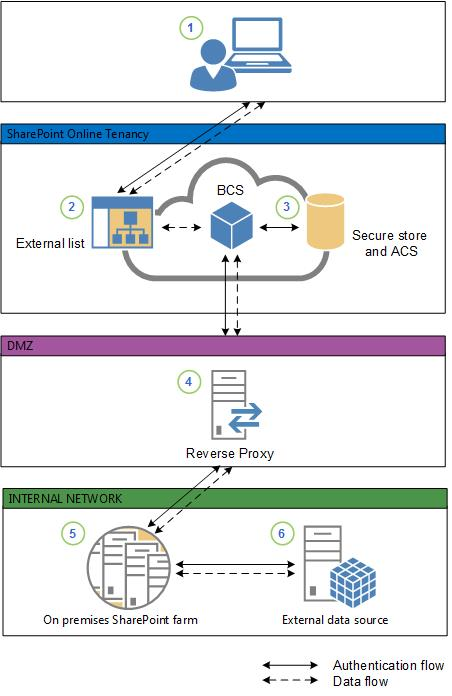

# Deploy a Business Connectivity Services hybrid solution in SharePoint

[!INCLUDE[appliesto-2013-2016-2019-SPO-md](../includes/appliesto-2013-2016-2019-SPO-md.md)]
  
 **This article is part of a roadmap of procedures for configuring SharePoint hybrid solutions. Be sure you're [following a roadmap](configuration-roadmaps.md) when you do the procedures in this article. **
  
The Microsoft Business Connectivity Services (BCS) hybrid deployment scenario allows you to securely publish on-premises data to an external list or app for SharePoint in Microsoft 365. From there, users can view and edit the data, depending on the permissions that they have.
  
In this scenario, you will learn how to:
  
- Configure your on-premises environment so that you can securely publish confidential business data to your SharePoint tenancy.
    
- Create and configure an OData service endpoint and an external content type with Visual Studio 2012.
    
- Prepare your SharePoint tenancy to host an app for SharePoint or an external list, which makes the external data available to your extranet users.
    
- Create a connection settings object that tells Business Connectivity Services in SharePoint how to connect to the on-premises OData service endpoint.
    
- Deploy an app for SharePoint or external list to SharePoint in Microsoft 365.
    
- Validate and troubleshoot the BCS hybrid scenario.
    
    
## What these procedures help you deploy

 BCS is a centralized infrastructure in SharePoint Server, Office 2016, and SharePoint in Microsoft 365 that enables you to integrate data that is not in SharePoint products or Office 2016 into SharePoint Server. BCS implementations take many forms. This includes this hybrid form that uses SharePoint in Microsoft 365 and SharePoint Server on-premises. These procedures show how to install and configure BCS to integrate data from an on-premises OData service endpoint into SharePoint in Microsoft 365. For this scenario, we use the AdventureWorks sample SQL database and create an OData service head for the database. The solution looks as shown in the following diagram. 
  
**Figure: Hybrid BCS solution**

  
1. An information worker logs on to SharePoint by using their federated account and opens an app for SharePoint or external list that needs data from an on-premises OData data source.
    
2. The external list creates a request for the data and sends it to Business Connectivity Services. Business Connectivity Services looks at the connection settings object to see how to connect to the data source and which credentials to use.
    
3. Business Connectivity Services retrieves two sets of credentials:
    
1. The Secure Channel certificate from Secure Store in SharePoint. This is used for SharePoint authentication to the reverse proxy. 
    
2. An [OAuth](https://go.microsoft.com/fwlink/?LinkID=214783) token from the Azure AD Service. This is used for user authentication to the SharePoint Server farm. You gain access to the Azure AD service with your SharePoint subscription. It is a security token service that manages security tokens for users of SharePoint. 
    
4. Business Connectivity Services sends an HTTPS request to the published endpoint for the data source. The request includes the client certificate from Secure Store, the OAuth token, and a request for the data. The reverse proxy authenticates the request by using the client certificate and forwards it to the on-premises SharePoint Server farm. For more information about publishing SharePoint to the Internet, see [SharePoint publishing solution guide](https://go.microsoft.com/fwlink/?LinkId=253268) in the Forefront Technical Library. 
    
5. The on-premises farm retrieves the user's cloud identity from the OAuth token (for example, user123@contoso.com), and through the Client Side Object Model (CSOM) code, maps it to the on-premises identity (for example, contoso\user123). The on-premises credentials are mapped to credentials that have access to the external data via a Secure Store target application. 
    
6. The on-premises Business Connectivity Services forwards the request to the OData Service endpoint. The OData Service authenticates the request (via IIS) and returns the data, which is passed back through the chain to the external list for the user to work with. 
    
**Video: Watch a demonstration of the BCS hybrid scenario**

> [!VIDEO https://www.microsoft.com/videoplayer/embed/f62fa1b6-188e-4588-b029-a7e02f3e53da?autoplay=false]
## How to use these procedures

The steps to completely deploy this scenario are presented in smaller procedures. Each procedure is numbered indicating its position in the overall sequence. At the beginning and end of each procedure, links direct you to the previous and following steps. The following list contains links to all of the procedures, in the required order, for your reference. Be aware that this list includes the steps to deploy an external list and an app for SharePoint. You can deploy one or the other or both, depending on your needs. You should skip the steps for whichever configuration you don't want to deploy. You must follow them in sequence to build out the scenario. You can also use these procedures individually for your own unique scenarios. When you assemble individual procedures to build out your own scenarios, it is important that you test the complete set of procedures, in order, in a lab setting before you try them in production.
  
## Roadmap of the procedures

To configure the BCS hybrid solution:
  
1. To configure the underlying settings and services needed, follow the procedures in [Prepare your environment for the Business Connectivity Services hybrid scenario](prepare-your-environment.md). 
    
2. If you want to use an external list, follow the procedures in [Deploy the Business Connectivity Services hybrid scenario as an external list](deploy-the-hybrid-scenario-as-an-external-list.md).
    
3. To validate your setup, follow the procedures in [Validate the Business Connectivity Services hybrid scenario](validate-the-hybrid-scenario.md). 
    
## See also

#### Concepts

[Hybrid for SharePoint Server](hybrid.md)
  
[Plan SharePoint Server hybrid](plan-sharepoint-server-hybrid.md)
  
[Install and configure SharePoint Server hybrid](install-and-configure-sharepoint-server-hybrid.md)
#### Other Resources

[Introducing OData: Data Access for the Web, the cloud, mobile devices, and more](https://go.microsoft.com/fwlink/p/?LinkId=245650)

