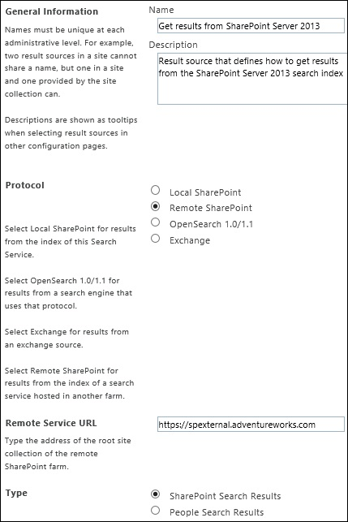
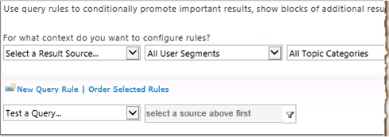
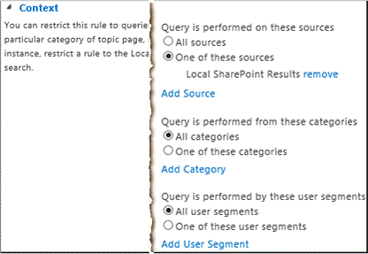
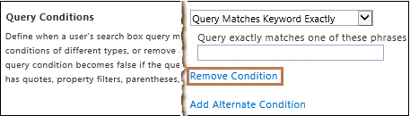
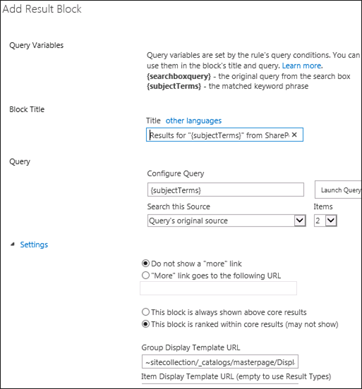
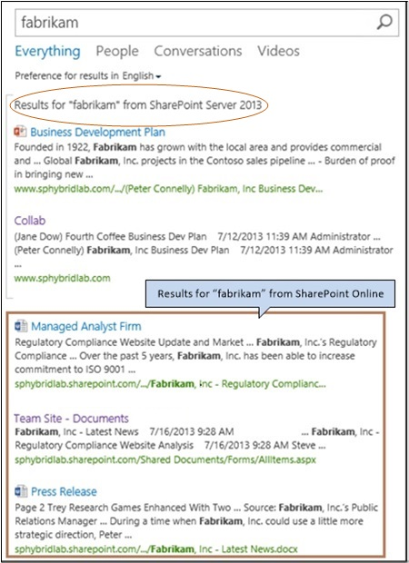

# Display hybrid federated search results in SharePoint Online

[!INCLUDE[appliesto-2013-2016-2019-SPO-md](../includes/appliesto-2013-2016-2019-SPO-md.md)] 
  
 **This article is part of a roadmap of procedures for configuring SharePoint hybrid solutions. Be sure you're [following a roadmap](configuration-roadmaps.md) when you do the procedures in this article.**
  
This article describes how to configure a hybrid SharePoint environment so that searches from the SharePoint Online enterprise Search Center display hybrid results—that is, results from both search indexes (SharePoint Online and SharePoint Server). This configuration is called inbound hybrid search. 
  
The search results from SharePoint Server will appear with the search results from SharePoint Server, but in a separate group called a result block. You can configure the block of results from SharePoint Server to be shown above all the results from SharePoint Online, or to be ranked by relevance compared to the SharePoint Online results.
  
To display hybrid search results in the SharePoint Online Search Center, in SharePoint Online you perform the following procedures, which are described in detail in this article:
  
- [Step 1: Create a result source that defines how to get search results from the SharePoint Server 2013 deployment](display-hybrid-federated-search-results-in-sharepoint-online.md#section1)
    
- [Step 2: Create a query rule to turn on hybrid search results in SharePoint Online](display-hybrid-federated-search-results-in-sharepoint-online.md#section2)
    
- [Step 3: Test your configuration for displaying search results from SharePoint Server 2013 in SharePoint Online](display-hybrid-federated-search-results-in-sharepoint-online.md#section3)
    
- [Step 4: Try a search from the SharePoint Online Search Center](display-hybrid-federated-search-results-in-sharepoint-online.md#section4)
    
## Step 1: Create a result source that defines how to get search results from the SharePoint Server 2013 deployment

In this procedure, you create a result source in SharePoint Online. This result source is a definition that specifies SharePoint Server as a provider to get search results from. This definition specifies each of the following:
  
- The protocol for getting search results from the SharePoint Server deployment.
    
- The URL of the reverse proxy device. The reverse proxy device forwards search queries from SharePoint Online to the SharePoint Server deployment.
    
- The ID of the target application that stores the Secure Store SSL certificate.
    
Result sources can be created at the SharePoint Admin Center level, the site collection level, or the site level. In this procedure, you create the result source at the SharePoint Admin Center level. This makes the result source available to any query rule that is created at the same level, and also to any query rule that is created for a site collection or site.
  
For more information about result sources, see [Understanding result sources](http://office.microsoft.com/support/sharepoint-help/sharepointsearch/understanding-result-sources-HA102848849.aspx?CTT=5&amp;origin=HA103639370) and [Manage result sources](https://docs.microsoft.com/sharepoint/manage-result-sources).
  
1. Verify that the user account that you use to perform this procedure is a global administrator for the Office 365 subscription that you want to configure.
    
2. In the SharePoint Online Admin Center, in the Quick Launch, click **search**.
    
3. On the **search administration** page, click **Manage Result Sources**.
    
4. Click **New Result Source**.
    
5. On the page where you can create a new result source, do the following:
    
   - In the General Information section, in the **Name** text box, type a name for the new result source—for example, Get results from SharePoint Server 2013.
    
     
  
   - (Optional) In the General Information section, in the **Description** text box, type a description of the new result source. This description will appear as a tooltip when the pointer rests on the result source on certain configuration pages. 
    
   - In the **Protocol** section, select **Remote SharePoint**.
    
   - In the **Remote Service URL** section, type the address of the external endpoint of the reverse proxy device, such as https://spexternal.adventureworks.com. The reverse proxy device routes queries that are submitted in SharePoint Online to the SharePoint Server deployment. For more information, see [Configure a reverse proxy device for SharePoint Server hybrid](configure-a-reverse-proxy-device-for-sharepoint-server-hybrid.md). The external endpoint of the reverse proxy device is its Internet-facing endpoint. The address of that external endpoint is called the external URL. Get the value of the external URL from the External URL row in Table 3 of [the SharePoint hybrid worksheet](https://go.microsoft.com/fwlink/?LinkId=391835) that you have been maintaining, and type it in the **Remote Service URL** text box. 
    
   - In the **Type** section, select **SharePoint Search Results**.
    
   - In the **Query Transform** section you can enter a query transform to narrow the search results to a specified subset—for example, a subset that is from a particular SharePoint site collection or site. However, if you are **not** familiar with query transforms in SharePoint Server or SharePoint Online, we recommend that you **keep** the default query transform that's in the text box. The default transform is **{searchTerms}**, which is a query variable that stands for the query that the user typed, as it was changed by the most recent query transform. If you are familiar with query transforms you can change the default query transform by either typing a different query transform in the text box or launching the Query Builder to help you configure a query transform. For more information, see [Plan to transform queries and order results in SharePoint Server](../search/plan-to-transform-queries-and-order-results.md) and [Query variables in SharePoint Server](../technical-reference/query-variables.md).
    
     
  
   - If you are connecting to your organization's intranet through a reverse proxy, in the **Credentials Information** section, select **SSO Id** and then in the **Reverse proxy certificate (Secure Store Id)** text box, type the name of the target application—for example, SecureChannelTargetApp—which stores the Windows certificate that will be used to authenticate to the reverse proxy device. Get the name of the target application from the Target Application ID row in Table 6 of [the SharePoint hybrid worksheet](https://go.microsoft.com/fwlink/?LinkId=391835) that you have been maintaining, and enter it in the **Reverse proxy certificate (Secure Store Id)** text box. 
    
   - Click **OK** to save the new result source. 
    
## Step 2: Create a query rule to turn on hybrid search results in SharePoint Online

In this procedure, you create a query rule in SharePoint Online that uses the result source that you created in the previous procedure in this article. When the query rule fires, it causes search results from content in the SharePoint Server search index to be displayed in a result block on a search results page in SharePoint Online.
  
Query rules can be created at the SharePoint Admin Center level, the site collection level, or the site level. In this procedure, you create a query rule at the SharePoint Admin Center level. Because you create the rule at this level, the rule can apply to any queries that users submit in this instance of SharePoint Online.
  
For more information about query rules, see [Plan to transform queries and order results in SharePoint Server](../search/plan-to-transform-queries-and-order-results.md) and [Manage query rules in SharePoint Server](../search/manage-query-rules.md)
  
1. Verify that the user account that you use to perform this procedure is a global administrator for the Office 365 subscription that you want to configure.
    
2. In the SharePoint Online Admin Center, in the Quick Launch, click **search**.
    
3. On the **search administration** page, click **Manage Query Rules**.
    
4. On the **Manage Query Rules** page, do the following: 
    
   - Under the text **For what context do you want to configure rules?**, in the **Select a Result Source** drop-down list, select a result source for which you want this query rule to be applicable. For testing, we recommend that you select the **Local SharePoint Results** result source here. If you do so, then by default the query rule will be applicable when a user performs a query in the **Everything** search vertical in the enterprise Search Center, because that vertical uses the **Local SharePoint Results** result source by default. After you select a result source from the drop-down list, all existing query rules that apply to that result source appear on the page. (On the  _Search_service_application_name_: Add Query Rule page, in the **Context** section, you will be able to add or remove result sources for which you want the rule to be applicable.) 
    
     
  
   - (Optional) Under the text **For what context do you want to configure rules?**, in the **User Segments** drop-down list, select a user segment for which you want this query rule to be applicable. User segments are based on terms that describe users in the term store of a Managed Metadata service application. (On the Add Query Rule page, in the **Context** section, you will be able to add or remove user segments for which you want the rule to be applicable.) 
    
   - (Optional) Under the text **For what context do you want to configure rules?**, in the **Topic Categories** drop-down list, select a topic category for which you want this query rule to be applicable. Topic categories are based on terms for categories in the term store of a Managed Metadata service application. (On the Add Query Rule page, in the **Context** section, you will be able to add or remove categories for which you want the rule to be applicable.) 
    
   - Click **New Query Rule**.
    
5. On the **Add Query Rule** page, do the following: 
    
   - In the **General Information** section, in the **Rule Name** text box, type a name for the new query rule—for example, Show results from SharePoint Server.
    
   - If the **Context** section is collapsed, click the arrow next to **Context** to expand it. 
    
     
  
   - In the **Context** section, under **Query is performed on these sources**, select **All sources** if you want this query rule to be applicable for queries that users submit against any result source, or select **One of these sources**, and then optionally click **Add Source** to add other result sources for which you want the query rule to be applicable. 
    
     > [!NOTE]
     >  The result source that you selected on the  _Search_service_application_name_: **Add Query Rule** page (for example, **Local SharePoint Results**—see step 5a of this procedure) will be shown under **One of these sources**. >  When you select **One of these sources**, this query rule will be applicable only when a user submits a query against one of the result sources in this list. Therefore, make sure that the result source appears for which you want this query rule to be applicable—for example, **Local SharePoint Results**. 
  
   - (Optional) Under **Query is performed from these categories**, specify the topic categories (based on terms for topic categories in the term store of a Managed Metadata service application) to perform the query from.
    
   - (Optional) Under **Query is performed by these user segments**, specify user segments (based on terms that describe users in the term store of a Managed Metadata service application) to which you want the query rule to apply.
    
   - In the **Query Conditions** section, specify conditions to control when the rule will fire, or click **Remove Condition** if you want the rule to fire for any query text. For testing, we recommend that you click **Remove Condition** so that the rule will fire for any query text. 
    
     
  
   - In the **Actions** section, under **Result Blocks**, click **Add Result Block**.
    
     
  
   - (Optional) In the **Block Title** section, in the **Title** text box, change the title to the text that you want to display above the result block on the search results page, such as Results for "{subjectTerms}" from SharePoint Server.
    
   - In the **Query** section, you can enter the query you want to run. If you are **not** familiar with query transforms in SharePoint Server or SharePoint Online, we recommend that you **keep** the default query transform that's in the text box. The default transform is **{searchTerms}**. If you are familiar with query transforms you can change the default query transform by either typing a different query transform in the text box or launching the Query Builder to help you configure a query transform. For more information, see [Plan to transform queries and order results in SharePoint Server](../search/plan-to-transform-queries-and-order-results.md) and [Query variables in SharePoint Server](../technical-reference/query-variables.md).
    
   - In the **Query** section, in the **Search this Source** drop-down list, select the name of the result source that you created in the previous procedure in this article ( [Step 1: Create a result source that defines how to get search results from SharePoint Online](display-hybrid-federated-search-results-in-sharepoint-server.md#section1))—for example, Get results from SharePoint Server.
    
   - In the **Query** section, in the **Items** drop-down list, select the number of search results from SharePoint Server that you want to show in this result block on the search results page. For example, select **3** to display three results from SharePoint Server in this result block. 
    
   - If you want to display a **Show More** link at the bottom of the result block, expand the **Settings** section and select **More link goes to the following URL**, and type the URL for the link to a page that displays more results from the SharePoint Server search index. For example, to specify the main search results page as the page that displays more results, typically you can type a URL of the following form (followed by "?k={subjectTerms}" to signify the user's search query): http:// _Tenant_Name_.sharepoint.com/sites/ _Search_Center_Name_/pages/results.aspx?k={subjectTerms}. When end users click **Show More**, they will see more results for the result block.
    
   - Specify the placement of the block of results from SharePoint Server relative to the results from SharePoint Online. Select **This block is always shown above core results** to display the result block at or near the top of the first page of search results. In this case, core results are the results from the SharePoint Online search index. This option is useful for testing, or when most of the relevant content is located in the remote search index in the hybrid environment. If you select this option for more than one result block, you can configure the order in which the result blocks are displayed by ranking the associated query rules. Select **This block is ranked within core results (may not show)** to display the result block such that it is ranked by relevance compared to the core results, in which case the result block might not appear on the first page of search results. This is the default setting and is typically the more appropriate choice in a production environment. As with individual results, the rank of the result block might be different when users perform the same query later. For example, if users click search results in the result block, the result block will be ranked higher in the search results over time. Otherwise, the result block will be ranked lower over time. 
    
   - (Optional) Specify a different URL for the group display template in the **Group Display Template URL** text box. 
    
   - (Optional) Specify an item display template in the **Item Display Template** text box, 
    
   - Skip the **Routing** section. 
    
   - Click **OK** to add the result block. 
    
6. (Optional) Specify when the query rule shall be active. In the **Publishing** section, use the **Start Date**, **End Date**, **Review Date**, and **Contact** fields. The start date and end date specify when the query rule will be active. If you specify a start date without an end date, the rule will always be active after the start date. If you specify an end date without a start date, the rule will always be active until the end date. If you do not specify a start date or an end date, the rule will always be active. 
    
7. Activate the query rule by selecting **Is Active** in the **Publishing** section. When a query rule is active, it fires whenever the query conditions are met. 
    
8. Click **Save**.
    
After a few moments, when federated users submit queries from the SharePoint Online Search Center against a result source that you specified in step 5 of this procedure, they will see results from both search indexes, as shown in the following screen shot. In the screen shot, a block of two search results from SharePoint Server appears above the search results from SharePoint Online.
  
> [!NOTE]
> A federated user is a user whose on-premises Active Directory Domain Services (AD DS) domain account is synchronized between SharePoint Server and SharePoint Online, and who accesses resources in both environments by authenticating with the federation identity provider, such as Active Directory Federation Services (AD FS) 2.0. 
  

  
## Step 3: Test your configuration for displaying search results from SharePoint Server 2013 in SharePoint Online

Use the following procedure to validate your configuration for viewing search results from the SharePoint Server deployment in SharePoint Online.
  
> [!IMPORTANT]
> If you are using single sign-on (SSO) authentication, it is important to test the hybrid Search functionality by using federated user accounts. Native Office 365 user accounts and AD accounts that are not federated are not recognized by both directory services. Therefore, they cannot authenticate using SSO and cannot be granted permissions to resources in both environments. For more information, see [Accounts needed for hybrid configuration and testing](accounts-needed-for-hybrid-configuration-and-testing.md). 
  
1. Verify that the user account that you use to perform this procedure is a federated user who has been activated in SharePoint Online, and who has permissions to view the root site collection there.
    
2. On the SharePoint Admin Center page, click **search**.
    
3. On the **search administration** page, click **Manage Query Rules**.
    
4. On the page for managing query rules, do the following:
    
   - In the **Select a Result Source** drop-down list, click the result source that you selected in step 4a of Step 2 in this article ( [Step 2: Create a query rule to turn on hybrid search results in SharePoint Online](display-hybrid-federated-search-results-in-sharepoint-online.md#section2))—for example, **Local SharePoint Results**.
    
    A list of query rules that are applicable to that result source appears.
    
   - In the list of query rules, click the query rule that you created according to step 2 in this article ([Step 2: Create a query rule to turn on hybrid search results in SharePoint Online](display-hybrid-federated-search-results-in-sharepoint-online.md#section2))—for example, Show results from SharePoint Server 2013.
    
5. On the page for editing the query rule, in the **Actions** section, in the **Result Blocks** subsection, next to the name of the query rule that will show results from the SharePoint Server search index (for example, **Show results from SharePoint Server 2013**), click **edit**.
    
6. In the **edit result block** dialog box, in the **Query** section, click **Launch Query Builder**.
    
7. In the **build your query** dialog box, on the **BASICS** tab, do the following: 
    
   - In the **Select a query** section, select the result source that you created according to Step 1 in this article ( [Step 1: Create a result source that defines how to get search results from the SharePoint Server 2013 deployment](display-hybrid-federated-search-results-in-sharepoint-online.md#section1))—for example, Get results from SharePoint Server.
    
   - In the **Query text** section, delete the default text, which is **{subjectTerms}**, and then type a test query (such as the name of your company) that should yield search results from the SharePoint Server search index.
    
8. Click **Test query**.
    
    In the **Search Result Preview** pane, if your search configuration is valid and there are relevant results in SharePoint Server, the SharePoint Online search system will display search results from SharePoint Server. If there are problems with your configuration, the search system can display troubleshooting information. 
    
9. Click **OK**.
    
## Step 4: Try a search from the SharePoint Online Search Center

To validate your configuration for displaying search results from both SharePoint Server and SharePoint Online in the SharePoint Online Search Center, you can log on to SharePoint Online as a federated user and try some searches from the enterprise Search Center. Use the following procedure to validate your configuration in this way.
  
1. Log on to SharePoint Online as a federated user who has been activated in SharePoint Online, and who has permissions to view the root site collection there.
    
2. Go to the enterprise Search Center in SharePoint Online.
    
    Typically, the enterprise Search Center in SharePoint Online is at https://< _domain_>.sharepoint.com/search—for example, https://adventureworks.sharepoint.com/search.
    
3. In the enterprise Search Center, do the following:
    
   - In the search box, type a test query, such as the name of your company.
    
    Make sure that the test query should yield search results from the SharePoint Server search index and the SharePoint Online search index.
    
   - Click the search icon, or press Enter.
    
   - Click a search vertical that uses a result source that you specified in step 5c of the second procedure in this article ([Step 2: Create a query rule to turn on hybrid search results in SharePoint Online](display-hybrid-federated-search-results-in-sharepoint-online.md#section2)), such as **Local SharePoint Results**. That is, click a search vertical that you specified on the Add Query Rule page, in the **Context** section, under **Query is performed on these sources**.
    
4. On the search results page, you should see results from the SharePoint Online search index and a result block from the SharePoint Server search index.
    
    > [!NOTE]
    > To view the target of a search result that is from content in the SharePoint Server farm, a user must have at least Read permission for the root site collection in the primary web application. (In a SharePoint hybrid environment, the primary web application is in the SharePoint Server farm and is used to receive all connections from Office 365. For more information about the primary web application, see [Plan connectivity from Office 365 to SharePoint Server](plan-connectivity-from-office-365-to-sharepoint-server.md).) 
  
5. If you do not see results from both search indexes on the search results page, do the following:
    
   - Verify that the search system in SharePoint Server has crawled the local content.
    
   - Verify that you have configured Search features and functionality as described in this article.
    
   - Correct any errors or omissions, and try a search again.
    
6. If you still do not see search results from both search indexes, check the SharePoint Unified Logging Service (ULS) logs, also called the SharePoint trace logs.
    
    For more information, see [Overview of Unified Logging System (ULS) Logging](https://go.microsoft.com/fwlink/p/?LinkId=393137).
    
## See also

#### Concepts

[Plan hybrid federated search for SharePoint Server](plan-hybrid-federated-search.md)

