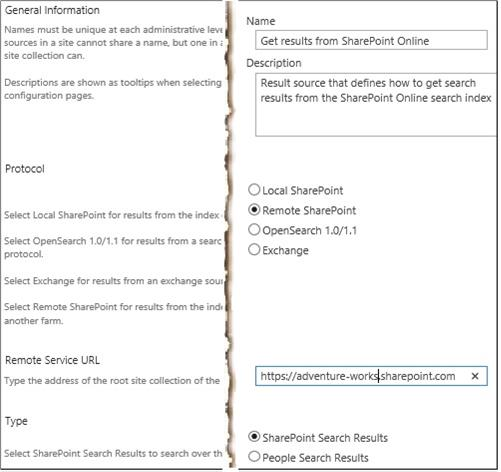
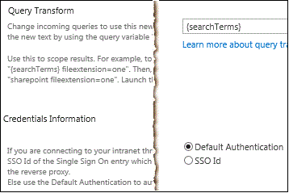
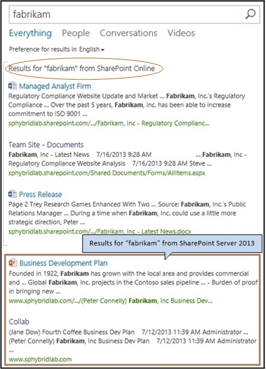

# Display hybrid federated search results in SharePoint Server

[!INCLUDE[appliesto-2013-2016-2019-SPO-md](../includes/appliesto-2013-2016-2019-SPO-md.md)]
  
 **This article is part of a roadmap of procedures for configuring SharePoint hybrid solutions. Be sure you're [following a roadmap](configuration-roadmaps.md) when you do the procedures in this article.**
  
This article describes how to configure a SharePoint hybrid environment so that searches from the SharePoint Server enterprise Search Center display hybrid results—that is, results from both search indexes (SharePoint Server and SharePoint in Microsoft 365). This configuration is called outbound hybrid search. 
  
The search results from SharePoint in Microsoft 365 will appear with the search results from SharePoint Server, but in a separate group called a result block. You can configure the block of results from SharePoint in Microsoft 365 to be shown above all the results from SharePoint Server, or to be ranked by relevance compared to the SharePoint Server results.
  
To display hybrid search results in the SharePoint Server enterprise Search Center, in the SharePoint Server deployment you perform the following procedures, which are described in detail this article:
  
- [Step 1: Create a result source that defines how to get search results from SharePoint in Microsoft 365](display-hybrid-federated-search-results-in-sharepoint-server.md#section1)
    
- [Step 2: Create a query rule to turn on hybrid search results in SharePoint Server 2013](display-hybrid-federated-search-results-in-sharepoint-server.md#section2)
    
- [Step 3: Try a search from the SharePoint Server 2013 Search Center](display-hybrid-federated-search-results-in-sharepoint-server.md#section3)
    
## Step 1: Create a result source that defines how to get search results from SharePoint in Microsoft 365

In this procedure, you create a result source in the SharePoint Server deployment. This result source is a definition that specifies SharePoint in Microsoft 365 as a provider to get search results from. This definition specifies each of the following:
  
- SharePoint in Microsoft 365 URL to get search results from.
    
- Protocol for getting those results.
    
- Method for authenticating against SharePoint in Microsoft 365.
    
Result sources can be created at the Search service application level, the site collection level, or the site level. In this procedure, you create the result source at the Search service application level. This will make the result source available to any query rule that is created at the same level, and also to any query rule that is created for a site collection or site that is in a web application that consumes the Search service application.
  
For more info about result sources, see the following resources:
  
- [Understanding result sources for search in SharePoint Server](../search/understanding-result-sources-for-search.md)
    
- [Configure result sources for search in SharePoint Server](../search/configure-result-sources-for-search.md)
    
### To create the result source

1. Verify that the user account that you use to perform this procedure is an administrator for the Search service application that you want to configure.
    
2. In the SharePoint Server deployment, in Central Administration, in the **Application Management** section, select **Manage service applications**.
    
3. Select the Search service application to which you want to add a result source.
    
4. On the Search Administration page for the Search service application, in the Quick Launch, select **Result Sources**.
    
5. On the Manage Result Sources page, select **New Result Source**.
    
6. On the **Add Result Source** page, do the following: 
    
  - In the General Information section, in the **Name** text box, enter a name for the new result source (for example, Get results from SharePoint in Microsoft 365).
    
     
  
  - (Optional) In the General Information section, in the **Description** text box, enter a description of the new result source. 
    
    This description appears as a tooltip when the pointer rests on the result source on certain configuration pages.
    
  - In the **Protocol** section, select **Remote SharePoint**.
    
  - In the **Remote Service URL** section, enter the address of the root site collection in SharePoint in Microsoft 365 that you want to get search results from, such as **https://adventure-works.sharepoint.com**.
    
  - In the **Type** section, select **SharePoint Search Results**.
    
  - In the **Query Transform** section, you can use the query transform to narrow the search results to a specified subset (for example, a subset that is from a particular SharePoint site collection or site). However, if you are **not** familiar with query transforms in SharePoint Server, we recommend that you **keep** the default query transform here. The default transform is **{searchTerms}**, which is a query variable that stands for the query that the user entered, as it was changed by the most recent query transform. If you are familiar with query transforms, either keep the default query transform, or enter a different query transform in the text box. If you want to use Query Builder to help you configure a different query transform, select **Launch Query Builder**. For more info about query building, see [Plan to transform queries and order results in SharePoint Server](../search/plan-to-transform-queries-and-order-results.md) and [Query variables in SharePoint Server](../technical-reference/query-variables.md).
    
     
  
  - In the **Credentials Information** section, select **Default Authentication**.
    
  - To save the new result source, select **Save**. 
    
## Step 2: Create a query rule to turn on hybrid search results in SharePoint Server 2013

In this procedure, you create a query rule in the SharePoint Server deployment. This query rule uses the result source that you created in the previous procedure in this article. When the query rule fires, it causes search results from the SharePoint in Microsoft 365 search index to appear in a result block on a search results page in the SharePoint Server deployment. The results from the SharePoint in Microsoft 365 search index appear along with results from the SharePoint Server search index.
  
Query rules can be created at the Search service application level, the site collection level, or the site level. In this procedure, you create the query rule at the Search service application level. Because you create the rule at this level, the rule can apply to queries that users submit in sites or site collections that consume the Search service application.
  
For more info about query rules, see [Plan to transform queries and order results in SharePoint Server](../search/plan-to-transform-queries-and-order-results.md) and [Manage query rules in SharePoint Server](../search/manage-query-rules.md)
  
1. Verify that the user account that you use to perform this procedure is an administrator for the Search service application that you want to configure.
    
2. In the SharePoint Server deployment, in Central Administration, in the **Application Management** section, select **Manage service applications**.
    
3. Select the Search service application in which you created a result source in the previous procedure in this article ([Step 1: Create a result source that defines how to get search results from SharePoint in Microsoft 365](display-hybrid-federated-search-results-in-sharepoint-server.md#section1)).
    
4. On the _Search_service_application_name_: Search Administration page, in the Quick Launch, select **Query rules**.
    
5. On the _Search_service_application_name_: Manage Query Rules page, do the following:
    
   - Under the text **For what context do you want to configure rules?**, in the **Select a Result Source** dropdown, select a result source for which you want this query rule to apply.   For testing, we recommend that you select the **Local SharePoint Results** result source here. If you do so, then by default the query rule will apply when a user performs a query in the **Everything** search vertical in the enterprise Search Center, because that vertical uses the **Local SharePoint Results** result source by default.   After you select a result source from the dropdown, all existing query rules that apply to that result source appear on the page. (On the  _Search_service_application_name_: Add Query Rule page, in the **Context** section, you can add or remove result sources for which you want the rule to apply.) 
    
     
  
   - (Optional) Under the text **For what context do you want to configure rules?**, in the **User Segments** dropdown, select a user segment for which you want this query rule to apply. User segments are based on terms that describe users in the term store of a Managed Metadata service application. (On the Add Query Rule page, in the **Context** section, you will be able to add or remove user segments for which you want the rule to apply.) 
    
   - (Optional) Under the text **For what context do you want to configure rules?**, in the **Topic Categories** dropdown, select a topic category for which you want this query rule to apply. Topic categories are based on terms for categories in the term store of a Managed Metadata service application. (On the Add Query Rule page, in the **Context** section, you will be able to add or remove categories for which you want the rule to apply.) 
    
   - Select **New Query Rule**.
    
6. On the _Search_service_application_name_: **Add Query Rule** page, do the following: 
    
    - In the **General Information** section, in the **Rule Name** text box, enter a name for the new query rule (for example, Show results from SharePoint in Microsoft 365).
    
    - If the **Context** section is collapsed, to expand it, select the arrow next to **Context**. 
    
        
  
    - In the **Context** section, under **Query is performed on these sources**, select **All sources** if you want this query rule to apply for queries that users submit against any result source, or select **One of these sources**, and then to add other result sources for which you want the query rule to apply, optionally select **Add Source**. 
    
    - (Optional) Under **Query is performed from these categories**, specify the topic categories (based on terms for topic categories in the term store of a Managed Metadata service application) to perform the query from.
    
    - (Optional) Under **Query is performed by these user segments**, specify user segments (based on terms that describe users in the term store of a Managed Metadata service application) to which you want the query rule to apply.
    
    - In the **Query Conditions** section, specify conditions to control when the rule will fire, or click **Remove Condition** if you want the rule to fire for any query text. For testing, so that the rule will fire for any query text, we recommend that you select **Remove Condition**. 
    
       
  
    - In the **Actions** section, under **Result Blocks**, select **Add Result Block**.
    
       
  
    - (Optional) In the **Block Title** section, in the **Title** text box, change the title to the text that you want to appear above the result block on the search results page, such as Results for "{subjectTerms}" from SharePoint in Microsoft 365.
    
    - In the **Query** section, enter the query you want to run. Either type it in the **Configure Query** text box, or launch the Query Builder to get help configuring the query. If you are not familiar with transforming queries in SharePoint Server, we recommend that you keep the default query here, namely **{subjectTerms}**. For more info, see [Plan to transform queries and order results in SharePoint Server](../search/plan-to-transform-queries-and-order-results.md) and [Query variables in SharePoint Server](../technical-reference/query-variables.md).
    
    - In the **Query** section, in the **Search this Source** dropdown, select the name of the result source that you created in the previous procedure in this article ( [Step 1: Create a result source that defines how to get search results from SharePoint in Microsoft 365](display-hybrid-federated-search-results-in-sharepoint-server.md#section1)) (for example, Get results from SharePoint in Microsoft 365).
    
    - In the **Query** section, in the **Items** dropdown, select the number of search results from SharePoint in Microsoft 365 that you want to show in this result block on the search results page.   For example, to display three results from SharePoint in Microsoft 365 in this result block, select **3**. 
    
    - If you want to display a **Show More** link at the bottom of the result block, expand the **Settings** section, and select **More link goes to the following URL**, and enter the URL for the link to a page that displays more results from the SharePoint in Microsoft 365 search index.   For example, to specify the main search results page as the page that displays more results, typically you can enter a URL of the following form (followed by "?k={subjectTerms}" to signify your search query): http:// _domain_name_.com/sites/ _Search_Center_name_/pages/results.aspx?k={subjectTerms}.   By selecting **Show More**, more results appear for the result block.
    
    - Specify the placement of the block of results from SharePoint in Microsoft 365 relative to the results from SharePoint Server.
      - To display the result block at or near the top of the first page of search results, select **This block is always shown above core results**. In this case, core results are the results from the SharePoint Server search index. This option is useful for testing, or when most of the relevant content is located in the remote search index in the hybrid environment. If you select this option for more than one result block, you can configure the order in which the result blocks appear by ranking the associated query rules.
      - To display the result block such that it is ranked by relevance compared to the core results, select **This block is ranked within core results (may not show)**, in which case the result block might not appear on the first page of search results.  This is the default setting, and is typically the more appropriate choice in a production environment. As with individual results, the rank of the result block might be different when users perform the same query later. For example, if you click search results in the result block, the result block is ranked higher in the search results over time. Otherwise, the result block is ranked lower over time. 
    
    - (Optional) To specify a different URL for the group display template, enter the URL in the **Group Display Template URL** text box. 
    
    - (Optional) To specify an item display template, enter the item display template info in the **Item Display Template** text box. 
    
    - Skip the **Routing** section. 
    
    - To add the result block, select **OK**. 
    
7. (Optional) Specify when the query rule shall be active. In the **Publishing** section, enter the appropriate info in the **Start Date**, **End Date**, **Review Date**, and **Contact** fields. The start date and end date specify when the query rule will be active. 
    - If you specify a start date without an end date, the rule will always be active after the start date.
    - If you specify an end date without a start date, the rule will always be active until the end date.
    - If you do not specify a start date or an end date, the rule will always be active.
    
8. Activate the query rule by selecting **Is Active** in the **Publishing** section. When a query rule is active, it fires whenever the query conditions are met. 
    
9. Select **Save**.
    
After a few moments, when federated users submit queries from the SharePoint Server Search Center against a result source that you specified in step 6c of this procedure, results appear from both search indexes, as shown in the following image. In the image, a block of three search results from SharePoint in Microsoft 365 appears above the search results from SharePoint Server.
  
> [!NOTE]
> A federated user is a user whose on-premises Active Directory Domain Services (AD DS) domain account is synchronized between SharePoint Server and SharePoint in Microsoft 365, and who accesses resources in both environments by authenticating with the federation identity provider, such as Active Directory Federation Services (AD FS) 2.0. 
  

  
## Step 3: Try a search from the SharePoint Server 2013 Search Center

To validate your configuration for displaying search results from both SharePoint Server and SharePoint in Microsoft 365 in the SharePoint Server Search Center, you can log on to SharePoint Server as a federated user and try some searches from the enterprise Search Center. To validate your configuration in this way, use the following procedure.
  
> [!IMPORTANT]
> If you are using single sign-on (SSO) authentication, it is important to test hybrid Search functionality by using federated user accounts. Native user accounts and Active Directory Domain Services (AD DS) accounts that are not federated are not recognized by both directory services. Therefore, they cannot authenticate using SSO and cannot be granted permissions to resources in both deployments. For more information, see [Accounts needed for hybrid configuration and testing](accounts-needed-for-hybrid-configuration-and-testing.md). 
  
1. Log on to the SharePoint Server deployment as a federated user who has been activated in SharePoint in Microsoft 365 and who has permissions to view the root site collection in SharePoint in Microsoft 365.
    
2. Browse to the enterprise Search Center in the SharePoint Server deployment.
    
3. In the enterprise Search Center, do the following:
    
    - Select a search vertical that uses a result source that you specified in step 6c of the second procedure in this article ([Step 2: Create a query rule to turn on hybrid search results in SharePoint Server 2013](display-hybrid-federated-search-results-in-sharepoint-server.md#section2)).
    
    - In the search box, enter a test query, such as the name of your company. Make sure that the test query should yield search results from the SharePoint Server search index and the SharePoint in Microsoft 365 search index.
    
    - Select the search icon, or press Enter.
    
4. On the search results page, results appear from the SharePoint Server search index and a result block of results from the SharePoint in Microsoft 365 search index.
    
5. If you do not see results from both search indexes, do the following:
    
    - Verify that the search system in SharePoint Server has crawled the local content. For info about how to view the crawl log, see [Crawl log](../search/view-search-diagnostics.md#proc3) in [View search diagnostics in SharePoint Server](../search/view-search-diagnostics.md).
    
    - Verify that you have configured the hybrid SharePoint environment as described first in [SharePoint Server 2016 hybrid configuration roadmaps](configuration-roadmaps.md) and then [Configure server-to-server authentication from SharePoint Server to SharePoint in Microsoft 365](configure-server-to-server-authentication.md).
    
    - Verify that you have configured Search features and functionality as described in this article.
    
    - Correct any errors or omissions, and try a search again.
    
6. If you still do not see search results from both search indexes, check the SharePoint Unified Logging Service (ULS) logs, also called the SharePoint trace logs.
    
    For more info, see [Overview of Unified Logging System (ULS) Logging](https://go.microsoft.com/fwlink/p/?LinkId=393137).
    
## See also

#### Concepts

[Plan hybrid federated search for SharePoint Server](plan-hybrid-federated-search.md)
  
[Display hybrid federated search results in SharePoint in Microsoft 365](display-hybrid-federated-search-results-in-sharepoint-online.md)

