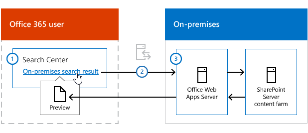

# Enable previews of on-premises search results in cloud hybrid search

[!INCLUDE[appliesto-2013-2016-2019-SPO-md](../includes/appliesto-2013-2016-2019-SPO-md.md)]

Learn how to enable display of previews of on-premises search results in a Search Center in Office 365 for cloud hybrid search.
  
In [cloud hybrid search](/SharePoint/hybrid/learn-about-cloud-hybrid-search-for-sharepoint), when users search in Office 365, they get search results from both on-premises and Office 365 content. When a user hovers over a search result that comes from Office 365, information about the content as well as a preview of the content is displayed. Information about the content from search results that come from SharePoint Server is displayed automatically, but display of previews is not automatic. You can enable such display of previews for content from SharePoint Server 2013 and SharePoint Server 2016, but not for content from SharePoint Server 2010. Users can click search results that come from SharePoint Server 2010, SharePoint Server 2013, and SharePoint Server 2016 to access the content.
  
To enable previews for on-premises content in SharePoint Server you need to set up an on-premises Office Online Server and configure SharePoint Server to use it.
  
## What is Office Online Server?

Office Online Server is an Office server product that lets users access their documents online using a web browser. For SharePoint Server content farms, it's the stand-alone Office Online Server that delivers the browser-based versions of Word, PowerPoint, Excel, and OneNote.
  

  
1. In an Office 365 Search Center, a user hovers over a search result for a Word document that's stored on a SharePoint Server on-premises content farm.
    
2. The request to show a preview of the document goes to the Office Online Server. You have to ensure that the Office Online Server is accessible from where the user is. For example, if you want to support users that are outside the corporate network, you can make the Office Online Server accessible through a reverse proxy.
    
3. The Office Online Server gets the document from the content farm and renders the document in the user's web browser.
    
## Turn on previews for on-premises content in SharePoint Server

Follow these procedures:
  
1. [Deploy Office Online Server](/officeonlineserver/deploy-office-online-server)
    
2. [Configure Office Online Server for SharePoint Server](/officeonlineserver/configure-office-online-server-for-sharepoint-server-2016/configure-office-online-server-for-sharepoint-server-2016)
    
3. Optional: Make the Office Online Server accessible outside the corporate network. You can configure your corporate firewall to allow access from the public Internet to your Office Online Server. To do this, set the public DNS to match the `ExternalUrl` value in your Office Online Server farm. This value can be set when creating a farm using `New-OfficeWebAppsFarm -ExternalUrl <value>` or `Set-OfficeWebAppsFarm -ExternalUrl <value>`. You must use SSL when allowing Internet access to your Office Online Server.
    
### Deploy the Office Online Server farm

Office Online Server needs to be on a separate server than SharePoint Server. Here are the steps for deploying the Office Online Server farm:
  
1. [Plan how to use the Office Web Apps Server](/webappsserver/plan-office-web-apps-server).
    
2. [Deploy Office Web Apps Server](/webappsserver/deploy-office-web-apps-server), here's an overview of the steps:
    
  - Prepare each server in the Office Online Server farm to run Office Online Server. This includes installing prerequisite software of Office Online Server, installing Office Online Server and related updates, and installing language packs for Office Online Server.
    
  - Deploy the Office Online Server farm. If you're deploying for test purposes, deploy a single server Office Online Server farm that uses HTTP. If you're deploying for production, deploy a single server Office Online Server farm that uses HTTPS.
    
### Configure SharePoint Server to use the Office Online Server

1. [Plan how you want to use Office Web Apps with SharePoint 2013.](/webappsserver/plan-office-web-apps-used-with-sharepoint-2013)
    
2. [Configure SharePoint 2013 to use Office Web Apps Server](/webappsserver/configure-office-web-apps-for-sharepoint-2013). Here's an overview of the steps:
    
  - Create a binding between SharePoint Server and the Office Online Server so traffic from the Office Online Server can enter SharePoint Server.
    
  - Office Online Server uses zones to determine which URL (internal or external) and which protocol (HTTP or HTTPS) to use when it communicates with SharePoint Server. By default, SharePoint Server uses the internal-https zone. If you've deployed Office Online Server for test purposes, set SharePoint Server to use the internal-http zone and set SharePoint Server to allow authentication over HTTP. If you've deployed Office Online Server for production, set SharePoint Server to use the internal-https zone.
    
  - Verify that Office Online Server is working.
    
## See also

#### Other Resources

[Learn about cloud hybrid search for SharePoint](/SharePoint/hybrid/learn-about-cloud-hybrid-search-for-sharepoint)
  
[Plan cloud hybrid search for SharePoint](/SharePoint/hybrid/plan-cloud-hybrid-search-for-sharepoint)
  
[Configure cloud hybrid search for SharePoint](/SharePoint/hybrid/configure-cloud-hybrid-searchroadmap)

