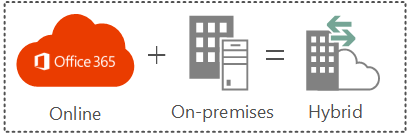

# Explore SharePoint Server hybrid

 **Summary:** Overview and introductory articles on SharePoint Server hybrid to help you decide which hybrid solution you should use for your business. 
  
Discover how a SharePoint hybrid environment using SharePoint Server and SharePoint Online can integrate functionality and access between the services and features of both environments.
  

  
Offload your users' personal storage to SharePoint Online with hybrid OneDrive for Business. Maximize the reach of Search to get search results from both SharePoint Server and SharePoint Online. Extend access to Microsoft Business Connectivity Services data and applications to the cloud. The following articles describe the currently supported SharePoint hybrid options and configurations and will help you decide which hybrid solution you should use to meet your business goals.
  
When you're done exploring, [plan your hybrid deployment](plan-sharepoint-server-hybrid.md).
  
|**Content**|**Description**|
|:-----|:-----|
|[The building blocks of Office 365 hybrid](the-building-blocks-of-office-365-hybrid.md)   |This chalk talk video covers the major components of Office 365 hybrid. If you're considering a hybrid solution, watch this video to learn more about how all the pieces fit together.    |
|[Minimum public update levels for SharePoint hybrid features](minimum-public-update-levels-for-sharepoint-hybrid-features.md)   |Learn which SharePoint Server updates are required to enable the various hybrid features.    |
|[SharePoint hybrid sites and search](sharepoint-hybrid-sites-and-search.md)   |Learn about the available hybrid features related to sites and search that can help create a cohesive user experience between SharePoint Server and SharePoint Online.    |
|[Learn about cloud hybrid search for SharePoint](http://technet.microsoft.com/library/af830951-8ddf-48b2-8340-179c1cc4d291%28Office.14%29.aspx)   |Learn about cloud hybrid search, its advantages, and what search experiences are available for your users.    |
|[Learn about hybrid federated search for SharePoint](learn-about-hybrid-federated-search-for-sharepoint.md)   |Learn about the different scenarios available for hybrid federated search and what search experiences they enable for your users.    |
|[Hybrid picker in the SharePoint Online admin center](hybrid-picker-in-the-sharepoint-online-admin-center.md)   |Learn about the hybrid picker configuration wizard and which hybrid scenarios it enables.    |
   
## See also

#### Concepts

[Hybrid for SharePoint Server](hybrid.md)

