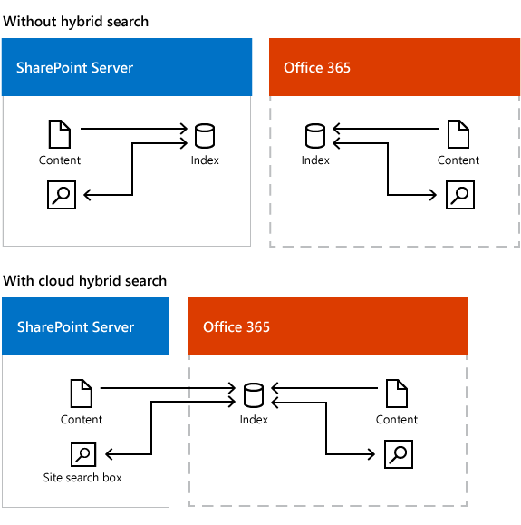
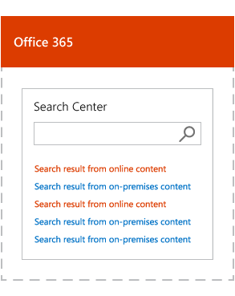
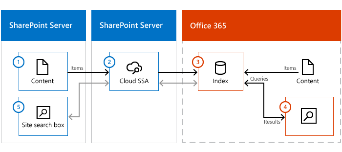

# Learn about cloud hybrid search for SharePoint

[!INCLUDE[appliesto-2013-2016-2019-SPO-md](../includes/appliesto-2013-2016-2019-SPO-md.md)]

With the cloud hybrid search solution for SharePoint, you index all your crawled content, including on-premises content, in your search index in Office 365. When users query your search index in Office 365, they get search results from both on-premises and Office 365 content.
  

  
A search center displays and ranks results from the Office 365 search index in one result block and calculates search relevance ranking and refiners for all your results, regardless of whether the results come from on-premises or Office 365 content.
  

  
It's the metadata for the content that's indexed, and this metadata is encrypted when it's transferred to the search index in Office 365, so the on-premises content remains secure. If you've synchronized Active Directory (AD) between your on-premises network (Windows Server Active Directory) and your Office 365 tenant (Windows Azure Active Directory), Office 365 alters the document permissions that refer to on-premises users, so they refer to the corresponding Office 365 users. Users only see search results for content they have access to.
  
Learn more:
  
[What are the benefits](#BKMK_Benefits)
  
[Which search experiences can you offer with cloud hybrid search?](#BKMK_SearchExperiences)
  
[Where do you manage cloud hybrid search?](#BKMK_WhereManage)
  
[How does cloud hybrid search work?](#BKMK_HowWork)
  
## What are the benefits?

- Your users get unified search results, search relevance ranking, and refiners even if your organization has content both on-premises and in Office 365. 
    
- Your users automatically get the newest SharePoint Online search experience without your organization having to update your existing SharePoint servers.
    
- You no longer have to worry about the size of your search index, because your search index is in Office 365. This means that the footprint of your SharePoint Server search farm is smaller, and your total cost of ownership for search is lower.
    
- SharePoint Server 2013 supports crawling of existing SharePoint Server 2007 and SharePoint Server 2010 content farms.
    
- SharePoint Server 2016 supports crawling of existing SharePoint Server 2007, SharePoint Server 2010, and SharePoint Server 2013 content farms.
    
- You no longer have to migrate your search index to a newer version of SharePoint Server because this happens automatically for you in Office 365.
    
## Which search experiences can you offer with cloud hybrid search?

When you've set up cloud hybrid search and a full crawl of the on-premises content has completed, the search center in Office 365 automatically shows hybrid results from your Office 365 index. 
  
### Other searches

 **Search verticals** - Search verticals narrow search results to a specific set of content, for example to show only videos. If you currently use a search vertical in a search center in SharePoint Server, you have to recreate it in your search center in SharePoint Online in Office 365. 
  
 **Site search** - Your existing search in document libraries in SharePoint Server stops returning results when you move your search index to Office 365. Search is fastest when users use search centers that are in the same environment as the search index, so searching from an Office 365 search center gives a better experience. If your users need results from the Office 365 search index in on-premises SharePoint sites, such as in existing Team Sites in SharePoint Server 2010 or SharePoint Server 2013, you can set up search in SharePoint Server to show hybrid results from your Office 365 index. Because SharePoint Online in Office 365 processes your queries, your users have to use the query syntax that SharePoint Online supports. Learn more in [Show results from Office 365 in on-premises SharePoint with cloud hybrid search](show-results-from-office-365-in-on-premises-sharepoint-with-cloud-hybrid-search.md).
  
 **eDiscovery search** - You might have to set up eDiscovery separately in SharePoint Server and in SharePoint Online in Office 365. 
  
 **Cross-site publishing search** - Cross-site publishing isn't available with cloud hybrid search. 
  
### Display options for search results

 **Previews** - When a user hovers over a search result that comes from Office 365, information about the content as well as a preview of the content is displayed. Information about the content from search results that come from on-premises is displayed automatically, but you have to set up display of previews for this content. 
  
 **Custom security trimming** - Custom security trimming isn't available with cloud hybrid search because SharePoint Online in Office 365 doesn't support custom security trimming. 
  
### Search features that work differently with cloud hybrid search

 **Best bets** - Best bets is a SharePoint Server 2010 feature. Use query rules in SharePoint Online in Office 365 instead. 
  
 **Custom search scopes** - Custom search scopes is a SharePoint Server 2010 feature. Use result sources in SharePoint Online in Office 365 instead. 
  
 **Promotion/demotion of search results** - Promotion/demotion of search results is a SharePoint Server 2010 feature. Use result sources in SharePoint Online in Office 365 instead. 
  
 **Removal of on-premises search results** - In Central Administration in SharePoint Server you can select a Search service application and use the option "Index reset" to remove all content from the search index. This option does not work for cloud hybrid search because there is no direct communication between the cloud Search service application in SharePoint Server 2013 or SharePoint Server 2016 and the search index in Office 365. If you only want to remove some on-premises metadata from the Office 365 search index, remove that on-premises content source, or create a crawl rule that doesn't crawl the URL of a file. If you need to remove all metadata from on-premises content from the search index in Office 365, open a ticket with Microsoft Support. 
  
 **Usage reports** - Usage reports are based on information about the crawled content and user actions on the SharePoint site. The cloud Search service application in SharePoint Server 2013 or SharePoint Server 2016 doesn't communicate with the usage analytics in SharePoint Online, so usage reports in SharePoint Online don't contain information about user actions on sites in SharePoint Server 2013 or SharePoint Server 2016. 
  
### Search features that aren't available with cloud hybrid search

 **Multi-tenancy on a SharePoint Server 2013 or SharePointServer 2016 farm** - One SharePoint Server 2013 or SharePoint Server 2016 farm can only attach to one tenant in SharePoint Online in Office 365, therefore SharePoint Online can't preserve the tenant isolation in a multi-tenant SharePoint Server 2013 or SharePoint Server 2016 farm. 
  
 **Custom entity extraction** - Custom entity extraction isn't available with cloud hybrid search because SharePoint Online in Office 365 doesn't support custom entity extraction. 
  
 **Content enrichment web service** - The content enrichment web service call-out is not available with cloud hybrid search because SharePoint Online in Office 365 doesn't support custom enrichment web service. 
  
 **Thesaurus** - Thesauruses aren't available with cloud hybrid search because SharePoint Online in Office 365 doesn't support thesauruses. 
  
## Where do you manage cloud hybrid search?

You **set up crawling** of on-premises content in Central Administration in the SharePoint Server 2013 or SharePoint Server 2016 farm. 
  
You **manage all other settings** in search administration in SharePoint Online in Office 365. 
  
### Crawling on-premises content

With cloud hybrid search, the crawler can crawl the same content sources and use the same search connectors as in earlier SharePoint Server versions. This lets you crawl and push content from your SharePoint Server 2007, SharePoint Server 2010, SharePoint Server 2013 and SharePoint Server 2016 farms into the Office 365 search index. But, you can't index content that requires custom security trimming, because SharePoint Online in Office 365 doesn't support adding [custom security trimmers](https://msdn.microsoft.com/en-us/library/ee819930.aspx). 
  
The crawler can crawl the same default file types as in earlier SharePoint Server versions. If you need to crawl other file types on-premises, you just add custom iFilters to the SharePoint Server 2013 or SharePoint Server 2016 farm. From the SharePoint Server 2013or SharePoint Server 2016 farm you can also change which file types the crawler crawls and includes in the search index in Office 365.
  
### The search schema in SharePoint Online in Office 365

You manage the search schema in SharePoint Online, see [Manage the Search Center in SharePoint Online](/sharepoint/manage-search-center).
  
The default mappings between crawled and managed properties in the search schema in Office 365 also apply to the on-premises content. As long as you don't remove your existing, standard SSA, you can still set up a search schema in SharePoint Server, but this search schema won't apply to your on-premises content that the cloud SSA crawls.
  
In the user interface for managing the search schema in SharePoint Online, you can't see the difference between the origin of properties such as categories, crawled properties, and automatically created managed properties. 
  
For content that's stored in Office 365, you can customize the search schema at the tenant and the site collection level. For content that's stored on-premises, you can only customize the search schema at the tenant level. In the search index, metadata for content that's stored on-premises has the managed property ** IsExternalContent ** set to true. 
  
### How search results are displayed

Search results are security trimmed based on the user's Office 365 identity. Ranking does not differentiate between on-premises and Office 365 content, and the refiners in the search center show both Office 365 and on-premises content. But, there are a few differences:
  
- **Opening a link from a search result**. To open a link from a search result that comes from on-premises content, users have to either be connected to the on-premises intranet via a Virtual Private Network (VPN) connection or be logged on to where the content is stored. Alternatively, you enable users to open such links by installing a reverse proxy device for SharePoint Server 2013 or SharePoint Server 2016. 
    
- **Previews**. When a user hovers over a search result that comes from Office 365, information about the content as well as a preview of the content is displayed. Information about the content from search results that come from on-premises is displayed automatically, but you have to set up the ability to display previews for this content. 
    
## How does cloud hybrid search work?

The key element is the **cloud Search service application (SSA)**. You set up a SharePoint farm running SharePoint Server 2013 or SharePoint Server 2016 and create the cloud SSA on this farm. We only support one cloud SSA per SharePoint Server farm. 
  
Here's how it works:
  

  
- On-premises content (1) is crawled by the crawler in the cloud SSA (2) and pushed to the search index in Office 365 (3).
    
- Users enter a query (4) in the SharePoint Online Search Center, the query is sent to the search index in Office 365 (3), and results are returned to the SharePoint Online Search Center (4).
    
- If necessary, you can set up site search in SharePoint Server 2013 or SharePoint Server 2016 to get search results from your search index in Office 365. Users enter a query in an on-premises site search box (5) and the query is sent via the server with the cloud SSA (2) to the search index in Office 365 (3). Results are returned via the server with the cloud SSA (2) to the on-premises site search box (5).
    
## See also

#### Concepts

[Configure cloud hybrid search - roadmap](configure-cloud-hybrid-searchroadmap.md)
#### Other Resources

[Plan cloud hybrid search for SharePoint](plan-cloud-hybrid-search-for-sharepoint.md)
  
[Hybrid search in SharePoint](hybrid-search-in-sharepoint.md)

