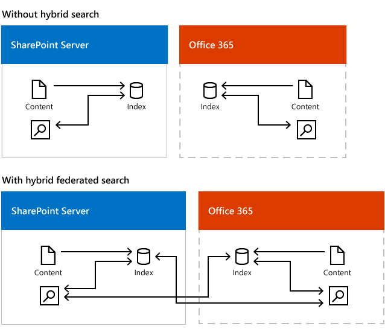
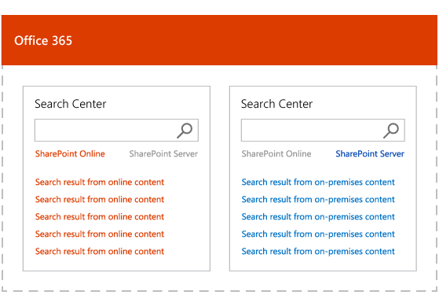
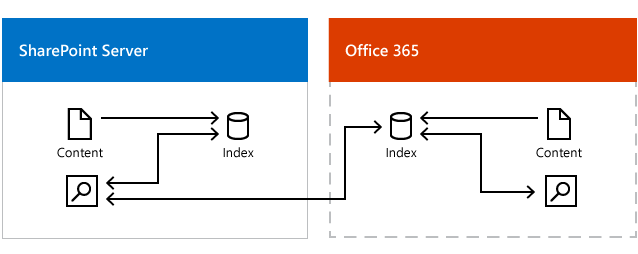
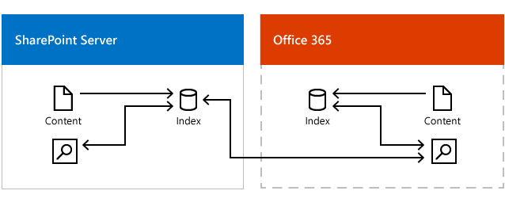

# Learn about hybrid federated search for SharePoint

[!INCLUDE[appliesto-2013-2016-2019-SPO-md](../includes/appliesto-2013-2016-2019-SPO-md.md)]

With the hybrid federated search solution, you use both your index in SharePoint Server and your index in Office 365 Both SharePoint Server and SharePoint Online Search services can query the search index in the other environment and return federated results. When users search from a Search Center, the search results come from both your search index in SharePoint Server and your search index in Office 365.
  

  
The Search Centers display results from the environments in two separate result blocks. Each Search Center displays and ranks search results from its own environment and uses ranking from the other environment for the other environment's search results. Let's use the Search Center in SharePoint Online in Office 365 as an example. This Search Center displays and ranks search results from the search index in Office 365, but for search results from the search index in SharePoint Server this Search Center uses the ranking from SharePoint Server and displays these search results in the order that they arrive.
  

  
If you've synchronized Active Directory (AD) between your on-premises network (Windows Server Active Directory) and your Office 365 tenant (Windows Azure Active Directory), Office 365 alters the document permissions that refer to on-premises users, so they refer to the corresponding Office 365 users, and the other way around. Users only see search results for content they have access to. 
  
## What are the scenarios for hybrid federated search?

### Hybrid federated search results in SharePoint Server

  
Show search results from SharePoint Online in a Search Center in SharePoint Server. This is the simplest scenario to set up because an outbound connection doesn't require a reverse proxy device.
  
### Hybrid federated search results in SharePoint Online

  
Show search results from SharePoint Server in a Search Center in SharePoint Online. This scenario requires a reverse proxy device, see [Display hybrid federated search results in SharePoint Online](display-hybrid-federated-search-results-in-sharepoint-online.md).
  
### Hybrid federated search from both SharePoint Server and SharePoint Online

  
Show search results from both environments in Search Centers both in SharePoint Online and SharePoint Server. This scenario requires a reverse proxy device, see [Display hybrid federated search results in SharePoint Server](display-hybrid-federated-search-results-in-sharepoint-server.md) and [Display hybrid federated search results in SharePoint Online](display-hybrid-federated-search-results-in-sharepoint-online.md).
  
## Should you set up hybrid federated search in the SharePoint Server farm, or in SharePoint Online?

- For your users, it's usually most convenient if you set up hybrid federated search in the environment where most of them are working. That way, users don't have to go to the remote environment to search for content.
    
- But for performance reasons, it's usually best to set up hybrid federated search in the environment where most of the content is stored. If most of the search results are from the local deployment, the overall query latency is likely to be less (all other things being equal) than if many results are from the remote deployment. Also, in general, when a user clicks a search result for local content, the response time to open that content will be faster than it would be to open content that is stored remotely. This is especially true for large files.
    
- You can set up hybrid federated search in both SharePoint Server and SharePoint Online if there about as many users working in both environments, or if there is about as much content in both environments, or if most users are working in one environment while most of the content is in the other environment.
    
> [!IMPORTANT]
>  If you have some on-premises content that's highly sensitive and shouldn't be indexed outside your on-premises network due to regulatory or legal or geopolitical constraints, there are several approaches to achieve this such as using crawler exclusion rules or a separate Search service application for that content. 
  
## Where do you manage hybrid federated search?

Because hybrid federated search is based on federating results from the two environments, you manage search separately in each environment, just as you'd do without hybrid federated search set up.
  
## How does hybrid federated search work?

The key element of hybrid federated search is the result source. You need two results sources, one provides results from the local search index and one from the remote search index. For example, if you want to get search results from SharePoint Online in a Search Center in SharePoint Server, you create a result source in SharePoint Server that specifies SharePoint Online as the provider of remote search results. Learn about result sources and federation in [Plan crawling and federation in SharePoint Server](../search/plan-crawling-and-federation.md) and in [Understanding result sources for search in SharePoint Server](../search/understanding-result-sources-for-search.md). [Configure hybrid federated search from SharePoint Server to SharePoint Online - roadmap](configure-hybrid-federated-search-sharepoint-serverroadmap.md).
  
## See also

#### Concepts

[Plan hybrid federated search for SharePoint Server](plan-hybrid-federated-search.md)
  
[Configure hybrid federated search from SharePoint Server to SharePoint Online - roadmap](configure-hybrid-federated-search-sharepoint-serverroadmap.md)
  
[Configure hybrid federated search from SharePoint Online to SharePoint Server - roadmap](configure-hybrid-federated-search-sharepoint-onlineroadmap.md)
#### Other Resources

[Hybrid search in SharePoint](hybrid-search-in-sharepoint.md)

