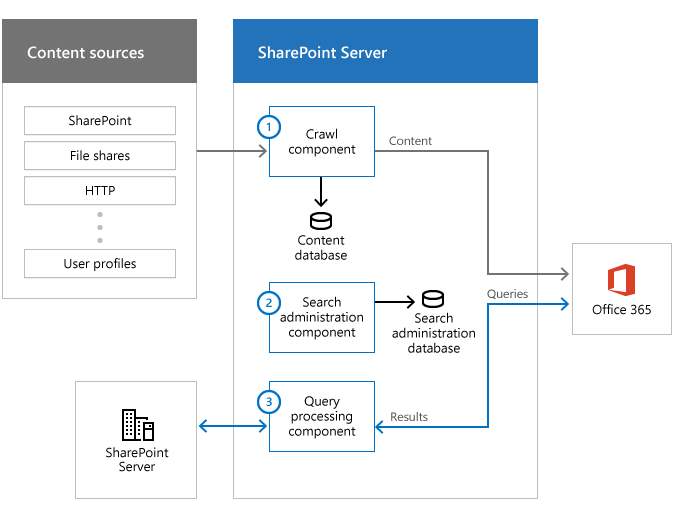
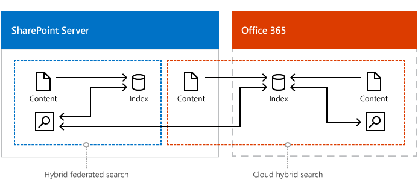
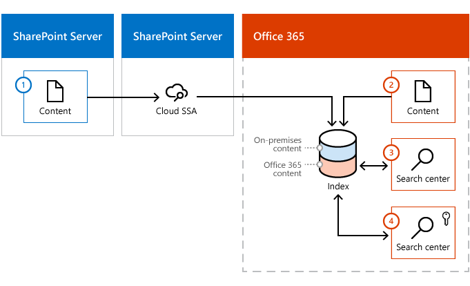

# Plan cloud hybrid search for SharePoint

[!INCLUDE[appliesto-2013-2016-2019-SPO-md](../includes/appliesto-2013-2016-2019-SPO-md.md)]

Setting up [cloud hybrid search](learn-about-cloud-hybrid-search-for-sharepoint.md) for SharePoint requires careful planning. This article helps you design a highly reliable, secure and scalable cloud hybrid search solution. 
  
## What search experiences do your users need?

When you've set up cloud hybrid search and a full crawl of the on-premises content has completed, the Search Center in Office 365 automatically displays hybrid results from your Office 365 index.
  
### Do your users need other types of search?

 **Search verticals** - Search verticals narrow search results to a specific set of content, for example to show only videos. If you currently use a search vertical in a Search Center in SharePoint Server, you have to recreate it in your Search Center in SharePoint Online in Office 365. 
  
 **Site search** - Your **existing search** in document libraries in SharePoint Server stops returning results when you move your search index to Office 365. Search is fastest when users use Search Centers that are in the same environment as the search index, so searching from an Office 365 Search Center gives a better experience. If your users need results from the Office 365 search index in on-premises SharePoint sites, such as in existing Team Sites in SharePoint Server 2010, you can set up search from SharePoint Server 2013 or SharePoint Server 2016. Plan a remote result source in SharePoint Server 2013 or SharePoint Server 2016 that gets results from the Office 365 search index and plan use of query federation. Because SharePoint Online in Office 365 processes your queries, your users have to use the query syntax that SharePoint Online supports. Learn more in [Show results from Office 365 in on-premises SharePoint with cloud hybrid search](show-results-from-office-365-in-on-premises-sharepoint-with-cloud-hybrid-search.md).
  
 **eDiscovery** - You might have to set up eDiscovery separately in SharePoint Server and in SharePoint Online in Office 365. 
  
 **Cross-site publishing** - Cross-site publishing isn't available with cloud hybrid search. 
  
### How do you want to display search results?

 **Previews** - When a user hovers over a search result that comes from Office 365, information about the content as well as a preview of the content is displayed. Information about the content from search results that come from on-premises is displayed automatically, but you have to set up display of previews for this content. Plan an Office Web Apps Server farm and configure SharePoint Server 2013 to use Office Web Apps Server. Learn how in [Show results from Office 365 in on-premises SharePoint with cloud hybrid search](show-results-from-office-365-in-on-premises-sharepoint-with-cloud-hybrid-search.md).
  
 **Custom security trimming** - SharePoint Online in Office 365 doesn't support custom security trimming. 
  
### Which search features do you need?

Some of the search features you might be familiar with from SharePoint Server work differently with cloud hybrid search. Plan to inform your users about the differences.
  
 **Best bets** - Best bets is a SharePoint Server 2010 feature. Use query rules in SharePoint Online in Office 365 instead. 
  
 **Custom search scopes** - Custom search scopes is a SharePoint Server 2010 feature. Use result sources in SharePoint Online in Office 365 instead. 
  
 **Promotion/demotion of search results** - Promotion/demotion of search results is a SharePoint Server 2010 feature. Use result sources in SharePoint Online in Office 365 instead. 
  
 **Removal of on-premises search results** - In Central Administration in SharePoint Server you can select a Search service application and use the option "Index reset" to remove all items from the search index. Don't use this option for a cloud Search service application, the option deletes the crawl history from the crawl databases, but doesn't remove on-premises items from the Office 365 index because there is no direct communication between the cloud Search service application in SharePoint Server and the search index in Office 365. These on-premises items become orphans in the Office 365 index. If you want to remove all on-premises metadata from the Office 365 search index, remove all the on-premises content sources. Any on-premises items left in the Office 365 search index after the process has completed, are orphan items. 
  
Some of the search features you might be familiar with from SharePoint Server aren't available with cloud hybrid search. Plan to inform your users.
  
 **Multi-tenancy on SharePoint Server 2013 or SharePoint Server 2016 farm** - A SharePoint Server 2013 orSharePoint Server 2016 farm can only attach to one tenant in SharePoint Online in Office 365, therefore SharePoint Online can't preserve the tenant isolation of a multi-tenant SharePoint Server 2013 or SharePoint Server 2016 farm. 
  
 **Custom entity extraction** - Custom entity extraction isn't available with cloud hybrid search because SharePoint Online in Office 365 doesn't support custom entity extraction. 
  
 **Content enrichment web service** - The content enrichment web service call-out is not available with cloud hybrid search because SharePoint Online in Office 365 doesn't support custom entity extraction. 
  
 **Thesaurus** - Thesauruses aren't available with cloud hybrid search because SharePoint Online in Office 365 doesn't support thesauruses. 
  
## Plan your search architecture in SharePoint Server for cloud hybrid search

When you set up cloud hybrid search, one of the steps is to create a cloud Search service application (cloud SSA) on your SharePoint Server 2013 orSharePoint Server 2016 search farm. When you create this cloud SSA, a default search architecture is created for you on the server running the cloud SSA. Each search farm can have only one cloud SSA, but can have multiple SSAs in combination with the cloud SSA.
  
A search architecture for cloud hybrid search consists of search components and databases that form a topology, and servers that host that topology. You need to plan the number of crawl components for your topology, which servers to host the search components and databases on, and the hardware required for each server.
  
Before you get going, you should read [Learn about the search topology for cloud hybrid search](plan-cloud-hybrid-search-for-sharepoint.md#BKMK_Learn_search_topo_cloud_hybrid_search) to familiarize yourself with the search components in a search architecture for cloud hybrid search. 
  
### Step 1: How much on-premises content can I index in Office 365?

For each 1 TB of pooled storage space your tenant has in SharePoint Online, you can index 1 million items of on-premises content in the search index in Office 365. You can purchase more space to increase your quota, until it reaches the threshold of 20 million items. If you need to index more than 20 million items of on-premises content, contact [Microsoft Support](https://support.microsoft.com/en-us/assistedsupportproducts) to increase this threshold. 
  
### Step 2: What size cloud search architecture do I need?

For cloud hybrid search we recommend using the default search architecture that you get when you create a cloud SSA:
  

  
The grey components are inactive in cloud hybrid search, but they still need to be placed on servers as shown. Read about inactive components in [Learn about the search topology for cloud hybrid search](plan-cloud-hybrid-search-for-sharepoint.md#BKMK_Learn_search_topo_cloud_hybrid_search).
  
Just as for on-premises only enterprise search, you can scale your search architecture. The main difference is that for cloud hybrid search it's only relevant to scale the crawl component. If you need to tune crawling, follow the guidance for crawling in [Redesign enterprise search topology for specific performance requirements in SharePoint 2016](../search/redesign-for-specific-performance-requirements.md) (the guidance for crawling also applies to cloud hybrid search). Note that if you crawl on-premises content at a high rate, the system might throttle feeding to the Office 365 search index to protect the Office 365 tenancy. If your search architecture has up to two crawl components, this should result in a sufficient and acceptable crawl rate. 
  
### Step 3: What hardware requirements should I be aware of for cloud search architecture?

#### Choose to run servers physically or virtually for cloud hybrid search

We recommend a search architecture that uses virtual machines, but you can also use physical machines. Learn more in [Choose to run servers physically or virtually](../search/plan-enterprise-search-architecture.md).
  
#### Choose hardware resources for the host servers for cloud hybrid search

This table shows the minimum amount of hardware resources that each application server or database server needs:
  
|**Server**|**On host**|**Storage**|**RAM**|**Processor1**|
|:-----|:-----|:-----|:-----|:-----|
|Application server    |A    |100 GB    |16 GB    |1.8 GHz 4x CPU cores    |
|Database server    |B    |100 GB    |16 GB    |1.8 GHz 4x CPU cores    |
   
1The number of CPU cores is specified here, not the number of CPU threads.
  
In addition to the above:
  
- Make sure that each host server has enough disk space for the base installation of the Windows Server operating system and for the SharePoint Server program files. The host server also needs free hard disk space for diagnostics such as logging, debugging, and creating memory dumps, for daily operations, and for the page file. Normally, 80 GB of disk space is enough for the Windows Server operating system and for the SharePoint Server program files.
    
- Add storage for the SQL log space for each database server. If you don't set the database server to back up the databases often, the SQL log space uses lots of storage. For more information about how to plan SQL databases, see [Storage and SQL Server capacity planning and configuration (SharePoint Server)](../administration/storage-and-sql-server-capacity-planning-and-configuration.md).
    
#### Plan storage performance for cloud hybrid search

The way you decide to distribute data from the search components and from the operating system across your storage, has an impact on search performance. It's a good idea to:
  
- Split the Windows Server operating system files, the SharePoint Server program files, and diagnostics logs across three separate storage volumes or partitions with normal performance.
    
- Store the search component data on a separate storage volume or partition with high performance.
    
> [!TIP]
> You can set a custom location for search component data when you install SharePoint Server on a host. Any search component on the host that needs to store data, stores it in this location. To change this location later, you have to reinstall SharePoint Server on that host. 
  
Make sure that the storage you have is fast enough to handle the traffic from the search components and databases. The crawl database is the only component in the search architecture for cloud hybrid search with IOPS requirements. The crawl database requires medium to high IOPS, and the typical load on a I/O subsystem is 10 IOPS per 1 document per second (DPS) crawl rate.
  
### Learn about the search topology for cloud hybrid search

The search topology of the cloud SSA consists of the same types of search components and databases as the search topology of a standard SSA in SharePoint Server 2013 or SharePoint Server 2016. But there are some differences.
  
 **Unused search components and databases in cloud hybrid search** - In cloud hybrid search, it's Office 365 that processes the content, stores the index, and processes analytics. The cloud SSA doesn't use its own content processing component, index component, analytics processing component, links database, or analytics database. These components and databases are idle. 
  
 **Interaction between search components and databases in cloud hybrid search** - Search components and databases interact differently in the search topology of the cloud SSA compared to the search topology of a standard SSA: 
  

  
1. The crawl component gets content from your on-premises farm and sends this content to the search index in Office 365. It uses connectors to interact with the content sources, and uses the crawl database to store both temporary and historical information about the items it crawls, just like a regular crawl component.
    
2. The search administration component runs system processes that are essential to search, just as for a standard SSA.
    
3. We recommend running all searches from Office 365, as cloud hybrid search is optimized for this. But, you can set up site search in SharePoint Server to get search results from your search index in Office 365. If you set up search in an on-premises site collection to query your Office 365 index, this query processing component passes queries from the search box to the Office 365 index, and results from the Office 365 index to the search box.
    
## Decide how to manage crawling of your on-premises content

You can influence crawl performance and search freshness by how you manage crawls, such as by using content sources effectively, scheduling crawls, and crawl rules. The guidance for managing crawling for on-premises only search also applies to cloud hybrid search, see [Best practices for crawling in SharePoint Server](../search/best-practices-for-crawling.md).
  
## Decide how to synchronize Active Directories

When your on-premises content is crawled, parsed and encrypted, the access control lists (ACLs) for each item are crawled too. The Office 365 search index stores the ACLs together with the item, so the system needs to be able to recognize an on-premises user as the same person in Office 365. When you've set up Active Directory synchronization between your on-premises network (Windows Server Active Directory) and your Office 365 tenant (Windows Azure Active Directory), the system maps and translates the ACLs to the right users, and the users get security trimmed search results from the Office 365 index.
  
There are two methods to synchronize Active Directories:
  
- Directory synchronization with password synchronization
    
- Directory synchronization with single sign-on (SSO)
    
If you choose the SSO option, you can also configure password synchronization if you want to as a backup for SSO, but you must configure at least one of the two (password synchronization or SSO). Learn more and how to configure the two methods in [Office 365 integration with on-premises environments](/office365/enterprise/office-365-integration).
  
### Why can't users get hybrid results with cloud hybrid search when they're members of the Domain Users security group?

Some organizations assign access rights to their on-premises content by using one of the default security groups in Windows Server Active Directory (AD), for example the Domain Users security group.
  
The Azure Active Directory Connect synchronization tool by default excludes some objects from synchronization. Security groups that have the attribute IsCriticalSecurityObject=true is one set of objects that the tool excludes, and Domain Users is an example of such a security group. Therefore, the access rights for the members of Domain Users aren't available in Azure Active Directory (AAD). Even if users have access to on-premises content, they don't get search results when they search for that content.
  
Instead, assign access rights by using a group that doesn't have IsCriticalSecurityObject=true, for example the Everyone group, the Authenticated Users group, or a custom group. For a list of the conditions for excluding objects and more information about unexpected synchronization results, see [One or more objects don't sync when using the Azure Active Directory Sync tool](https://support.microsoft.com/en-us/kb/2643629).
  
## Does your organization have on-premises content that's sensitive?

Some organizations have on-premises content that's considered sensitive because of regulatory, legal, or geopolitical constraints. In some cases, it's prohibited to add metadata from sensitive on-premises content to the Office 365 search index. In other cases, metadata from sensitive on-premises content can be added to the Office 365 search index, but only a limited number of users are allowed to open search results from the sensitive content.
  
Here are two examples of how you could set up hybrid search to comply with these constraints:
  
### When metadata from sensitive, on-premises content is allowed in the Office 365 index

Set up and cloud hybrid search and carefully plan access rights to the sensitive content so only the right users get access to the sensitive content when they select a search result.
  
### When metadata from sensitive, on-premises content isn't allowed in the Office 365 index

Set up cloud hybrid search in combination with hybrid federated search.
  

  
- Plan content sources for the cloud Search service application (cloud SSA) in SharePoint Server that cover all on-premises content except the sensitive content. The metadata for the crawled content is added the search index in Office 365.
    
- Plan enterprise search in SharePoint Server to crawl the sensitive, on-premises content, see [Plan search in SharePoint Server](../search/search-planning.md). Plan content sources for the SSA that cover the sensitive content. The metadata from the crawled, sensitive content is added to the search index in SharePoint Server.
    
- If your users need results from the Office 365 search index in on-premises SharePoint sites, plan hybrid federated search from SharePoint Server to display search results from the search index in SharePoint Server and from the search index in Office 365, see [Plan hybrid federated search for SharePoint Server](plan-hybrid-federated-search.md).
    
## Plan to validate cloud hybrid search before exposing it to your users

After you've created and set up the cloud SSA and completed a full crawl, your Office 365 Search Center shows both on-premises and online search results. We recommend that you validate and tune the new search experience in a separate Search Center, while keeping the original search experience unchanged.
  
Plan for a custom result source that limits your Search Centers in Office 365 to only show Office 365 content. The following illustration shows an environment where you can validate and tune how your hybrid search results are shown:
  

  
1. On-premises content. During crawl, metadata from this content is added to the Office 365 search index.
    
2. Office 365 content. During crawl, metadata from this content is added to the Office 365 search index.
    
3. Default (or existing) Office 365 Search Center. You create a custom result source for this Search Center, which limits search results to show only Office 365 content. .
    
4. New Office 365 Search Center, where you validate and tune how hybrid search results are shown. This Search Center uses the default result source and shows search results from both on-premises and Office 365 content. You set up access so only testers and administrators have access to this site.
    
> [!NOTE]
> Although you can keep the original search experience unchanged while tuning, you can't keep the original Office Delve experience unchanged. When metadata from on-premises content is in the Office 365 search index, Delve will display this content. 
  
## Related Topics

[Learn about cloud hybrid search for SharePoint](learn-about-cloud-hybrid-search-for-sharepoint.md)
  
[Configure cloud hybrid search - roadmap](configure-cloud-hybrid-searchroadmap.md)
  
[Hybrid search in SharePoint](hybrid-search-in-sharepoint.md)
  

