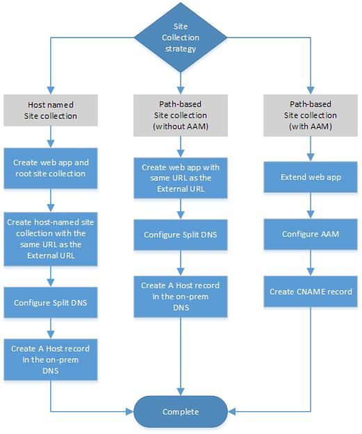
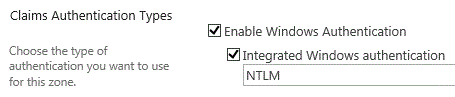

# Plan connectivity from Office 365 to SharePoint Server

[!INCLUDE[appliesto-2013-2016-2019-SPO-md](../includes/appliesto-2013-2016-2019-SPO-md.md)] 
  
This article is designed to help you plan and prepare to configure inbound connectivity from Office 365 for enterprises to SharePoint Server through a reverse proxy device. This is required for the following hybrid environments: 
  
- Inbound hybrid search (displaying search results from SharePoint Server in Office 365)
    
- Hybrid Business Connectivity Services
    
In this article, we give you the information that you need to know, such as prerequisites, and a worksheet to collect necessary information before you begin the configuration process.
  
This topic will help you do the following:
  
- Understand the prerequisites and requirements for inbound connectivity
    
- Plan your web application architecture
    
- Plan SSL certificates
    
- Record key decisions and information
    
## Gather and record worksheet and build log information

 **Worksheet.** During the planning process, you have to collect information and files. It is important to use the [SharePoint hybrid worksheet](https://go.microsoft.com/fwlink/?LinkID=391835) to track planning and deployment information for reference and to share with other members of your deployment team. We can't stress enough the importance of using this worksheet to organize your information before you begin the configuration process. 
  
 **Create a build log.** As in any complex implementation project, a detailed record of every design decision, server configuration, procedure, command output, and error is a very important reference for troubleshooting, support, and awareness. We highly recommend that you thoroughly document your deployment process. 
  
> [!CAUTION]
> For security reasons, store the worksheet and the build log in a security-enhanced place, such as a secured file share or SharePoint document library, and grant permissions only to administrators who are involved in the deployment process and must know this information. 
  
## Collect and record URL and host name information

In this section, you record information about URLs and host names in your environment. You will use this information during the deployment process.
  
- Record your company's public DNS domain name (such as adventureworks.com).
    
- Record the URL of the public-facing endpoint of the reverse proxy device that you'll use for SharePoint hybrid. This is the External URL. If this endpoint doesn't exist yet, you'll have to decide what this URL will be.
    
- Record the IP address of the external endpoint of the reverse proxy device.
    
- Ensure that an **A record** (also known as a **host record**) exists in the **public** DNS forward lookup zone for your public domain that maps the External URL to the IP address of the Internet-facing endpoint on the reverse proxy device. If you don't yet have this A record, create it now. 
    
- Ensure that an A record exists in the **intranet** DNS forward lookup zone that maps the host name of your SharePoint Server farm to its IP address. If you don't yet have this A record, create it now. 
    
    > [!IMPORTANT]
    > If you configure internal URLs to access a web application during the deployment process, make sure that you also create A records for those URLs in the intranet DNS forward lookup zone, and record them on the worksheet. 
  
|||
|:-----|:-----|
|| Record the following information in Table 3 of the SharePoint Hybrid worksheet:     The domain name of the public-facing corporate DNS domain in the **Public Internet Domain name** row.     The URL of the public-facing endpoint of the reverse proxy device in the **External URL** row.     The IP address of the external endpoint of the reverse proxy device in the **IP Address of the external endpoint** row.    |
  
## Plan your web application architecture

This section helps you plan the architecture of the SharePoint Server web applications that you will use in your hybrid environment.
  
Inbound connectivity requires a secure communication channel between the on-premises SharePoint Server farm and SharePoint Online. Data is exchanged between a site collection in SharePoint Online and an on-premises web application over this communication channel.
  
SharePoint Online sends requests to a reverse proxy server that relays the requests to a specific web application in the on-premises SharePoint Server farm that is configured for SharePoint hybrid. We refer to this as the primary web application.
  
> [!TIP]
> Regardless of how many hybrid solutions that you plan to configure, you typically will use only one primary web application. You don't have to create extra primary web applications for each additional hybrid solution. 
  
Both the primary web application and a single site collection within the primary web application must be configured to accept inbound connections from SharePoint Online. 
  
The SharePoint administrator associates the services and connection objects that are needed to support the hybrid solutions that are being deployed with the primary web application. Outbound connections can be made from any on-premises SharePoint Server web application by using the feature-specific configurations.
  
A SharePoint Server web application is composed of an Internet Information Services (IIS) website that acts as a logical unit for the site collections that you create. Each web application is represented by a different IIS website that has a unique or shared application pool, that has a unique public URL, and that can also be configured to use up to five internal URLs using Alternate Access Mapping (AAM). A given web application is associated with a single content database and is configured to use a specific authentication method to connect to the database. Multiple web applications can be configured to use different authentication methods, and optionally AAMs, to provide access to a single content database. 
  
A web application's public URL is always used as the root URL in all links to sites and content accessed through the web application. Consider a web application with the public URL **https://spexternal.adventureworks.com** that has an internal URL **https://sharepoint** configured in AAM. When you browse to the internal URL https://sharepoint, SharePoint Server returns the website with the URL https://spexternal.adventureworks.com, and all links within the site will have URLs based on that path. 
  
Alternate access mapping (AAM) is needed **only** when you are configuring inbound connectivity using a path-based site collection with a public URL that is different than the external URL. AAM lets you associate the external URL with the internal URL of a SharePoint site inside your organization. This enables SharePoint Server to route requests for internal URLs configured in AAM to the corresponding primary web application. 
  
For more information about claims-based web applications, see [Create claims-based web applications in SharePoint Server](/previous-versions/office/sharepoint-server-2010/ee806885(v=office.14)).
  
For more information about how to extend a web application, see [Extend claims-based web applications in SharePoint](../administration/extend-a-claims-based-web-application.md).
  
For more information about site collections, see [Overview of sites and site collections in SharePoint Server](../sites/sites-and-site-collections-overview.md).
  
### Choose a site collection strategy

Before you decide to use an existing web application or create a new one, you must understand the configuration requirements that the web application and site collection must meet to support hybrid functionality. Use the information in this section to determine your strategy for creating a new web application and site collection or to determine whether a site collection in an existing web application can be used in your hybrid environment.
  
The following figure shows the decision flow for determining your site collection strategy.
  

  
 **Requirements for hybrid web applications**
  
Web applications used for hybrid functionality must meet all these requirements: 
  
- **The public URL of the web application must be identical to the External URL**.
    
    The OAuth protocol provides user authorization in SharePoint hybrid solutions. The **Host** request header in all SharePoint Online communications to SharePoint on-premises contains the URL to which the request was originally sent. To authenticate inbound requests from SharePoint Online, the on-premises SharePoint Authentication service must be able to match this URL in all traffic from SharePoint Online to the public URL of the primary web application. This is the **External URL**. One advantage of using a host-named site collection for SharePoint hybrid environments is that you can configure a host-named site collection to use the same URL as the External URL. This eliminates the need to configure Alternate Access Mapping.
    
- **The web application must be configured to use Integrated Windows authentication using NTLM**.
    
    Integrated Windows authentication using NTLM is required for web applications that are deployed in scenarios that support server-to-server authentication and app authentication. For more information, see [Plan for server-to-server authentication in SharePoint Server](../security-for-sharepoint-server/plan-server-to-server-authentication.md).
    
     
  
 **Requirements for specific site collection configurations**
  
Site collections used for hybrid functionality must meet all these requirements, and must also either exist in or be created in a web application that meets the web application requirements:
  
- Host-named site collections
    
  - The web application must support host-named site collections.
    
    To create a host-named site collection, the web application must be created to enable them. You cannot enable this functionality after the web application has been created.
    
    For more information about how to create a host-named site collection, see [Host-named site collection architecture and deployment in SharePoint Server](/previous-versions/office/sharepoint-server-2010/cc424952(v=office.14)).
    
    > [!NOTE]
    > Although this is a web application requirement, it is listed here because it applies only to environments that have host-named site collections. 
  
  - Your on-premises DNS server has to be configured with split DNS. You need to create a forward lookup zone for the Public Internet domain that you used for your public URL and an **A (host) record** in the forward lookup zone that has the IP address of the SharePoint Server server and the host name of your External URL. 
    
    > [!IMPORTANT]
    > The reverse proxy device must be able to resolve host names in this forward lookup zone to relay inbound requests to the SharePoint Server farm. 
  
- Path-based site collections
    
  - **If the public URL is identical to the External URL:**
    
    Your on-premises DNS server must be configured with split DNS. You need to create a forward lookup zone for the Public Internet domain you used for your public URL and an **A record** in the forward lookup zone that has the IP address of the SharePoint Server server and the host name of your External URL. 
    
    > [!IMPORTANT]
    > The reverse proxy device must be able to resolve host names in this forward lookup zone to relay inbound requests to the SharePoint Server farm. 
  
    This is an easy way to configure a web application for a SharePoint hybrid. The goal is to match the **Public URL** field of the new web application to the URL of the public-facing endpoint on the reverse proxy, which is also known as the External URL. 
    
  - **If the public URL is different from the External URL:**
    
    You need to configure an alternate access mapping (AAM) to relay inbound requests from SharePoint Online.
    
    Extend the primary web application and use the External URL as the **Public URL**. Then create an Internal URL (via **Add Internal URLs**) in the same security zone as the extended web application to use as a bridging URL. You will also configure the reverse proxy device to relay inbound requests from SharePoint Online to this bridging URL.
    
    Remember, alternate access mapping (AAM) is needed **only** when you are configuring inbound connectivity using a path-based site collection with a public URL that is different than the external URL. 
    
> [!NOTE]
> Remember that the **External URL** is the URL of the Internet-facing endpoint of the reverse proxy device. 
  
|||
|:-----|:-----|
||Record your site collection strategy choice on the worksheet in the **Site collection strategy** row of Table 2. |
   
### Choose an existing web application or create a new one

You can either use an existing web application or create one to use as the primary web application.
  
If you prefer to manage the web application used for hybrid functionality independently or if your existing web application does not meet the requirements that are listed in the [Choose a site collection strategy](plan-connectivity-from-office-365-to-sharepoint-server.md#scstrategy) section, you should create a new web application. 
  
|||
|:-----|:-----|
||Record your decision in the **New or existing web application** row of Table 2. |
   
#### Plan to use an existing web application

If you decide to use an existing web application as the primary web application, gather the URL of the primary web application and the URL of the top level site collection and list it on the worksheet.
  
|||
|:-----|:-----|
|| Record the following information on the worksheet:     Depending on your site collection strategy, record the URL of the primary web application in the **Primary web application URL** row of Table 5a, 5b, or 5c.     If you are using an existing host-named site collection, record the URL of the top-level site collection in the **Host-named site collection URL** row in Table 5a.    |
  
#### Plan to create a new web application

If you decide to create a new web application, we will direct you on how to do this when you are configuring the hybrid topology.
  
## Plan SSL certificates

SSL certificates establish server identity and provide certificate authentication for several different services and connections in a SharePoint hybrid environment. You need to have two SSL certificates: a **Secure Channel SSL certificate** and an **STS certificate**.
  
For more information on how SSL certificates are used in SharePoint hybrid environments, see [SharePoint 2013 Hybrid Topology: Certificate and Authentication Model](https://go.microsoft.com/fwlink/?LinkID=392320).
  
> [!NOTE]
> If you choose to help secure your on-premises SharePoint farm with SSL, you will also need an SSL certificate for the primary web application. There are no hybrid-specific considerations for this certificate, so you can follow the general best practices for configuring SharePoint Server with SSL. 
  
> [!NOTE]
> "Secure Channel" is not a class of certificate; we use the term as a way to differentiate this particular certificate from other SSL certificates used in the environment. 
  
### About Secure Channel SSL certificates

A Secure Channel SSL certificate provides authentication and encryption for the secure communication channel between the reverse proxy device and Office 365, acting as both a server and a client certificate. It also verifies the identity of the reverse proxy endpoint that's used to publish the on-premises SharePoint Server site collection.
  
This certificate must be either a wildcard or a SAN certificate and be issued by a public root certification authority. The subject field of this certificate must contain the host name of the external endpoint of the reverse proxy server or a wildcard URL that covers all host names in the namespace. It must use at least 2048-bit encryption.
  
> [!IMPORTANT]
> Wildcard certificates can secure only a single level of a DNS namespace. For example, if your external URL is **https://spexternal.public.adventureworks.com**, the subject of your wildcard certificate must be *.public.adventureworks.com, not *.adventureworks.com. 
  
In scenarios where SharePoint Online is configured to request information from SharePoint Server, an SSL certificate is required to do the following:
  
- Encrypt traffic over the security channel.
    
- Enable the reverse proxy device to authenticate inbound connections using Certificate Authentication.
    
- Allow SharePoint Online to identify and trust the external endpoint.
    
During deployment, you'll install the SSL certificate both on the reverse proxy device and in a SharePoint Online Secure Store target application. You will configure this when you configure the hybrid environment infrastructure.
  
### Get a Secure Channel SSL certificate

Get a Secure Channel SSL wildcard or SAN (Subject Alternative Name) certificate for your on-premises public domain from a well-known certificate authority, for example, DigiCert, VeriSign, Thawte, or GeoTrust.
  
> [!NOTE]
>  This certificate must support multiple names and must be at least 2048 bits. >  The **Subject** or **Subject Name** field of the certificate must contain a wildcard entry of the domain name in the External URL. For example, if your external URL is https://spexternal.public.adventureworks.com, the subject of your wildcard certificate should be **\*.public.adventureworks.com**. >  Certificates typically expire at one-year intervals. So it's important to plan in advance for certificate renewals to avoid service interruptions. SharePoint Administrators should schedule a reminder for certificate replacement that gives you enough lead-in time to prevent a work stoppage. 
  
   
### About STS certificates

The STS certificate of the on-premises SharePoint farm requires a default certificate to validate incoming tokens. In a SharePoint hybrid environment, Azure Active Directory acts as a trusted token signing service and uses the STS certificate as the signing certificate. If you choose to use a certificate other than the default STS certificate (for example, a certificate from a public certificate authority), replace the default certificate before you begin the hybrid configuration process.
   
## Record the accounts needed for configuration and testing

A SharePoint hybrid environment setup requires several user accounts in both your on-premises Active Directory and the Office 365 directory (Azure Active Directory that is surfaced in the Office 365 directory). These accounts have different permissions and group or role memberships. Some of the accounts are used to deploy and configure software, and some are needed to test specific functionality to help guarantee that security and authentication systems are working as expected.
  
- Go to [Accounts needed for hybrid configuration and testing](accounts-needed-for-hybrid-configuration-and-testing.md) for a complete explanation of the required user accounts, including notes about roles and identity providers. 
    
- **Record** the required account information in the worksheet as instructed. 
    
- Return to this planning article after you complete this step.
    
## Next steps

At this point, you should have completed filling out the required worksheet for inbound connectivity and be ready to start the configuration process. Your next step is to [choose a configuration roadmap](configuration-roadmaps.md).
  

