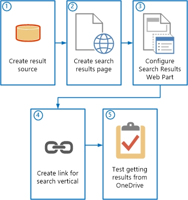
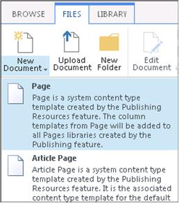
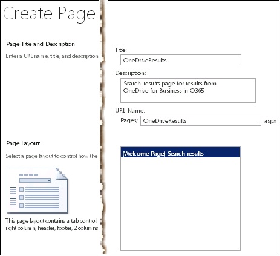
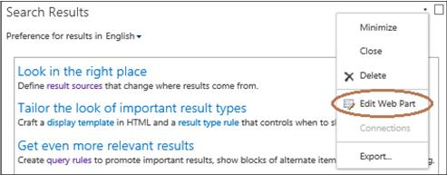
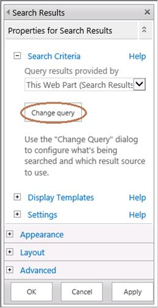
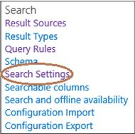

# Set up Search of OneDrive for Business from SharePoint Server

[!INCLUDE[appliesto-2013-2016-2019-SPO-md](../includes/appliesto-2013-2016-2019-SPO-md.md)]
  
After you install Service Pack 1 for SharePoint Server, when your users select **OneDrive** or **Sites** on the nav bar, you can redirect them to OneDrive for Business for professionals and small businesses. To learn how to do this, see [Plan hybrid OneDrive for Business](/sharepoint/hybrid/plan-hybrid-onedrive-for-business).
  
This article describes how you can then set up an option in the SharePoint Server enterprise Search Center to return only search results from OneDrive for Business. This option, called a search vertical, will provide an easy way for a user of on-premises SharePoint Server to search only the following items in OneDrive for Business for a match to the user's search query:
  
- Items that the user has stored in OneDrive for Business.
    
- Items in OneDrive for Business that are shared with the user.
    
- Items in OneDrive for Business that are shared with everyone.
    
## How users will access the OneDrive for Business search vertical

A search vertical filters search results so that only a certain subset of all relevant results is displayed. SharePoint Server provides four preconfigured search verticals: **Everything**, **People**, **Conversations**, and **Videos**. You can see the links for these search verticals in the Search Navigation Web Part, which is below the search box on a search-results page, as shown in the following screen capture.
  

  
When a user enters a search query in the search box and then clicks one of the search-vertical links, the Search system returns search results that correspond to that search vertical only. For example, if the user enters Azure in the search box and then selects the **Videos** search-vertical link, the Search system will return only search results that are videos related to Azure. 
  
In this article, in the SharePoint Server deployment, you will create a search vertical for OneDrive for Business. You will then add a link in the enterprise Search Center for the new search vertical. The link in the enterprise Search Center will look something like this, depending on what you name it.
  

  
After that, when users of on-premises SharePoint Server type queries in the search box in the enterprise Search Center, and they select the OneDrive for Business search-vertical link that you created, they will get search results only from OneDrive for Business.
  
## Setting up Search of OneDrive for Business by creating a OneDrive search vertical

To create a search vertical in your SharePoint Server deployment that will enable users to search only for items that are in OneDrive for Business, you perform the following procedures, which are described in detail in this article:.
  

  
That is, in your SharePoint Server deployment, you do the following:
  
- [Step 1: Create a result source that specifies OneDrive for Business as the content repository to get search results from](#BKMK_CreateResultSource).
    
- [Step 2: Create a search-results page for the OneDrive for Business search vertical](#BKMK_CreateSearchResultsPage).
    
- [Step 3: Configure the Search Results Web Part to display results from OneDrive for Business](#BKMK_ConfigureSearchResultsWebPart).
    
- [Step 4: Create a link in the Search Center for the OneDrive for Business search vertical](#BKMK_CreateLinkInSearchCenter).
    
- [Step 5: Test your configuration for using the OneDrive search vertical to display search results from OneDrive for Business](#BKMK_TestConfig).
    
## Before you begin

Before you perform the procedures in this article, make sure that you do each of the following:
  
- Complete the procedures in [Configure hybrid OneDrive for Business](configure-hybrid-onedrive-for-business.md).
    
- Configure a hybrid SharePoint environment according to the instructions in the following two articles, and in the following order:
    
1. [Configure hybrid federated search from SharePoint Server to SharePoint Online - roadmap](configure-hybrid-federated-search-sharepoint-serverroadmap.md)
    
2. [Configure server-to-server authentication from SharePoint Server to SharePoint Online](configure-server-to-server-authentication.md)
    
    For additional information about synchronizing users and passwords, see [Ways to synchronize users and passwords](configure-hybrid-onedrive-for-business.md) in [Configure hybrid OneDrive for Business](configure-hybrid-onedrive-for-business.md).
    
- Create an enterprise Search Center in your SharePoint Server deployment if one does not already exist. For more information, see [Create a Search Center site in SharePoint Server](../search/create-a-search-center-site.md).
    
## Step 1: Create a result source that specifies OneDrive for Business as the content repository to get search results from

In this procedure, you create a result source in the SharePoint Server deployment. This result source is a definition that specifies the URL and path in Office 365 to get search results from, the protocol for getting those results, and several other related settings.
  
A result source can be created at the Search service application level, the site collection level, or the site level. In this procedure, you create the result source at the Search service application level. This makes the result source available to any query rule that is created at the Search service application level in that Search service application and to any query rule that is created for a site collection or site that is in a web application that consumes the Search service application.
  
 **To create the result source**
  
1. Verify that the user account that you use to perform this procedure is an administrator for the Search service application that you want to configure.
    
2. In the SharePoint Server deployment, in the **Central Administration** website, in the **Application Management** section, select **Manage service applications**.
    
3. Select the Search service application to which you want to add a result source.
    
4. On the **_Search_service_application_name_:Search Administration** page for the Search service application, in the Quick Launch, select **Result Sources**.
    
5. On the  **_Search_service_application_name_:Manage Result Sources** page, select **New Result Source**.
    
6. On the  **_Search_service_application_name_:Add Result Source** page, do the following:
    
1. In the **Name** box, enter a name for the new result source (for example, Results from OneDrive in Office 365).
    
2. (Optional) In the **Description** box, enter a description of the new result source. 
    
    This description appears as a tooltip when the pointer rests on the result source on certain configuration pages.
    
3. In the **Protocol** section, select **Remote SharePoint**.
    
4. In the **Remote Service URL** section, enter the address of the root site collection in SharePoint Online that you want to get search results from. 
    
    The address of the root site collection in SharePoint Online is typically of the form https:// _tenant_name_.sharepoint.com, where  _tenant_name_ is the name of the Microsoft 365 organization. 
    
5. In the **Type** section, select **SharePoint Search Results**.
    
6. In the **Query Transform** section, after **{searchTerms}**, enter a space, and then enter the following:
    
    path:https:// _tenant_name_-my.sharepoint.com/personal
    
    In general, you can use a query transform to narrow search results to a specified subset. In this case, you use a query transform to specify the Path property, which narrows search results to documents that are in OneDrive for Business. For more information about query transforms, see the following resources:
    
  - [Transforming queries in result sources](../search/plan-to-transform-queries-and-order-results.md#Trans_Result_Sources) in [Plan to transform queries and order results in SharePoint Server](../search/plan-to-transform-queries-and-order-results.md)
    
  - [Query variables in SharePoint Server](../technical-reference/query-variables.md)
    
7. In the **Credentials Information** section, select **Default Authentication**.
    
    Your settings on the  _Search_service_application_name_:Add Result Source page then look something like this:
    
     
  
8. To save the new result source, select **OK**. 
    
## Step 2: Create a search-results page for the OneDrive for Business search vertical

Each search vertical can have its own search-results page on which results for that vertical appear. In the following procedure, you create the search-results page that will display results for the OneDrive for Business search vertical.
  
 **To create the search-results page for the OneDrive for Business search vertical**
  
1. Verify that the user account that you use to perform this procedure is a site collection administrator or site owner for the enterprise Search Center.
    
2. In the SharePoint Server deployment, browse to the enterprise Search Center.
    
    The URL of the enterprise Search Center is typically of the form http:// _host_name_/sites/ _Search_Center_name_.
    
3. Go to **Settings** > **Site Contents** > **Pages**.
    
    This Pages page contains a list of all of the search-results pages for the enterprise Search Center.
    
4. From the Pages page, add a new search-results page by doing the following:
    
1. On the ribbon, select the **Files** tab. 
    
2. Select **New Document**, and then select **Page**.
    
     
  
5. On the **Create Page** page, do the following:
    
1. In the **Title** box, enter a title for the new search-results page, such as OneDriveResults.
    
2. (Optional) In the **Description** box, enter a description for the new page. 
    
3. In the **URL** box, enter the portion of the URL that you want to use to identify the page, such as OneDriveResults.
    
4. In the **Page Layout** section, ensure that **(Welcome Page) Search Results** is selected. 
    
    This specifies how the new search-results page appears.
    
    Your settings on the Create Page page then look something like this:
    
     
  
5. Select **Create**.
    
6. On the page that contains a list of all of the search-results pages for the enterprise Search Center, do the following:
    
1. Select the icon next to the name of the search-results page (such as **OneDriveResults**) that you just created.
    
    This selects that row in the list of search-results pages.
    
2. On the **Files** tab, in the **Open &amp; Check Out** section, select **Check In**.
    
3. In the **Check in** dialog, do the following: 
    
1. In the **Version** field, select **1.0 Major Version (publish)**.
    
2. In the **Retain Check Out** field, select **No**.
    
3. (Optional) In the **Comments** field, enter comments as appropriate for your configuration. 
    
4. Select **OK**.
    
    This checks in and publishes the page.
    
## Step 3: Configure the Search Results Web Part to display results from OneDrive for Business

In this procedure, you configure the Search Results Web Part on the search-results page that you created in the previous procedure in this article (Step 2). You configure the Search Results Web Part to display search results from OneDrive for Business.
  
 **To configure the Search Results Web Part to display search results from OneDrive for Business**
  
1. Verify that the user account that you use to perform this procedure is a site collection administrator or site owner for the enterprise Search Center.
    
2. Go to the page that has a list of all of the search-results pages for the enterprise Search Center.
    
    You accessed this page in the previous procedure in this article (Step 2). To reach it again, browse to the enterprise Search Center, and then go to **Settings** > **Site Contents** > **Pages**. The URL of the page might resemble http:// _host_name_/sites/ _Search_Center_name_/Pages/Forms/AllItems.aspx.
    
3. Select the name of the search-results page (such as **OneDriveResults**) that you created, checked in, and published in the previous procedure in this article (Step 2).
    
    Selecting the name of the search-results page opens that page.
    
    > [!NOTE]
    > On the **search-results** page, you might see the message **Sorry, something went wrong**, or the message **Nothing here matches your search**. These are default messages that can be displayed on the search-results page when a user search fails. These messages do not apply to the configuration that you are currently doing. 
  
4. Go to **Settings** > **Edit page**.
    
5. On the ribbon, select the **PAGE** tab. 
    
6. On the **PAGE** tab, in the Search Results Web Part, move the pointer to the right until you see the down arrow, and then select the arrow. 
    
    The **Search Results** Web Part menu appears. 
    
7. On the **Search Results** Web Part menu, select **Edit Web Part**.
    
     
  
    The Search Results Web Part tool pane then appears at the top right of the page that you are editing.
    
8. In the Search Results Web Part tool pane, select **Change query**.
    
     
  
9. In the **Build Your Query** dialog, do the following: 
    
1. In the **Select a query** section, on the dropdown, select the result source that you created in the first procedure of this article, such as **Results from OneDrive in Office 365**.
    
    This causes search results from OneDrive for Business to appear in the Search Results Web Part on the OneDriveResults search-results page.
    
2. Skip the other sections in the dialog, and then select **OK**.
    
10. On the **PAGE** tab, in the **Edit** group, select **Check In**.
    
11. In the **Check In** dialog, do the following: 
    
1. (Optional) Enter comments as appropriate for your configuration.
    
2. Select **Continue**.
    
12. Do either of the following to publish the page:
    
  - Select **Publish this draft**.
    
  - Do the following:
    
1. On the **Publish** tab, select **Publish**.
    
2. In the **Publish** dialog, optionally enter comments as appropriate for your configuration, and then select **Continue**.
    
## Step 4: Create a link in the Search Center for the OneDrive for Business search vertical

In this procedure, you create the link in the SharePoint Server enterprise Search Center that users will click to get results from OneDrive for Business. After you create the link, it appears in the Search Navigation Web Part, under the search box next to the links for the other search verticals, such as **Everything** and **People**. The links in the Search Navigation Web Part then look something like this, depending on your particular configuration:
  

  
 **To create the link for the OneDrive for Business search vertical**
  
1. Verify that the user account that you use to perform this procedure is a site collection administrator or site owner for the enterprise Search Center in the SharePoint Server deployment.
    
2. Browse to the enterprise Search Center in the SharePoint Server deployment.
    
    The URL of the enterprise Search Center is typically of the form http:// _host_name_/sites/ _Search_Center_name_.
    
3. Go to **Settings** > **Site Settings**.
    
4. On the **Site Settings** page, in the **Search** section, select **Search Settings**.
    
     
  
5. On the **Search Settings** page, do the following:
    
1. (Optional) In the **Enter a Search Center URL** section, in the **Search Center URL** box, enter the URL of the enterprise Search Center. 
    
    If you enter a URL in this box, after a user performs a search from a search box on another site, the Search system shows a link that the user can select to try the search again from the enterprise Search Center.
    
2. In the **Which search results page should queries be sent to?** section, select **Use the same results page as my parent**.
    
3. In the **Configure Search Navigation** section, select **Add Link**.
    
4. In the **Navigation Link** dialog, do the following: 
    
     
  
1. In the **Title** box, enter the text (such as MyOneDrive) that you want to use for the search-vertical link in the enterprise Search Center that opens the search-results page that you created in the second procedure (Step 2) in this article.
    
2. In the **URL** box, do one of the following: 
    
  - Enter the relative path to the search-results page that you created in the previous procedure, such as /sites/ _Search_Center_name_/Pages/onedriveresults.aspx.
    
  - Select **Browse**.
    
  - In the list of search-results pages, select the name of the search-results page for the new search vertical, and then select **Insert**.
    
3. Select the **Open link in new window** check box if you want the search-results page for OneDrive for Business to open in a new window when users select the link for that search vertical. 
    
4. (Optional) In the **Description** box, enter a description for the new link. 
    
5. (Optional) In the **Audience** box, enter the name of a global audience, a SharePoint group, a distribution group, or a security group to which access to the new search-results page will be limited. 
    
    **All Site users** is the default value if you do not enter anything in the **Audience** box. The value **All site users** allows access to all users who can access the Search Center site. For more info, see "To grant access to the SharePoint Search Center" in [Create a Search Center site in SharePoint Server](../search/create-a-search-center-site.md).
    
6. If you entered a value in the **Audience** box, then next to that box, select the **Check Names** icon to make sure that SharePoint Server recognizes the audience that you typed. 
    
7. Select **OK**.
    
5. In the **Configure Search Navigation** section, select the name of the new link, such as **MyOneDrive**, and then click **Move Up** or **Move Down** as appropriate to position the new link where you want it to appear in the group of search-vertical links. 
    
6. Select **OK**.
    
## Step 5: Test your configuration for using the OneDrive search vertical to display search results from OneDrive for Business

Federated users should now be able to use the new MyOneDrive search vertical to get results from OneDrive for Business. Searches that federated users perform in the new search vertical should return the following items from OneDrive for Business that match the search query:
  
- Items that the user has stored in OneDrive for Business.
    
- Items in OneDrive for Business that are shared with the user.
    
- Items in OneDrive for Business that are shared with everyone.
    
A federated user is one who has an account in the on-premises Active Directory Domain Services (AD DS) Domain Users group that has been synchronized with Azure Active Directory by using the Azure Active Directory Sync tool (DirSync). The account has group memberships and permissions for resources in the SharePoint Server deployment and in Office 365, and can access resources in both environments by authenticating with the federation identity provider, such as Active Directory Federation Services (AD FS) 2.0. 
  
To validate your configuration for displaying search results from OneDrive for Business, you can log on to SharePoint Server as a federated user and try some searches from the OneDrive for Business search vertical in the enterprise Search Center. Use the following procedure to validate your configuration in this way.
  
 **To test your configuration for displaying search results from OneDrive for Business**
  
1. Log on to the SharePoint Server deployment as a federated user who has been activated in Office 365, and who has permission to view the root site collection in SharePoint Online in Microsoft 365.
    
2. Browse to the enterprise Search Center in the SharePoint Server deployment.
    
    The URL of the enterprise Search Center might resemble http:// _host_name_/sites/ _Search_Center_name_.
    
3. In the enterprise Search Center, do the following:
    
1. In the search box, enter a test search query, such as the name of your company.
    
    Make sure that it's a query that should yield some search results from OneDrive for Business.
    
2. Press <Enter>, or select the search icon, and then wait for initial search results to appear.
    
3. After the initial search results appear, select the link for the search vertical for OneDrive for Business that you created earlier in this article.
    
4. On the search-results page, confirm that you see results from OneDrive for Business.
    
5. If you do not see results from OneDrive for Business on the search-results page, do the following:
    
1. Verify each of the following:
    
1. You configured the hybrid SharePoint environment as described in the following articles, and in the following order:
    
1. [Configure hybrid federated search from SharePoint Server to SharePoint Online - roadmap](configure-hybrid-federated-search-sharepoint-serverroadmap.md)
    
2. [Configure server-to-server authentication from SharePoint Server to SharePoint Online](configure-server-to-server-authentication.md)
    
2. You completed the procedures described in [Configure hybrid OneDrive for Business](configure-hybrid-onedrive-for-business.md).
    
3. You completed the previous procedures described in this article.
    
2. Correct any errors or omissions, and try a search again.
    
3. If you still do not see search results from OneDrive for Business, check the SharePoint Unified Logging Service (ULS) logs, also called SharePoint trace logs.
    
    For more info, see [Overview of Unified Logging System (ULS) Logging](https://go.microsoft.com/fwlink/p/?LinkId=393137).
    

