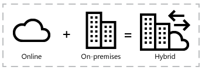

# SharePoint hybrid sites and search

[!INCLUDE[appliesto-2013-2016-2019-SPO-md](../includes/appliesto-2013-2016-2019-SPO-md.md)]

A hybrid environment can help your company get started in the cloud, taking a first step to explore the cloud functionality at own your own pace. It also enables enterprise users to be connected from almost anywhere to the resources and content they need.
  
When you add Microsoft 365 to an environment where you're already using SharePoint Server, by default there's no integration between the two. With SharePoint hybrid features, you can tie the two environments together in a variety of ways to make a more seamless user experience.
  

  
With SharePoint hybrid features, you can consolidate search results between SharePoint Server and Microsoft 365, consolidate user profiles in Microsoft 365, and offload your users' personal storage to the cloud. Except as noted, the hybrid features discussed in this article are available for both SharePoint Server 2013 and SharePoint Server 2016.
  
## Hybrid sites and search at a glance

This table gives a quick overview of hybrid integration between SharePoint Server and Microsoft 365.
  
||**Non-hybrid**|**Hybrid**|
|:-----|:-----|:-----|
|**OneDrive**   |OneDrive is available in Office 365 but there is no link to it from SharePoint Server. If you've deployed MySites, users may have a second OneDrive in SharePoint Server.    |**OneDrive** links are provided in SharePoint Server which direct users to OneDrive.    (See [Plan hybrid OneDrive](plan-hybrid-onedrive-for-business.md) for detailed information.)    |
|**Site following**   |The followed sites list in Microsoft 365 tracks followed SharePoint in Microsoft 365 sites. If you've deployed MySites, a second followed sites list in SharePoint Server tracks followed SharePoint Server sites.    |Followed sites from both locations are consolidated in the SharePoint in Microsoft 365 followed sites list. SharePoint Server links to the followed sites list redirect users to the SharePoint in Microsoft 365 followed sites list.    (See [Hybrid site following](hybrid-site-following.md) for detailed information.)    |
|**Document following**   |If you've deployed MySites, the followed documents list in SharePoint Server tracks followed SharePoint Server documents.    |Hybrid document following is not available. If you use hybrid OneDrive, the SharePoint Server followed documents list will be hidden from users. (Note that if you configure hybrid search and you have Delve, you can favorite SharePoint Server documents.)    |
|**Profiles**   |Users have separate profiles in SharePoint Server and in Microsoft 365.    |Profiles exist in both locations, but SharePoint Server links to users' profiles redirect profiles in Microsoft 365.    (See [Plan hybrid profiles](plan-hybrid-profiles.md) for detailed information.)    |
|**Extensible app launcher**   |Users see a different app launcher in Microsoft 365 and in SharePoint Server.    |There are still separate app launchers, but the SharePoint Server app launcher includes several tiles from Microsoft 365.    (See [The extensible hybrid app launcher](the-extensible-hybrid-app-launcher.md) for detailed information.)    |
|**Hybrid self-service site creation**   |Users see separate self-service site creation experiences in SharePoint Server and SharePoint in Microsoft 365, as configured by the administrator.    |Users going to the default SharePoint Server site creation page are redirected to the SharePoint Group Creation page, allowing them to create sites in SharePoint.    (See [Hybrid self-service site creation](hybrid-self-service-site-creation.md) for detailed information.)    |
|**Search**   |Separate search indexes and search centers for SharePoint Server and Microsoft 365. Users must search from SharePoint Server to find items stored there and they must search from Microsoft 365 to find items stored there.    |Search results between the two locations are combined in one of two ways. Cloud hybrid search crawls on-premises content and indexes it in the search index in Office 365. Users can search the Microsoft 365 index from either location. Hybrid federated search combines search results from each search index in a single search center.    For detailed info, see [Hybrid search in SharePoint](/SharePoint/hybrid/hybrid-search-in-sharepoint).     |
   
## What is redirection?

Many of the SharePoint hybrid features make use of a technique called redirection. With redirection, when users attempt to access a service in SharePoint Server using site navigation, they are automatically redirected to the equivalent service in Microsoft 365.
  
For example, in a non-hybrid environment, when a user selects **OneDrive** on a SharePoint Server site, they are taken to their SharePoint Server OneDrive location. With hybrid OneDrive, when a user selects **OneDrive**, they are taken to OneDrive.
  
Hybrid OneDrive, hybrid site following, and hybrid profiles all use redirection to send users from on-premises SharePoint Server to the equivalent service in Microsoft 365. The on-premises SharePoint Server services continue to function in the background and are accessible by users if they've bookmarked the URL.
  
When redirection is used, existing data in SharePoint Server is not automatically migrated to the equivalent Microsoft 365 service. Documents in OneDrive and user profile information have to be manually migrated for each user, and SharePoint Server followed sites will have to be re-followed.
  
## Hybrid sites features and OneDrive

Several hybrid features are bundled together to help ease deployment. The two feature bundles are:
  
- Hybrid OneDrive
    
- Hybrid sites features
    
(Note that the hybrid search options are independent of these two bundles and are configured separately.)
  
The following table shows which hybrid features are included with each option.
  
||**Hybrid OneDrive**|**Hybrid sites features**|
|:-----|:-----|:-----|
|OneDrive    |X    |X    |
|Site following    ||X    |
|Profiles    |X    |X    |
|Extensible app launcher\*    ||X    |
   
*In SharePoint Server 2016, the extensible app launcher is part of hybrid sites features. In SharePoint Server 2013, it requires the [July 2016 PU](https://support.microsoft.com/kb/3115286) and is enabled separately from hybrid sites features by using Windows PowerShell. 
  
## Configuring SharePoint hybrid

To get started configuring hybrid features for your environment, choose a feature below:
  
- [Configure hybrid OneDrive - roadmap](configure-hybrid-onedrive-for-businessroadmap.md)
    
- [Configure hybrid sites features - roadmap](configure-hybrid-sites-featuresroadmap.md)
    
- [Configure cloud hybrid search - roadmap](configure-cloud-hybrid-searchroadmap.md)
    

