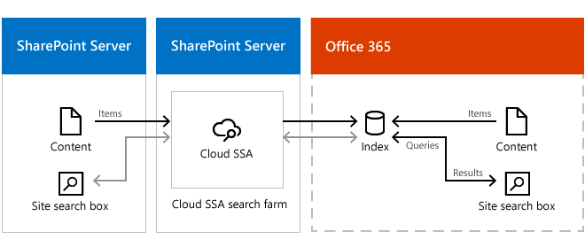

# Show results from Office 365 in on-premises SharePoint with cloud hybrid search

[!INCLUDE[appliesto-2013-2016-2019-SPO-md](../includes/appliesto-2013-2016-2019-SPO-md.md)]

Learn how to show results from the Office 365 search index when searching from SharePoint Server sites with cloud hybrid search.
  
After you've set up [cloud hybrid search](/SharePoint/hybrid/learn-about-cloud-hybrid-search-for-sharepoint), your users get search results from both on-premises and Office 365 content when they use the search center in Office 365. However, your existing search in document libraries in SharePoint Server, such as Team Sites, stops returning results when you've set up cloud hybrid search. If your users need to search from Team Sites, you can set up search from SharePoint Server Team Sites to show results from the search index in Office 365. You use the cloud Search service application to achieve this. Note that searching from a Search Center in Office 365 will be faster than searching from a document library in SharePoint Server because the search index and the search center are in the same environment.
  
Here's an overview of the cloud hybrid search solution. The light grey lines represent what you're setting up by following the steps in this article.
  

  
Follow these steps:
  
1. Verify that cloud hybrid search works.
    
2. In the cloud search farm, [create a result source](#create-a-result-source-that-defines-how-to-get-search-results-from-the-search-index-in-office-365) that defines how to get search results from the search index in Office 365.
    
3. In the cloud search farm, [set that result source as the default result source](#set-the-result-source-as-the-default-result-source-for-the-cloud-search-service-application) for the cloud Search service application.
    
4. If your existing on-premises document libraries are in SharePoint Server 2010 and/or SharePoint Server 2013, [set up query federation](#set-up-query-federation) by publishing the cloud Search service application (cloud SSA) so that SharePoint Server 2010 and/or SharePoint Server 2013 can consume the cloud SSA. 
    
## Create a result source that defines how to get search results from the search index in Office 365

1. Verify that the user account that you use to perform this procedure is an administrator for the cloud SSA.
    
2. In the cloud search farm, in Central Administration, in the **Application Management** section, click **Manage service applications**. 
    
3. Click the cloud SSA to which you want to add a result source.
    
4. On the Search Administration page for the cloud SSA, in the Quick Launch, click **Result Sources**. 
    
5. On the **Manage Result Sources** page, click **New Result Source**. 
    
6. On the **Add Result Source** page, do the following: 
    
1. In the **General Information** section, in the **Name text** box, type a name for the new result source—for example,  *Office 365 search index*  . 
    
2. (Optional) In the **General Information** section, in the **Description** text box, type a description of the new result source. 
    
    This description will appear as a tooltip when the pointer rests on the result source on certain configuration pages.
    
3. In the **Protocol** section, select **Remote SharePoint**. 
    
4. In the **Remote Service URL** section, type the address of the root site collection in SharePoint Online that you want to get search results from, such as https://adventure-works.sharepoint.com. 
    
5. In the **Type** section, select **SharePoint Search Results**. 
    
6. In the **Query Transform** section, keep the default setting. 
    
7. In the **Credentials Information** section, select **Default Authentication.**
    
8. Click **OK** to save the new result source. 
    
## Set the result source as the default result source for the cloud Search service application

1. Verify that the user account that performs this procedure is an administrator for the cloud SSA.
    
2. In the cloud search farm, in Central Administration, in the **Application Management** section, click **Manage service applications**. 
    
3. Click the cloud SSA for which you want to set the result source as default.
    
4. On the **Search Administration** page, in the **Queries and Results** section, click **Result Sources**. 
    
5. On the **Manage Result Sources** page, point to the result source that you want to set as default, click the arrow that appears, and then click **Set as Default**. 
    
## Set up query federation

To set up query federation you have to publish the cloud SSA so that it can be consumed by SharePoint Server 2010 or SharePoint Server 2013. For an overview of this approach, see [Share service applications across farms in SharePoint Server](../administration/share-service-applications-across-farms.md) and select the SharePoint Server version of the article for your consuming environment. 
  
In each of the following steps, when you refer to the SharePoint Server documentation, use the appropriate names and parameters for your cloud search farm and your cloud SSA.
  
1. Publish and share the cloud SSA, see [Publish service applications in SharePoint Server](../administration/publish-a-service-application.md).
    
2. Consume the cloud SSA.
    
    Consuming a published SSA requires exchanging trust certificates between the consuming and the publishing SharePoint on-premises farm. See [Exchange trust certificates between farms in SharePoint Server](../administration/exchange-trust-certificates-between-farms.md), and select the relevant SharePoint Server version of the article for your consuming environment.
    
3. Grant permission to connect to the cloud SSA.
    
    Grant permission to the consuming SharePoint Server 2010 or SharePoint Server 2013 farm to be able to connect the published cloud SSA. See [Set permissions to published service applications in SharePoint 2013](/SharePoint/administration/set-permission-to-a-published-service-application).
    
4. Connect to the cloud SSA.
    
    Once the trust and permissions have been set between the farms, you can configure SharePoint Server 2010 or SharePoint Server 2013 to connect to the cloud SSA on your cloud search farm. See [Connect to service applications on remote farms in SharePoint 2013](/SharePoint/administration/connect-to-a-service-application-on-a-remote-farm).
    
5. Configure web applications to associate with the cloud SSA.
    
    In SharePoint Server 2010 or SharePoint Server 2013, configure the web applications to associate with the new cloud SSA connection. See [Add or remove service application connections from a web application in SharePoint 2013](/SharePoint/administration/add-or-remove-a-service-application-connection-to-a-web-application).
    
## Related Topics

[Learn about cloud hybrid search for SharePoint](/SharePoint/hybrid/learn-about-cloud-hybrid-search-for-sharepoint)
  
[Plan cloud hybrid search for SharePoint](/SharePoint/hybrid/plan-cloud-hybrid-search-for-sharepoint)
  
[Configure cloud hybrid search for SharePoint](/SharePoint/hybrid/configure-cloud-hybrid-searchroadmap)
  

